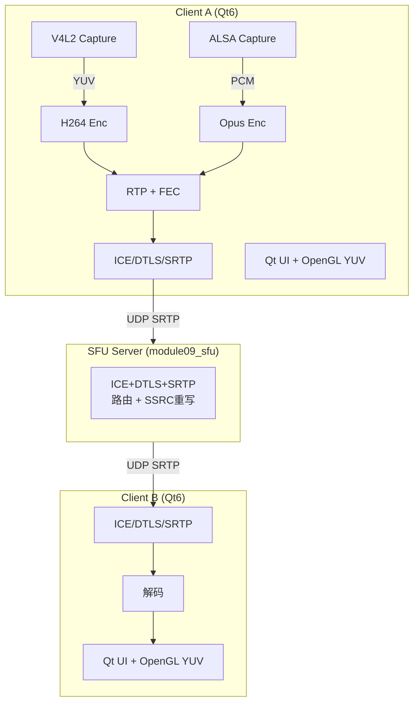
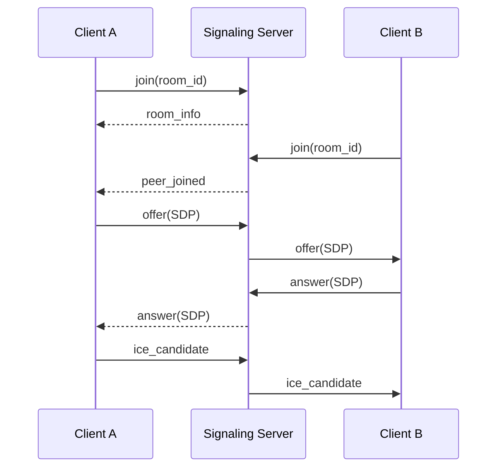
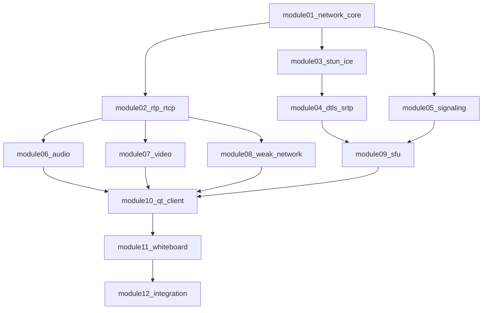

# 架构总览

## 系统组件

```mermaid
graph TD
    subgraph CA["Client A (Qt6)"]
        V4L2["V4L2 Capture"] -->|YUV| H264["H264 Enc"]
        ALSA_A["ALSA Capture"] -->|PCM| OPUS["Opus Enc"]
        H264 --> RTP_A["RTP + FEC"]
        OPUS --> RTP_A
        RTP_A --> ICE_A["ICE/DTLS/SRTP"]
        QT_A["Qt UI + OpenGL YUV"]
    end

    ICE_A -->|UDP SRTP| SFU

    subgraph SFU["SFU Server (module09_sfu)"]
        SFUC["ICE+DTLS+SRTP\n路由 + SSRC重写"]
    end

    SFU -->|UDP SRTP| ICE_B

    subgraph CB["Client B (Qt6)"]
        ICE_B["ICE/DTLS/SRTP"] --> DEC["解码"]
        DEC --> QT_B["Qt UI + OpenGL YUV"]
    end
```

## 信令流程（WebSocket）

```mermaid
sequenceDiagram
    participant A as Client A
    participant S as Signaling Server
    participant B as Client B

    A->>S: join(room_id)
    S-->>A: room_info
    B->>S: join(room_id)
    S-->>A: peer_joined
    A->>S: offer(SDP)
    S->>B: offer(SDP)
    B->>S: answer(SDP)
    S-->>A: answer(SDP)
    A->>S: ice_candidate
    S->>B: ice_candidate
```

## 模块依赖图

```mermaid
graph TD
    M01[module01_network_core]
    M02[module02_rtp_rtcp]
    M03[module03_stun_ice]
    M04[module04_dtls_srtp]
    M05[module05_signaling]
    M06[module06_audio]
    M07[module07_video]
    M08[module08_weak_network]
    M09[module09_sfu]
    M10[module10_qt_client]
    M11[module11_whiteboard]
    M12[module12_integration]

    M01 --> M02
    M01 --> M03
    M01 --> M05
    M02 --> M06
    M02 --> M07
    M02 --> M08
    M03 --> M04
    M04 --> M09
    M05 --> M09
    M06 --> M10
    M07 --> M10
    M08 --> M10
    M09 --> M10
    M10 --> M11
    M11 --> M12
```
