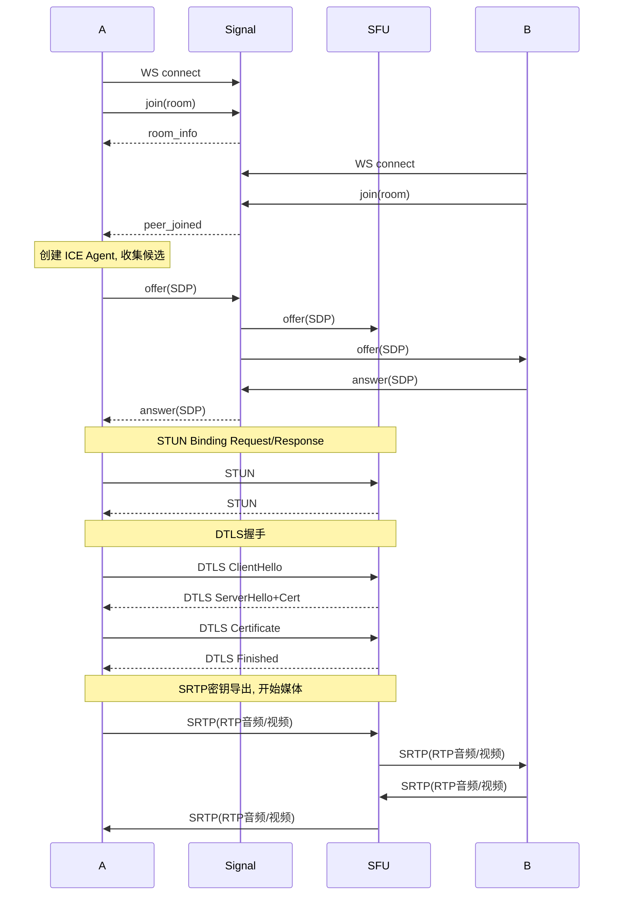

# 协议流程

## 完整呼叫建立流程



## RTP/RTCP 包格式

```
RTP Header (最小12字节):
 0                   1                   2                   3
 0 1 2 3 4 5 6 7 8 9 0 1 2 3 4 5 6 7 8 9 0 1 2 3 4 5 6 7 8 9 0 1
├─┼─┼─┼─┼─┼─┼─┼─┼─┼─┼─┼─┼─┼─┼─┼─┼─┼─┼─┼─┼─┼─┼─┼─┼─┼─┼─┼─┼─┼─┼─┼─┤
│V=2│P│X│  CC   │M│    PT     │         Sequence Number           │
├───────────────────────────────────────────────────────────────────┤
│                           Timestamp                               │
├───────────────────────────────────────────────────────────────────┤
│                             SSRC                                  │
└───────────────────────────────────────────────────────────────────┘
```

## DTLS字节复用(demux)

```
首字节范围:
  [0,  3]  → STUN
  [20, 63] → DTLS
  [128,191]→ SRTP/SRTCP
```
