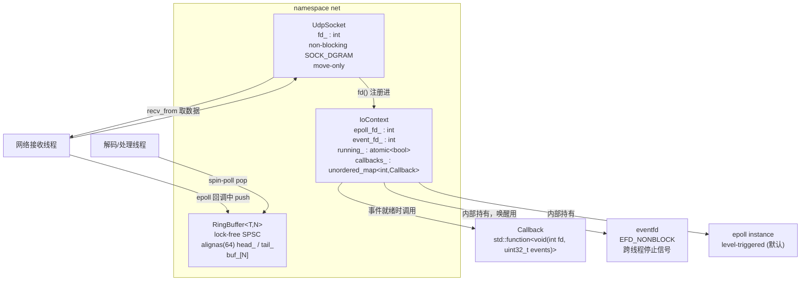
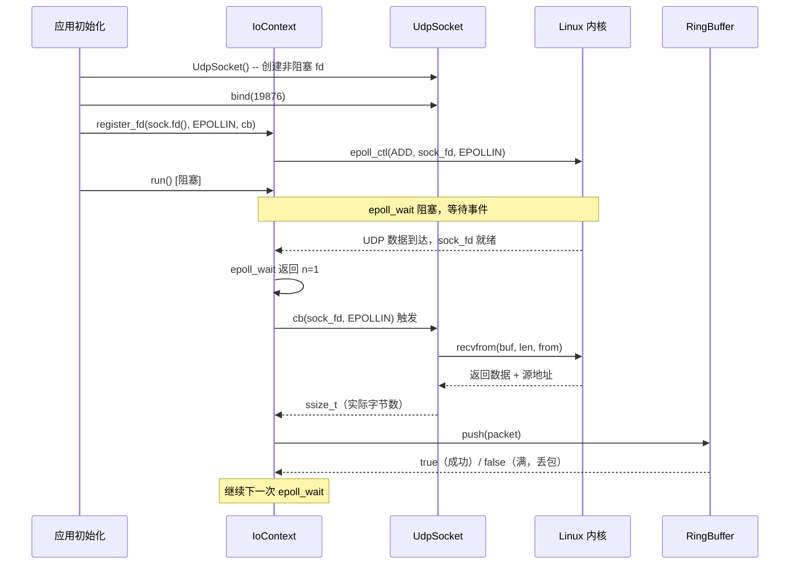
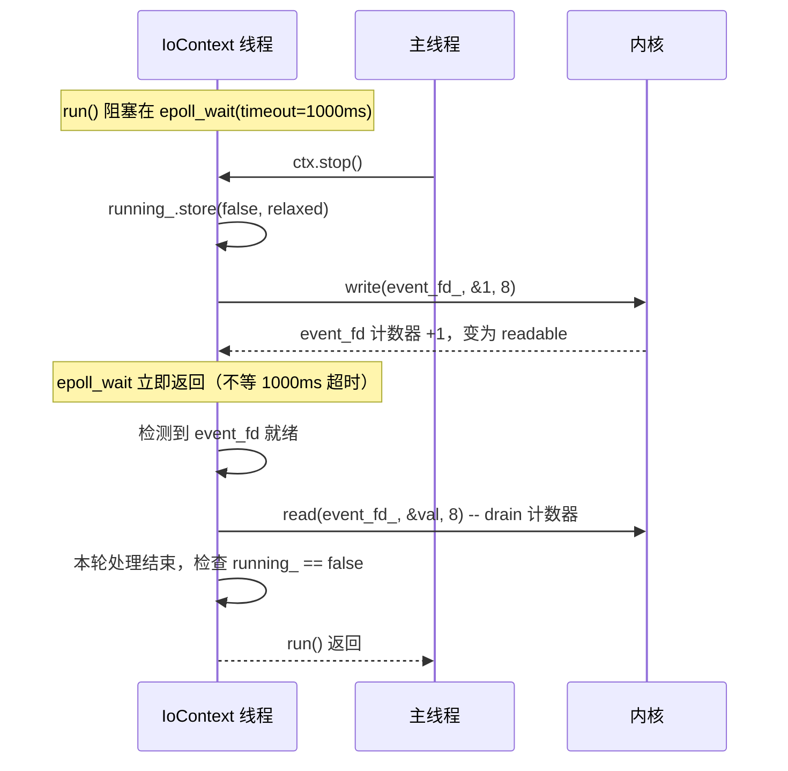

# module01_network_core

网络核心层：无锁环形缓冲区、UDP Socket 封装与 epoll 事件循环。

---

## 1. 模块目的与背景

实时音视频通信系统对网络 I/O 有两个核心要求：**低延迟**和**高吞吐**。传统的阻塞 I/O
与互斥锁在高频收包场景下开销过高：一次 `pthread_mutex_lock` 在竞争情况下可能带来数微
秒的上下文切换，而音频帧的间隔通常只有 20ms，一个视频帧在 1Gbps 链路上的传输时间也
不过几十微秒。

本模块作为整个 cpp_meet 项目的网络基础层，提供三个核心组件：

1. **RingBuffer** — 无锁 SPSC（Single-Producer Single-Consumer）环形队列，用于网络
   接收线程向解码线程传递原始 UDP 载荷，完全避免互斥锁。
2. **UdpSocket** — 对 POSIX `socket()`/`sendto()`/`recvfrom()` 的薄封装，始终以非
   阻塞模式创建，配合 IoContext 使用。
3. **IoContext** — 基于 Linux `epoll` 的事件循环，支持多 fd 注册、通过 `eventfd`
   跨线程安全停止。

上层模块（module02_rtp_rtcp、module03_jitter_buffer 等）直接依赖本模块的三个组件完
成数据收发。整个模块没有第三方依赖，只依赖 Linux 内核 API（`epoll`、`eventfd`）和
C++11 标准原子库。

```
┌─────────────────────────────────────────────────────────────┐
│                    上层业务模块                              │
│      module02_rtp_rtcp  /  module03_jitter_buffer  / ...    │
└───────────────────────┬─────────────────────────────────────┘
                        │ 使用
          ┌─────────────▼──────────────┐
          │      module01_network_core  │
          │  ┌─────────┐ ┌──────────┐  │
          │  │RingBuffer│ │UdpSocket │  │
          │  └────┬────┘ └────┬─────┘  │
          │       │           │注册     │
          │       │      ┌────▼─────┐  │
          │       └──────│IoContext │  │
          │              └──────────┘  │
          └─────────────────────────────┘
```

---

## 2. 架构图



---

## 3. 关键类与文件表

### `include/net/ring_buffer.h` — `net::RingBuffer<T, N>`

模板类，T 为元素类型，N 为缓冲区槽数（必须为 2 的幂，`static_assert` 编译期强制）。
内部维护两个原子变量：`head_`（由生产者独占写入，表示下一个可写位置）和 `tail_`（由
消费者独占写入，表示下一个可读位置）。两者各自通过 `alignas(64)` 独占一条 64 字节缓
存行，防止伪共享（false sharing）。有效容量为 N-1（保留一个空槽用于区分满/空状态）。

该类是纯头文件实现，零运行时依赖，可直接嵌入任何需要无锁队列的场景。

**关键接口：**

- `push(const T&) -> bool`：生产者调用。若队列已满返回 false，不阻塞，不抛出异常。
  内部以 acquire 序读取 tail_ 检查满状态，以 release 序写入 head_ 发布数据。
- `pop(T&) -> bool`：消费者调用。若队列为空返回 false，不阻塞。以 acquire 序读取
  head_ 检查数据可见性，以 release 序写入 tail_ 归还槽位。
- `empty() / full()` — 两次 acquire 读取的快照，并发下近似值。
- `size()` — 返回当前元素数量的近似值，不应用于精确逻辑判断。

### `include/net/udp_socket.h` + `src/udp_socket.cpp` — `net::UdpSocket`

对原始 BSD UDP socket 的 RAII 封装。构造时立即调用 `socket(AF_INET, SOCK_DGRAM, 0)`
创建 fd 并通过 `fcntl(F_GETFL/F_SETFL)` 设置 `O_NONBLOCK`。析构时自动 `close(fd_)`。

该类**不可复制**（复制构造和赋值 `= delete`），**可移动**（移动后源对象 `fd_ = -1`，
防止双 close，`valid()` 返回 false）。这种设计保证了 fd 的所有权语义清晰，避免资源
泄漏。

**关键接口：**

- `bind(uint16_t port) -> bool`：绑定 `INADDR_ANY:port`，同时设置 `SO_REUSEADDR`
  以允许快速重启时复用端口（避免 TIME_WAIT 导致 `bind()` 失败）。
- `send_to(data, len, sockaddr_in&) -> ssize_t`：`sendto(2)` 的直接包装，返回实际
  发送字节数。非阻塞时若内核发送缓冲区满返回 -1/`EAGAIN`。
- `recv_from(buf, len, sockaddr_in& from) -> ssize_t`：`recvfrom(2)` 的直接包装，
  非阻塞时若无数据返回 -1/`EAGAIN`（调用方需判断 errno）。
- `fd() -> int`：返回底层 fd，供 `IoContext::register_fd` 注册。
- `valid() -> bool`：检查 fd 是否有效（>= 0），移动后的 socket 返回 false。

### `include/net/io_context.h` + `src/io_context.cpp` — `net::IoContext`

单线程 Reactor 事件循环。**不可复制也不可移动**。内部持有：

- `epoll_fd_`：`epoll_create1(0)` 创建的 epoll 实例。
- `event_fd_`：`eventfd(0, EFD_NONBLOCK)` 创建的计数型 fd，注册到 epoll 用于跨线程
  停止通知。
- `running_`：`std::atomic<bool>`，run() 的主循环条件。
- `callbacks_`：`std::unordered_map<int, Callback>`，以 fd 为键的事件处理函数表。

构造函数完成三件事：创建 epoll 实例、创建 eventfd、将 eventfd 注册到 epoll（EPOLLIN）
并在 callbacks_ 中插入空回调。所有操作失败均抛出 `std::runtime_error`。

**关键接口：**

- `register_fd(fd, events, cb)` — `epoll_ctl(EPOLL_CTL_ADD)` + callbacks_ 插入，
  **非线程安全**，必须在 `run()` 前或与 `run()` 在同一线程调用。
- `unregister_fd(fd)` — `epoll_ctl(EPOLL_CTL_DEL)` + callbacks_ 删除。
- `run()` — 阻塞循环，每批最多处理 64 个就绪事件，超时 1000ms（保证 `running_` 标
  志的检查频率即使没有事件也不超过 1 秒）。
- `stop()` — 从任意线程调用，设置 `running_ = false` 并 write eventfd 唤醒 epoll_wait。

### `tests/test_ring_buffer.cpp`

4 个 Google Test 单元测试：PushPop（基础）、Full（满边界）、Empty（空边界）、
Wraparound（索引回绕）。全部在单线程下运行，验证核心逻辑正确性。

### `tests/test_udp_socket.cpp`

1 个集成测试：同进程创建发送方和接收方两个 UdpSocket，通过 127.0.0.1:19876 发送
"hello" 并接收，带最多 100ms spin-wait 等待内核转发（非阻塞 socket）。

---

## 4. 核心算法

### 4.1 SPSC 无锁环形队列

**不变式**：`head_` 指向下一个可写槽，`tail_` 指向下一个可读槽。

满条件：`(head_ + 1) & (N-1) == tail_`
空条件：`head_ == tail_`

**push 伪代码**：

```
函数 push(item):
    h = head_.load(relaxed)          // 生产者读自己的变量，无需同步
    next_h = (h + 1) & (N - 1)      // 位与代替取模（N 是 2 的幂）
    t = tail_.load(acquire)          // ← acquire：与消费者 release-store tail_ 建立 happens-before
                                     //   保证看到消费者已完成对 buf_[t] 的最后一次读取
    if next_h == t:
        return false                 // 队满，非阻塞返回
    buf_[h] = item                   // 写数据到槽（在 release-store 之前）
    head_.store(next_h, release)     // ← release：消费者 acquire-load head_ 时
                                     //   保证看到 buf_[h] = item 已写入
    return true
```

**pop 伪代码**：

```
函数 pop(item):
    t = tail_.load(relaxed)          // 消费者读自己的变量，无需同步
    h = head_.load(acquire)          // ← acquire：与生产者 release-store head_ 建立 happens-before
                                     //   保证看到 buf_[h] = item 已写入（push 步骤 3）
    if t == h:
        return false                 // 队空，非阻塞返回
    item = buf_[t]                   // 读取数据
    tail_.store((t + 1) & (N-1), release)  // ← release：通知生产者该槽已空闲
    return true
```

**内存序配对关系**：

```
生产者线程（push）                消费者线程（pop）
─────────────────────            ─────────────────────
buf_[h] = item                   h = head_.load(acquire) ─┐
head_.store(next_h, release) ──► 建立 happens-before        │
                                 item = buf_[t]  ◄──────────┘
tail_.load(acquire) ◄──────────  tail_.store((t+1), release)
  └─ 建立 happens-before
```

这两条 acquire-release 对保证：
1. 生产者写 `buf_[h]` → consumer 看到（通过 head_ 的 release-acquire）
2. 消费者读完 `buf_[t]` → 生产者知道槽已空闲（通过 tail_ 的 release-acquire）

### 4.2 为什么 N 必须是 2 的幂

取模运算 `index % N` 编译为除法指令（x86：`div` 约 20-40 cycles，延迟高）。当 N 是
2 的幂时，`index % N` 等价于 `index & (N-1)`，单条 `and` 指令（1 cycle）完成。

RingBuffer 在每次 push/pop 的热路径上都要计算 next 索引：

```
// 除法版本（N 不是 2 的幂）：
const size_t next_h = (h + 1) % N;   // ~20-40 cycles

// 位与版本（N 是 2 的幂）：
const size_t next_h = (h + 1) & (N - 1);  // 1 cycle
```

对于 1Gbps 链路上的 UDP 收包（每秒约 10 万包），这个差异可累计为可观的 CPU 时间。
`static_assert((N & (N-1)) == 0)` 在编译期捕获非法参数，零运行时开销。

### 4.3 伪共享（False Sharing）与 alignas(64)

现代 CPU 缓存以 64 字节 cache line 为单位操作。若 `head_` 和 `tail_` 相邻放置（差
8 字节）则位于同一 cache line：

```
假设没有 alignas(64)，内存布局可能是：
偏移 0:  head_ (8 bytes)
偏移 8:  tail_ (8 bytes)
         ──── 同一 64-byte cache line ────
```

生产者写 `head_` → cache coherence 协议（MESI）将此 cache line 标记为 Modified →
消费者读 `tail_` 时发现 cache line 已 Invalid → 需从生产者 CPU 核心取数据 → 数十纳
秒延迟。即使生产者和消费者访问的是**不同变量**，只要在同一 cache line，就会互相干扰。

`alignas(64)` 解法：

```cpp
alignas(64) std::atomic<size_t> head_{0};  // 占 cache line #1
alignas(64) std::atomic<size_t> tail_{0};  // 占 cache line #2（下一个 64 字节对齐地址）
```

两个变量位于不同 cache line，生产者写 `head_` 不会使消费者的 `tail_` cache line 失效。
这是 lock-free 数据结构中最常见也最容易忽略的性能优化点。

### 4.4 epoll level-triggered 事件循环

```
初始化阶段:
  epoll_fd = epoll_create1(0)
  event_fd = eventfd(0, EFD_NONBLOCK)
  epoll_ctl(epoll_fd, EPOLL_CTL_ADD, event_fd, {EPOLLIN})
  callbacks_[event_fd] = no-op lambda

run() 主循环:
  running_.store(true, relaxed)
  while running_.load(relaxed):
    n = epoll_wait(epoll_fd, events[64], timeout=1000ms)
    if n < 0 and errno == EINTR: continue   // 被信号打断，重试
    if n < 0: break                          // 真实错误，退出
    for i in [0, n):
      fd = events[i].data.fd
      if fd == event_fd:
        read(event_fd, &val, 8)             // drain 计数器（LT 模式必须）
        continue                            // 不调用业务回调
      if callbacks_.count(fd):
        callbacks_[fd](fd, events[i].events)

stop():
  running_.store(false, relaxed)
  val = 1
  write(event_fd, &val, 8)                 // 唤醒 epoll_wait
```

### 4.5 eventfd 跨线程唤醒原理

`eventfd` 是 Linux 2.6.22 引入的计数型文件描述符（`man 2 eventfd`）：
- `write(efd, &val, 8)`：将 val 累加到内核 64-bit 计数器（uint64_t）。
- `read(efd, &val, 8)`：原子读取计数器并清零，返回之前的值。
- 当计数器 > 0 时，fd 处于 `POLLIN/EPOLLIN` 就绪状态。

`stop()` 调用链：

```
外部线程:  write(event_fd, &1, 8)
              ↓ 内核计数器: 0 → 1
内核:      event_fd 标记为 readable
              ↓
IoContext: epoll_wait 返回，event_fd 在就绪列表中
              ↓
run():     read(event_fd, &val, 8)  → 计数器清零（避免 LT 死循环）
              ↓
run():     循环检查 running_ == false，退出
```

整个过程无互斥锁，通过内核 fd 机制完成跨线程同步。

---

## 5. 调用时序图

### 场景一：UDP 收包并放入 RingBuffer



### 场景二：跨线程停止事件循环



---

## 6. 关键代码片段

### 6.1 RingBuffer::push — acquire/release 内存序

```cpp
// include/net/ring_buffer.h: 23-35

bool push(const T& item) {
    // relaxed：生产者是 head_ 的唯一写者，读自己的变量无需跨线程同步
    const size_t h = head_.load(std::memory_order_relaxed);

    // 位与代替取模，N 必须是 2 的幂才能保证等价性
    // 例如 N=8：(h+1) & 7 等价于 (h+1) % 8，但快 20-40 倍
    const size_t next_h = (h + 1) & (N - 1);

    // acquire：建立与消费者 tail_.store(..., release) 的 happens-before 关系
    // 保证：消费者对 buf_[freed_slot] 的最后一次读（pop 中的 item = buf_[t]）
    // 一定发生在本次生产者对该槽的写（下面的 buf_[h] = item）之前
    // 若改为 relaxed，在 ARM/POWER 等弱序架构上可能出现数据竞争
    if (next_h == tail_.load(std::memory_order_acquire)) {
        return false; // full
    }

    // 实际数据写入，必须在 release-store head_ 之前完成
    // 编译器和 CPU 不能将此写操作重排到 head_.store 之后（release 屏障保证）
    buf_[h] = item;

    // release：消费者执行 head_.load(acquire) 时，保证能看到上面 buf_[h] = item
    // 这是生产者"发布"数据的核心屏障
    head_.store(next_h, std::memory_order_release);
    return true;
}
```

### 6.2 alignas(64) 防伪共享 — 内存布局对比

```cpp
// include/net/ring_buffer.h: 15-17

// 错误写法（没有 alignas）：
// std::atomic<size_t> head_{0};  // 偏移 0
// std::atomic<size_t> tail_{0};  // 偏移 8，与 head_ 在同一 cache line
// → 生产者写 head_ 会使消费者核心的 cache line 失效，反之亦然

// 正确写法：
alignas(64) std::atomic<size_t> head_{0};  // 独占 cache line #1 (字节 0-63)
alignas(64) std::atomic<size_t> tail_{0};  // 独占 cache line #2 (字节 64-127)
// → 两核并发读写不产生 cache coherence 流量
```

### 6.3 IoContext 构造 — eventfd 注册流程

```cpp
// src/io_context.cpp: 16-40

IoContext::IoContext() : epoll_fd_(-1), event_fd_(-1), running_(false) {
    // epoll_create1(0)：创建 epoll 实例，O_CLOEXEC 默认不设（传 0）
    epoll_fd_ = ::epoll_create1(0);

    // EFD_NONBLOCK：让 read(event_fd) 在计数为 0 时返回 EAGAIN 而非阻塞
    // 初始计数为 0（第一个参数）
    event_fd_ = ::eventfd(0, EFD_NONBLOCK);

    // 将 eventfd 以 level-triggered EPOLLIN 注册到 epoll
    // 不加 EPOLLET：只要计数 > 0 就持续通知，避免漏事件
    epoll_event ev{};
    ev.events = EPOLLIN;
    ev.data.fd = event_fd_;
    ::epoll_ctl(epoll_fd_, EPOLL_CTL_ADD, event_fd_, &ev);

    // 注册空 lambda 作为 eventfd 的回调
    // run() 检测到 event_fd 后直接 drain，不需要业务处理
    callbacks_[event_fd_] = [](int /*fd*/, uint32_t /*events*/) {};
}
```

### 6.4 IoContext::stop — 无锁跨线程唤醒

```cpp
// src/io_context.cpp: 92-97

void IoContext::stop() {
    // 先设标志，再发信号
    // memory_order_relaxed 足够：run() 对 running_ 的读也是 relaxed，
    // 但 write(event_fd) 通过内核建立了隐式的内存屏障（系统调用含屏障语义）
    running_.store(false, std::memory_order_relaxed);

    // write 8 字节（uint64_t = 1）到 eventfd
    // 内核将计数器 +1 → fd 变为 readable → epoll_wait 立即返回
    // 这是在不使用互斥锁的前提下跨线程唤醒阻塞调用的标准 Linux 做法
    uint64_t val = 1;
    ::write(event_fd_, &val, sizeof(val));
}
```

### 6.5 UdpSocket 构造 — 正确设置 O_NONBLOCK

```cpp
// src/udp_socket.cpp: 12-30

UdpSocket::UdpSocket() : fd_(-1) {
    fd_ = ::socket(AF_INET, SOCK_DGRAM, 0);  // 创建 UDP socket

    // 正确的 O_NONBLOCK 设置方式：
    // 先 F_GETFL 读取现有 flags（可能包含 O_CLOEXEC 等）
    // 再 F_SETFL 追加 O_NONBLOCK，而不是直接覆盖
    // 错误做法：fcntl(fd_, F_SETFL, O_NONBLOCK) 会清除其他 flags
    int flags = ::fcntl(fd_, F_GETFL, 0);
    ::fcntl(fd_, F_SETFL, flags | O_NONBLOCK);
    // 之后 recv_from 返回 -1/EAGAIN 表示"暂无数据"而非阻塞等待
}
```

### 6.6 run() 主循环 — EINTR 处理与 eventfd drain

```cpp
// src/io_context.cpp: 62-89

void IoContext::run() {
    running_.store(true, std::memory_order_relaxed);
    epoll_event events[kMaxEvents];  // kMaxEvents = 64，栈上分配

    while (running_.load(std::memory_order_relaxed)) {
        // kEpollTimeoutMs = 1000ms：即使没有事件，最多 1 秒检查一次 running_
        int n = ::epoll_wait(epoll_fd_, events, kMaxEvents, kEpollTimeoutMs);
        if (n < 0) {
            if (errno == EINTR) continue;  // 被信号（如 SIGWINCH）打断，重试
            break;                          // EBADF/EINVAL 等真实错误，退出
        }

        for (int i = 0; i < n; ++i) {
            int fd = events[i].data.fd;

            if (fd == event_fd_) {
                uint64_t val;
                // 必须 drain：LT 模式下若不读取，下次 epoll_wait 立即再次返回
                // 形成 busy loop，CPU 占满
                ::read(event_fd_, &val, sizeof(val));
                continue;  // 不调用业务回调
            }

            auto it = callbacks_.find(fd);
            if (it != callbacks_.end()) {
                it->second(fd, events[i].events);  // 调用注册的业务回调
            }
        }
    }
}
```

---

## 7. 设计决策

### 7.1 为什么用 epoll 而不是 io_uring

io_uring 在 Linux 5.1+ 引入，可以通过共享内存环形队列实现零系统调用路径的异步 I/O，
对于高并发场景（数千个连接）理论上有显著优势。但本项目的约束条件是：

- 目标操作系统：Ubuntu 18.04/20.04（内核 4.15-5.4），io_uring 不可用或不稳定。
- 连接数量：实时会议场景通常不超过数十个 UDP 流，epoll 的 O(1) 事件分发完全够用。
- UDP 收包延迟：`recvfrom()` 系统调用约 200-300ns，io_uring 的优化主要体现在批量
  I/O 场景，小包 UDP 的收益不明显。
- 调试友好性：epoll 接口简单，`strace`/`/proc/fd` 工具链成熟。

待 module06（OS 接口）讲解 io_uring 时再进行迁移实验对比。

### 7.2 为什么用 Level-Triggered 而不是 Edge-Triggered

**Edge-Triggered (ET)** 的要求：当 fd 状态从"不可读"变为"可读"时触发一次。若一次
回调中没有读尽所有数据（必须读到 `EAGAIN`），后续的 `epoll_wait` 不会再通知，数据
将"卡住"直到下次状态变化（通常不会再发生）。

ET 适合以下场景：高并发 TCP 长连接，每个连接的回调需要处理大量数据，LT 下的重复通
知会带来额外 `epoll_wait` 返回开销。

**Level-Triggered (LT)** 的行为：只要 fd 上有未读数据，每次 `epoll_wait` 都返回。

对于 UDP 场景：每次 `recvfrom` 返回一个完整的数据报（UDP 保留消息边界）。LT 模式下
回调函数只调用一次 `recvfrom`，行为与期望完全一致，不需要循环读到 `EAGAIN`，代码逻
辑更简单，不存在数据"卡住"的风险。若改用 ET 则必须在回调中 `while(recvfrom() > 0)`
循环，增加代码复杂度，但对 UDP 单包场景无任何性能优势。

### 7.3 为什么 IoContext 不是线程安全的

`register_fd` 操作 `callbacks_`（`std::unordered_map`），而 `run()` 同时遍历
`callbacks_`，若多线程并发调用会导致数据竞争（`unordered_map` 非线程安全）。

**备选方案分析**：
- 加 `std::mutex`：每次事件分发都需要持锁，在高频事件（每秒万次）下锁竞争明显。
- 加 `std::shared_mutex`（读多写少）：`run()` 持读锁，`register_fd` 持写锁。但写
  锁申请会等待所有读锁释放，在 `run()` 长时间运行时造成 `register_fd` 延迟。
- **采用的方案**：约定所有 `register_fd` 在 `run()` 前完成（Reactor 模式标准约束，
  libevent、libuv 均如此）。若需运行时动态注册，通过 eventfd + 任务队列将注册请求
  投递到 IoContext 线程串行执行（不在本模块实现）。

### 7.4 为什么 RingBuffer 容量是 N-1 而不是 N

区分满/空有两种方案：

**方案 A（本方案）**：保留一个空槽，满条件 `(h+1)%N == t`，空条件 `h == t`。
- 优点：只需两个原子变量，生产者独占 head_，消费者独占 tail_，真正的 SPSC 无竞争。
- 缺点：浪费 1/N 容量（N=16 浪费 6.25%）。

**方案 B**：用额外的原子计数器 `count_` 记录元素数。
- 缺点：生产者（push）和消费者（pop）都需要原子更新 `count_`，这个共享变量会在两个
  核心之间来回传递 cache line，破坏 SPSC 的无竞争特性，退化为有竞争的实现。

因此选择方案 A，1/N 的容量损耗换取真正的无竞争访问。

### 7.5 为什么 UdpSocket 不继承抽象基类 Socket

继承虚函数会引入虚函数表（vtable）和虚函数分发（每次调用一个间接跳转 + 可能的
icache miss，约 3-5 cycles 额外开销）。在高频发包场景（每秒 10 万包）下这是可测
量的累积开销。

实时通信项目通常只有一种 socket 类型（UDP），不需要运行时多态。若未来需要抽象
（如同时支持 TCP 和 UDP），通过模板参数（编译期多态）或 `std::variant` 实现，无
虚函数开销。

---

## 8. 常见坑

**坑 1：N 传入非 2 的幂，静默产生错误行为**

原因：若 N=6，`& (N-1)` 等价于 `& 5`（二进制 `101`），索引序列为 0,1,4,5,0,1,...
（跳过 2,3），槽 2 和 3 永远不会被使用，且满/空判定逻辑出错（`(h+1)&5 == t` 在
某些情况下永远不成立），导致"永远不满"的 bug，数据覆盖旧数据。

解决：`static_assert((N & (N - 1)) == 0, "N must be power of 2")` 编译期捕获，
零运行时代价。常用值：8、16、32、64、128、256、512、1024。

---

**坑 2：LT 模式下忘记 drain eventfd，epoll_wait 死循环**

原因：`stop()` 写入 eventfd 后，若 `run()` 不调用 `read(event_fd, &val, 8)`，内
核计数器保持 > 0，eventfd 始终处于 EPOLLIN 就绪状态。LT 模式下每次 `epoll_wait`
立即返回，进入忙轮询，CPU 立刻飙升到 100%，其他事件的处理延迟急剧增加。

解决：检测到 `event_fd_` 就绪时，必须调用 `read` 清零计数器（见 run() 实现）。

---

**坑 3：从 run() 运行中的其他线程调用 register_fd，数据竞争**

原因：`callbacks_`（`std::unordered_map`）非线程安全。`run()` 遍历时若另一线程插
入新元素触发 rehash，迭代器失效，导致 UB（通常表现为 segfault 或 infinite loop）。
AddressSanitizer 会报 data race，ThreadSanitizer 能直接检测。

解决：所有 `register_fd` 必须在 `run()` 前完成。若必须运行时注册，将 `register_fd`
的调用封装为 lambda，通过 `write(eventfd, ...)` 投递到 IoContext 线程执行。

---

**坑 4：移动后的 UdpSocket 仍然调用 send_to/recv_from**

原因：移动构造/赋值后，源对象 `fd_ = -1`。`sendto(-1, ...)` 返回 -1，`errno = EBADF`。
若调用方没有检查返回值，数据静默丢失，且不会触发任何异常。在高并发场景下这类 bug
极难定位（send_to 看起来正常，但数据从未发出）。

解决：移动后调用 `valid()` 验证，或养成检查所有 send_to/recv_from 返回值的习惯。
建议在代码审查中将 `[[nodiscard]]` 属性加到这两个函数上（当前版本未加）。

---

**坑 5：RingBuffer::size() 结果不可靠，不能用于精确逻辑判断**

原因：`size()` 先 acquire-load `head_`，再 acquire-load `tail_`，两次读之间另一线
程可能修改 head_ 或 tail_，导致：
- 若 head_ 在读取后增大，size 可能偏小（漏计新 push 的元素）。
- 若 tail_ 在读取后增大，`(h - t + N) & (N-1)` 因无符号算术可能得到接近 N 的大值。

错误用法：`if (rb.size() > 0) rb.pop(val);` — 仍然可能 pop 失败（TOCTOU 竞争）。
正确用法：直接 `if (rb.pop(val)) { ... }` — pop 内部原子地检查空状态。

---

**坑 6：epoll_wait 被信号打断，未处理 EINTR 导致事件循环提前退出**

原因：进程收到任何信号（`SIGCHLD`、`SIGWINCH`、`SIGUSR1` 等）时，`epoll_wait` 被
中断，返回 -1，`errno == EINTR`。若错误处理代码将所有负返回值视为致命错误而 break，
事件循环在收到第一个信号时就会退出，症状是 IoContext 莫名停止工作。

解决：明确区分 EINTR（重试）和其他 errno（真实错误）：

```cpp
if (n < 0) {
    if (errno == EINTR) continue;  // 被信号打断，安全重试
    break;                          // EBADF/EINVAL：fd 被关闭等真实错误
}
```

---

## 9. 测试覆盖说明

### `TEST(RingBuffer, PushPop)` — 基础语义验证

**覆盖场景**：
- push 一个元素后 `empty()` 返回 false
- pop 取出元素，值与 push 的相同（42）
- pop 后 `empty()` 返回 true

**设计意图**：行为基线测试，验证 head_/tail_ 的推进方向正确（不会搞反）。若 push
写入 `buf_[head_]` 后推进 head_，而 pop 从 `buf_[tail_]` 读取后推进 tail_，这是最
基础的 FIFO 语义，任何逻辑反转都会在此测试中暴露。

---

### `TEST(RingBuffer, Full)` — 满边界与恢复

**覆盖场景**：
- N=4，容量 3，依次 push 3 个元素，`full()` 返回 true
- 第 4 次 push 返回 false（满时不阻塞）
- pop 一个元素后 `full()` 返回 false，可再次 push

**设计意图**：验证"N-1 容量"的满判定逻辑（`(h+1)&(N-1) == t`），以及满时 push
的非阻塞返回行为契约。特别验证 pop 一个后可以恢复 push，确保满状态是可逆的。

---

### `TEST(RingBuffer, Empty)` — 空边界与防御性 pop

**覆盖场景**：
- 空队列 pop 返回 false 且 item 不被修改（不崩溃）
- push 一个元素，pop 后重回空状态
- 对空队列再次 pop 依然返回 false

**设计意图**：消费者线程通常以 spin-poll 模式反复调用 `pop`（`while (!rb.pop(v))`
或 `if (!rb.pop(v)) { usleep(1); continue; }`），空队列的 pop 必须是安全的无限次
调用。若空队列 pop 返回 false 后 item 被修改为垃圾值也是 bug（本实现中 pop 在返回
false 前不修改 item）。

---

### `TEST(RingBuffer, Wraparound)` — 索引回绕正确性

**覆盖场景**：
- N=4，先 push 3 个（head_=3, tail_=0）→ 全部 pop（head_=3, tail_=3）
- 此时 head_=tail_=3，再 push 两个（索引回绕到 0, 1）
- pop 取出的值与 push 的顺序一致（4, 5）

**设计意图**：这是最容易出 bug 的场景——位与运算回绕（3+1=4, 4&3=0）复用槽，旧数
据可能"幽灵"般出现。测试注释明确标注了回绕后 head_/tail_ 的期望值，方便 code review
验证内部状态。FIFO 顺序在回绕后必须保持正确。

---

### `TEST(UdpSocket, BindAndSendRecv)` — 端到端 UDP 收发

**覆盖场景**：
- 同进程内两个 UdpSocket，一个 bind(19876)，一个不 bind（由内核分配临时端口）
- 通过 127.0.0.1 发送 "hello"（含 null 终止符，6 字节）
- 接收方 spin-wait 最多 100ms（1ms 间隔，100 次重试）
- 验证收到字节数和字符串内容

**设计意图**：端到端集成测试，验证 socket 创建、O_NONBLOCK 设置、bind、SO_REUSEADDR、
sendto/recvfrom 的完整链路。用 spin-wait 而不是固定 sleep（如 `sleep(1)`）是因为
loopback 通常在 <1ms 内完成，固定 sleep 会无谓拖慢 CI 流水线；100ms 的 spin-wait
窗口足够容纳系统负载波动。

---

## 10. 构建与运行

### 前置条件

- **编译器**：GCC 10+（系统默认 GCC 7 缺少部分 C++17 特性，`std::optional` 等）
- **CMake**：3.14+（支持 FetchContent 下载 GoogleTest）
- **操作系统**：Linux（`epoll`、`eventfd` 是 Linux 专有 API，不支持 macOS/Windows）
- **网络权限**：测试使用 127.0.0.1:19876，需要允许本地 UDP 绑定

### 构建命令

```bash
# 在项目根目录 /home/aoi/AWorkSpace/cpp_meet
CXX=g++-10 CC=gcc-10 cmake -B build -DCMAKE_BUILD_TYPE=Debug
cmake --build build -j$(nproc)
```

### 运行测试

```bash
# 运行 module01 全部测试（带详细输出）
cd /home/aoi/AWorkSpace/cpp_meet
ctest --test-dir build -R "module01" -V

# 直接运行测试二进制
./build/module01_network_core/tests/test_ring_buffer
./build/module01_network_core/tests/test_udp_socket

# 单独运行某个测试用例
./build/module01_network_core/tests/test_ring_buffer --gtest_filter="RingBuffer.Wraparound"
```

### 使用 ThreadSanitizer 验证内存序

```bash
# ThreadSanitizer 能正确建模 acquire/release，不误报 RingBuffer 的内存序
CXX=g++-10 CC=gcc-10 cmake -B build_tsan \
    -DCMAKE_BUILD_TYPE=Debug \
    -DCMAKE_CXX_FLAGS="-fsanitize=thread -g -O1"
cmake --build build_tsan -j$(nproc)
./build_tsan/module01_network_core/tests/test_ring_buffer
```

### 使用 AddressSanitizer 检测内存错误

```bash
CXX=g++-10 CC=gcc-10 cmake -B build_asan \
    -DCMAKE_BUILD_TYPE=Debug \
    -DCMAKE_CXX_FLAGS="-fsanitize=address -g"
cmake --build build_asan -j$(nproc)
./build_asan/module01_network_core/tests/test_ring_buffer
./build_asan/module01_network_core/tests/test_udp_socket
```

### 性能基准（参考）

```bash
# 用 perf 测量 push/pop 吞吐（非正式）
g++-10 -O2 -std=c++17 -o bench bench_ring_buffer.cpp
./bench
# 典型结果：SPSC RingBuffer<int,1024> 吞吐约 200-400M ops/sec（单核，视 CPU 型号）
```

---

## 11. 延伸阅读

### 无锁数据结构与 C++ 内存模型

- **Herb Sutter — "atomic Weapons: The C++ Memory Model and Modern Hardware"**
  CppCon 2012 双场演讲，深入讲解 happens-before、acquire/release、memory fence。
  https://herbsutter.com/2013/02/11/atomic-weapons-the-c-memory-model-and-modern-hardware/

- **Dmitry Vyukov — Bounded MPMC Queue**
  经典无锁队列实现，SPSC 是其简化版本，可对比理解多生产者场景。
  https://www.1024cores.net/home/lock-free-algorithms/queues/bounded-mpmc-queue

- **C++11 memory_order 参考文档**
  https://en.cppreference.com/w/cpp/atomic/memory_order

- **Paul E. McKenney — "Is Parallel Programming Hard, And, If So, What Can You Do About It?"**
  深入内存模型、RCU、各架构的内存序差异。
  https://cdn.kernel.org/pub/linux/kernel/people/paulmck/perfbook/perfbook.html

- **Intel — "Avoiding and Identifying False Sharing Among Threads"**
  false sharing 实测数据，`alignas(64)` 的性能收益量化。
  https://www.intel.com/content/www/us/en/developer/articles/technical/avoiding-and-identifying-false-sharing-among-threads.html

### epoll 与 Linux I/O 多路复用

- **epoll(7) man page** — LT vs ET 的精确定义，EPOLLONESHOT，边缘情况。
  https://man7.org/linux/man-pages/man7/epoll.7.html

- **eventfd(2) man page** — 计数语义、EFD_NONBLOCK、EFD_SEMAPHORE。
  https://man7.org/linux/man-pages/man2/eventfd.2.html

- **Michael Kerrisk — "The Linux Programming Interface"**
  Chapter 63: Alternative I/O Models（epoll 完整解析）。

- **Marek Majkowski (Cloudflare) — "Epoll is fundamentally broken"**
  深入分析 LT/ET 的边缘情况和 epoll 的已知问题（EPOLLEXCLUSIVE 等）。
  https://idea.popcount.org/2017-01-06-select-is-fundamentally-broken/

- **io_uring 官方文档**（下一代异步 I/O 对比参考）
  https://kernel.dk/io_uring.pdf

### UDP 与实时网络

- **RFC 768 — User Datagram Protocol**
  https://www.rfc-editor.org/rfc/rfc768

- **Ilya Grigorik — "High Performance Browser Networking", Chapter 3: Building Blocks of UDP**
  https://hpbn.co/building-blocks-of-udp/

- **POSIX socket(7) / recvfrom(2) man pages**
  https://man7.org/linux/man-pages/man2/recvfrom.2.html
