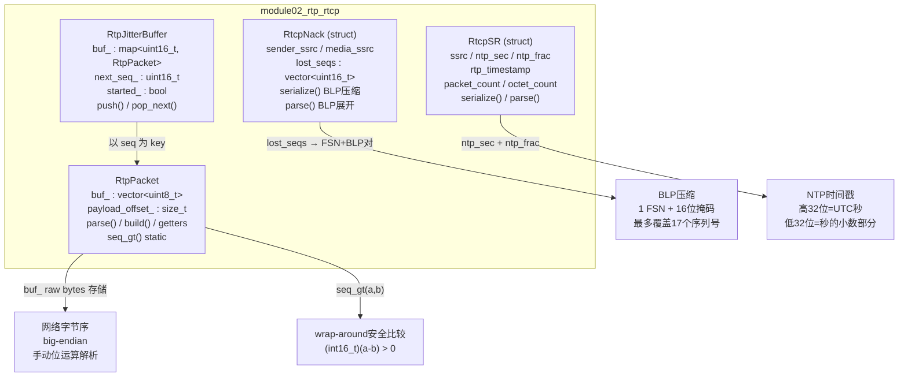
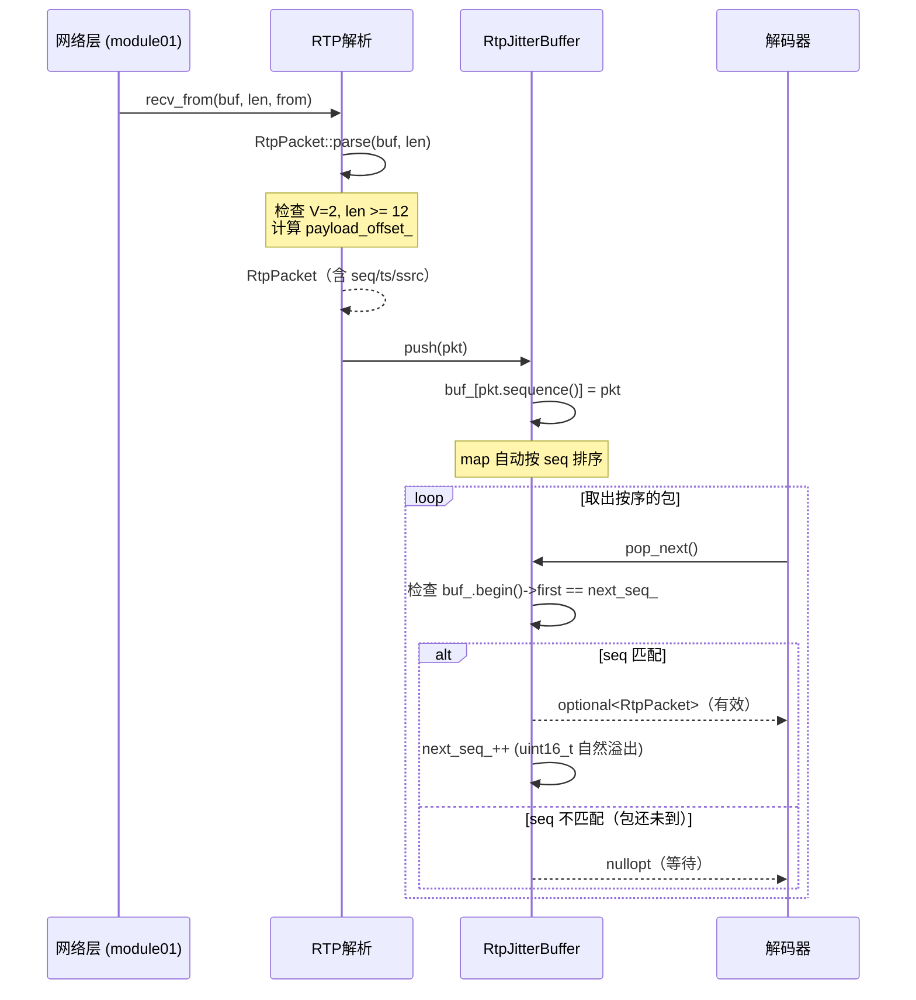
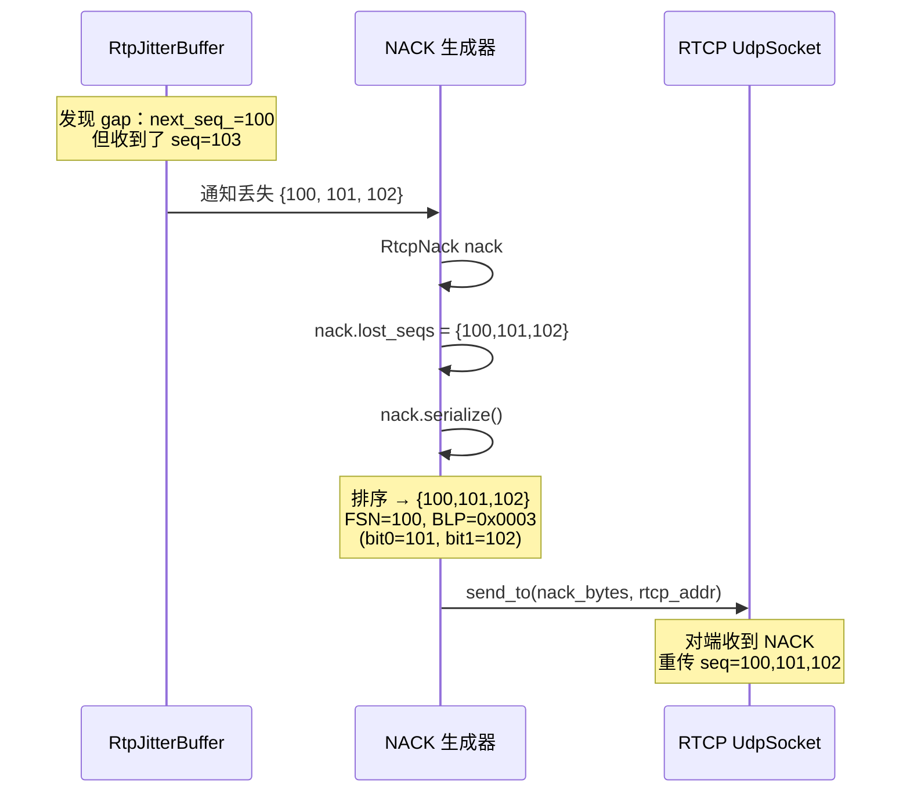

# module02_rtp_rtcp

RTP/RTCP 协议实现：包解析与构建、序列号回绕比较、NACK BLP 压缩、抖动缓冲区。

---

## 1. 模块目的与背景

实时音视频传输的核心协议是 **RTP（Real-time Transport Protocol，RFC 3550）**。RTP 本
身只是一个薄封装：提供序列号（用于排序和丢包检测）、时间戳（用于播放同步）、负载类型
标识、SSRC 流标识，而**不提供可靠性保证**——丢包是预期行为，不重传，不等待。

实时传输对延迟极其敏感：视频会议的端到端延迟预算通常在 150ms 以内，TCP 的重传机制
（RTT 级别的延迟）完全不可接受，因此 RTP 跑在 UDP 之上。

**RTCP（RTP Control Protocol）** 是 RTP 的控制协议，同样跑在 UDP 上（通常在 RTP 端
口+1 的端口）。本模块实现两种 RTCP 包：

- **RTCP SR（Sender Report，PT=200）**：发送端周期性发送，携带 NTP 绝对时间戳与 RTP
  时间戳的对应关系，接收端用此实现音视频同步（lip sync）。
- **RTCP NACK（PT=205，FMT=1，RFC 4585）**：接收端检测到丢包后发送，请求发送端重传
  指定序列号的包，最多 17 个序列号压缩在一个 FSN+BLP 对中。

此外，本模块提供 **RtpJitterBuffer**：按序列号排序的接收缓冲区，处理 UDP 乱序到达
和短暂抖动，为上层解码器提供按序的包序列。

```mermaid
graph TD
    Upper["上层模块（解码器、播放器）"]
    JB["RtpJitterBuffer\nmap&lt;uint16_t, RtpPacket&gt;"]
    PKT["RtpPacket\nparse() / build() / seq_gt() / getters"]
    RTCP["RtcpNack / RtcpSR\nserialize() / parse() / BLP 压缩/展开"]
    NET["module01 UdpSocket 收发"]

    Upper -->|pop_next() 按序| JB
    JB -->|push(pkt)| PKT
    PKT -->|收到丢包事件| RTCP
    RTCP --> NET
```

---

## 2. 架构图



---

## 3. 关键类与文件表

### `include/rtp/rtp_packet.h` + `src/rtp_packet.cpp` — `RtpPacket`

存储格式为 `std::vector<uint8_t> buf_`，即原始网络字节序的 RTP 包数据。所有字段通
过 getter 函数从 `buf_` 按位解析，**不使用 `#pragma pack` 结构体**（原因详见第 7 节
设计决策）。`payload_offset_` 记录有效载荷的起始偏移（跳过固定头 + CC * 4 + 扩展头）。

**构造与解析**：
- 默认构造：空包。
- `explicit RtpPacket(std::vector<uint8_t> data)`：从已有 bytes 构造，自动计算
  `payload_offset_`（仅考虑 CC，不处理扩展头）。
- `parse(const uint8_t* data, size_t len) -> bool`：完整解析，检查 version==2、
  包长合法性、扩展头长度，计算正确的 `payload_offset_`。解析失败返回 false。
- `build(pt, seq, ts, ssrc, payload, len, marker)`：构建标准 RTP 包（无 CC，无扩展头），
  手动写入 12 字节固定头，然后 `memcpy` 载荷数据。

**序列号比较**：
- `static bool seq_gt(uint16_t a, uint16_t b)` — RFC 3550 附录 A.1 算法，处理 16-bit
  序列号的 wrap-around，详见第 4 节。

### `include/rtp/rtcp_packet.h` + `src/rtcp_packet.cpp` — `RtcpSR` / `RtcpNack`

两个 Plain Old Data 风格的 struct，字段直接对应 RFC 3550/4585 的报文字段（均为主机
字节序），序列化/反序列化时进行大端转换。

**RtcpSR**（Sender Report，PT=200）：
- `ntp_sec`：NTP 时间戳高 32 位（UTC 秒，以 1900 年 1 月 1 日为纪元）。
- `ntp_frac`：NTP 时间戳低 32 位（秒的小数部分，精度 = 1/2^32 ≈ 232 皮秒）。
- `rtp_timestamp`：对应 `ntp_sec.ntp_frac` 时刻的 RTP 时间戳（媒体时钟频率下的值）。
- `packet_count` / `octet_count`：从开始发送至今的统计量。
- `serialize() -> vector<uint8_t>`：生成 28 字节固定长度的 SR 包。
- `parse(data, len) -> bool`：验证 V=2、PT=200、length 字段合法性，解析各字段。

**RtcpNack**（RTPFB，PT=205，FMT=1）：
- `lost_seqs`：已展开的丢失序列号列表（`vector<uint16_t>`）。序列化时压缩为 FSN+BLP
  对，反序列化时展开。
- `serialize()`：对 `lost_seqs` 排序去重，贪心打包为最少数量的 FSN+BLP 对。
- `parse()`：将 FSN+BLP 对展开为序列号列表（FSN 本身 + BLP 中置位的偏移）。

### `include/rtp/rtp_jitter_buffer.h` — `RtpJitterBuffer`

基础版抖动缓冲区（供 module08 扩展），内部用 `std::map<uint16_t, RtpPacket>` 按序列
号自动排序。

- `push(RtpPacket pkt)`：插入包，以序列号为 key。`map` 自动维护有序性。
- `pop_next() -> optional<RtpPacket>`：若 `buf_` 中存在序列号等于 `next_seq_` 的包，
  则取出并递增 `next_seq_`（自然 uint16_t 溢出处理回绕）；否则返回 `nullopt`（等待
  乱序包补齐）。
- `started_`：标记是否已收到第一个包（初始化 `next_seq_`）。

注意：`std::map<uint16_t, ...>` 的 key 比较是无符号数值比较，不是 seq_gt 语义。这
在序列号跨越 32768 边界（半圈以上的跳跃）时会出现排序异常。基础版只处理正常情况，
鲁棒性改进留给后续模块。

---

## 4. 核心算法

### 4.1 RTP 头部格式（RFC 3550 Section 5.1）

```
 0                   1                   2                   3
 0 1 2 3 4 5 6 7 8 9 0 1 2 3 4 5 6 7 8 9 0 1 2 3 4 5 6 7 8 9 0 1
+-+-+-+-+-+-+-+-+-+-+-+-+-+-+-+-+-+-+-+-+-+-+-+-+-+-+-+-+-+-+-+-+
|V=2|P|X|  CC   |M|     PT      |       sequence number         |
+-+-+-+-+-+-+-+-+-+-+-+-+-+-+-+-+-+-+-+-+-+-+-+-+-+-+-+-+-+-+-+-+
|                           timestamp                           |
+-+-+-+-+-+-+-+-+-+-+-+-+-+-+-+-+-+-+-+-+-+-+-+-+-+-+-+-+-+-+-+-+
|           synchronization source (SSRC) identifier           |
+-+-+-+-+-+-+-+-+-+-+-+-+-+-+-+-+-+-+-+-+-+-+-+-+-+-+-+-+-+-+-+-+
|            contributing source (CSRC) identifiers            |
|                             ....                              |
+-+-+-+-+-+-+-+-+-+-+-+-+-+-+-+-+-+-+-+-+-+-+-+-+-+-+-+-+-+-+-+-+
```

| 字段 | 位宽 | 字节偏移 | 说明 |
|------|------|----------|------|
| V（Version） | 2 bits | byte[0] bit[7:6] | 必须为 2 |
| P（Padding） | 1 bit  | byte[0] bit[5] | 末尾有填充字节 |
| X（Extension）| 1 bit | byte[0] bit[4] | 后跟扩展头 |
| CC（CSRC Count）| 4 bits | byte[0] bit[3:0] | CSRC 数量，每个 4 字节 |
| M（Marker）  | 1 bit  | byte[1] bit[7] | 媒体相关（视频帧末包=1） |
| PT（Payload Type）| 7 bits | byte[1] bit[6:0] | 编解码类型（96-127 动态） |
| Sequence Number | 16 bits | byte[2-3] | 每包+1，wrap-around |
| Timestamp | 32 bits | byte[4-7] | 媒体时钟频率下的采样时刻 |
| SSRC | 32 bits | byte[8-11] | 流标识符，随机生成 |
| CSRC[0..CC-1] | 32 bits each | byte[12+] | 混音源标识 |

固定头最小 12 字节（CC=0）。若有 CC 个 CSRC，头长为 `12 + CC * 4` 字节。

### 4.2 序列号 wrap-around 比较（RFC 3550 附录 A.1）

RTP 序列号为 16-bit 无符号整数（0-65535），每包加 1，65535 之后回绕到 0。直接用
`a > b` 比较会在回绕时出错：`0 > 65535` 为 false，但 0 实际上比 65535 更新（更靠后）。

**有符号差值法**：

```cpp
static bool seq_gt(uint16_t a, uint16_t b) {
    return (int16_t)(a - b) > 0;
}
```

**原理证明**：

设 `d = a - b`（无符号 16-bit 减法，结果模 2^16）：

- 若 `a` 比 `b` 新（a 在 b 之后，差值在 1 到 32767 之间）：
  `d ∈ [1, 32767]`，强转为 `int16_t` 后仍为正数，返回 true。

- 若 `a` 比 `b` 旧（a 在 b 之前，正向差值在 32769 到 65535 之间）：
  `d ∈ [32769, 65535]`，强转为 `int16_t` 后为负数（二进制补码），返回 false。

- 若 `a == b`：`d = 0`，强转后为 0，返回 false（不满足"大于"）。

- 关键边界 —— wrap-around 示例：
  `a=0, b=65535`：`d = 0 - 65535 = 1`（无符号模 65536），`(int16_t)1 > 0` → true（正确）。
  `a=65535, b=0`：`d = 65535 - 0 = 65535`，`(int16_t)65535 = -1 > 0` → false（正确）。

**隐含假设**：两个序列号的"真实距离"不超过 32767（半圈）。若距离超过半圈，有符号差
值法无法区分"a 比 b 新了 32768 个包"和"a 比 b 旧了 32768 个包"。实际应用中，正常
网络抖动导致的乱序不超过数百个序列号，这个假设是安全的。

### 4.3 NACK BLP 压缩算法

**FSN（First Sequence Number）+ BLP（Bitmask of following Lost Packets）** 是 RFC 4585
定义的丢包列表压缩格式：每个 FSN+BLP 对（32 bits）最多表示 17 个丢失的序列号。

```
FSN = 第一个丢失的序列号（16-bit）
BLP 第 i 位（i=0 为最低位）= 1 表示 FSN + i + 1 也丢失
```

示例：丢失序列号 `{100, 101, 103}`
- FSN = 100
- BLP bit 0 = 1 → 100+0+1 = 101（丢失）
- BLP bit 1 = 0 → 100+1+1 = 102（未丢失）
- BLP bit 2 = 1 → 100+2+1 = 103（丢失）
- BLP = 0b0000000000000101 = 0x0005

**serialize() 贪心算法伪代码**：

```
输入: lost_seqs（无序的丢失序列号列表）
输出: FSN+BLP 对列表

1. 对 lost_seqs 排序并去重
2. i = 0
3. while i < seqs.size():
     fsn = seqs[i]
     blp = 0
     // 将 fsn+1 到 fsn+16 范围内的其他丢失序列号打包进 BLP
     for j = i+1 to seqs.size()-1:
       diff = seqs[j] - fsn       // 注意：简化实现用整数差，不处理 wrap-around
       if diff in [1, 16]:
         blp |= (1 << (diff - 1))
       elif diff > 16:
         break
     pairs.append({fsn, blp})
     // 跳过已被当前 BLP 覆盖的序列号（diff <= 16 的都被覆盖了）
     while i+1 < seqs.size() and seqs[i+1] - fsn <= 16:
       i++
     i++
4. return pairs
```

**parse() 展开伪代码**：

```
输入: FSN+BLP 对列表
输出: 展开后的 lost_seqs

for each (fsn, blp):
    lost_seqs.push_back(fsn)
    for i = 0 to 15:
        if blp & (1 << i):
            lost_seqs.push_back(fsn + i + 1)
```

### 4.4 RTCP SR NTP 时间戳格式

NTP（Network Time Protocol）时间戳是 64-bit 固定小数点数：

```
|<───── 高 32 位 (ntp_sec) ─────>|<───── 低 32 位 (ntp_frac) ─────>|
|         UTC 整秒数              |       秒的小数部分（二进制）       |
|  自 1900-01-01 00:00:00 UTC 起  |  精度 = 1/2^32 ≈ 232 皮秒       |
```

UNIX 时间戳（自 1970-01-01）转 NTP 时间戳：

```cpp
// UNIX epoch 到 NTP epoch 的差值（秒）
static constexpr uint32_t kNtpUnixDelta = 2208988800u;  // 70年差值

uint32_t ntp_sec  = (uint32_t)unix_time_sec + kNtpUnixDelta;
uint32_t ntp_frac = (uint32_t)(subsecond_fraction * (1LL << 32));
```

**为什么 RTCP SR 需要同时携带 NTP 和 RTP 时间戳**：

RTP 时间戳是媒体时钟（如 90000Hz 视频时钟、48000Hz 音频时钟），只有相对意义，不同
流的 RTP 时间戳基准（`timestamp_base`）是随机的，无法直接比较。RTCP SR 建立了一个
映射关系：在 NTP 时刻 `T_ntp` 时，媒体时钟值为 `T_rtp`。接收端用这个映射将不同流
的 RTP 时间戳换算到统一的 NTP 时间轴上，从而实现音视频同步。

### 4.5 音视频 AV 同步（lip sync）原理

音频时钟：48000 Hz（每秒 48000 个采样点），每 20ms 音频帧的时间戳增量 = 960。
视频时钟：90000 Hz（固定，不依赖实际帧率），30fps 时每帧时间戳增量 = 3000。

假设某时刻接收到的数据：
- 音频包：RTP timestamp = 48000（对应 RTCP SR 中 NTP = T₁）
- 视频包：RTP timestamp = 90000（对应 RTCP SR 中 NTP = T₂）

接收端通过各自的 RTCP SR，将音频和视频时间戳均转换到 NTP 时间轴，再找到最接近同一
NTP 时刻的音频帧和视频帧进行配对播放，即为 lip sync。

**时钟漂移问题**：发送端的媒体时钟（如声卡时钟）和系统时钟（NTP 参考）可能有细微漂
移（通常 < 100ppm），RTCP SR 周期性更新（约每 5 秒一次）可以跟踪这种漂移。

---

## 5. 调用时序图

### 场景一：接收 RTP 包并存入 JitterBuffer



### 场景二：检测丢包并发送 NACK



### 场景三：解析 RTCP SR 用于 AV 同步

```mermaid
sequenceDiagram
    participant SRParser as SR解析器
    participant AVSync as AV同步模块
    participant VideoPlayer as 视频播放器
    participant AudioPlayer as 音频播放器

    SRParser->>SRParser: RtcpSR sr; sr.parse(data, len)
    Note over SRParser: ntp_sec/ntp_frac → 绝对时刻 T<br/>rtp_timestamp → 该时刻的媒体时钟值

    SRParser->>AVSync: (ssrc, ntp_ts, rtp_ts) 映射对

    AVSync->>VideoPlayer: 视频 RTP ts → NTP 时刻
    AVSync->>AudioPlayer: 音频 RTP ts → NTP 时刻
    AVSync->>AVSync: 对齐两路时间轴，计算同步误差
    AVSync->>VideoPlayer: 调整视频渲染时刻
```

---

## 6. 关键代码片段

### 6.1 RtpPacket::parse — 字段解析与边界检查

```cpp
// src/rtp_packet.cpp: 16-39

bool RtpPacket::parse(const uint8_t* data, size_t len) {
    if (len < kRtpMinHeaderLen) return false;  // kRtpMinHeaderLen = 12

    // byte[0] 高2位是 Version，必须为 2（RFC 3550 §5.1）
    // 通过右移6位再与0x03取低2位
    uint8_t version = (data[0] >> 6) & 0x03;
    if (version != 2) return false;

    // byte[0] 低4位是 CC（Contributing Source Count）
    // 每个 CSRC 占 4 字节，追加在固定头之后
    uint8_t cc = data[0] & 0x0F;
    size_t header_len = kRtpMinHeaderLen + cc * 4;  // 12 + cc*4
    if (len < header_len) return false;

    // 检查是否有扩展头（X bit = byte[0] bit[4]）
    bool has_ext = (data[0] >> 4) & 0x01;
    size_t offset = header_len;
    if (has_ext) {
        if (offset + 4 > len) return false;
        // 扩展头格式：2字节profile + 2字节length（以32-bit words为单位）
        uint16_t ext_len = ((uint16_t)data[offset + 2] << 8) | data[offset + 3];
        offset += 4 + ext_len * 4;  // 跳过扩展头
        if (offset > len) return false;
    }

    buf_.assign(data, data + len);  // 拷贝原始字节（大端序，直接存储）
    payload_offset_ = offset;       // 记录载荷起始位置
    return true;
}
```

### 6.2 RtpPacket::build — 手动写入大端序头部

```cpp
// src/rtp_packet.cpp: 42-70

void RtpPacket::build(uint8_t payload_type, uint16_t seq, uint32_t timestamp,
                      uint32_t ssrc, const uint8_t* payload, size_t payload_len,
                      bool marker)
{
    buf_.resize(kRtpMinHeaderLen + payload_len);

    // byte[0]: V=2(10), P=0, X=0, CC=0 → 0b10000000 = 0x80
    buf_[0] = 0x80;

    // byte[1]: M bit 在最高位，PT 占低7位
    // marker ? 0x80 : 0x00 设置 M bit
    buf_[1] = (marker ? 0x80 : 0x00) | (payload_type & 0x7F);

    // bytes[2-3]: 16-bit 序列号，大端序（网络字节序）
    // 高字节先写（Big Endian = 高位在低地址）
    buf_[2] = (seq >> 8) & 0xFF;   // 高字节
    buf_[3] = seq & 0xFF;           // 低字节

    // bytes[4-7]: 32-bit 时间戳，大端序
    buf_[4] = (timestamp >> 24) & 0xFF;
    buf_[5] = (timestamp >> 16) & 0xFF;
    buf_[6] = (timestamp >>  8) & 0xFF;
    buf_[7] = timestamp & 0xFF;

    // bytes[8-11]: 32-bit SSRC，大端序
    buf_[8]  = (ssrc >> 24) & 0xFF;
    buf_[9]  = (ssrc >> 16) & 0xFF;
    buf_[10] = (ssrc >>  8) & 0xFF;
    buf_[11] = ssrc & 0xFF;

    payload_offset_ = kRtpMinHeaderLen;
    if (payload && payload_len > 0) {
        std::memcpy(buf_.data() + payload_offset_, payload, payload_len);
    }
}
```

### 6.3 seq_gt — 有符号差值法 wrap-around 比较

```cpp
// include/rtp/rtp_packet.h: 40-42

// RFC 3550 Appendix A.1 的标准算法
// 将无符号 uint16_t 减法结果强转为有符号 int16_t
// 利用二进制补码的性质：差值在 [1,32767] 时为正，在 [32769,65535] 时解释为负
static bool seq_gt(uint16_t a, uint16_t b) {
    return (int16_t)(a - b) > 0;
    //              ^^^^^^^^
    // uint16_t 减法结果模 2^16，强转 int16_t 后：
    // - 若真实差值在 [1, 32767]（a 比 b 新），int16_t 为正 → 返回 true
    // - 若真实差值在 [32769, 65535]（a 比 b 旧，或差太大），int16_t 为负 → 返回 false
    // - 示例：a=0, b=65535 → 0-65535=1 (mod 65536) → (int16_t)1=1 > 0 → true
}
```

### 6.4 RtcpNack::serialize — BLP 压缩核心逻辑

```cpp
// src/rtcp_packet.cpp: 126-151（关键段落）

size_t i = 0;
while (i < seqs.size()) {
    NackPair p;
    p.fsn = seqs[i];  // 当前窗口的第一个丢失序列号
    p.blp = 0;

    // 将 FSN+1 到 FSN+16 范围内的其他丢失序列号打包进 BLP
    // diff=1 → BLP bit 0（最低位），diff=16 → BLP bit 15（最高位）
    for (size_t j = i + 1; j < seqs.size(); ++j) {
        int diff = (int)(seqs[j]) - (int)(p.fsn);
        if (diff >= 1 && diff <= 16) {
            p.blp |= (uint16_t)(1 << (diff - 1));  // 置对应位
        } else if (diff > 16) {
            break;  // 超出 BLP 覆盖范围，开启新的 FSN+BLP 对
        }
    }
    pairs.push_back(p);

    // 跳过已经被当前 BLP 覆盖的序列号（diff <= 16 的均已打包）
    while (i + 1 < seqs.size()) {
        int diff = (int)(seqs[i + 1]) - (int)(p.fsn);
        if (diff <= 16) { ++i; } else { break; }
    }
    ++i;  // 移动到下一个未覆盖的序列号
}
```

### 6.5 RtcpSR::serialize — length 字段的计算

```cpp
// src/rtcp_packet.cpp: 51-70

std::vector<uint8_t> RtcpSR::serialize() const {
    std::vector<uint8_t> buf;
    buf.reserve(28);  // SR 固定 28 字节（无 report block）

    buf.push_back(0x80);   // V=2(10), P=0, RC=0 → 0b10000000
    buf.push_back(200);    // PT = 200（SR 的 Payload Type）

    // length 字段：RFC 3550 定义为"(总字节数/4) - 1"（以32-bit words计，不含自身）
    // 28字节 / 4 = 7 words，7 - 1 = 6
    // 这个字段值在 parse 时用于验证：expected = (length+1)*4
    write_u16(buf, 6);     // length = 6

    write_u32(buf, ssrc);          // 发送方 SSRC
    write_u32(buf, ntp_sec);       // NTP 时间戳高32位（UTC秒）
    write_u32(buf, ntp_frac);      // NTP 时间戳低32位（秒的小数）
    write_u32(buf, rtp_timestamp); // 对应 NTP 时刻的 RTP 时间戳
    write_u32(buf, packet_count);  // 发送总包数
    write_u32(buf, octet_count);   // 发送总字节数

    return buf;
}
```

---

## 7. 设计决策

### 7.1 为什么不用 `#pragma pack` 结构体直接 reinterpret_cast

最直觉的 RTP 解析方式是定义一个 packed 结构体然后直接强转指针：

```cpp
// 看起来简单，但有严重问题：
#pragma pack(1)
struct RtpHeader {
    uint8_t  flags;    // V, P, X, CC
    uint8_t  marker_pt;
    uint16_t seq;      // 这里是大端序！
    uint32_t timestamp;
    uint32_t ssrc;
};
#pragma pack()

// 危险用法：
const RtpHeader* hdr = reinterpret_cast<const RtpHeader*>(data);
uint16_t seq = ntohs(hdr->seq);  // 仍然需要字节序转换
```

**问题一：strict aliasing 违规（UB）**

C++ 标准规定，通过与实际类型不兼容的指针访问对象是未定义行为（strict aliasing rule，
[basic.lval] §11.7.4）。`reinterpret_cast<RtpHeader*>(uint8_t*)` 违反此规则。GCC 在
`-O2` 及以上优化级别假设不存在 aliasing，可能将此 cast 优化掉或产生不正确的结果。
正确的 type-punning 方法是 `memcpy`，但那已经和手动位运算差不多了。

**问题二：字节序需要手动处理**

`#pragma pack` 只处理对齐，不处理字节序。网络字节序（大端）与 x86 主机字节序（小端）
不同，每个多字节字段仍然需要 `ntohs`/`ntohl`。

**问题三：可移植性**

`#pragma pack` 是编译器扩展，不是 C++ 标准，不同编译器行为可能不同。

**本模块的做法**：原始字节存在 `vector<uint8_t>`，通过位运算 getter 解析，避免所有
aliasing 和字节序问题，代码意图清晰，可移植性好：

```cpp
uint16_t sequence() const {
    return ((uint16_t)buf_[2] << 8) | buf_[3];  // 大端序，显式处理
}
```

### 7.2 为什么 lost_seqs 存储已展开的序列号，而不是 FSN+BLP 对

存储展开的序列号（`vector<uint16_t>`）比存储压缩的 FSN+BLP 对（`vector<NackPair>`）
有以下优势：

- **业务层接口简单**：调用方直接 `for (auto seq : nack.lost_seqs)` 遍历，不需要关心
  BLP 解码逻辑。
- **压缩是传输细节**：BLP 压缩只在序列化到网络字节流时发生，是传输层的优化，业务逻辑
  不应该暴露这种细节。
- **灵活性**：调用方可以向 `lost_seqs` 任意添加序列号，序列化时自动压缩为最优的
  FSN+BLP 布局，不需要手动管理 BLP bit。

代价：`vector<uint16_t>` 占用的内存比 `vector<NackPair>` 略多（最多 17× 倍，但实际
NACK 列表通常 < 20 个序列号，差异可忽略）。

### 7.3 为什么 RtpJitterBuffer 使用 std::map 而不是自定义环形缓冲区

`std::map<uint16_t, RtpPacket>` 自动维护按序列号排序的有序容器：

- `push()` 是 O(log n) 插入，对小 n（抖动缓冲区通常 < 200 个包）性能完全够用。
- `pop_next()` 检查 `begin()` 是否等于 `next_seq_` 是 O(1)。
- 天然处理乱序到达（map 自动按 key 排序）。

自定义环形缓冲区需要处理：seq wrap-around 时的索引映射、超出窗口大小时的淘汰策略、
空洞（missing seq）的管理。这些逻辑在基础版中暂不需要，交给 module08 实现。

`std::map` 的缺点是 heap 分配（每个节点独立 malloc），缓存局部性差。高性能场景应使
用 flat_map 或自定义环形数组。

### 7.4 为什么 RTCP SR 的 length 字段是 `(总字节数/4) - 1` 而不是总字节数

这是 RFC 3550 的历史设计：RTCP 包中的 length 字段以 32-bit words（4 字节）为单位，
且不计首字（即减 1）。用意是 RTCP 包必须 4 字节对齐，length 字段用 words 表示节省
一位，且减 1 后 length=0 表示仅有 4 字节（最小合法 RTCP 包），避免 length=0 被误解
为"无数据"。

实际字节数 = `(length + 1) * 4`。SR（28 字节）的 length = 28/4 - 1 = 6。解析时必须
用此公式计算 `expected`，与 `len` 比较以验证包长度合法性。

---

## 8. 常见坑

**坑 1：用 `a > b` 比较序列号，wrap-around 时逻辑错误**

原因：`uint16_t(0) > uint16_t(65535)` 为 false，但 seq=0 比 seq=65535 更新（更靠后）。
直接数值比较在序列号回绕后完全失效。

解决：一律使用 `RtpPacket::seq_gt(a, b)` 进行序列号比较。JitterBuffer 的 `pop_next`
中对 `next_seq_` 的递增依赖 `uint16_t` 的自然溢出（65535+1=0）也是正确的。

---

**坑 2：解析 RTP 包时忘记检查扩展头长度**

原因：若 RTP 包的 X bit 为 1 但包体被截断（扩展头 `length` 字段声明的长度超出实际
字节数），直接访问 `data[offset]` 会越界。真实网络中畸形包、重放攻击包都可能触发。

解决：`parse()` 中对每次 `offset` 推进都检查 `offset > len`（见实现第 34 行）。输入
验证必须在数据访问前完成。

---

**坑 3：RTCP length 字段误解，parse 时算错 expected 长度**

原因：初学者容易将 RTCP length 字段理解为"字节数"。实际上 length = (字节数/4) - 1，
actual_bytes = (length + 1) * 4。若用 `expected = length * 4` 计算，SR（length=6）
的 expected 为 24 字节而非 28，导致解析时 `ssrc`/`ntp_sec` 等字段读取的是后 4 个字
节的数据，静默产生错误值。

解决：严格按 RFC 公式计算：`size_t expected = (length_words + 1) * 4`（见实现）。

---

**坑 4：NACK serialize 中序列号跨越 wrap-around 边界时排序失效**

原因：`RtcpNack::serialize()` 对 `lost_seqs` 进行简单数值排序（`std::sort`）。若丢
失序列号同时包含 65530、65535、0、5，数值排序得到 `{0, 5, 65530, 65535}`，BLP 打包
会将 0 和 5 分成一组，65530 和 65535 分成另一组，而真实顺序应该是 65530、65535、0、5
（跨越 wrap-around 的连续序列）。BLP 压缩的 diff 计算 `(int)(seqs[j]) - (int)(p.fsn)`
也不是 wrap-around 安全的（用了普通整数减法）。

解决：基础实现注释中已标注此限制。调用方应保证 `lost_seqs` 中所有序列号在合理范围
内（不跨越半圈，即差值 < 32768）。完整实现需要先用 `seq_gt` 排序，再用有符号差值法
计算 diff（module08 扩展）。

---

**坑 5：大端序与主机序混淆，直接对字段做位运算**

原因：网络包是大端序，x86/ARM64 主机是小端序。若将 `buf_` 中的 bytes 2-3 直接作为
`uint16_t*` 读取（不做字节序转换），在小端 x86 上得到的是"反序"的值。例如 seq=0x1234
在网络包中是 `{0x12, 0x34}`，直接 `*(uint16_t*)&buf_[2]` 在 x86 上读取为 `0x3412`。

解决：始终用手动位运算解析（`((uint16_t)buf_[2] << 8) | buf_[3]`），或用 `ntohs()`/
`ntohl()`。本模块统一使用位运算，避免 `ntoh*` 函数的平台依赖。

---

**坑 6：RtpJitterBuffer 的 std::map key 是 uint16_t 数值序**

原因：`std::map<uint16_t, ...>` 用 `operator<` 比较 key，即无符号数值比较。这不是
seq_gt 语义。若当前 `next_seq_` = 2，JitterBuffer 中同时有 seq=1（旧包）和 seq=3（乱
序的新包），`map.begin()` 返回 seq=1（数值最小），`pop_next` 因 `1 != 2` 返回 nullopt，
而 seq=1 的旧包永远阻塞在 buffer 中，后续所有包无法被取出。

解决：基础版不处理旧包淘汰。实际系统需要在 `push()` 中检测 `seq_gt(pkt.seq, next_seq_)`，
丢弃过旧的包；并在 `pop_next()` 中对超时的包（等待超过 50-100ms 仍未收到）直接跳过，
更新 `next_seq_` 到下一个可用包（module08 的主要工作）。

---

## 9. 测试覆盖说明

### `TEST(RtpPacket, BuildAndParse)` — 构建解析往返一致性

**覆盖场景**：
- `build(pt=96, seq=1234, ts=90000, ssrc=0xDEADBEEF, payload, len, marker=false)`
- 直接读取 getter 验证所有字段（version、pt、seq、ts、ssrc、marker、padding、extension、cc）
- 通过 `parse(pkt.data(), pkt.size())` 重新解析，验证二次解析结果一致

**设计意图**：验证 build 写入的大端序字节与 getter 解析的位运算完全互逆（round-trip
consistency）。任何字节偏移算错、位掩码写错都会在此测试中暴露。使用 `0xDEADBEEF` 这
个"魔数"SSRC 是为了使调试时字节序错误一眼可见（小端错误读取会得到 `0xEFBEADDE`）。

---

### `TEST(RtpPacket, SeqComparison)` — wrap-around 边界情况全覆盖

**覆盖场景**：
- 正常情况：`seq_gt(100, 50)=true`，`seq_gt(50, 100)=false`，`seq_gt(100,100)=false`
- wrap-around：`seq_gt(0, 65535)=true`（0 比 65535 新）
- wrap-around：`seq_gt(1, 65535)=true`
- wrap-around：`seq_gt(100, 65500)=true`（差值 136 < 32768，a 更新）
- 反向：`seq_gt(65535, 0)=false`，`seq_gt(65500, 100)=false`

**设计意图**：RFC 3550 附录 A.1 算法的边界测试。特别是 `seq_gt(0, 65535)=true` 这个
wrap-around 情况，是对有符号差值法核心的验证。`seq_gt(100, 65500)` 测试了"a 比 b 新
但差值跨越了0"的场景（100 在 65500 之后 136 步）。

---

### `TEST(RtpPacket, PayloadIntegrity)` — 载荷数据完整性

**覆盖场景**：
- build 包含 5 字节载荷 `{0xAA, 0xBB, 0xCC, 0xDD, 0xEE}`
- 验证 `payload_size() == 5`
- `memcmp(payload(), data, 5) == 0`（字节级内容一致）
- parse 后重新验证载荷内容一致

**设计意图**：验证 `payload_offset_` 计算正确（12 字节头之后，CC=0 时直接是 12），
以及 `memcpy` 正确复制了载荷数据。用 `{0xAA, 0xBB, ...}` 非零值确保内存对齐问题不
会被 `0x00` 掩盖。parse 后的二次验证确保 `parse()` 正确恢复了 `payload_offset_`。

---

### `TEST(RtpPacket, MarkerBit)` — M bit 单独验证

**覆盖场景**：
- `build(..., marker=true)` → `marker()=true`
- `build(..., marker=false)` → `marker()=false`
- parse 后 marker bit 保留

**设计意图**：Marker bit 是视频 RTP 包中标识帧末包（last packet of frame）的关键信号，
接收端用它触发帧组装。单独测试确保 M bit 不会被 PT 字段的写操作意外覆盖（byte[1] 中
M 在 bit[7]，PT 在 bit[6:0]，需要用 `0x80` 和 `0x7F` 正确隔离）。

---

## 10. 构建与运行

### 前置条件

- **编译器**：GCC 10+（`std::optional` 需要 C++17）
- **CMake**：3.14+
- **依赖**：仅标准库，无第三方 C 库依赖

### 构建命令

```bash
# 在项目根目录 /home/aoi/AWorkSpace/cpp_meet
CXX=g++-10 CC=gcc-10 cmake -B build -DCMAKE_BUILD_TYPE=Debug
cmake --build build -j$(nproc)
```

### 运行测试

```bash
# 运行 module02 全部测试
ctest --test-dir build -R "module02" -V

# 直接运行测试二进制
./build/module02_rtp_rtcp/tests/test_rtp_packet

# 运行指定测试用例
./build/module02_rtp_rtcp/tests/test_rtp_packet --gtest_filter="RtpPacket.SeqComparison"
```

### 使用 Valgrind 检测内存错误

```bash
valgrind --leak-check=full --error-exitcode=1 \
    ./build/module02_rtp_rtcp/tests/test_rtp_packet
```

### 手动构造测试包（Python 辅助验证）

```python
# 验证 build() 生成的字节序正确性
import struct

def build_rtp(pt, seq, ts, ssrc, payload, marker=False):
    byte0 = 0x80  # V=2, P=0, X=0, CC=0
    byte1 = (0x80 if marker else 0x00) | (pt & 0x7F)
    header = struct.pack('>BBHII', byte0, byte1, seq, ts, ssrc)
    return header + payload

pkt = build_rtp(96, 1234, 90000, 0xDEADBEEF, b'\x01\x02\x03\x04\x05')
print(pkt.hex())
# 预期：80 60 04d2 00015f90 deadbeef 0102030405
```

---

## 11. 延伸阅读

### RTP/RTCP 协议规范

- **RFC 3550 — RTP: A Transport Protocol for Real-Time Applications**
  RTP 协议的完整规范，包含头部格式、时间戳语义、SSRC 冲突处理、RTCP SR/RR 格式、
  附录 A.1 的序列号比较算法（本模块 seq_gt 的直接来源）。
  https://www.rfc-editor.org/rfc/rfc3550

- **RFC 4585 — Extended RTP Profile for RTCP-Based Feedback (RTP/AVPF)**
  定义 RTCP NACK（PT=205，FMT=1）和 BLP 编码格式。本模块 RtcpNack 的直接规范来源。
  https://www.rfc-editor.org/rfc/rfc4585

- **RFC 3551 — RTP Profile for Audio and Video Conferences**
  定义静态 Payload Type 映射（PT 0-95）和动态 PT 使用规则（96-127）。
  https://www.rfc-editor.org/rfc/rfc3551

- **RFC 7741 — RTP Payload Format for VP8 Video**
  视频 RTP 包中 Marker bit（帧末包）和时间戳使用方式的实际案例。
  https://www.rfc-editor.org/rfc/rfc7741

### NTP 时间戳与 AV 同步

- **RFC 5905 — Network Time Protocol Version 4**
  NTP 时间戳格式（64-bit 固定小数点）的完整定义。
  https://www.rfc-editor.org/rfc/rfc5905

- **WebRTC 音视频同步实现分析**（Chromium 源码参考）
  https://chromium.googlesource.com/external/webrtc/+/refs/heads/main/modules/rtp_rtcp/

### 序列号与 NACK

- **RFC 3550 Appendix A.1** — 序列号 wrap-around 比较算法（本模块的权威来源）。

- **Google WebRTC NACK 实现** — 工业级 NACK 缓冲区与重传逻辑参考：
  https://chromium.googlesource.com/external/webrtc/+/refs/heads/main/modules/rtp_rtcp/source/nack_rtx_unittest.cc

### C++ 协议实现最佳实践

- **Chandler Carruth — "Undefined Behavior and Compiler Optimizations"** (CppCon 2016)
  strict aliasing UB 的实际案例分析，说明 `reinterpret_cast` 做 type-punning 的危险。
  https://www.youtube.com/watch?v=yG1OZ69H_-o

- **cppreference: std::optional**
  本模块 `RtpJitterBuffer::pop_next()` 返回类型的文档。
  https://en.cppreference.com/w/cpp/utility/optional
