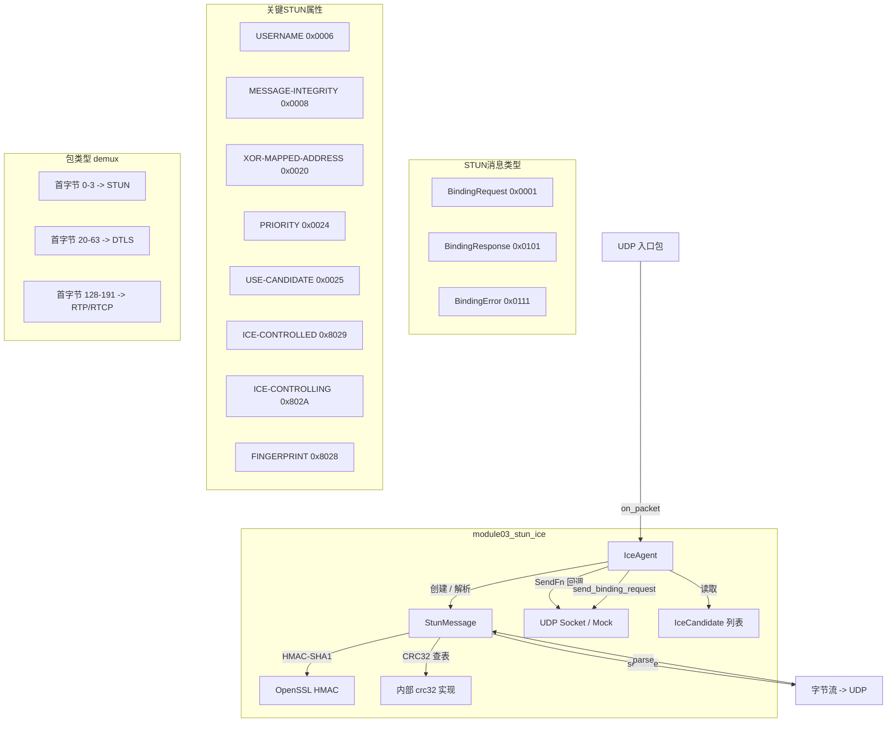
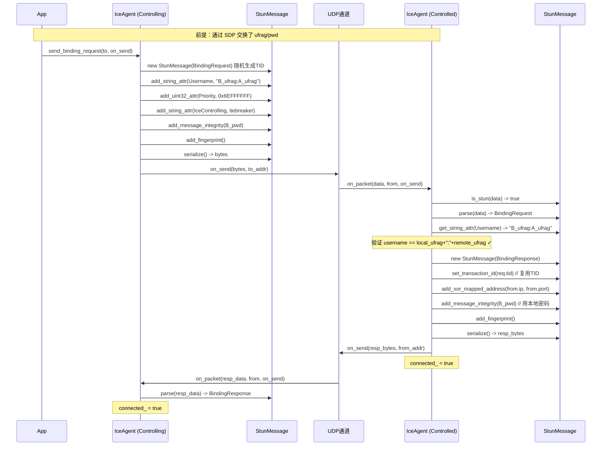
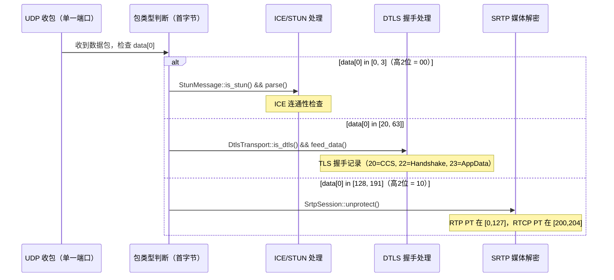

# module03_stun_ice — STUN 消息与 ICE 连通性检查

## 1. 模块目的与协议背景

### 为什么需要这个模块

现代实时通信（WebRTC、VoIP）中，两个对等端几乎都处于 NAT 后面。直接使用私有 IP 地址无法建立 UDP 连接，需要一套机制来：

1. **发现外部地址**：通过 STUN 服务器了解自己在公网上的 IP 和端口（Server Reflexive Candidate）
2. **连通性检查**：对所有候选地址对（candidate pair）发送探测包，确认哪条路径可用
3. **协商角色**：在双向连通检查过程中决定 Controlling / Controlled 角色，最终选定一对候选地址

没有 ICE，WebRTC 的 P2P 媒体流就无从建立。STUN 是 ICE 的基础协议，ICE 的连通性检查本质上就是携带特定属性的 STUN Binding Request/Response 交换。

### RFC 背景

| RFC | 内容 |
|-----|------|
| RFC 5389 | STUN — Session Traversal Utilities for NAT（消息格式、属性、Magic Cookie） |
| RFC 8445 | ICE — Interactive Connectivity Establishment（候选收集、排序、连通检查，取代 RFC 5245） |
| RFC 5245 | ICE 旧版（仍广泛引用，与 RFC 8445 逻辑相同） |
| RFC 5769 | STUN 测试向量（MESSAGE-INTEGRITY、FINGERPRINT 的官方参考值） |
| RFC 3489 | 原始 STUN（无 Magic Cookie，已废弃，仅做背景参考） |
| RFC 5764 | DTLS-SRTP（描述 ICE 与 DTLS 的组合使用场景） |

### 模块范围

本模块实现了：
- 完整的 STUN 消息序列化与解析（RFC 5389）
- MESSAGE-INTEGRITY（HMAC-SHA1）与 FINGERPRINT（CRC32 XOR 魔术值）
- XOR-MAPPED-ADDRESS 编解码
- ICE short-term credential 验证（ufrag:pwd 格式）
- ICE Binding Request / Response 的收发与角色判断逻辑

**不包含**：TURN（RFC 5766）、完整的候选收集（需绑定真实 socket）、ICE 候选对完整排序算法、Trickle ICE（RFC 8838）。

---

## 2. 架构图



---

## 3. 关键类与文件表

| 文件 | 作用 |
|------|------|
| `include/ice/stun_message.h` | `StunMessage` 类声明；`StunType`/`StunAttr` 枚举；`STUN_MAGIC_COOKIE` 常量 |
| `include/ice/ice_agent.h` | `IceAgent` 类声明；`IceCandidate` 结构体；`IceRole` 枚举 |
| `src/stun_message.cpp` | STUN 序列化/解析、MI 计算、FINGERPRINT 计算、XOR-MAPPED-ADDRESS 编解码、CRC32 查表 |
| `src/ice_agent.cpp` | ICE 连通性检查：收包验证、构造 Response、发起 Request、角色属性填写 |
| `tests/test_stun.cpp` | 4 个 Google Test 用例覆盖主要功能路径 |

### StunMessage 类详细说明

| 方法 | 说明 |
|------|------|
| `StunMessage(StunType)` | 构造时用 `rand()` 随机生成 12 字节事务 ID |
| `set_transaction_id(tid)` | 覆盖事务 ID（Response 必须复用 Request 的 tid） |
| `add_string_attr(attr, val)` | 添加任意字符串属性（USERNAME、ICE-CONTROLLING 的 tiebreaker 等） |
| `add_uint32_attr(attr, val)` | 添加 4 字节大端整型属性（PRIORITY） |
| `add_xor_mapped_address(ip, port)` | XOR 编码地址后追加 XOR-MAPPED-ADDRESS 属性 |
| `add_message_integrity(pwd)` | 用精确长度字段计算 HMAC-SHA1 并追加 MI 属性 |
| `add_fingerprint()` | 计算 CRC32 XOR 0x5354554E 并追加 FINGERPRINT 属性 |
| `serialize()` | 返回完整字节流（20 字节头 + 所有属性含 4 字节对齐填充） |
| `parse(data, len)` | 解析字节流；验证 Magic Cookie 和首字节高两位 |
| `get_string_attr(attr, out)` | 按类型查找并返回字符串属性值 |
| `get_uint32_attr(attr, out)` | 按类型查找并返回 uint32 属性值 |
| `get_xor_mapped_address(ip, port)` | 解码 XOR-MAPPED-ADDRESS，返回原始 IP/端口 |
| `is_stun(data, len)` | 静态方法，用于包类型 demux（首字节高2位为0且有 Magic Cookie） |

内部状态：
- `type_`：消息类型枚举
- `transaction_id_[12]`：事务 ID 字节数组
- `attrs_`：`vector<pair<StunAttr, vector<uint8_t>>>`，保留插入顺序

### IceAgent 类详细说明

| 方法 | 说明 |
|------|------|
| `IceAgent(role, local_ufrag, local_pwd)` | 构造时设置本地角色和凭证 |
| `set_remote_credentials(ufrag, pwd)` | SDP Offer/Answer 交换后调用，设置对端凭证 |
| `add_remote_candidate(c)` | 添加对端候选（从 SDP 解析） |
| `on_packet(data, len, from, on_send)` | 收包入口：非 STUN 包直接忽略；Request 验证并回复 Response；Response 设置 connected_ |
| `send_binding_request(to, on_send)` | 主动发起连通性检查，填写 USERNAME/PRIORITY/角色属性/MI/FINGERPRINT |
| `is_connected()` | 双向验证完成标志 |

### IceCandidate 结构体

| 字段 | 类型 | 说明 |
|------|------|------|
| `foundation` | `string` | 同类候选的唯一标识（相同 IP/协议/类型的候选共用） |
| `priority` | `uint32_t` | 由优先级公式计算，值越大优先级越高 |
| `ip` | `uint32_t` | 网络字节序 IPv4 地址 |
| `port` | `uint16_t` | 主机字节序端口号 |
| `type` | `string` | `"host"` 或 `"srflx"`（本模块只用 host） |

---

## 4. 核心算法

### 4.1 STUN 消息格式（RFC 5389 §6）

```
 0                   1                   2                   3
 0 1 2 3 4 5 6 7 8 9 0 1 2 3 4 5 6 7 8 9 0 1 2 3 4 5 6 7 8 9 0 1
+-+-+-+-+-+-+-+-+-+-+-+-+-+-+-+-+-+-+-+-+-+-+-+-+-+-+-+-+-+-+-+-+
|0 0|     STUN Message Type     |         Message Length        |
+-+-+-+-+-+-+-+-+-+-+-+-+-+-+-+-+-+-+-+-+-+-+-+-+-+-+-+-+-+-+-+-+
|                     Magic Cookie (0x2112A442)                 |
+-+-+-+-+-+-+-+-+-+-+-+-+-+-+-+-+-+-+-+-+-+-+-+-+-+-+-+-+-+-+-+-+
|                                                               |
|                     Transaction ID (96 bits = 12字节)        |
|                                                               |
+-+-+-+-+-+-+-+-+-+-+-+-+-+-+-+-+-+-+-+-+-+-+-+-+-+-+-+-+-+-+-+-+
|   属性 TLV 列表（每个 4 字节对齐）                           |
+-+-+-+-+-+-+-+-+-+-+-+-+-+-+-+-+-+-+-+-+-+-+-+-+-+-+-+-+-+-+-+-+
```

关键规则：
- 头部固定 **20 字节**，Message Length **不含这 20 字节**
- 首字节高 2 位必须为 `00`（区分 RTP `10xxxxxx` 和 RTCP `10xxxxxx`）
- Magic Cookie 固定 `0x2112A442`，区分旧 RFC 3489 包
- 每个属性由 2 字节类型 + 2 字节长度 + 值（4 字节对齐）组成

### 4.2 消息类型编码（2 位 class + 12 位 method 交织）

RFC 5389 的消息类型不是简单拼接，而是将 class（2 位）和 method（12 位）交织到 16 位中：

```
位布局（位 15 到 位 0）：
  M11 M10 M9 M8 M7  C1  M6 M5 M4  C0  M3 M2 M1 M0
  (bits 15-11)      (10) (9-7)     (4)  (3-0)

Binding method = 0x001（M 全部低 12 位为 0x001，即只有 M0=1）

class 取值:
  00 = Request     C1=0, C0=0
  01 = Indication  C1=0, C0=1
  10 = Success Response  C1=1, C0=0
  11 = Error Response    C1=1, C0=1

结果：
  BindingRequest  = 0x0001 (M=0x001, class=00)
  BindingResponse = 0x0101 (M=0x001, class=10 -> bit10=1)
  BindingError    = 0x0111 (M=0x001, class=11 -> bit10=1, bit4=1)
```

本模块直接使用枚举常量，无需手动做位运算。

### 4.3 MESSAGE-INTEGRITY 计算（精确步骤）

RFC 5389 §15.4 规定，HMAC-SHA1 的输入中，**消息头的 Length 字段必须设为包含 MI 属性后的值**：

```
输入：
  - password（short-term credential 的密码字符串）
  - 当前已添加的所有属性（不含 MI 本身）

步骤 1：序列化现有属性 → attr_bytes（含4字节对齐填充）
步骤 2：计算临时长度
          msg_len_for_mi = len(attr_bytes) + 24
          // 24 = 4字节(MI属性头 type+len) + 20字节(SHA1摘要长度)
步骤 3：构造 HMAC 输入流
          [type        : 2字节大端]
          [msg_len_for_mi : 2字节大端]   <- 关键：用含MI后的长度
          [Magic Cookie: 4字节]
          [Transaction ID: 12字节]
          [attr_bytes]
步骤 4：digest = HMAC-SHA1(key=password, msg=上述输入流)
步骤 5：将 digest[0..19]（20字节）作为 MI 属性值追加到属性列表
```

**为什么要预设长度**：让接收方可以用"截止到 MI 属性前"的消息数据重算 HMAC。接收方计算时同样把长度字段临时改为含 MI 的值，才能得到一致的输入。

### 4.4 FINGERPRINT 计算（精确步骤）

RFC 5389 §15.5：FINGERPRINT 必须是消息的最后一个属性。

```
步骤 1：序列化现有属性（不含 FINGERPRINT）→ attr_bytes
步骤 2：计算临时长度
          msg_len_for_fp = len(attr_bytes) + 8
          // 8 = 4字节(FINGERPRINT属性头) + 4字节(CRC32值)
步骤 3：构造 CRC 输入流（格式同 MI 步骤 3）
步骤 4：fp_value = CRC32(输入流) XOR 0x5354554E
          // 0x5354554E = ASCII "STUN" 的大端编码
步骤 5：将 fp_value（4字节大端）作为 FINGERPRINT 属性值追加
```

**FINGERPRINT 的作用**：在 ICE 复用端口（multiplexed）场景下，STUN 包与 DTLS、SRTP 包复用同一 UDP 端口。通过首字节范围可以粗略区分，FINGERPRINT 提供额外的完整性检测，过滤随机噪声包和 DTLS Alert 包。

### 4.5 XOR-MAPPED-ADDRESS 编解码

**编码（发送 Response 时）：**

```
IPv4地址（网络字节序） -> 主机字节序 -> XOR Magic Cookie -> 大端写入
端口（主机字节序）    -> XOR Magic Cookie 高16位       -> 大端写入

属性值布局（8字节）：
  字节[0]    = 0x00  (保留)
  字节[1]    = 0x01  (IPv4 family)
  字节[2..3] = port XOR (0x2112A442 >> 16) = port XOR 0x2112
  字节[4..7] = ntohl(ip_net) XOR 0x2112A442
```

**解码（接收 Response 时）：**

```
port = read_u16(val+2) XOR 0x2112
ip   = htonl(read_u32(val+4) XOR 0x2112A442)
```

**目的**：防止 NAT ALG（Application Layer Gateway）错误修改 STUN 载荷中看起来像 IP 的字节。XOR 使明文地址不以原始形式出现在 UDP 载荷中。

### 4.6 ICE 候选优先级公式（RFC 8445 §5.1.2）

```
priority = 2^24 * type_pref + 2^8 * local_pref + (256 - comp_id)

type_pref 参考值（值越大优先级越高）：
  host              = 126
  peer-reflexive    = 110  <- 本模块 send_binding_request 中使用
  server-reflexive  = 100
  relay             = 0

local_pref：同类型多接口时区分，通常取最大值 65535
comp_id：组件 ID，RTP=1（本模块），RTCP=2

示例（本模块 ice_agent.cpp 第 70 行）：
  priority = (110 << 24) | (65535 << 8) | 255
           = 0x6EFFFFFF
           = 1862270975
```

### 4.7 ICE 连通性检查流程（Connectivity Check）

RFC 8445 §7 定义双向验证流程：

```
发送步骤（Controlling 端发起）：
  1. 构造 BindingRequest
  2. USERNAME = remote_ufrag + ":" + local_ufrag
  3. PRIORITY = peer-reflexive 优先级
  4. ICE-CONTROLLING = <8字节随机 tiebreaker>
  5. MESSAGE-INTEGRITY = HMAC-SHA1(key=remote_pwd, msg=消息)
  6. FINGERPRINT = CRC32(消息) XOR 0x5354554E

接收步骤（Controlled 端处理）：
  1. StunMessage::is_stun() 检测包类型
  2. parse() 解析消息
  3. 验证 USERNAME == local_ufrag + ":" + remote_ufrag
  4. 构造 BindingResponse，复用 Request 的事务 ID
  5. 添加 XOR-MAPPED-ADDRESS（发送方的外部地址）
  6. MESSAGE-INTEGRITY = HMAC-SHA1(key=local_pwd, msg=响应)
  7. FINGERPRINT
  8. 设置 connected_ = true

发起方收到 Response 后：
  - 解析 Response
  - 设置 connected_ = true
```

### 4.8 ICE-CONTROLLING vs ICE-CONTROLLED

| 角色 | 属性 | 发送 USE-CANDIDATE | 决定选定候选对 |
|------|------|--------------------|----------------|
| Controlling | ICE-CONTROLLING (0x802A) | 是 | 是 |
| Controlled | ICE-CONTROLLED (0x8029) | 否 | 否 |

本模块在 `send_binding_request()` 中根据 `role_` 填写对应属性；tiebreaker 是 8 字节随机值，用于解决双方都声称 Controlling 的 Glare 冲突。

### 4.9 Short-term Credentials（RFC 5389 §10.1）

ICE 使用 Short-term Credentials（区别于 Long-term Credentials 的 realm/nonce 机制）：

```
USERNAME 格式: <接收方ufrag>:<发送方ufrag>

发送 Request（我是发送方）:
  username = remote_ufrag + ":" + local_ufrag

验证收到的 Request（我是接收方）:
  expected = local_ufrag + ":" + remote_ufrag

MESSAGE-INTEGRITY 密钥规则:
  - Request 的 MI 使用 remote_pwd（接收方用自己的密码验证）
  - Response 的 MI 使用 local_pwd（发送方用对端的密码验证）

本质：MI 密钥 = 接收方的密码
```

---

## 5. 调用时序图

### 5.1 完整连通性检查时序



### 5.2 UDP 包 demux 逻辑



---

## 6. 关键代码片段

### 6.1 MESSAGE-INTEGRITY 精确长度处理

来自 `src/stun_message.cpp`（第 131-156 行）：

```cpp
void StunMessage::add_message_integrity(const std::string& password) {
    // RFC 5389 §15.4：HMAC 输入中的长度字段必须包含 MI 属性本身
    std::vector<uint8_t> attr_bytes = serialize_attrs(attrs_);
    size_t msg_len_for_mi = attr_bytes.size() + 24; // 4(type+len头) + 20(SHA1)

    std::vector<uint8_t> hmac_input;
    write_u16(hmac_input, static_cast<uint16_t>(type_));
    write_u16(hmac_input, static_cast<uint16_t>(msg_len_for_mi)); // 关键：含MI后的长度
    write_u32(hmac_input, STUN_MAGIC_COOKIE);
    hmac_input.insert(hmac_input.end(), transaction_id_, transaction_id_ + 12);
    hmac_input.insert(hmac_input.end(), attr_bytes.begin(), attr_bytes.end());

    uint8_t digest[20];
    unsigned int dlen = 20;
    HMAC(EVP_sha1(),
         password.data(), static_cast<int>(password.size()),
         hmac_input.data(), hmac_input.size(),
         digest, &dlen);

    attrs_.push_back({StunAttr::MessageIntegrity,
                      std::vector<uint8_t>(digest, digest + 20)});
}
```

### 6.2 XOR-MAPPED-ADDRESS 字节序处理

来自 `src/stun_message.cpp`（第 85-99 行）：

```cpp
void StunMessage::add_xor_mapped_address(uint32_t ip, uint16_t port) {
    // ip 传入为网络字节序；ntohl 转主机序后再 XOR
    uint16_t xport = port ^ (STUN_MAGIC_COOKIE >> 16);   // XOR 0x2112
    uint32_t xip   = ntohl(ip) ^ STUN_MAGIC_COOKIE;       // 主机序 XOR Cookie

    std::vector<uint8_t> bytes(8);
    bytes[0] = 0x00;    // 保留
    bytes[1] = 0x01;    // IPv4 family
    bytes[2] = (xport >> 8) & 0xFF;
    bytes[3] = xport & 0xFF;
    bytes[4] = (xip >> 24) & 0xFF;
    bytes[5] = (xip >> 16) & 0xFF;
    bytes[6] = (xip >> 8) & 0xFF;
    bytes[7] = xip & 0xFF;
    attrs_.push_back({StunAttr::XorMappedAddress, std::move(bytes)});
}
```

解码时反向操作（第 239-250 行）：

```cpp
bool StunMessage::get_xor_mapped_address(uint32_t& ip, uint16_t& port) const {
    for (auto& [type, val] : attrs_) {
        if (type == StunAttr::XorMappedAddress && val.size() >= 8) {
            uint16_t xport = read_u16(val.data() + 2);
            uint32_t xip   = read_u32(val.data() + 4);
            port = xport ^ (STUN_MAGIC_COOKIE >> 16);
            ip   = htonl(xip ^ STUN_MAGIC_COOKIE); // 结果转回网络字节序
            return true;
        }
    }
    return false;
}
```

### 6.3 ICE USERNAME 方向性验证

来自 `src/ice_agent.cpp`（第 28-35 行）：

```cpp
if (req.type() == StunType::BindingRequest) {
    std::string username;
    if (req.get_string_attr(StunAttr::Username, username)) {
        // 接收方期望: 本地ufrag:对端ufrag
        // 因为发送方填的是 remote_ufrag:local_ufrag（对它而言 remote=我）
        std::string expected = local_ufrag_ + ":" + remote_ufrag_;
        if (username != expected) return;  // 不匹配则静默丢弃
    }
}
```

### 6.4 FINGERPRINT 的 XOR 魔术值

来自 `src/stun_message.cpp`（第 172 行）：

```cpp
uint32_t fp = crc32(fp_input.data(), fp_input.size()) ^ 0x5354554eu;
// 0x5354554E = 'S'(0x53) 'T'(0x54) 'U'(0x55) 'N'(0x4E) 大端
```

### 6.5 CRC32 查表法实现

来自 `src/stun_message.cpp`（第 10-29 行）：

```cpp
static uint32_t make_crc32_table_entry(uint8_t i) {
    uint32_t c = i;
    for (int k = 0; k < 8; ++k)
        c = (c & 1) ? (0xEDB88320u ^ (c >> 1)) : (c >> 1);
    return c;  // 多项式 0xEDB88320（IEEE 802.3 标准，反射位序）
}

uint32_t StunMessage::crc32(const uint8_t* data, size_t len) {
    static uint32_t table[256] = {};
    static bool initialized = false;
    if (!initialized) {  // 惰性初始化，注意非线程安全
        for (int i = 0; i < 256; ++i) table[i] = make_crc32_table_entry(i);
        initialized = true;
    }
    uint32_t crc = 0xFFFFFFFF;
    for (size_t i = 0; i < len; ++i)
        crc = (crc >> 8) ^ table[(crc ^ data[i]) & 0xFF];
    return crc ^ 0xFFFFFFFF;
}
```

### 6.6 is_stun 包检测（demux 入口）

来自 `src/stun_message.cpp`（第 252-259 行）：

```cpp
bool StunMessage::is_stun(const uint8_t* data, size_t len) {
    if (len < 20) return false;
    if (data[0] & 0xC0) return false;  // 首字节高2位必须为00
    uint32_t cookie = read_u32(data + 4);
    return cookie == STUN_MAGIC_COOKIE;  // 0x2112A442
}
```

---

## 7. 设计决策

### 7.1 属性存储用 `vector<pair>` 而非 `map`

**选择**：`std::vector<std::pair<StunAttr, std::vector<uint8_t>>> attrs_`

**原因**：
- STUN 协议中属性的**顺序至关重要**：MESSAGE-INTEGRITY 必须在 FINGERPRINT 之前，FINGERPRINT 必须是最后一个属性
- `std::map` 按键值排序，会破坏插入顺序
- 同类型属性理论上可重复出现（虽然罕见）
- 属性数量通常少于 10 个，线性查找开销可忽略

### 7.2 CRC32 惰性初始化查表

**选择**：`static bool initialized` 控制的惰性初始化

**原因**：
- 避免全局对象初始化顺序问题（Static Initialization Order Fiasco）
- 查表法比逐位计算快约 8 倍
- 首次调用一次性初始化，后续调用 O(n) 计算

**已知问题**：多线程环境下 `initialized` 的读写非原子，存在竞态。生产代码应改用 `std::call_once` 或 C++11 magic static：
```cpp
static const std::array<uint32_t, 256> table = init_table();
```

### 7.3 SendFn 回调而非虚函数继承

**选择**：`using SendFn = std::function<void(const uint8_t*, size_t, const sockaddr_in&)>`

**原因**：
- 将网络 I/O 与协议逻辑完全解耦
- 单元测试中用 lambda 捕获发送内容，无需 mock 继承体系
- 调用方可在同一个 IceAgent 生命周期内切换不同的发送实现
- 比虚函数更灵活，开销在这种场景下可接受

### 7.4 Response 复用 Request 的事务 ID

**原因**：RFC 5389 §7.3.1 强制要求——Response 和 Error Response 的事务 ID 必须与触发它的 Request 相同，发送方通过事务 ID 匹配 Request/Response 对。

### 7.5 不在 `parse()` 中验证 MESSAGE-INTEGRITY

**选择**：parse() 只做结构解析，不做语义验证

**原因**：
- 验证 MI 需要知道密码，而 `parse()` 是无状态函数
- 上层（IceAgent）在解析后按需验证
- 符合"解析和验证分离"的设计原则

**权衡**：代价是调用方可能忘记验证 MI，安全性依赖调用者纪律。

---

## 8. 常见坑

### 坑 1：MESSAGE-INTEGRITY 长度字段用错

**现象**：对端 MI 验证失败（HMAC 不匹配）

**原因**：构造 HMAC 输入时，消息长度字段用了"当前属性长度"，而没有加上 MI 属性本身的 24 字节（4 字节属性头 + 20 字节 SHA1）。接收方计算时用的是正确长度，双方输入不同，HMAC 必然不匹配。

**解决**：
```cpp
size_t msg_len_for_mi = attr_bytes.size() + 24; // 必须加 24
```

### 坑 2：FINGERPRINT 在 MESSAGE-INTEGRITY 之前添加

**现象**：FINGERPRINT 值错误，对端验证失败

**原因**：FINGERPRINT 的计算输入包含消息当前所有属性（含 MI）。若先添加 FINGERPRINT，此时 MI 属性不存在，CRC32 计算的输入数据比对端期望的少 24 字节。

**解决**：严格保持调用顺序：
```cpp
msg.add_message_integrity(password);  // 先
msg.add_fingerprint();                // 后
```

### 坑 3：XOR-MAPPED-ADDRESS 的字节序混淆

**现象**：解码出的 IP 地址与实际地址不符

**原因**：IP 地址以网络字节序（大端）传入，直接与 Magic Cookie 做 XOR 会得到错误结果。必须先 `ntohl()` 转主机字节序（在小端机器上才有实际转换），XOR 后再以大端写入属性。

**解决**：
```cpp
uint32_t xip = ntohl(ip) ^ STUN_MAGIC_COOKIE; // ntohl 转主机序后 XOR
// 解码：
ip = htonl(read_u32(val+4) ^ STUN_MAGIC_COOKIE); // XOR 后转回网络序
```

### 坑 4：USERNAME 方向性填反

**现象**：接收方验证 USERNAME 失败，连通性检查无法完成

**原因**：USERNAME 格式是 `<接收方ufrag>:<发送方ufrag>`。容易误写成 `local:remote`（从自己视角出发）。

**解决**：明确区分发送方和接收方视角：
```cpp
// 发送 Request 时（我是发送方，对端是接收方）：
std::string username = remote_ufrag_ + ":" + local_ufrag_;
// 接收 Request 时（我是接收方，对端是发送方）：
std::string expected = local_ufrag_ + ":" + remote_ufrag_;
```

### 坑 5：属性值未做 4 字节对齐填充

**现象**：后续属性偏移计算错误，`parse()` 返回 false 或读取到垃圾属性

**原因**：RFC 5389 §15 规定所有属性值以 4 字节对齐，不足部分用 0 填充，但**填充字节不计入 Length 字段**。如果 USERNAME 长度为 9 字节，Length 字段写 9，但实际占用 12 字节（3 字节填充）。

**解决**：
```cpp
size_t pad = (4 - (val.size() % 4)) % 4;
for (size_t i = 0; i < pad; ++i) buf.push_back(0);
```

### 坑 6：parse() 未验证 Magic Cookie 就处理旧版 STUN 包

**现象**：对 RFC 3489 包（Magic Cookie 位置是随机事务 ID 的一部分）调用 parse() 不报错，输出垃圾属性

**原因**：RFC 3489 和 RFC 5389 包头格式相同，区分依赖偏移 4 处是否为 `0x2112A442`。

**解决**：`is_stun()` 和 `parse()` 都强制验证 Magic Cookie。

### 坑 7：ICE Role Glare（角色冲突）未处理

**现象**：双方都发送了含 ICE-CONTROLLING 的 Request，但没有人切换为 Controlled，导致状态机卡死

**原因**：在直连场景（无 TURN 中继）下，若双方同时启动 ICE 且都随机选为 Controlling，会发生 Glare。RFC 8445 §7.3.1.1 规定此时 tiebreaker 较小的一方必须降级为 Controlled，并重发携带 ICE-CONTROLLED 的 Request。

**当前状态**：本模块为简化版，未实现 Glare 处理。

---

## 9. 测试覆盖说明

测试文件：`tests/test_stun.cpp`，共 4 个 Google Test 用例。

| 测试名 | 覆盖内容 | 关键断言 |
|--------|----------|----------|
| `StunMessage.BuildAndParse` | 序列化后解析的完整往返 | 消息类型、事务ID（12字节）、USERNAME 字符串、PRIORITY uint32 全匹配 |
| `StunMessage.XorMappedAddress` | XOR-MAPPED-ADDRESS 编解码 | 192.168.1.100:12345 经 XOR 编码再解码后与原值完全相同 |
| `StunMessage.IsStun` | 包类型检测边界条件 | 正常包→true；长度<20→false；首字节高位非零→false；magic cookie 错误→false |
| `StunMessage.MessageIntegrity` | MI + FINGERPRINT 完整流程 | 添加 MI 和 FINGERPRINT 后可以正常序列化并重新解析 |

### 测试未覆盖的场景（建议扩展）

| 场景 | 说明 |
|------|------|
| MI 值验证 | 需在 parse() 后重算 HMAC 并比对，当前未实现 |
| FINGERPRINT 值验证 | 需在 parse() 后重算 CRC32 并比对 |
| ICE 双向连通检查 | 需两个 IceAgent 通过 SendFn 互相交换包 |
| USERNAME 验证失败路径 | 填错 ufrag 时应静默丢弃 |
| 属性截断包 | attr_len 超出消息边界时 parse() 应返回 false |
| 空属性列表 | 只有 20 字节头的最小合法 STUN 包 |
| ICE Role 属性编解码 | tiebreaker 8 字节的正确编解码 |

---

## 10. 构建与运行

### 依赖

| 依赖 | 版本要求 | 用途 |
|------|----------|------|
| CMake | >= 3.14 | 构建系统（FetchContent 需要 3.11+） |
| g++ | >= 10（推荐）| C++17，`GCC 7 缺少部分 C++17 特性` |
| OpenSSL | 任意版本 | HMAC-SHA1（`libssl-dev`） |
| Google Test | 自动下载 | 单元测试框架 |

### 构建步骤

```bash
# 在 cpp_meet 根目录执行
CXX=g++-10 CC=gcc-10 cmake -B build -DCMAKE_BUILD_TYPE=Debug
cmake --build build -j$(nproc)
```

### 运行测试

```bash
# 直接运行
./build/module03_stun_ice/test_stun

# 通过 ctest（在 build 目录内）
cd build
ctest -R test_stun -V
```

### 预期输出

```
[==========] Running 4 tests from 1 test suite.
[----------] 4 tests from StunMessage
[ RUN      ] StunMessage.BuildAndParse
[       OK ] StunMessage.BuildAndParse (0 ms)
[ RUN      ] StunMessage.XorMappedAddress
[       OK ] StunMessage.XorMappedAddress (0 ms)
[ RUN      ] StunMessage.IsStun
[       OK ] StunMessage.IsStun (0 ms)
[ RUN      ] StunMessage.MessageIntegrity
[       OK ] StunMessage.MessageIntegrity (0 ms)
[----------] 4 tests from StunMessage (0 ms total)
[==========] 4 tests from 1 test suite ran. (0 ms total)
[  PASSED  ] 4 tests.
```

### 目录结构

```
module03_stun_ice/
├── CMakeLists.txt
├── README.md
├── include/
│   └── ice/
│       ├── stun_message.h
│       └── ice_agent.h
├── src/
│   ├── stun_message.cpp
│   └── ice_agent.cpp
└── tests/
    └── test_stun.cpp
```

---

## 11. 延伸阅读

| 文档 | 链接 |
|------|------|
| RFC 5389 — STUN（Session Traversal Utilities for NAT） | https://www.rfc-editor.org/rfc/rfc5389 |
| RFC 8445 — ICE（Interactive Connectivity Establishment） | https://www.rfc-editor.org/rfc/rfc8445 |
| RFC 5769 — STUN 测试向量（官方参考实现） | https://www.rfc-editor.org/rfc/rfc5769 |
| RFC 5245 — ICE 旧版（仍被广泛引用） | https://www.rfc-editor.org/rfc/rfc5245 |
| RFC 5766 — TURN（Traversal Using Relays around NAT） | https://www.rfc-editor.org/rfc/rfc5766 |
| RFC 8656 — TURN（新版，取代 RFC 5766） | https://www.rfc-editor.org/rfc/rfc8656 |
| RFC 8838 — Trickle ICE | https://www.rfc-editor.org/rfc/rfc8838 |
| RFC 5764 — DTLS-SRTP（ICE 与 DTLS 的组合） | https://www.rfc-editor.org/rfc/rfc5764 |
| RFC 3711 — SRTP（安全实时传输协议） | https://www.rfc-editor.org/rfc/rfc3711 |
| WebRTC 1.0 W3C 规范（ICE 集成） | https://www.w3.org/TR/webrtc/ |
