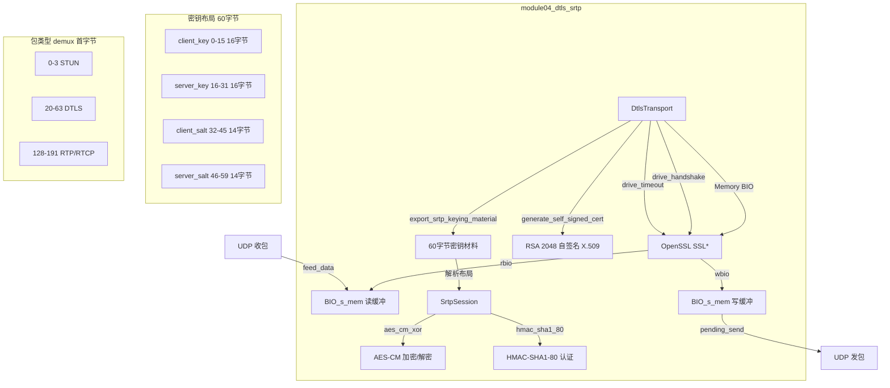
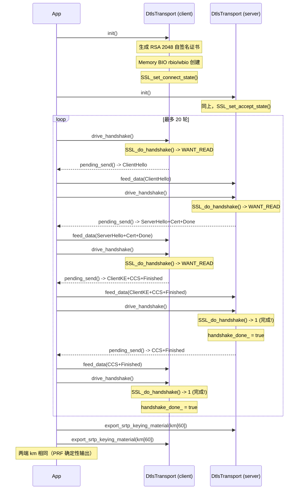
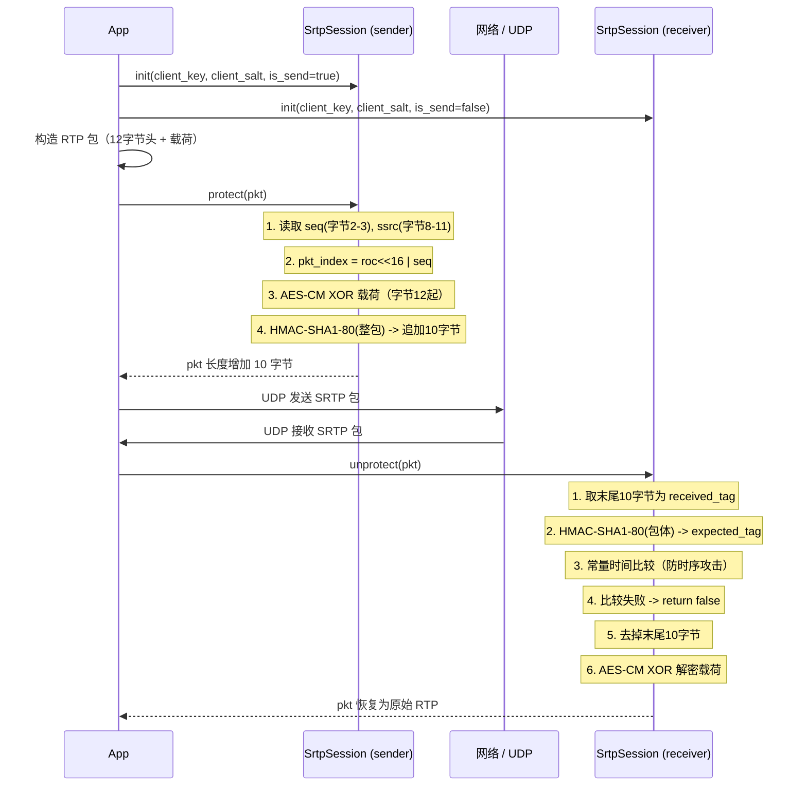
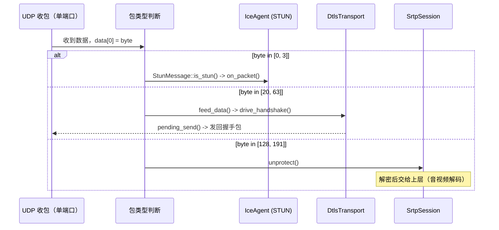

# module04_dtls_srtp — DTLS 握手与 SRTP 媒体加密

## 1. 模块目的与协议背景

### 为什么需要这个模块

WebRTC 的媒体安全体系由两层协议组成：

1. **DTLS**（Datagram TLS）：基于 UDP 的握手协议，负责在 ICE 建立的连通路径上协商加密密钥。握手完成后，通过 `SSL_export_keying_material` 导出 SRTP 所需的主密钥和盐值。

2. **SRTP**（Secure Real-time Transport Protocol）：使用 DTLS 导出的密钥对 RTP/RTCP 包进行加密（AES-CM）和认证（HMAC-SHA1-80），防止偷听和篡改。

这两个协议的组合（DTLS-SRTP）是 WebRTC 强制要求的安全机制（RFC 5764），任何 WebRTC 实现都必须支持。

### 与 TLS 的核心区别

| 特性 | TLS（基于 TCP） | DTLS（基于 UDP） |
|------|-----------------|------------------|
| 传输层 | TCP（有序、可靠） | UDP（乱序、可丢失） |
| 记录编号 | 无（TCP 保序） | 有（epoch + seq，防重放） |
| 重传 | 由 TCP 负责 | DTLS 自己重传（flight 机制） |
| 握手消息 | 流式 | 分片（Handshake Message Seq） |
| 超时处理 | 无需 | `DTLSv1_handle_timeout` |
| 乱序容忍 | 无需 | 记录层 seq 排序 |

### RFC 背景

| RFC | 内容 |
|-----|------|
| RFC 6347 | DTLS 1.2（当前主流版本，基于 TLS 1.2） |
| RFC 9147 | DTLS 1.3（最新版本） |
| RFC 5764 | DTLS-SRTP：DTLS 扩展用于密钥材料导出 |
| RFC 3711 | SRTP：安全实时传输协议（AES-CM 加密 + HMAC-SHA1 认证） |
| RFC 3550 | RTP：实时传输协议（SRTP 的基础） |
| RFC 4568 | SDP 安全描述（SDES，与 DTLS-SRTP 的替代方案） |

### 模块范围

本模块实现了：
- DTLS 传输层（基于 OpenSSL Memory BIO，完全解耦于 socket）
- 自签名 RSA 2048 证书生成
- SRTP 密钥材料导出（60 字节，RFC 5764 §4.2）
- 极简 SRTP 会话（AES-CM-128-HMAC-SHA1-80，仅教学用途）

**不包含**：完整的 SRTP 重放保护（Replay Window）、SRTCP、DTLS 1.3、ECDSA 证书、完整的 KDF（Key Derivation Function，仅使用 master key/salt 直接加密）。生产环境请使用 `libsrtp2`。

---

## 2. 架构图



---

## 3. 关键类与文件表

| 文件 | 作用 |
|------|------|
| `include/dtls/dtls_transport.h` | `DtlsTransport` 类声明；Memory BIO 模式说明 |
| `include/dtls/srtp_session.h` | `SrtpSession` 类声明；AES-CM + HMAC-SHA1-80 |
| `src/dtls_transport.cpp` | DTLS 完整实现：初始化、握手驱动、超时、加解密、证书指纹 |
| `src/srtp_session.cpp` | SRTP 实现：AES-CM IV 构造、计数器模式加密、HMAC-SHA1-80 认证 |
| `tests/test_dtls.cpp` | 4 个测试：完整握手（内存模拟）、密钥材料导出、包类型检测、证书指纹 |
| `tests/test_srtp.cpp` | 3 个测试：加解密往返、完整性验证、多包连续 |

### DtlsTransport 类详细说明

| 方法 | 说明 |
|------|------|
| `DtlsTransport(bool is_server)` | 构造；`is_server=true` 使用 `DTLS_server_method()` |
| `init()` | 创建 SSL_CTX、生成自签名证书、配置 SRTP 扩展、创建 Memory BIO |
| `feed_data(data, len)` | 将 UDP 收到的字节写入 rbio（`BIO_write`） |
| `drive_handshake()` | 调用 `SSL_do_handshake()`，处理 WANT_READ/WANT_WRITE |
| `drive_timeout()` | 调用 `DTLSv1_handle_timeout()`，在 epoll 超时事件时触发重传 |
| `pending_send()` | 从 wbio 读取待发送字节（`BIO_read` 循环） |
| `encrypt(plain, len)` | 握手后写入明文（`SSL_write`），返回密文 |
| `decrypt()` | 握手后从 SSL 读取明文（`SSL_read`） |
| `handshake_done()` | 返回握手完成标志 |
| `export_srtp_keying_material(out[60])` | 用 `SSL_export_keying_material` 导出 60 字节 SRTP 密钥 |
| `local_fingerprint()` | SHA-256 证书指纹，格式 `XX:XX:...:XX`（32 字节 = 32 组） |
| `is_dtls(data, len)` | 静态方法：首字节 20-63 为 DTLS 记录 |

### SrtpSession 类详细说明

| 方法 | 说明 |
|------|------|
| `init(key, salt, is_send)` | 用 16 字节 master_key 和 14 字节 master_salt 初始化 |
| `protect(in_out)` | 加密 RTP 载荷（字节 12 起）+ 追加 10 字节 HMAC 标签 |
| `unprotect(in_out)` | 验证 HMAC 标签 + 解密 RTP 载荷 |
| `aes_cm_xor(buf, len, ssrc, index)` | AES 计数器模式：构造 IV，生成密钥流，XOR 数据 |
| `hmac_sha1_80(data, len, key, key_len, out[10])` | HMAC-SHA1 截断为 10 字节 |

内部状态：
- `master_key_[16]`：AES-128 主密钥
- `master_salt_[14]`：AES-CM IV 构造用盐值
- `is_send_`：true=加密发送，false=解密接收
- `roc_`：Rollover Counter，序列号回绕时递增

---

## 4. 核心算法

### 4.1 DTLS vs TLS：UDP 上的可靠握手

DTLS 在 TLS 握手基础上增加了以下机制：

```
Flight 概念：
  DTLS 握手消息按 flight 分组（一次性发送的消息集合）
  Flight 0: ClientHello
  Flight 2: ServerHello + Certificate + ServerHelloDone
  Flight 4: ClientKeyExchange + ChangeCipherSpec + Finished
  Flight 6: ChangeCipherSpec + Finished (server)

重传机制：
  - 每个 flight 有定时器（初始 1 秒，指数退避到 60 秒上限）
  - 对端 ACK 由接收下一个 flight 的第一条消息隐式确认
  - DTLSv1_get_timeout() 获取下次超时时间
  - DTLSv1_handle_timeout() 触发重传

记录层序号（防重放）：
  epoch:   2字节，每次 ChangeCipherSpec 后递增
  seq_num: 6字节，每条记录递增
  接收方维护 Replay Window（64位位图）过滤重复包
```

### 4.2 OpenSSL Memory BIO 模式

标准 TLS 使用 socket BIO（OpenSSL 直接读写 fd）。DTLS-SRTP 改用 Memory BIO：

```
UDP 收包 → feed_data() → BIO_write(rbio) → [OpenSSL 内部处理] → BIO_read(wbio) → pending_send() → UDP 发包

优势：
1. 可测试性：单元测试中两个 DtlsTransport 通过内存直接交换数据，无需真实 socket
2. 解耦：应用层控制何时喂数据、何时取数据，可与 epoll 完美配合
3. 灵活性：可在喂入数据前做 demux（STUN/DTLS/SRTP 分流）
4. 控制权：应用层决定 MTU 分片和批量发送时机

对比 socket BIO 的劣势：
- 需要额外的内存拷贝（BIO_write/BIO_read）
- 需要应用层驱动（主动调用 drive_handshake / drive_timeout）
```

### 4.3 DTLS 握手状态机

```
Client                                     Server
  |                                           |
  |--- ClientHello --------------------------->|
  |    (含 DTLS cookie，首次为空)              |
  |                                           |
  |<-- HelloVerifyRequest ------------------- |  (DTLS 特有，防 DoS)
  |    (含 cookie)                            |
  |                                           |
  |--- ClientHello（含 cookie）-------------->|
  |                                           |
  |<-- ServerHello -------------------------- |
  |<-- Certificate (自签名 RSA 2048) -------- |
  |<-- ServerHelloDone ---------------------- |
  |                                           |
  |--- ClientKeyExchange（RSA 加密预主密钥） ->|
  |--- ChangeCipherSpec --------------------> |
  |--- Finished（加密）--------------------> |
  |                                           |
  |<-- ChangeCipherSpec --------------------- |
  |<-- Finished（加密）--------------------- |
  |                                           |
  [握手完成，两端 handshake_done_ = true]
  [双方调用 export_srtp_keying_material()]
```

OpenSSL 内部通过 `SSL_do_handshake()` 驱动状态机。返回 `SSL_ERROR_WANT_READ` 表示等待对端数据，返回 `1` 表示握手完成。

### 4.4 DTLSv1_handle_timeout 使用时机

```
事件循环伪代码：

loop:
  // 计算 DTLS 超时
  struct timeval timeout;
  if DTLSv1_get_timeout(ssl, &timeout) > 0:
    epoll_wait(fd, events, max_events, timeout_ms)
  else:
    epoll_wait(fd, events, max_events, -1)  // 无限等待

  if epoll_timeout:
    DTLSv1_handle_timeout(ssl_)  // 触发握手消息重传
    drive_handshake()            // 尝试推进状态机

  if readable:
    feed_data(data, len)
    drive_handshake()

  data = pending_send()
  if not empty:
    send_udp(data)
```

本模块的测试通过循环调用 `drive_timeout()` 模拟超时事件。

### 4.5 SRTP 密钥材料导出（RFC 5764 §4.2）

```cpp
// label = "EXTRACTOR-dtls_srtp"（RFC 5764 §4.2 规定）
SSL_export_keying_material(ssl_, out, 60,
                           "EXTRACTOR-dtls_srtp", 19,
                           nullptr, 0, 0);
```

60 字节的布局（RFC 5764 §4.2，client/server 指 DTLS 角色）：

```
偏移  长度  含义
  0   16   client_write_key  (client 发送时的 AES-128 master key)
 16   16   server_write_key  (server 发送时的 AES-128 master key)
 32   14   client_write_salt (client 发送时的 AES-CM master salt)
 46   14   server_write_salt (server 发送时的 AES-CM master salt)
```

密钥分配逻辑：
- 如果本端是 DTLS client：发送用 `out[0..15]`（key）和 `out[32..45]`（salt），接收用 `out[16..31]` 和 `out[46..59]`
- 如果本端是 DTLS server：发送用 `out[16..31]` 和 `out[46..59]`，接收用 `out[0..15]` 和 `out[32..45]`

### 4.6 AES-CM（Counter Mode）密钥流生成原理

RFC 3711 §4.3.1 定义 SRTP 的加密方式为 AES Counter Mode：

```
IV 构造（128位大端）：
  IV = (session_salt XOR (SSRC << 64) XOR (pkt_index << 16))

具体字节布局（16字节 IV）：
  bytes[0..3]  = 0
  bytes[4..7]  = SSRC（大端，4字节）
  bytes[8..13] = packet_index（大端，48位 = ROC*2^16 + SEQ）
  bytes[14..15]= 0
  然后与 14字节 master_salt（前14字节对齐）做 XOR

密钥流生成：
  counter = IV  （初始值）
  for each 16字节块:
    keystream_block = AES_encrypt(counter, session_key)
    plaintext_block XOR keystream_block = ciphertext_block
    counter += 1  （大端整数，最低字节在 bytes[15]）
```

AES-CM 是流密码：**同一个 (key, IV) 必须唯一**，否则重用密钥流会导致密文可被异或破解。packet_index 的单调递增保证了这一点。

### 4.7 HMAC-SHA1-80 认证（先加密后认证）

RFC 3711 §4.2.1 规定 SRTP 使用"先加密后认证"（Encrypt-then-MAC）顺序：

```
保护过程（protect）：
  步骤 1: 用 AES-CM 加密 RTP 载荷（字节 12 以后）
  步骤 2: HMAC-SHA1(key=master_key, msg=整个SRTP包（含头部）) -> 20字节
  步骤 3: 取前 10 字节（80 bit），追加到包尾
  输出: RTP头(12) + 加密载荷 + HMAC标签(10)

解除保护过程（unprotect）：
  步骤 1: 取包尾 10 字节作为接收到的标签
  步骤 2: 对包体（不含标签）重算 HMAC-SHA1-80
  步骤 3: 常量时间比较标签（防时序攻击）
  步骤 4: 验证通过 → 去掉标签，AES-CM 解密载荷
  注意：若验证失败，不执行解密（直接返回 false）
```

**为什么截断为 10 字节**：RFC 3711 §4.2.1 认为 80 位（10 字节）在对称加密场景下提供足够的认证强度，同时减少每包开销（比完整 SHA1 节省 10 字节）。

### 4.8 STUN/DTLS/SRTP 包类型 demux

RFC 5764 §5.1.2 定义了在复用 UDP 端口时的包类型判断规则：

```
首字节值范围    协议          依据
[0,   3]       STUN          高2位为00，Magic Cookie 进一步确认
[20,  63]      DTLS          DTLS 记录类型（20=CCS, 21=Alert, 22=Handshake, 23=AppData）
[128, 191]     RTP 或 RTCP   高2位为10（RTP V字段=2），PT 区分 RTP/RTCP

具体实现：
if data[0] & 0xC0 == 0x00:  # [0, 63]
    if data[0] <= 3:         # [0, 3] → STUN
    else:                    # [20, 63] → DTLS
elif data[0] & 0xC0 == 0x80: # [128, 191] → RTP/RTCP
```

### 4.9 自签名证书生成（RSA 2048）

```
生成步骤：
  1. RSA_generate_key(2048, RSA_F4)
     RSA_F4 = 65537（费马数，标准公钥指数）
  2. 创建 X.509 v1 证书（X509_new）
  3. 设置序列号 = 1
  4. 有效期：当前时间 ± 1 年（X509_gmtime_adj）
  5. 设置公钥（X509_set_pubkey）
  6. 设置 CN = "dtls_test"（无 SAN，仅测试用）
  7. 自签名：issuer = subject，签名算法 SHA-256（X509_sign with EVP_sha256）
  8. 载入 SSL_CTX（SSL_CTX_use_certificate + SSL_CTX_use_PrivateKey）

证书指纹（SHA-256）：
  - 对 DER 编码的证书计算 SHA-256（X509_digest with EVP_sha256）
  - 输出格式：XX:XX:...:XX（32个两位十六进制，用冒号分隔）
  - 通过 SDP offer/answer 交换给对端，验证 DTLS 证书真实性（防中间人）

为什么用 RSA 2048 而非 ECDSA：
  - 库兼容性好（所有 OpenSSL 版本都支持）
  - 2048 位提供约 112 位安全强度（NIST 推荐至 2030 年）
  - 教学代码优先清晰性；生产建议改用 ECDSA P-256（更小、更快）
```

---

## 5. 调用时序图

### 5.1 DTLS 握手全流程（内存模拟）



### 5.2 SRTP 保护与解除保护



### 5.3 复用端口包分发



---

## 6. 关键代码片段

### 6.1 Memory BIO 初始化

来自 `src/dtls_transport.cpp`（第 44-59 行）：

```cpp
// 创建一对内存 BIO：rbio 接收 UDP 数据，wbio 输出待发送数据
rbio_ = BIO_new(BIO_s_mem());
wbio_ = BIO_new(BIO_s_mem());

// 设置 EOF 返回 -1 而非 0（避免 OpenSSL 将 EOF 误判为错误）
BIO_set_mem_eof_return(rbio_, -1);
BIO_set_mem_eof_return(wbio_, -1);

// SSL 接管 BIO 的所有权（析构时由 SSL_free 释放）
SSL_set_bio(ssl_, rbio_, wbio_);

// 设置角色：server 调用 SSL_accept 系列，client 调用 SSL_connect 系列
if (is_server_) {
    SSL_set_accept_state(ssl_);
} else {
    SSL_set_connect_state(ssl_);
}
```

### 6.2 握手驱动与错误处理

来自 `src/dtls_transport.cpp`（第 110-125 行）：

```cpp
void DtlsTransport::drive_handshake() {
    if (handshake_done_) return;

    int ret = SSL_do_handshake(ssl_);
    if (ret == 1) {
        handshake_done_ = true;  // 握手完成
        return;
    }

    int err = SSL_get_error(ssl_, ret);
    // WANT_READ: 需要更多对端数据（正常，等待 feed_data）
    // WANT_WRITE: 需要发送数据（调用 pending_send 后发出）
    // 其他错误: 握手失败（TLS alert、证书错误等）
    if (err != SSL_ERROR_WANT_READ && err != SSL_ERROR_WANT_WRITE) {
        (void)err;  // 生产代码应记录 ERR_print_errors 并关闭连接
    }
}
```

### 6.3 SRTP 密钥材料导出

来自 `src/dtls_transport.cpp`（第 163-170 行）：

```cpp
bool DtlsTransport::export_srtp_keying_material(uint8_t out[60]) {
    if (!handshake_done_) return false;
    // RFC 5764 §4.2: label = "EXTRACTOR-dtls_srtp"，长度 19
    // context 为空，use_context = 0
    int ret = SSL_export_keying_material(ssl_, out, 60,
                                         "EXTRACTOR-dtls_srtp", 19,
                                         nullptr, 0, 0);
    return ret == 1;
}
```

### 6.4 AES-CM IV 构造（RFC 3711 §4.3.1）

来自 `src/srtp_session.cpp`（第 10-36 行）：

```cpp
static void build_aes_cm_iv(uint8_t iv[16], const uint8_t* salt14,
                              uint32_t ssrc, uint64_t index)
{
    // 初始化为 master_salt（14字节，前14字节，最后2字节为0）
    memset(iv, 0, 16);
    memcpy(iv, salt14, 14);

    // XOR SSRC（大端，字节4-7）
    iv[4]  ^= (ssrc >> 24) & 0xFF;
    iv[5]  ^= (ssrc >> 16) & 0xFF;
    iv[6]  ^= (ssrc >> 8)  & 0xFF;
    iv[7]  ^=  ssrc        & 0xFF;

    // XOR packet_index（48位，大端，字节8-13）
    iv[8]  ^= (index >> 40) & 0xFF;
    iv[9]  ^= (index >> 32) & 0xFF;
    iv[10] ^= (index >> 24) & 0xFF;
    iv[11] ^= (index >> 16) & 0xFF;
    iv[12] ^= (index >> 8)  & 0xFF;
    iv[13] ^=  index        & 0xFF;
}
```

### 6.5 AES-CM 计数器模式加密

来自 `src/srtp_session.cpp`（第 38-67 行）：

```cpp
void SrtpSession::aes_cm_xor(uint8_t* buf, size_t len,
                               uint32_t ssrc, uint32_t index)
{
    uint8_t iv[16];
    build_aes_cm_iv(iv, master_salt_, ssrc, index);

    AES_KEY aes_key;
    AES_set_encrypt_key(master_key_, 128, &aes_key);

    uint8_t counter[16];
    memcpy(counter, iv, 16);

    size_t pos = 0;
    while (pos < len) {
        uint8_t keystream[16];
        AES_encrypt(counter, keystream, &aes_key);  // 注意：加密和解密都用 encrypt

        size_t chunk = std::min(len - pos, (size_t)16);
        for (size_t i = 0; i < chunk; ++i)
            buf[pos + i] ^= keystream[i];
        pos += chunk;

        // 大端计数器递增（仅递增最低字节，溢出时进位）
        for (int i = 15; i >= 0; --i)
            if (++counter[i] != 0) break;
    }
}
```

### 6.6 HMAC-SHA1-80 认证标签生成

来自 `src/srtp_session.cpp`（第 69-78 行）：

```cpp
void SrtpSession::hmac_sha1_80(const uint8_t* data, size_t len,
                                 const uint8_t* key, size_t key_len,
                                 uint8_t out[10])
{
    uint8_t digest[20];
    unsigned int dlen = 20;
    HMAC(EVP_sha1(), key, static_cast<int>(key_len),
         data, len, digest, &dlen);
    memcpy(out, digest, 10);  // 截断为 10 字节（80 bit）
}
```

### 6.7 常量时间 HMAC 比较（防时序攻击）

来自 `src/srtp_session.cpp`（第 127-132 行）：

```cpp
// 常量时间比较：不因标签不同而提前返回，防止通过响应时间推断标签内容
uint8_t diff = 0;
for (int i = 0; i < 10; ++i) {
    diff |= (expected_tag[i] ^ in_out[payload_end + i]);
}
if (diff != 0) return false;  // 任何字节不同，整体失败
```

### 6.8 自签名证书生成

来自 `src/dtls_transport.cpp`（第 64-104 行）：

```cpp
bool DtlsTransport::generate_self_signed_cert(SSL_CTX* ctx) {
    EVP_PKEY* pkey = EVP_PKEY_new();
    RSA* rsa = RSA_generate_key(2048, RSA_F4, nullptr, nullptr);
    EVP_PKEY_assign_RSA(pkey, rsa);

    X509* x509 = X509_new();
    ASN1_INTEGER_set(X509_get_serialNumber(x509), 1);
    X509_gmtime_adj(X509_get_notBefore(x509), -365 * 24 * 3600);
    X509_gmtime_adj(X509_get_notAfter(x509),   365 * 24 * 3600);
    X509_set_pubkey(x509, pkey);

    X509_NAME* name = X509_get_subject_name(x509);
    X509_NAME_add_entry_by_txt(name, "CN", MBSTRING_ASC,
                                (unsigned char*)"dtls_test", -1, -1, 0);
    X509_set_issuer_name(x509, name);  // 自签名：issuer = subject
    X509_sign(x509, pkey, EVP_sha256());

    SSL_CTX_use_certificate(ctx, x509);
    SSL_CTX_use_PrivateKey(ctx, pkey);
    X509_free(x509);
    EVP_PKEY_free(pkey);
    return true;
}
```

---

## 7. 设计决策

### 7.1 Memory BIO 而非 socket BIO

**选择**：使用 `BIO_s_mem()` 内存 BIO，完全解耦 socket

**原因**：
- **可测试性**：单元测试中直接内存交换，无需 localhost socket、无端口占用、无 epoll
- **解耦**：应用层负责 demux（STUN/DTLS/SRTP 分流），将正确的包喂给 DTLS，socket BIO 做不到
- **异步友好**：与 epoll/io_uring 集成时，应用层控制何时喂数据，避免 OpenSSL 阻塞
- **可注入**：可以在喂入数据前做 MTU 分片、拥塞控制等处理

### 7.2 RSA 2048 而非 ECDSA P-256

**选择**：`RSA_generate_key(2048, RSA_F4, ...)`

**原因**：
- API 简单，无需 EC 曲线参数配置
- OpenSSL 旧版本（1.0.x）对 RSA 支持更完整
- 教学代码优先清晰性

**权衡**：RSA 2048 握手比 ECDSA P-256 慢约 10 倍（密钥交换阶段）；生产代码应改用 ECDSA：`EC_KEY_new_by_curve_name(NID_X9_62_prime256v1)`。

### 7.3 不实现完整 KDF（密钥派生函数）

**选择**：直接使用 master_key/master_salt，跳过 RFC 3711 §4.3 的 KDF

**原因**：完整 KDF 涉及 AES-CM 对固定标签（r=0x00,label,index）的多次调用，引入 session_key/session_salt/session_auth_key 三个派生密钥，大幅增加代码量而对理解核心算法帮助有限。

**影响**：教学代码可接受；生产代码必须实现完整 KDF（libsrtp2 已实现）。

### 7.4 先加密后认证（Encrypt-then-MAC）

**选择**：`protect()` 先 AES-CM 再 HMAC-SHA1-80

**原因**：RFC 3711 §4.2 规定了此顺序。Encrypt-then-MAC 的优势是接收方可以先验证 MAC，MAC 验证失败时无需解密（节省计算，防 padding oracle 攻击）。与 TLS 的 MAC-then-Encrypt（易受 Lucky13 攻击）不同。

### 7.5 SSL_VERIFY_NONE（测试模式）

**选择**：`SSL_CTX_set_verify(ctx_, SSL_VERIFY_NONE, nullptr)`

**原因**：DTLS-SRTP 中证书验证通过信令层（SDP）交换的指纹完成，而非 PKI 链验证。双方用自签名证书，没有 CA 链可以验证。正确的生产实现是：在握手完成后，读取对端证书，计算其 SHA-256 指纹，与 SDP 中的 `a=fingerprint:sha-256 XX:XX:...` 比对。

---

## 8. 常见坑

### 坑 1：`BIO_set_mem_eof_return` 未设置

**现象**：握手过程中 OpenSSL 报 `SSL_ERROR_SYSCALL` 或 `SSL_ERROR_ZERO_RETURN`，握手提前失败

**原因**：`BIO_s_mem()` 默认在缓冲区为空时返回 0，OpenSSL 将 0 解读为连接关闭（EOF）。实际上只是没有数据可读，应返回 -1（表示 WOULD_BLOCK）。

**解决**：
```cpp
BIO_set_mem_eof_return(rbio_, -1);
BIO_set_mem_eof_return(wbio_, -1);
```

### 坑 2：忘记调用 `pending_send()` 发出握手包

**现象**：握手卡住，双方互相等待，`drive_handshake()` 一直返回 `WANT_READ`

**原因**：`SSL_do_handshake()` 把要发送的握手记录写入 wbio，但不会自动发出。必须显式调用 `pending_send()` 读出数据并发送给对端。

**解决**：每次 `drive_handshake()` 后立即调用 `pending_send()` 并发送。

### 坑 3：SRTP 密钥方向搞反

**现象**：解密失败（HMAC 验证失败）

**原因**：client 和 server 的密钥是不对称的：client 发送用 `client_write_key/salt`，server 接收时也应用 `client_write_key/salt`（同一份密钥）。若 server 用了 `server_write_key/salt` 来解密 client 发来的包，则密钥不匹配。

**解决**：明确 60 字节布局，按 DTLS 角色分配：
```
如果我是 DTLS client:
  发送: key=km[0..15],  salt=km[32..45]
  接收: key=km[16..31], salt=km[46..59]
如果我是 DTLS server:
  发送: key=km[16..31], salt=km[46..59]
  接收: key=km[0..15],  salt=km[32..45]
```

### 坑 4：AES-CM 中使用 AES 解密而非加密

**现象**：解密出的数据错误

**原因**：AES 计数器模式是流密码，加密和解密都使用 `AES_encrypt`（加密密钥流），然后 XOR 数据。若解密时错误地调用 `AES_decrypt`（使用解密密钥调度，不同于加密），生成的密钥流不同，解密失败。

**解决**：
```cpp
AES_set_encrypt_key(master_key_, 128, &aes_key);  // 注意：encrypt_key
// 然后无论加密还是解密，都调用：
AES_encrypt(counter, keystream, &aes_key);
```

### 坑 5：握手超时未处理，导致网络丢包时卡死

**现象**：真实网络（非内存模拟）中握手包丢失后，握手无限等待

**原因**：DTLS 有 flight 重传机制，但依赖外部定时器触发。若不调用 `DTLSv1_handle_timeout()`，丢包后握手永远不会重传。

**解决**：
```cpp
// 事件循环中，每次 epoll 超时后：
struct timeval tv;
if (DTLSv1_get_timeout(ssl_, &tv) > 0) {
    // 设置 epoll 超时为 tv 指定的时间
}
// epoll 超时后：
DTLSv1_handle_timeout(ssl_);
drive_handshake();
auto data = pending_send();
// 发送重传的握手包
```

### 坑 6：AES-CM IV 中 packet_index 只用 seq 未加 ROC

**现象**：序列号回绕（seq 从 65535 跳回 0）后，packet_index 重复，导致 IV 重用，加密被破解

**原因**：48 位 packet_index = ROC（32位）× 65536 + SEQ（16位）。序列号回绕时 ROC 必须递增。若只用 SEQ 作为 index，则序列号回绕后 IV 完全相同，XOR 两个密文即得明文。

**解决**：
```cpp
uint64_t pkt_index = (uint64_t(roc_) << 16) | seq;
// 在检测到 seq 回绕时（seq << 前值）：roc_++
```

### 坑 7：`export_srtp_keying_material` 在握手完成前调用

**现象**：函数返回失败（返回值 != 1）或导出全零数据

**原因**：`SSL_export_keying_material` 使用 TLS PRF（基于握手密钥），必须在握手完成后（master secret 已协商）才能调用。

**解决**：始终检查 `handshake_done_` 后再导出：
```cpp
bool DtlsTransport::export_srtp_keying_material(uint8_t out[60]) {
    if (!handshake_done_) return false;  // 保护条件
    return SSL_export_keying_material(...) == 1;
}
```

### 坑 8：`SSL_CTX_free` 和 `SSL_free` 顺序错误

**现象**：析构时崩溃（use-after-free）

**原因**：`SSL_free` 不会释放 SSL_CTX（引用计数管理），但 `SSL_CTX_free` 后再调用 `SSL_free` 访问已释放的 CTX 内部状态会崩溃。

**解决**：先 `SSL_free(ssl_)`，再 `SSL_CTX_free(ctx_)`（本模块析构函数正确处理了此顺序）。BIO 由 `SSL_set_bio` 后的 SSL 对象接管，`SSL_free` 时自动释放，无需单独释放。

---

## 9. 测试覆盖说明

### test_dtls.cpp（4 个测试）

| 测试名 | 覆盖内容 | 关键断言 |
|--------|----------|----------|
| `DtlsTransport.Handshake` | 完整 DTLS 握手（内存模拟，最多 20 轮） | server 和 client 的 `handshake_done()` 均为 true |
| `DtlsTransport.KeyMaterial` | 握手后导出 60 字节密钥材料 | 两端导出值完全相同（`memcmp == 0`）且非全零 |
| `DtlsTransport.IsDetection` | 首字节范围检测 | 22（Handshake）→true；0x00（STUN）→false；0x80（RTP）→false |
| `DtlsTransport.Fingerprint` | 证书指纹格式 | 非空，含有冒号分隔符 |

### test_srtp.cpp（3 个测试）

| 测试名 | 覆盖内容 | 关键断言 |
|--------|----------|----------|
| `SrtpSession.ProtectUnprotect` | 加解密完整往返 | 加密后长度 +10；载荷已改变；解密后与原始完全相同 |
| `SrtpSession.IntegrityCheck` | 篡改检测 | 修改密文任意字节后 `unprotect()` 返回 false |
| `SrtpSession.MultiplePackets` | 连续多包（seq 1-5） | 5 个不同序列号的包均能正确加解密 |

### 测试未覆盖的场景（建议扩展）

| 场景 | 说明 |
|------|------|
| DTLS 加解密数据 | 握手后 `encrypt`/`decrypt` 往返验证 |
| DTLS 超时重传 | `drive_timeout()` 触发重传的实际效果 |
| SRTP ROC 回绕 | seq 从 65535 → 0 时 ROC 递增，packet_index 正确性 |
| SRTP 重放攻击 | 重复发送已验证过的包应被拒绝（需实现 Replay Window） |
| 错误密钥的 SRTP | 接收方用不同密钥时 `unprotect()` 失败 |
| 非常短的 RTP 载荷 | 0 字节载荷（只有 12 字节头）的处理 |
| 并发 DTLS | 多个 DtlsTransport 同时运行（SSL_CTX 线程安全性） |

---

## 10. 构建与运行

### 依赖

| 依赖 | 版本要求 | 用途 |
|------|----------|------|
| CMake | >= 3.14 | 构建系统 |
| g++ | >= 10 | C++17，系统默认 GCC 7 缺乏部分特性 |
| OpenSSL | >= 1.1.0 | DTLS、RSA 证书、HMAC-SHA1、AES（`libssl-dev`） |
| Google Test | 自动下载 | 单元测试框架 |

### 构建步骤

```bash
# 在 cpp_meet 根目录执行
CXX=g++-10 CC=gcc-10 cmake -B build -DCMAKE_BUILD_TYPE=Debug
cmake --build build -j$(nproc)
```

### 运行测试

```bash
# 运行 DTLS 测试
./build/module04_dtls_srtp/test_dtls

# 运行 SRTP 测试
./build/module04_dtls_srtp/test_srtp

# 通过 ctest
cd build
ctest -R "test_dtls|test_srtp" -V
```

### 预期输出（test_dtls）

```
[==========] Running 4 tests from 1 test suite.
[----------] 4 tests from DtlsTransport
[ RUN      ] DtlsTransport.Handshake
[       OK ] DtlsTransport.Handshake (XXX ms)
[ RUN      ] DtlsTransport.KeyMaterial
[       OK ] DtlsTransport.KeyMaterial (XXX ms)
[ RUN      ] DtlsTransport.IsDetection
[       OK ] DtlsTransport.IsDetection (0 ms)
[ RUN      ] DtlsTransport.Fingerprint
[       OK ] DtlsTransport.Fingerprint (XXX ms)
[  PASSED  ] 4 tests.
```

**注意**：握手测试因 RSA 2048 密钥生成涉及大数运算，耗时可能达数秒（调试模式）。Release 模式约 100-500ms。

### 预期输出（test_srtp）

```
[==========] Running 3 tests from 1 test suite.
[----------] 3 tests from SrtpSession
[ RUN      ] SrtpSession.ProtectUnprotect
[       OK ] SrtpSession.ProtectUnprotect (0 ms)
[ RUN      ] SrtpSession.IntegrityCheck
[       OK ] SrtpSession.IntegrityCheck (0 ms)
[ RUN      ] SrtpSession.MultiplePackets
[       OK ] SrtpSession.MultiplePackets (0 ms)
[  PASSED  ] 3 tests.
```

### 目录结构

```
module04_dtls_srtp/
├── CMakeLists.txt
├── README.md
├── include/
│   └── dtls/
│       ├── dtls_transport.h
│       └── srtp_session.h
├── src/
│   ├── dtls_transport.cpp
│   └── srtp_session.cpp
└── tests/
    ├── test_dtls.cpp
    └── test_srtp.cpp
```

---

## 11. 延伸阅读

| 文档 | 链接 |
|------|------|
| RFC 6347 — DTLS 1.2 | https://www.rfc-editor.org/rfc/rfc6347 |
| RFC 9147 — DTLS 1.3 | https://www.rfc-editor.org/rfc/rfc9147 |
| RFC 5764 — DTLS-SRTP（密钥导出 label 与布局） | https://www.rfc-editor.org/rfc/rfc5764 |
| RFC 3711 — SRTP（AES-CM、HMAC-SHA1-80、KDF） | https://www.rfc-editor.org/rfc/rfc3711 |
| RFC 3550 — RTP（包格式、序列号、SSRC） | https://www.rfc-editor.org/rfc/rfc3550 |
| RFC 5246 — TLS 1.2（DTLS 1.2 的基础） | https://www.rfc-editor.org/rfc/rfc5246 |
| RFC 8446 — TLS 1.3（DTLS 1.3 的基础） | https://www.rfc-editor.org/rfc/rfc8446 |
| RFC 4568 — SDP 安全描述（SDES，DTLS-SRTP 替代方案） | https://www.rfc-editor.org/rfc/rfc4568 |
| OpenSSL DTLS 文档 | https://www.openssl.org/docs/man1.1.1/man3/SSL_do_handshake.html |
| libsrtp2（生产 SRTP 实现） | https://github.com/cisco/libsrtp |
| WebRTC 安全架构（W3C） | https://www.w3.org/TR/webrtc-security/ |
