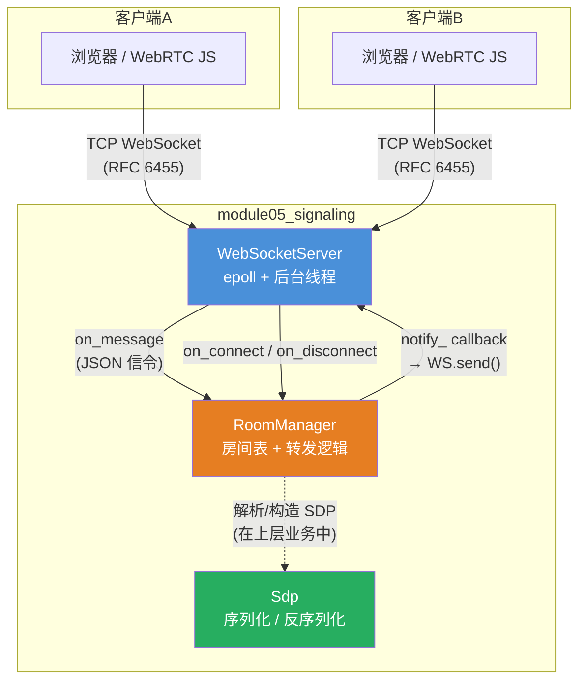
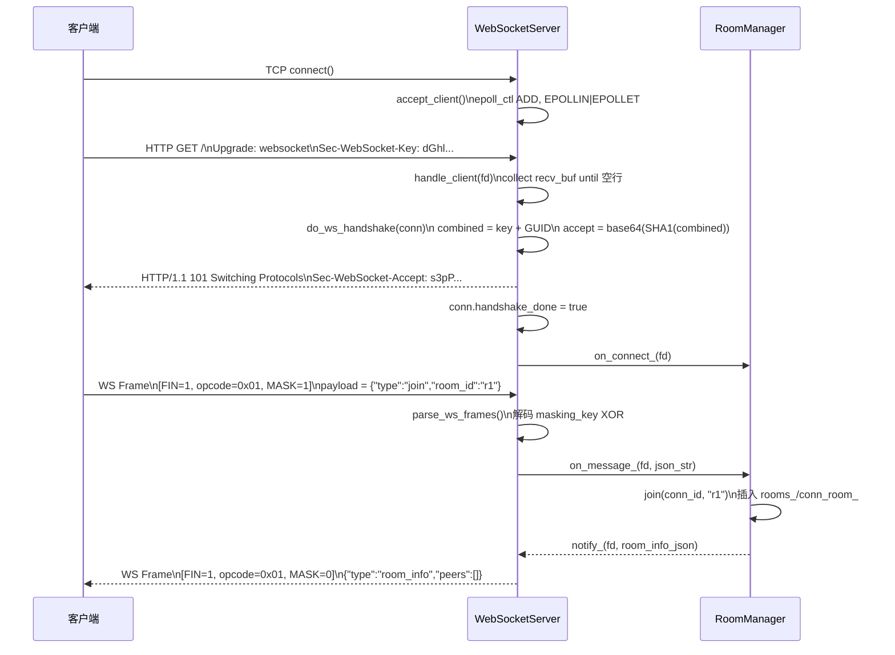
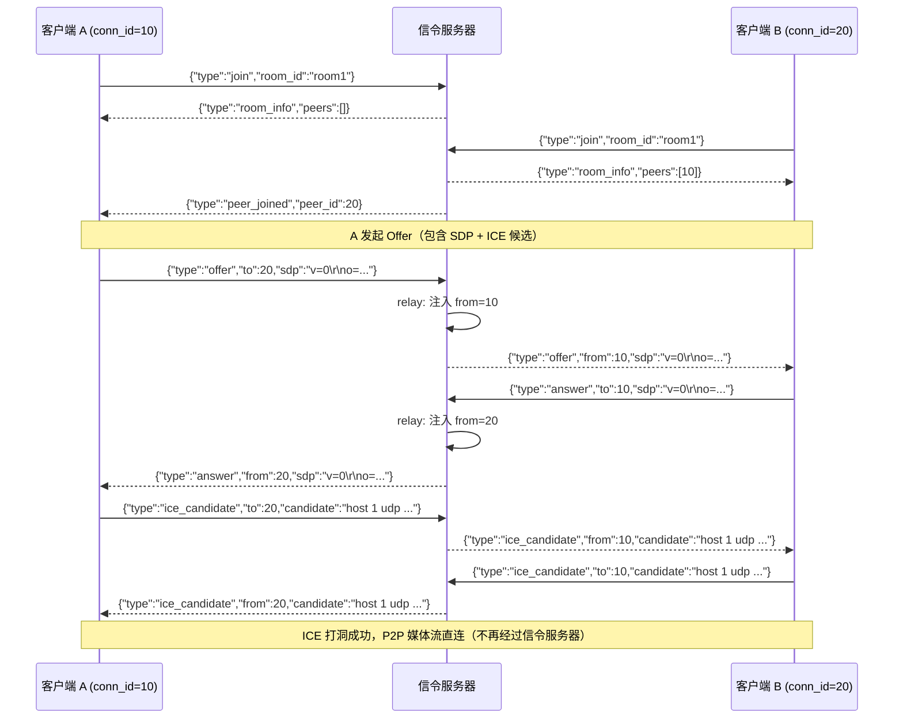
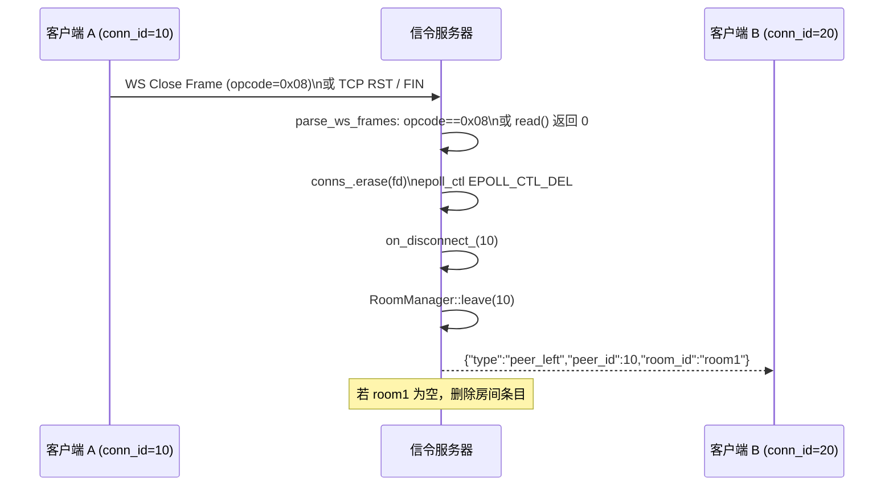

# module05_signaling — WebSocket 信令服务器

## 1. 模块目的与协议背景

### 目的

信令（Signaling）是 WebRTC 建立点对点连接的前提步骤。WebRTC 本身不规定信令协议，
但在两个对等端能够直接传输媒体数据之前，必须通过某个带外信道交换三类信息：

1. **SDP（Session Description Protocol）**：描述各端的媒体能力、编解码器列表、DTLS 指纹。
2. **ICE Candidate**：描述各端可达的网络地址（本地 IP、STUN 映射地址、TURN 中继地址）。
3. **控制消息**：加入房间、离开房间、对等端上下线通知。

本模块实现一个轻量 WebSocket 信令服务器，完整覆盖以上功能，不依赖任何第三方 WebSocket 库，
从 TCP 原始套接字出发，手工实现 RFC 6455 规定的握手与帧格式，目的是让学习者深入理解协议细节。

### 为什么选 WebSocket 而不是 HTTP 长轮询或 SSE

| 方案 | 方向 | 延迟 | 连接数 | 适合信令 |
|------|------|------|--------|---------|
| HTTP 短轮询 | 单向（拉） | 高（轮询间隔） | 每次轮询开新连接 | 不适合 |
| HTTP 长轮询 | 单向（拉） | 中（等待推送） | 每条消息一个连接 | 勉强可用 |
| SSE | 单向（推） | 低 | 持久 | 服务器→客户端可用，但客户端无法推送 |
| WebSocket | 全双工 | 低 | 持久 | 最适合，一条连接双向实时消息 |

信令需要全双工：客户端发 offer，服务器转发；服务器推送 peer_joined，客户端立刻响应 answer。
HTTP 长轮询需要两条 HTTP 流才能模拟全双工，且每次"发送"都需要一个新 HTTP 请求，
延迟和复杂度都不可接受。WebSocket 在一条 TCP 连接上提供全双工消息通道，是信令的标准选择。

### 协议规范

- **RFC 6455**：WebSocket 协议（握手、帧格式、关闭握手）
- **RFC 3264**：SDP Offer/Answer 模型
- **RFC 4566**：SDP 字段定义
- **RFC 8829**：WebRTC 中的 SDP 使用方式（JSEP）
- **RFC 8445**：ICE candidate 格式

---

## 2. 架构图



数据流说明：

- `WebSocketServer` 负责 TCP 连接管理、HTTP 升级握手、RFC 6455 帧的拆解与封装。
- 收到完整文本消息后，通过 `on_message_` 回调传给上层（通常是 `RoomManager`）。
- `RoomManager` 解析 JSON 信令，决定是加入房间、广播还是点对点转发，
  通过 `notify_` 回调再调用 `WebSocketServer::send()` 发回数据。
- `Sdp` 是独立的序列化层，供上层业务代码构造和解析 SDP offer/answer。

---

## 3. 关键类与文件表

| 文件 | 类 / 结构 | 职责 |
|------|----------|------|
| `include/sig/websocket_server.h` | `WsConnection` | 单连接状态：fd、握手标志、两段缓冲区 |
| `include/sig/websocket_server.h` | `WebSocketServer` | TCP 监听、epoll 事件循环、WS 握手与帧解析 |
| `include/sig/sdp.h` | `SdpMedia` | 单个媒体段（m= 及其 a= 属性） |
| `include/sig/sdp.h` | `Sdp` | 完整 SDP 文档，含 serialize/parse |
| `include/sig/room_manager.h` | `RoomManager` | 房间表、成员管理、JSON 信令转发 |
| `src/websocket_server.cpp` | — | epoll 事件循环、握手、帧解析、SHA1/Base64 |
| `src/sdp.cpp` | — | SDP 逐行解析状态机、序列化输出 |
| `src/room_manager.cpp` | — | join/leave/relay，nlohmann/json 操作 |
| `tests/test_websocket.cpp` | — | 集成测试：手工发 HTTP Upgrade + WS 帧 |
| `tests/test_sdp.cpp` | — | 单元测试：parse、serialize、往返一致性 |

---

## 4. 核心算法

### 4.1 WebSocket 握手算法（RFC 6455 §4.2.2）

```
输入：HTTP 请求文本（包含 Sec-WebSocket-Key 头）
输出：HTTP 101 响应（包含 Sec-WebSocket-Accept 头）

步骤：
1. 在 HTTP 请求头中定位 "Sec-WebSocket-Key:" 字段
2. 提取 key 值（去除首尾空格），例如：
       "dGhlIHNhbXBsZSBub25jZQ=="
3. 拼接魔法 GUID：
       combined = key + "258EAFA5-E914-47DA-95CA-C5AB0DC85B11"
4. 计算 SHA-1：
       hash[20] = SHA1(combined)
5. Base64 编码：
       accept = base64(hash)              // 28 字节字符串
6. 发送响应：
       "HTTP/1.1 101 Switching Protocols\r\n"
       "Upgrade: websocket\r\n"
       "Connection: Upgrade\r\n"
       "Sec-WebSocket-Accept: " + accept + "\r\n"
       "\r\n"
```

RFC 6455 附录 B 给出标准测试向量：
- 输入 key：`dGhlIHNhbXBsZSBub25jZQ==`
- 预期 accept：`s3pPLMBiTxaQ9kYGzzhZRbK+xOo=`

魔法字符串 `258EAFA5-E914-47DA-95CA-C5AB0DC85B11` 是 RFC 6455 硬编码的 GUID，
目的是防止将普通 HTTP 响应误认为 WebSocket 握手响应（防止缓存代理注入攻击）。

### 4.2 RFC 6455 帧格式

```
RFC 6455 帧字节布局（§5.2）：

 0                   1                   2                   3
 0 1 2 3 4 5 6 7 8 9 0 1 2 3 4 5 6 7 8 9 0 1 2 3 4 5 6 7 8 9 0 1
+-+-+-+-+-------+-+-------------+-------------------------------+
|F|R|R|R| opcode|M| Payload len |    Extended payload length    |
|I|S|S|S|  (4)  |A|     (7)     |        (16 or 64 bits)        |
|N|V|V|V|       |S|             |   (if payload len==126/127)   |
| |1|2|3|       |K|             |                               |
+-+-+-+-+-------+-+-------------+-------------------------------+
|     Masking-key (if MASK=1, 4 bytes)                          |
+---------------------------------------------------------------+
|                        Payload Data                           |
+---------------------------------------------------------------+

字段说明：
  FIN  (1 bit)  : 1 = 最后一个分片（或不分片）；0 = 还有后续 continuation 帧
  RSV1-3        : 必须为 0（除非协商了扩展）
  opcode (4 bit): 帧类型
    0x0 = continuation（分片续帧）
    0x1 = text（UTF-8 文本）
    0x2 = binary（二进制）
    0x8 = close（关闭握手）
    0x9 = ping
    0xA = pong
  MASK (1 bit)  : 客户端→服务器的帧必须为 1；服务器→客户端必须为 0
  Payload len   : 0-125 = 实际长度；126 = 读后续2字节；127 = 读后续8字节

三段式长度编码：
  payload_len < 126   → header=2B, len=payload_len
  payload_len ≤ 65535 → header=4B, byte[1]=126, byte[2-3]=len（big-endian）
  payload_len > 65535 → header=10B, byte[1]=127, byte[2-9]=len（big-endian）

Masking（客户端必须，服务器禁止）：
  payload[i] = raw[i] XOR masking_key[i % 4]
```

### 4.3 帧解析算法（流式缓冲区）

```
维护滚动缓冲区 ws_buf，每次 read() 追加。

parse_ws_frames(conn):
    while ws_buf.size() >= 2:
        b0 = ws_buf[0]; b1 = ws_buf[1]
        opcode = b0 & 0x0F
        masked = (b1 & 0x80) != 0
        payload_len = b1 & 0x7F

        确定 header_size：
            if payload_len == 126:
                if ws_buf.size() < 4: return   // 等待更多数据
                payload_len = big_endian_16(ws_buf[2:4])
                header_size = 4
            elif payload_len == 127:
                if ws_buf.size() < 10: return
                payload_len = big_endian_64(ws_buf[2:10])
                header_size = 10
            else:
                header_size = 2

        mask_size = masked ? 4 : 0
        total = header_size + mask_size + payload_len
        if ws_buf.size() < total: return       // 帧还没收完

        if masked:
            masking_key = ws_buf[header_size : header_size+4]
            payload[i] = ws_buf[header_size+4+i] XOR masking_key[i%4]
        else:
            payload = ws_buf[header_size : header_size+payload_len]

        ws_buf.erase(0, total)    // 消费已处理帧

        switch opcode:
            0x01 (text)  → on_message_(fd, payload)
            0x08 (close) → close(fd); return
            0x09 (ping)  → send pong frame (opcode=0x0A, same payload)
            default      → ignore
```

### 4.4 服务器端帧构造（不 mask）

```
build_ws_frame(msg):
    frame[0] = 0x81          // FIN=1, opcode=0x01(text)
    len = msg.size()
    if len < 126:
        frame[1] = len       // MASK bit = 0
    elif len <= 65535:
        frame[1] = 126
        frame[2] = (len >> 8) & 0xFF
        frame[3] = len & 0xFF
    else:
        frame[1] = 127
        frame[2..9] = len（8字节 big-endian）
    frame += msg             // payload 不做 masking
    return frame
```

服务器为什么不 mask：RFC 6455 §5.1 规定 masking 的目的是防止恶意客户端脚本
通过浏览器的代理缓存发起"缓存中毒"攻击（cache poisoning）。服务器响应不经过正向代理，
不存在此风险，因此规范明确禁止服务器对帧进行 masking。

### 4.5 房间信令路由算法

```
收到消息 msg（来自 conn_id = from）：

switch msg["type"]:
    "join":
        room_id = msg["room_id"]
        reply = RoomManager::join(from, room_id)
        // join 内部：
        //   1. 若 from 已在其他房间，先从旧房间移除
        //   2. 插入新房间：rooms_[room_id].insert(from)
        //   3. 收集已有成员列表 peers
        //   4. 向其他成员广播 peer_joined{peer_id: from}
        //   5. 返回 room_info{room_id, peers}
        send(from, reply)

    "offer" / "answer" / "ice_candidate":
        RoomManager::relay(from, msg)
        // relay 内部：
        //   若 msg["to"] 存在 → 点对点转发给目标
        //   否则 → 广播给房间内所有其他成员
        //   均注入 msg["from"] = from

on_disconnect(conn_id):
    RoomManager::leave(conn_id)
    // leave 内部：
    //   1. 从 conn_room_ 找到 room_id
    //   2. 从 rooms_[room_id] 删除 conn_id
    //   3. 向剩余成员广播 peer_left{peer_id: conn_id}
    //   4. 若房间空了，删除房间
```

### 4.6 SDP 解析状态机

```
SDP 是纯文本，每行格式为 "X=value\r\n"，X 是单字母类型标识。
使用 cur_media 指针跟踪当前媒体段（m= 行之后的 a= 行属于该媒体段）：

cur_media = nullptr
for each line:
    strip '\r'
    type = line[0], value = line[2:]
    switch type:
        'v' → sdp.version = value
        'o' → sdp.origin = value
        's' → sdp.session_name = value
        't' → 忽略
        'm' → 新建 SdpMedia，解析 "type port proto fmt..."
               cur_media = 指向新媒体
        'a' → if cur_media != null:
                  "rtpmap:PT codec/clock" → rtpmap 列表
                  "fingerprint:algo hash" → fingerprint
                  "ice-ufrag:xxx"         → ice_ufrag
                  "ice-pwd:xxx"           → ice_pwd
                  "candidate:..."         → 保存第一个（host 候选）
```

---

## 5. 调用时序图

### 5.1 WebSocket 连接建立与消息收发



### 5.2 双端 SDP Offer/Answer 交换（RFC 3264）



### 5.3 连接断开通知流程



---

## 6. 关键代码片段

### 6.1 SHA1 + Base64 计算 Sec-WebSocket-Accept

```cpp
// src/websocket_server.cpp
std::string WebSocketServer::sha1_base64(const std::string& input) {
    unsigned char sha1_hash[SHA_DIGEST_LENGTH]; // 20 字节
    // OpenSSL SHA1：对 key + GUID 整体做哈希，结果 20 字节二进制
    SHA1(reinterpret_cast<const unsigned char*>(input.data()),
         input.size(), sha1_hash);

    // BIO 链：b64（Base64 过滤器）→ mem（内存缓冲区）
    BIO* b64 = BIO_new(BIO_f_base64());
    BIO* mem = BIO_new(BIO_s_mem());
    b64 = BIO_push(b64, mem);
    BIO_set_flags(b64, BIO_FLAGS_BASE64_NO_NL); // 禁止插入换行（RFC 要求单行）
    BIO_write(b64, sha1_hash, SHA_DIGEST_LENGTH);
    BIO_flush(b64);   // 强制刷新：写完最后一个 Base64 块

    BUF_MEM* bptr = nullptr;
    BIO_get_mem_ptr(b64, &bptr);  // 获取内存 BIO 中的数据指针
    std::string result(bptr->data, bptr->length);
    BIO_free_all(b64); // 释放整条 BIO 链（b64 + mem）
    return result;
}
```

调用点：

```cpp
// do_ws_handshake() 中
std::string accept = sha1_base64(
    ws_key + "258EAFA5-E914-47DA-95CA-C5AB0DC85B11");
```

### 6.2 三段式 payload_len 解析

```cpp
// src/websocket_server.cpp: parse_ws_frames()
uint64_t payload_len = b1 & 0x7F;  // 取低 7 位

size_t header_size = 2;
if (payload_len == 126) {
    // 16 位扩展长度：等待至少 4 字节
    if (buf.size() < 4) return;
    payload_len = (static_cast<uint64_t>(buf[2]) << 8) | buf[3];
    header_size = 4;  // 2 基础 + 2 扩展
} else if (payload_len == 127) {
    // 64 位扩展长度：等待至少 10 字节
    if (buf.size() < 10) return;
    payload_len = 0;
    for (int i = 0; i < 8; ++i)
        payload_len = (payload_len << 8) | buf[2 + i]; // 大端序逐字节读入
    header_size = 10; // 2 基础 + 8 扩展
}
// 确认缓冲区有完整帧，否则等待下次 read()
size_t total = header_size + (masked ? 4 : 0) + payload_len;
if (buf.size() < total) return;
```

### 6.3 Masking Key 解码

```cpp
// XOR 解码：payload[i] = raw_byte[i] XOR masking_key[i % 4]
if (masked) {
    uint8_t mask[4];
    // masking_key 位于 header 之后，payload 之前
    for (int i = 0; i < 4; ++i)
        mask[i] = buf[header_size + i];
    for (uint64_t i = 0; i < payload_len; ++i)
        payload[i] = buf[header_size + 4 + i] ^ mask[i % 4];
        // i % 4：masking_key 以 4 字节为周期循环作用
}
```

### 6.4 RoomManager::relay — 点对点 vs 广播

```cpp
// src/room_manager.cpp
void RoomManager::relay(int from, const std::string& msg_json) {
    try {
        json msg = json::parse(msg_json);

        if (msg.contains("to") && !msg["to"].is_null()) {
            // 点对点：消息指定了目标 conn_id
            int to = msg["to"].get<int>();
            msg["from"] = from;       // 注入发送方，让接收方知道来源
            if (notify_) notify_(to, msg.dump());
        } else {
            // 广播：发给同一房间内所有其他成员
            std::lock_guard<std::mutex> lk(mutex_);
            auto it = conn_room_.find(from);
            if (it == conn_room_.end()) return; // from 不在任何房间
            const std::string& room_id = it->second;
            msg["from"] = from;
            std::string out = msg.dump();
            for (int peer : rooms_[room_id]) {
                if (peer != from && notify_)
                    notify_(peer, out); // 跳过发送方自身
            }
        }
    } catch (...) {
        // 忽略非法 JSON，防止单一恶意客户端导致服务器崩溃
    }
}
```

### 6.5 join 中的双向索引维护与通知

```cpp
// src/room_manager.cpp: RoomManager::join()
// 若 conn_id 已在某房间，先从旧房间移除（支持跳转房间）
auto it = conn_room_.find(conn_id);
if (it != conn_room_.end()) {
    const std::string& old_room = it->second;
    rooms_[old_room].erase(conn_id);
    if (rooms_[old_room].empty()) rooms_.erase(old_room);
    conn_room_.erase(it);
}

// 加入新房间：维护正向（rooms_）和反向（conn_room_）索引
rooms_[room_id].insert(conn_id);
conn_room_[conn_id] = room_id;

// 通知房间内已有成员：有新人加入
json notify_msg = {
    {"type",    "peer_joined"},
    {"peer_id", conn_id},
    {"room_id", room_id}
};
for (int peer : rooms_[room_id]) {
    if (peer != conn_id)
        notify_(peer, notify_msg.dump());
}
```

### 6.6 SDP 字段详解

一段典型的 WebRTC SDP（来自 test_sdp.cpp 的测试用例）：

```
v=0
o=- 1234567890 2 IN IP4 127.0.0.1
s=-
t=0 0
m=audio 9 UDP/TLS/RTP/SAVPF 111 103
a=ice-ufrag:ufrag_audio
a=ice-pwd:pwd_audio_long_enough_here
a=fingerprint:sha-256 AA:BB:CC:DD:EE:FF:00:11
a=candidate:host 1 udp 2130706431 192.168.1.1 5000 typ host
a=rtpmap:111 opus/48000/2
a=rtpmap:103 ISAC/16000
m=video 9 UDP/TLS/RTP/SAVPF 96 97
a=rtpmap:96 VP8/90000
a=rtpmap:97 H264/90000
```

字段说明：

| 字段 | 示例值 | 含义 |
|------|--------|------|
| `v=` | `0` | SDP 版本，固定为 0 |
| `o=` | `- 1234567890 2 IN IP4 127.0.0.1` | 用户名 / 会话ID / 版本号 / 网络类型 / 地址类型 / 地址 |
| `s=` | `-` | 会话名称（WebRTC 通常用 `-`） |
| `t=` | `0 0` | 会话时间：0 0 表示永久 |
| `m=` | `audio 9 UDP/TLS/RTP/SAVPF 111 103` | 媒体类型 / 端口 / 协议 / Payload Type 列表 |
| `a=ice-ufrag:` | `ufrag_audio` | ICE 用户名片段（随机字符串，≥4字符） |
| `a=ice-pwd:` | `pwd_audio_long...` | ICE 密码（随机字符串，≥22字符） |
| `a=fingerprint:` | `sha-256 AA:BB:...` | DTLS 证书指纹（用于验证对端身份） |
| `a=candidate:` | `host 1 udp 2130706431 192.168.1.1 5000 typ host` | ICE 候选地址（优先级/IP/端口/类型） |
| `a=rtpmap:` | `111 opus/48000/2` | Payload Type 111 对应 Opus，48kHz，2声道 |

---

## 7. 设计决策

### 7.1 epoll 边缘触发 + 非阻塞 fd

选用 `EPOLLET`（边缘触发）而非默认水平触发（`EPOLLLT`）：
- 水平触发：只要 fd 可读就持续触发，适合简单场景但可能出现"惊群"。
- 边缘触发：仅在状态变化时触发一次，必须配合非阻塞 fd 循环读尽所有数据。

本实现使用边缘触发，`handle_client()` 中循环 `read()` 直到 `EAGAIN`，
确保不遗漏数据，同时避免了水平触发的重复事件开销。

### 7.2 WsConnection 中的双缓冲区设计

```
WsConnection::recv_buf   — std::string      — HTTP 握手阶段
WsConnection::ws_buf     — vector<uint8_t>  — WebSocket 帧阶段
```

两个缓冲区职责分离：握手阶段处理 HTTP 文本（`find`、`substr`），
帧解析阶段处理二进制字节（索引访问、`erase` 消费）。
握手完成后 `recv_buf` 不再使用，避免混用导致解析歧义。

### 7.3 SDP 只解析会议所需字段

完整的 SDP 解析（RFC 4566 + 扩展）极其复杂。本模块只实现会议必需的字段子集，
对未知字段静默忽略。这在实际互通场景中足够，且使代码量降低 90%。

### 7.4 RoomManager 双向索引

```
rooms_:     room_id  → set<conn_id>   正向索引（广播）
conn_room_: conn_id  → room_id        反向索引（断线清理）
```

断线时只知道 `conn_id`，通过反向索引 O(1) 找到 `room_id`，
再从正向索引删除成员，整体 O(1)（哈希表操作）。

### 7.5 relay 中注入 from 字段

客户端发送 offer/answer/ice_candidate 时可以不知道自己的 `conn_id`
（浏览器端通常用业务层 ID，而非 fd）。服务器在转发时统一注入 `from = fd`，
接收方可据此构造回复消息的 `to` 字段，实现点对点交互。

### 7.6 使用 OpenSSL 而非手写 SHA-1

SHA-1 手写实现约 200 行，容易出错。直接调用 `SHA1()` 单行完成，
OpenSSL 已是 WebRTC 项目的必选依赖（DTLS 需要），无额外成本。

---

## 8. 常见坑

### 坑 1：EPOLLET 下必须循环读尽，否则数据被丢弃

边缘触发只在 fd 就绪状态"发生变化"时通知一次。若 `read()` 只读了部分数据，
剩余数据不会再触发 `EPOLLIN`，消息永久卡住。

```cpp
// 必须循环读，直到 EAGAIN 为止
while (true) {
    ssize_t n = ::read(fd, buf, sizeof(buf));
    if (n < 0 && (errno == EAGAIN || errno == EWOULDBLOCK)) break;
    if (n <= 0) goto disconnect;
    // 追加数据到缓冲区并处理
}
```

### 坑 2：一个 WS 帧可能跨多次 read() 到达

TCP 是字节流，一个 WebSocket 帧可能被拆成多个 TCP 段分批到达。
不能假设每次 `read()` 恰好读到完整帧。必须维护滚动缓冲区，
`parse_ws_frames()` 在数据不足时提前返回，等下次数据到达再解析。

```cpp
// 数据不足时直接返回，等下次 epoll 触发
size_t total = header_size + mask_size + payload_len;
if (buf.size() < total) return; // 关键！
```

### 坑 3：客户端帧必须 mask，服务器帧禁止 mask

RFC 6455 §5.1 规定：
- 客户端 → 服务器：MASK bit 必须为 1，否则服务器应发 1002 关闭帧。
- 服务器 → 客户端：MASK bit 必须为 0，浏览器收到 masked 响应会关闭连接。

`build_ws_frame()` 中 `frame[1] = len`（无 0x80 mask bit），是正确的。
测试代码 `make_ws_text_frame()` 中 `frame.push_back(mask_bit | len)`（0x80 置位），也是正确的。

### 坑 4：Sec-WebSocket-Accept 的 GUID 字母必须大写

魔法 GUID `258EAFA5-E914-47DA-95CA-C5AB0DC85B11` 中的字母（A-F）必须精确匹配大写形式。
一旦写成小写，SHA1 输入改变，计算出不同的 accept 值，浏览器报：
`Incorrect 'Sec-WebSocket-Accept' header value`。

### 坑 5：SDP 行结束符是 \r\n，不是 \n

RFC 4566 §5 规定 SDP 使用 CRLF。serialize() 每行末尾必须用 `"\r\n"`，
否则部分 WebRTC 实现（特别是 Chrome 内置 SDP 解析器）会拒绝该 SDP。
parse() 中必须主动去掉行尾的 `'\r'`：

```cpp
if (!line.empty() && line.back() == '\r')
    line.pop_back();
```

### 坑 6：payload_len = 126/127 是标志位，不是实际长度

很多人看到 `payload_len == 126` 就以为消息长度是 126 字节，实际上这是"扩展长度"标志：
- 126 → 后续 2 字节才是实际长度
- 127 → 后续 8 字节才是实际长度

一个实际长度为 126 字节的消息，在帧中编码为 `[..., 0x7E, 0x00, 0x7E, ...]`（`126 = 0x7E`）。

### 坑 7：conns_ 的并发访问死锁风险

`run_loop()` 在后台线程持有 `conns_mutex_` 时可能触发 `on_message_` 回调，
若回调内部调用 `send()`（也需要 `conns_mutex_`），则发生递归加锁死锁。
解决方案：将已解析的消息先复制出来，释放锁之后再触发回调。

```cpp
// 正确做法：在锁内处理帧，回调在锁外调用
std::string payload_copy;
{
    std::lock_guard<std::mutex> lk(conns_mutex_);
    // ... 解析帧，得到 payload
    payload_copy = payload;
}
if (on_message_) on_message_(fd, payload_copy); // 锁外回调
```

### 坑 8：leave() 后不应再访问 rooms_[room_id] 指针

`leave()` 中先取引用 `auto& members = rooms_[room_id]`，
再调用 `members.erase(conn_id)`，若删除后调用 `rooms_.erase(room_id)`，
之前的 `members` 引用变成悬空引用。正确做法是先 `erase`，后删除空房间：

```cpp
members.erase(conn_id);
// 通知其他成员（此时 members 仍有效）
if (members.empty())
    rooms_.erase(room_id); // 最后再删除
```

---

## 9. 测试覆盖说明

### test_websocket.cpp — 集成测试

| 测试名 | 场景 | 核心验证 |
|--------|------|---------|
| `HandshakeAndMessage` | 完整 HTTP Upgrade → WS 握手 → 收文本帧 | 响应包含 `101 Switching Protocols`；响应包含 `Sec-WebSocket-Accept`；`on_message` 收到原始 payload `"hello"` |
| `SendToClient` | 握手后服务器主动 `send()` | 客户端能从 TCP 读到包含 `"world"` 的 WS 帧字节 |

测试采用的握手 key `dGhlIHNhbXBsZSBub25jZQ==` 是 RFC 6455 附录 B 的标准测试向量，
对应 accept `s3pPLMBiTxaQ9kYGzzhZRbK+xOo=`，可用于手动验证。

客户端模拟帧使用固定 masking key `{0xDE, 0xAD, 0xBE, 0xEF}`，
便于用 `tcpdump`/`wireshark` 对照抓包验证解码正确性。

### test_sdp.cpp — 单元测试

| 测试名 | 场景 | 核心验证 |
|--------|------|---------|
| `Parse` | 解析含 2 个媒体段的完整 SDP | 版本、session_name、media 数量；audio 的 fmts、rtpmap、ice-ufrag/pwd、fingerprint、candidate |
| `Serialize` | parse 后再序列化 | 输出包含 `v=0`、`m=audio`、`m=video`、`a=rtpmap:111 opus/48000/2`、`a=ice-ufrag:ufrag_audio` |
| `ParseAndSerialize` | 往返一致性：parse → 修改 → serialize → re-parse | 追加的 `G722/8000` rtpmap 在第二次 parse 后完整保留 |
| `EmptySdp` | 解析空字符串 | 不 crash，返回含空 media 列表的 Sdp |

### 未覆盖场景（可扩展）

- WebSocket 16-bit / 64-bit payload（大消息）
- WebSocket 分片帧（FIN=0 + opcode=0x00 continuation）
- RoomManager 多房间并发加入/离开
- relay 广播（无 "to" 字段）

---

## 10. 构建与运行

### 依赖

```
libssl-dev        # OpenSSL（SHA1 + Base64）
nlohmann/json     # JSON 解析（FetchContent 自动下载）
googletest        # 单元测试（FetchContent 自动下载）
g++-10 / gcc-10   # C++17 特性（系统默认 GCC 7 不支持）
```

### 构建

```bash
# 在 cpp_meet 根目录
CXX=g++-10 CC=gcc-10 cmake -B build -DCMAKE_BUILD_TYPE=Debug
cmake --build build -j$(nproc)
```

### 运行测试

```bash
# 运行 module05 全部测试
./build/module05_signaling/test_signaling

# 指定测试
./build/module05_signaling/test_signaling --gtest_filter="WebSocketServer.*"
./build/module05_signaling/test_signaling --gtest_filter="Sdp.*"

# 带详细输出
./build/module05_signaling/test_signaling --gtest_filter="*" -v
```

### 手工验证握手（命令行）

```bash
# 验证 Sec-WebSocket-Accept 计算（RFC 6455 附录 B 测试向量）
echo -n "dGhlIHNhbXBsZSBub25jZQ==258EAFA5-E914-47DA-95CA-C5AB0DC85B11" \
    | openssl dgst -sha1 -binary | base64
# 预期输出：s3pPLMBiTxaQ9kYGzzhZRbK+xOo=
```

### 用 websocat 连接测试（需要启动信令服务器）

```bash
# 安装 websocat
cargo install websocat

# 连接并发消息
websocat ws://127.0.0.1:8080
# 输入 JSON 信令，例如：
# {"type":"join","room_id":"test"}
```

---

## 11. 延伸阅读

### RFC 规范

- [RFC 6455 — The WebSocket Protocol](https://datatracker.ietf.org/doc/html/rfc6455)
  - §4.2.2：服务器握手处理流程
  - §5.1：客户端帧 masking 规则与原理
  - §5.2：完整帧格式定义
  - §5.5：控制帧（Close/Ping/Pong）处理
  - 附录 B：握手测试向量

- [RFC 4566 — SDP: Session Description Protocol](https://datatracker.ietf.org/doc/html/rfc4566)
  - §5：所有 SDP 字段完整定义

- [RFC 3264 — An Offer/Answer Model with SDP](https://datatracker.ietf.org/doc/html/rfc3264)
  - WebRTC Offer/Answer 模型的理论基础

- [RFC 8829 — JSEP](https://datatracker.ietf.org/doc/html/rfc8829)
  - 浏览器 `createOffer` / `createAnswer` / `setLocalDescription` 规范

- [RFC 8445 — ICE](https://datatracker.ietf.org/doc/html/rfc8445)
  - ICE candidate 格式、优先级计算、连通性检测

### 深入阅读

- [High Performance Browser Networking, Chapter 17 — WebSocket](https://hpbn.co/websocket/)
  Ilya Grigorik 对 WebSocket 性能特性与使用场景的深度分析

- [WebRTC for the Curious](https://webrtcforthecurious.com/)
  开源书籍，覆盖信令、ICE、DTLS、SRTP 完整协议栈，有中文译本

- [epoll(7) Linux man page](https://man7.org/linux/man-pages/man7/epoll.7.html)
  边缘触发 vs 水平触发详细说明及陷阱

- [OpenSSL BIO Documentation](https://www.openssl.org/docs/man3.0/man7/bio.html)
  BIO 链（filter + source/sink）使用方式

### 相关模块

- `module04_ice`：ICE candidate 收集与连通性检测（STUN/TURN）
- `module07_dtls`：基于本模块交换的 fingerprint 进行 DTLS-SRTP 握手
- `module08_rtp`：RTP/SRTP 媒体数据封包与传输
