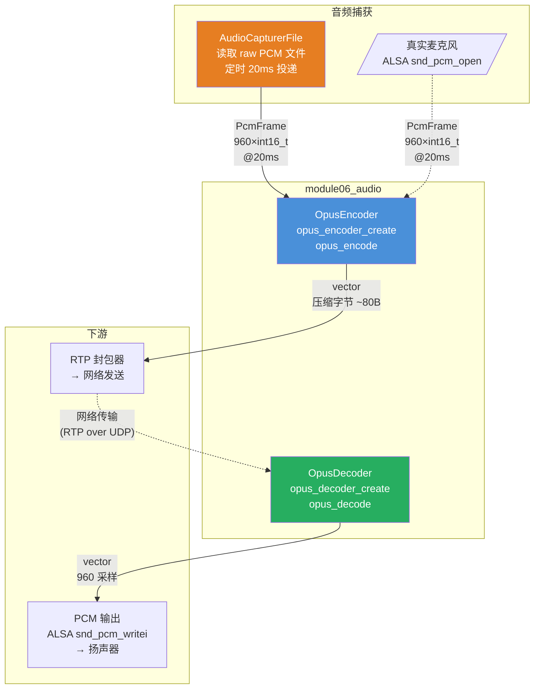
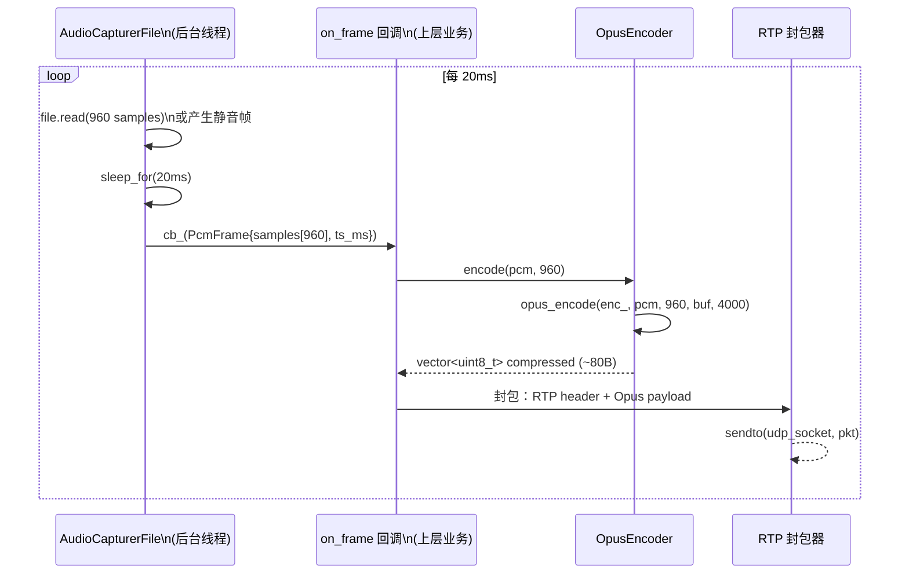
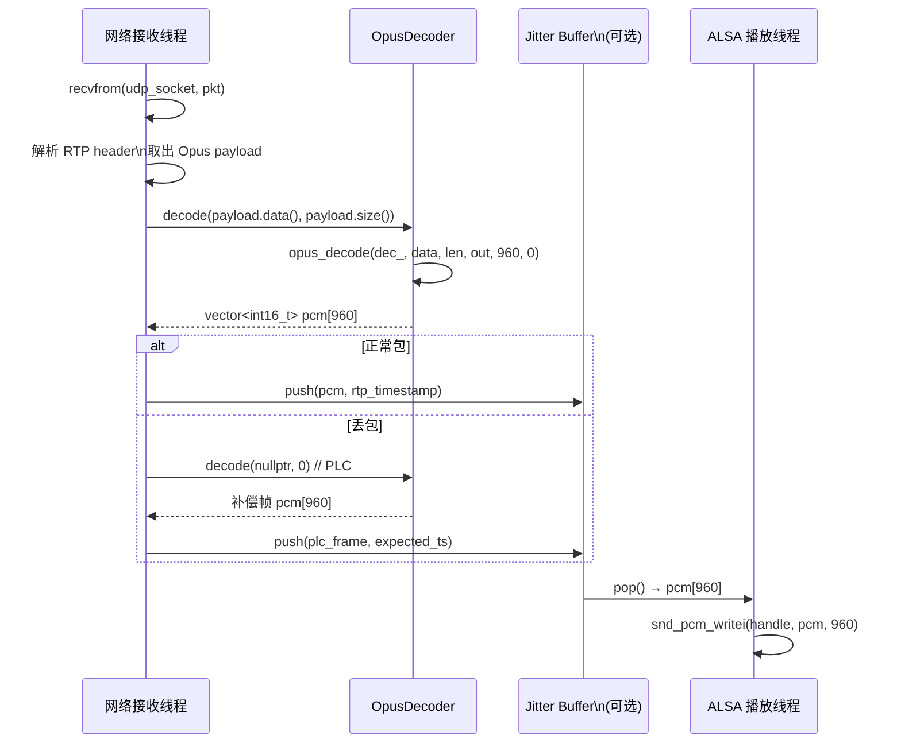

# module06_audio — Opus 音频编解码与捕获

## 1. 模块目的与协议背景

### 目的

音频是实时通信的核心媒体流。本模块实现三个关键能力：

1. **OpusEncoder**：将原始 PCM 音频（int16_t 采样）压缩为 Opus 编码字节流，供 RTP 封包发送。
2. **OpusDecoder**：将收到的 Opus 字节流解压回 PCM，供 ALSA 播放或进一步处理。
3. **AudioCapturerFile**：从文件读取 raw PCM 数据，以 20ms 节拍定时投递帧，
   完整模拟真实麦克风捕获的行为，但不依赖任何音频硬件，适合 CI/CD 环境。

### 为什么选 Opus

| 编解码器 | 延迟 | 质量 | 授权 | WebRTC 标准 | 自适应码率 |
|---------|------|------|------|-------------|-----------|
| **Opus** | 极低（2.5-60ms） | 极高 | BSD（免费） | 强制支持（RFC 7874） | 支持 |
| AAC | 中（~100ms+） | 高 | 专利费用 | 不强制 | 部分 |
| G.711 (PCMU/PCMA) | 低 | 低（64kbps 恒定） | 免费 | 可选 | 不支持 |
| G.722 | 低 | 中等 | 免费 | 可选 | 不支持 |
| MP3 | 高 | 中等 | 专利到期 | 不支持 | 不支持 |

Opus 是 IETF 为实时通信设计的开放编解码器（RFC 6716），结合了：
- **SILK**（Skype 语音编码）：低延迟语音，适合 8-12kHz 窄带语音
- **CELT**（Xiph.org）：低延迟全带宽音频，适合音乐和宽带语音

两种模式可动态混合（Hybrid 模式），在 6kbps 到 510kbps 宽泛范围内自动调节，
同一个编解码器覆盖从窄带电话（SILK）到高保真音乐（CELT）所有场景。

### 参数选择依据

本模块使用的固定参数：

```
SAMPLE_RATE = 48000 Hz   — Opus 的原生采样率，其他采样率会触发内部重采样
CHANNELS    = 1          — 单声道（会议语音不需要立体声）
FRAME_SIZE  = 960        — 960 samples = 20ms @ 48kHz（20ms × 48000 = 960）
BITRATE     = 32000 bps  — 32kbps，Opus 在此码率下语音质量优异（G.711 需要 64kbps）
```

为什么选 20ms 帧：
- WebRTC 标准推荐 20ms 帧（与 RTP 包间隔对齐）
- 小于 20ms（如 10ms）：压缩效率下降，包头开销占比增大
- 大于 20ms（如 40ms）：端到端延迟增加，交互性变差
- 20ms 是"延迟"与"效率"的最佳平衡点

---

## 2. 架构图



数据流：

1. `AudioCapturerFile`（或真实 ALSA 麦克风）每 20ms 产生一个 `PcmFrame`（960 个 int16_t 采样）。
2. `OpusEncoder::encode()` 将 960 个采样压缩为约 80-120 字节（32kbps 下）。
3. 压缩字节封入 RTP 包，通过 UDP/SRTP 发送到对端。
4. 对端收到 RTP 包，取出 Opus 字节流，`OpusDecoder::decode()` 还原为 960 个 int16_t。
5. 解码后的 PCM 送入 ALSA `snd_pcm_writei()` 播放。

---

## 3. 关键类与文件表

| 文件 | 类 / 结构 | 职责 |
|------|----------|------|
| `include/audio/opus_codec.h` | `OpusEncoder` | 封装 libopus 编码器，管理生命周期，提供 encode() 接口 |
| `include/audio/opus_codec.h` | `OpusDecoder` | 封装 libopus 解码器，提供 decode() 接口 |
| `include/audio/audio_capturer.h` | `PcmFrame` | PCM 帧数据结构（samples + timestamp_ms） |
| `include/audio/audio_capturer.h` | `AudioCapturerFile` | 文件 PCM 源，定时 20ms 回调，CI 无硬件替代方案 |
| `src/opus_codec.cpp` | — | opus_encoder_create/encode/destroy + ctl 封装 |
| `src/audio_capturer.cpp` | — | ifstream 读 raw PCM，循环播放，静音帧填充 |
| `tests/test_opus.cpp` | — | 编解码往返测试，压缩率验证，SNR 估算 |

---

## 4. 核心算法

### 4.1 Opus 编码器内部架构

```
输入 PCM（int16_t 采样，960 个）
           |
           v
  [带宽检测]  → 判断信号带宽：NB(8kHz)/MB(12kHz)/WB(16kHz)/SWB(24kHz)/FB(48kHz)
           |
           v
  [模式选择]
   ┌────────┬──────────┬───────────────┐
   │  SILK  │ Hybrid   │     CELT      │
   │ ≤8kHz  │ 12-20kHz │  全带宽/音乐  │
   └────────┴──────────┴───────────────┘
           |
           v
  [编码输出]  → Opus 字节流（自描述格式，包含 TOC 字节标识模式）
```

OPUS_APPLICATION_VOIP（本模块使用）vs OPUS_APPLICATION_AUDIO：

| 特性 | VOIP | AUDIO |
|------|------|-------|
| 目标 | 语音清晰度 | 音乐保真度 |
| DTX（非连续传输）| 开启（静音时少发包） | 关闭 |
| 内置 FEC | 开启（丢包预测冗余） | 关闭 |
| 带宽限制 | 自动限制到语音带宽 | 全带宽 |
| 适用场景 | 会议通话 | 音乐流媒体 |

### 4.2 Opus 内置 FEC（In-band Forward Error Correction）

Opus VOIP 模式支持 LBRR（Low Bit-Rate Redundancy），在包含当前帧的 Opus 包中，
同时携带上一帧的低码率冗余编码：

```
数据包 N 的内容：
  [TOC 字节] [当前帧 N 的编码数据] [帧 N-1 的 LBRR 冗余数据]

解码端收到包 N 后可以恢复：
  - 帧 N（来自包 N）
  - 帧 N-1（来自包 N 的冗余，如果包 N-1 丢失了）

opus_decode() 第 5 个参数 decode_fec：
  0 = 正常解码当前包
  1 = 解码冗余数据（用于恢复前一个丢失的包）
```

FEC 的代价：每个包的字节数增加约 20-50%，但在丢包率 < 20% 的网络下，
音质比重传方案（RTT 延迟）好得多。

### 4.3 OpusEncoder 初始化与编码流程

```
init(bitrate_bps):
    enc = opus_encoder_create(
        sample_rate=48000,
        channels=1,
        application=OPUS_APPLICATION_VOIP,  // 启用 DTX + FEC
        &err
    )
    if err != OPUS_OK: return false
    opus_encoder_ctl(enc, OPUS_SET_BITRATE(bitrate_bps))
    return true

encode(pcm[960], frame_size=960):
    out_buf = vector<uint8_t>(MAX_PKT_SIZE=4000)
    bytes = opus_encode(
        enc,
        pcm,            // int16_t 输入
        frame_size,     // 960 个采样
        out_buf.data(), // 输出缓冲区
        4000            // 缓冲区大小上限
    )
    if bytes < 0: return {}  // 编码失败（OPUS_INVALID_STATE 等）
    out_buf.resize(bytes)    // 收缩到实际大小
    return out_buf
```

32kbps 下，每 20ms 帧实际编码大小约为：
- 32000 bps ÷ 8 bit/byte ÷ 50 frame/s = 80 bytes/frame（理论值）
- 实际值因帧内容动态调整，范围 ~20-200 字节

### 4.4 OpusDecoder 解码流程

```
init():
    dec = opus_decoder_create(
        sample_rate=48000,
        channels=1,
        &err
    )
    return err == OPUS_OK

decode(data, len):
    out = vector<int16_t>(FRAME_SIZE=960)
    samples = opus_decode(
        dec,
        data,        // 压缩字节
        len,         // 字节数
        out.data(),  // 输出 PCM
        FRAME_SIZE,  // 最大输出采样数
        0            // decode_fec=0 正常解码
    )
    if samples < 0: return {}  // 解码失败
    out.resize(samples)        // 通常 = 960
    return out
```

丢包处理（PLC — Packet Loss Concealment）：
当一个 RTP 包丢失时，可以调用 `opus_decode(dec, NULL, 0, out, FRAME_SIZE, 0)`，
Opus 会自动进行 PLC（利用上下文预测补偿波形），避免音频出现爆裂噪声。

### 4.5 AudioCapturerFile 定时帧投递

```
start():
    thread = Thread([this]():
        file = ifstream(path_, binary)
        ts_ms = 0
        while running_:
            frame.samples.resize(960)
            frame.timestamp_ms = ts_ms

            if file.is_open():
                bytes_read = file.read(frame_buf, 960 * sizeof(int16_t))
                if bytes_read == 0:   // 文件读完
                    file.seekg(0)     // 循环到开头（loop playback）
                    重新 read
                frame.samples.resize(got / 2)
                frame.samples.resize(960, 0)  // 末尾补零（避免短帧）
            else:
                frame.samples.fill(0) // 无文件 → 产生静音帧

            if cb_: cb_(frame)        // 触发回调
            ts_ms += 20
            sleep_for(20ms)           // 模拟实时 20ms 节拍
```

**为什么 CI 不能用真实麦克风：**
- CI 服务器（Docker 容器、无头 VM）没有物理声卡，ALSA `snd_pcm_open()` 会失败。
- 测试需要确定性：真实麦克风输入是随机的，无法重现。
- `AudioCapturerFile` 用固定文件替代，行为完全可重现，无硬件依赖。

### 4.6 ALSA 播放流程（供参考）

```
// 实际播放代码不在本模块，这里描述标准 ALSA 流程：

snd_pcm_t* handle;
snd_pcm_open(&handle, "default", SND_PCM_STREAM_PLAYBACK, 0);

snd_pcm_hw_params_t* params;
snd_pcm_hw_params_alloca(&params);
snd_pcm_hw_params_any(handle, params);
snd_pcm_hw_params_set_access(handle, params, SND_PCM_ACCESS_RW_INTERLEAVED);
snd_pcm_hw_params_set_format(handle, params, SND_PCM_FORMAT_S16_LE); // int16_t
snd_pcm_hw_params_set_rate(handle, params, 48000, 0);
snd_pcm_hw_params_set_channels(handle, params, 1);
snd_pcm_hw_params(handle, params);

// 播放一帧（阻塞，直到 ALSA 缓冲区有空间）
snd_pcm_writei(handle, pcm_data, 960 /*frames*/);
// 注意：snd_pcm_writei 的第三个参数是 "frames"（采样对），不是字节数
```

音频线程的实时性要求：
- `snd_pcm_writei()` 可能阻塞（等待 ALSA 缓冲区排空），但阻塞时间是确定的（约一个帧周期）。
- 音频线程不应有不确定时长的操作：网络 I/O、磁盘 I/O、内存分配、锁竞争都会导致欠载（underrun）。
- ALSA underrun（`-EPIPE` 错误）发生时，需要调用 `snd_pcm_prepare()` 恢复。

---

## 5. 调用时序图

### 5.1 编码路径（麦克风 → 网络）



### 5.2 解码路径（网络 → 扬声器）



### 5.3 OpusEncoder 生命周期

```mermaid
sequenceDiagram
    participant APP as 应用代码
    participant ENC as OpusEncoder
    participant LIB as libopus

    APP->>ENC: OpusEncoder enc; enc.init(32000)
    ENC->>LIB: opus_encoder_create(48000, 1, VOIP, &err)
    LIB-->>ENC: OpusEncoder* 句柄
    ENC->>LIB: opus_encoder_ctl(OPUS_SET_BITRATE, 32000)
    LIB-->>ENC: OPUS_OK
    ENC-->>APP: true

    loop 每帧
        APP->>ENC: encode(pcm, 960)
        ENC->>LIB: opus_encode(enc_, pcm, 960, buf, 4000)
        LIB-->>ENC: bytes（实际压缩大小）
        ENC-->>APP: vector<uint8_t>[bytes]
    end

    APP->>ENC: 析构
    ENC->>LIB: opus_encoder_destroy(enc_)
```

---

## 6. 关键代码片段

### 6.1 OpusEncoder::init() — 编码器创建与参数设置

```cpp
// src/opus_codec.cpp
bool OpusEncoder::init(int bitrate_bps) {
    int err = OPUS_OK;
    // OPUS_APPLICATION_VOIP：启用 DTX（静音不发包）和 FEC（丢包冗余）
    // 适合会议语音；若需要音乐流媒体，改用 OPUS_APPLICATION_AUDIO
    enc_ = opus_encoder_create(SAMPLE_RATE,   // 48000
                               CHANNELS,      // 1（单声道）
                               OPUS_APPLICATION_VOIP,
                               &err);
    if (err != OPUS_OK || !enc_) {
        return false;
    }
    // 设置目标码率：32000 bps = 32kbps
    // 实际每包大小 ≈ 32000/8/50 = 80 字节（50包/秒，每包20ms）
    if (opus_encoder_ctl(enc_, OPUS_SET_BITRATE(bitrate_bps)) != OPUS_OK) {
        opus_encoder_destroy(enc_);
        enc_ = nullptr;
        return false;
    }
    return true;
}
```

### 6.2 OpusEncoder::encode() — 逐帧编码

```cpp
// src/opus_codec.cpp
std::vector<uint8_t> OpusEncoder::encode(const int16_t* pcm, int frame_size) {
    if (!enc_) return {};
    // MAX_PKT_SIZE = 4000 字节，远大于实际需要
    // Opus 保证单包不超过 1275 字节（RFC 6716 §2.1.2），4000 是安全上限
    std::vector<uint8_t> out(MAX_PKT_SIZE);
    opus_int32 bytes = opus_encode(
        enc_,                              // 编码器句柄
        pcm,                               // 输入：int16_t 数组
        frame_size,                        // 960（= 20ms × 48kHz）
        out.data(),                        // 输出缓冲区
        static_cast<opus_int32>(out.size()) // 缓冲区大小
    );
    if (bytes < 0) return {};  // 错误码：OPUS_BAD_ARG, OPUS_BUFFER_TOO_SMALL 等
    out.resize(static_cast<size_t>(bytes)); // 收缩到实际压缩大小
    return out;
}
```

### 6.3 OpusDecoder::decode() — 解码与 PLC

```cpp
// src/opus_codec.cpp
std::vector<int16_t> OpusDecoder::decode(const uint8_t* data, size_t len) {
    if (!dec_) return {};
    std::vector<int16_t> out(OpusEncoder::FRAME_SIZE); // 预分配 960 个采样
    int samples = opus_decode(
        dec_,
        data,                           // 压缩字节（或 nullptr 表示丢包）
        static_cast<opus_int32>(len),   // 字节数（丢包时为 0）
        out.data(),                     // 输出 PCM
        OpusEncoder::FRAME_SIZE,        // 最大输出采样数
        0                               // decode_fec：0=正常，1=解码FEC冗余
    );
    if (samples < 0) return {};
    out.resize(static_cast<size_t>(samples)); // 通常 = 960
    return out;
}
// 调用方式：
//   正常解码: decode(opus_data, opus_len)
//   丢包补偿: decode(nullptr, 0)  → Opus PLC 自动预测填充
```

### 6.4 AudioCapturerFile::start() — 定时帧投递

```cpp
// src/audio_capturer.cpp
void AudioCapturerFile::start() {
    running_ = true;
    thread_ = std::thread([this]() {
        std::ifstream file(path_, std::ios::binary);
        // 文件不存在时静默继续（产生静音帧）
        // 这是 CI 的关键特性：无 PCM 文件时不 crash，只产生静音
        uint32_t ts_ms = 0;
        constexpr int FRAME_SAMPLES = 960;
        constexpr int FRAME_MS = 20;

        while (running_) {
            PcmFrame frame;
            frame.samples.resize(FRAME_SAMPLES);
            frame.timestamp_ms = ts_ms;

            if (file.is_open()) {
                file.read(reinterpret_cast<char*>(frame.samples.data()),
                          FRAME_SAMPLES * sizeof(int16_t)); // 读 1920 字节
                auto got = file.gcount();
                if (got <= 0) {
                    // 文件读完，循环到开头（loop playback，方便长时间测试）
                    file.clear();
                    file.seekg(0, std::ios::beg);
                    file.read(reinterpret_cast<char*>(frame.samples.data()),
                              FRAME_SAMPLES * sizeof(int16_t));
                    got = file.gcount();
                }
                auto samples_got = static_cast<size_t>(got) / sizeof(int16_t);
                frame.samples.resize(samples_got);
                frame.samples.resize(FRAME_SAMPLES, 0); // 末尾补零（短帧对齐）
            } else {
                // 无文件：产生全零静音帧，不中断流水线
                std::fill(frame.samples.begin(), frame.samples.end(), 0);
            }

            if (cb_) cb_(frame); // 触发回调，上层处理（编码/写入/分析等）

            ts_ms += FRAME_MS;
            std::this_thread::sleep_for(std::chrono::milliseconds(FRAME_MS));
            // sleep_for 是软实时定时器，精度约 ±1ms
            // 生产环境应使用 clock_nanosleep(TIMER_ABSTIME) 消除累积漂移
        }
    });
}
```

### 6.5 测试中的 SNR 估算

```cpp
// tests/test_opus.cpp
// 松散 SNR 检查：编解码引入的失真应远小于信号本身
double sig_power = 0.0, err_power = 0.0;
for (int i = 0; i < OpusEncoder::FRAME_SIZE; ++i) {
    double s = pcm[i];      // 原始采样
    double d = decoded[i];  // 解码采样
    sig_power += s * s;
    err_power += (s - d) * (s - d); // 量化误差
}
// err_power < sig_power * 10 即 SNR > -10dB（非常松散的检查）
// 实际 Opus 在 32kbps 下 SNR 约 25-35dB（err_power ≈ sig_power * 0.001）
EXPECT_LT(err_power, sig_power * 10.0);
```

---

## 7. 设计决策

### 7.1 选用 OPUS_APPLICATION_VOIP 而非 OPUS_APPLICATION_AUDIO

会议通话场景的关键需求是语音清晰度，而非音乐保真度：
- `VOIP` 模式开启 DTX（Discontinuous Transmission）：静音时不发包或发极小的舒适噪声包，
  节省约 40% 带宽（会议中大量静音时间）。
- `VOIP` 模式开启 LBRR FEC：在预测到高丢包率时，在当前帧中打包上一帧的冗余数据。
- `VOIP` 模式限制带宽到语音频段：不浪费码率编码人声范围（300Hz-3400Hz）以外的频率。

如果需要播放背景音乐或实现高保真音频（播客、音乐会），改用 `OPUS_APPLICATION_AUDIO`。

### 7.2 固定 FRAME_SIZE = 960（20ms）不使用动态帧

Opus 支持 2.5ms 到 120ms 的多种帧长。选择 20ms 的理由：
- 与 RTP 包间隔对齐（WebRTC 标准使用 20ms 包间隔）
- 延迟可接受（20ms 单向传播时间，总 RTT 下几乎不可感知）
- 压缩效率高（帧越短，帧头开销占比越大）
- 与 ALSA 硬件 period_size 对齐（通常为 960 或 1024 帧）

### 7.3 MAX_PKT_SIZE = 4000 的安全边界

RFC 6716 规定单个 Opus 包最大 1275 字节（受 IP/UDP 分片限制）。
选择 4000 字节的理由：
- 留出 3 倍以上余量，防止未来码率提升或 FEC 开销超预期。
- `std::vector<uint8_t>(4000)` 的内存分配成本极低（在 heap 上），
  之后用 `resize(actual_bytes)` 收缩，不浪费。
- 避免因缓冲区过小导致的 `OPUS_BUFFER_TOO_SMALL` 错误。

### 7.4 AudioCapturerFile 文件循环播放（loop playback）

到达文件末尾时，重置文件指针到开头继续读取（`seekg(0)`），
这使得一段短的测试 PCM 文件可以无限循环，
方便长时间运行集成测试（压力测试、内存泄漏检测）而不需要准备大文件。

### 7.5 解码器输出尺寸的处理

`opus_decode()` 的返回值是实际解码的采样数，通常等于 `FRAME_SIZE`（960），
但在 PLC 或变长帧情况下可能不同。因此 `decode()` 返回 `vector<int16_t>`
并用 `resize(samples)` 精确裁剪，而不是假设固定大小。
调用方应检查返回向量的 `size()` 而不是假设为 960。

### 7.6 音频线程不持有重量级锁

`AudioCapturerFile` 的后台线程每 20ms 触发回调，是软实时线程。
`on_frame_` 回调（`OpusEncoder::encode()`）不访问任何共享状态，
避免了锁竞争导致的延迟抖动。如果上层回调需要访问共享队列，
应使用无锁队列（lock-free queue）或 try-lock，不应使用阻塞 mutex。

---

## 8. 常见坑

### 坑 1：encode() 之前忘记调用 init()

`OpusEncoder::encode()` 在 `enc_ == nullptr` 时直接返回空 vector，
不抛出异常，不打印错误。调用方若不检查返回值，会默默丢弃所有音频数据。

```cpp
OpusEncoder enc;
// 忘记 enc.init(32000) !!!
auto data = enc.encode(pcm.data()); // 返回空 vector，无提示
```

正确做法：

```cpp
OpusEncoder enc;
if (!enc.init(32000)) {
    // 处理初始化失败
}
auto data = enc.encode(pcm.data());
assert(!data.empty()); // 有声音内容时不应为空
```

### 坑 2：传入 encode() 的 frame_size 与 SAMPLE_RATE 不匹配

`opus_encode()` 要求 `frame_size` 必须是 Opus 支持的帧长（2.5/5/10/20/40/60ms 对应的采样数）。
对于 48kHz，合法值为：120/240/480/960/1920/2880。
传入错误值（如 1024）会返回 `OPUS_BAD_ARG`（负数错误码）。

```cpp
// 错误：1024 不是合法帧大小
enc.encode(pcm.data(), 1024); // 返回空 vector

// 正确：使用常量
enc.encode(pcm.data(), OpusEncoder::FRAME_SIZE); // = 960
```

### 坑 3：opus_encode 返回负值时直接转 size_t 导致巨大分配

```cpp
opus_int32 bytes = opus_encode(...);
// 错误！bytes 可能是负数（错误码），转 size_t 变成巨大正数
out.resize(static_cast<size_t>(bytes)); // 可能抛出 bad_alloc
```

正确做法：

```cpp
opus_int32 bytes = opus_encode(...);
if (bytes < 0) return {}; // 先检查错误
out.resize(static_cast<size_t>(bytes)); // 再收缩
```

### 坑 4：AudioCapturerFile 的 sleep_for 精度问题导致累积漂移

`std::this_thread::sleep_for(20ms)` 使用相对时间，每次睡眠的实际时长可能是 20.1ms 或 19.9ms。
经过 3000 次（1分钟），累积误差可能超过 300ms，导致时间戳 `ts_ms` 与真实时钟偏离。

生产环境应使用绝对时间定时：

```cpp
// 消除累积漂移的正确做法
auto next_frame_time = std::chrono::steady_clock::now();
while (running_) {
    next_frame_time += std::chrono::milliseconds(20);
    // ... 处理帧 ...
    std::this_thread::sleep_until(next_frame_time); // 等到下一帧绝对时刻
}
```

### 坑 5：解码线程与播放线程不同步导致 ALSA underrun

典型错误：解码线程每 20ms 往队列里 push 一帧，ALSA 线程阻塞在 `snd_pcm_writei()`，
两个线程用同一把 mutex 访问队列，导致 ALSA 写入时阻塞了解码线程，
解码线程被阻塞后 jitter buffer 为空，ALSA 触发 underrun（`-EPIPE`）。

解决方案：使用无锁环形缓冲区（lock-free ring buffer），
解码线程永不阻塞，ALSA 线程无等待读取。

### 坑 6：单声道 vs 双声道配置不一致

`OpusEncoder` 和 `OpusDecoder` 都固定使用 `CHANNELS=1`（单声道）。
如果 ALSA 捕获设备配置为 `SND_PCM_FORMAT_S16_LE` 双声道，
每帧实际数据是 1920 个 int16_t（960 对立体声采样），
直接传入 Opus 会得到 `OPUS_BAD_ARG` 或乱码。

必须在捕获后做声道转换（取平均或只取左声道）：

```cpp
// 立体声转单声道（取平均）
for (int i = 0; i < 960; ++i)
    mono[i] = (stereo[2*i] / 2) + (stereo[2*i+1] / 2);
```

### 坑 7：对端编解码参数不一致

`OpusEncoder` 创建时的 `SAMPLE_RATE`/`CHANNELS` 是编码参数，
`OpusDecoder` 创建时的参数是解码输出参数。即使对端用 44100Hz 编码，
本地解码器也可以用 48000Hz 输出（Opus 内部重采样），但必须确保
`opus_decoder_create` 的参数与实际期望的输出格式一致，
而不是与发送方的编码参数一致。

### 坑 8：opus_encoder_ctl 的参数类型

`OPUS_SET_BITRATE` 是宏，展开后需要传入 `opus_int32` 类型：

```cpp
// 错误：直接传 int 字面量（某些编译器不报错但可能截断）
opus_encoder_ctl(enc_, OPUS_SET_BITRATE(32000));

// 正确：明确类型（宏已处理，通常安全，但注意不要传负值）
opus_int32 bitrate = 32000;
opus_encoder_ctl(enc_, OPUS_SET_BITRATE(bitrate));

// 特殊值：OPUS_AUTO（自动）或 OPUS_BITRATE_MAX（最大）
opus_encoder_ctl(enc_, OPUS_SET_BITRATE(OPUS_AUTO));
```

---

## 9. 测试覆盖说明

### test_opus.cpp

| 测试名 | 场景 | 核心验证 |
|--------|------|---------|
| `EncodeDecodeRoundtrip` | 440Hz 正弦波 → 编码 → 解码 | 解码输出非零（有实际声音内容）；err_power < sig_power × 10（粗略 SNR 检查）；返回帧大小 = FRAME_SIZE（960） |
| `EncodedSizeReduced` | 编码一帧正弦波 | 压缩后字节数 < 原始字节数 1920（960×2）；压缩字节数 > 0 |

测试使用 440Hz 正弦波（音乐 A4 音符），振幅 20000（接近 int16_t 最大值 32767 的 61%），
覆盖了常见的有声内容场景。

### 覆盖场景

- [x] 编码器初始化（VOIP 模式，32kbps）
- [x] 解码器初始化
- [x] 完整 encode → decode 往返
- [x] 压缩率验证（压缩后 < 原始大小）
- [x] 解码非零能量（非静音）
- [x] 松散 SNR 估算

### 未覆盖场景（可扩展）

- 丢包恢复（PLC：`decode(nullptr, 0)`）
- FEC 解码（`decode_fec=1`）
- 不同码率的编码质量对比（8kbps / 32kbps / 128kbps）
- 静音帧的 DTX 效果（encode() 返回 2-3 字节的舒适噪声包）
- AudioCapturerFile 的帧回调计时精度
- AudioCapturerFile 的文件循环播放（EOF 处理）

---

## 10. 构建与运行

### 依赖

```
libopus-dev     # Opus 编解码库（apt install libopus-dev）
libasound2-dev  # ALSA 音频（可选，播放侧需要）
googletest      # 单元测试（FetchContent 自动下载）
g++-10 / gcc-10 # C++17 特性
```

### 构建

```bash
# 在 cpp_meet 根目录
CXX=g++-10 CC=gcc-10 cmake -B build -DCMAKE_BUILD_TYPE=Debug
cmake --build build -j$(nproc)
```

### 运行测试

```bash
# 运行 module06 全部测试（无需音频硬件）
./build/module06_audio/test_audio

# 指定测试
./build/module06_audio/test_audio --gtest_filter="OpusCodec.EncodeDecodeRoundtrip"
./build/module06_audio/test_audio --gtest_filter="OpusCodec.EncodedSizeReduced"
```

### 手工生成测试 PCM 文件

```bash
# 用 sox 生成 1 秒 440Hz 正弦波（raw S16LE, 48kHz, mono）
sox -n -r 48000 -e signed-integer -b 16 -c 1 test_audio.raw \
    synth 1 sine 440

# 或用 ffmpeg
ffmpeg -f lavfi -i "sine=frequency=440:duration=1" \
    -ar 48000 -ac 1 -f s16le test_audio.raw
```

### 验证 Opus 压缩率

```bash
# 440Hz, 48kHz, 1声道, 960采样 = 1920 字节原始
# 32kbps 下期望压缩到约 80 字节

# 用 opusenc 命令行验证（若已安装）
opusenc --bitrate 32 input.wav output.opus
ls -la output.opus
```

### 检测 ALSA 可用性（CI 环境）

```bash
# 检查是否有可用的声卡
aplay -l
# 若无输出或报错 "no soundcards found"，说明需要使用 AudioCapturerFile 替代真实麦克风
```

---

## 11. 延伸阅读

### RFC 规范

- [RFC 6716 — Definition of the Opus Audio Codec](https://datatracker.ietf.org/doc/html/rfc6716)
  - §2.1：帧结构与 TOC 字节
  - §3：SILK 模式技术细节
  - §4：CELT 模式技术细节

- [RFC 7874 — WebRTC Audio Codec and Processing Requirements](https://datatracker.ietf.org/doc/html/rfc7874)
  - 规定 WebRTC 端点必须支持 Opus 和 G.711

- [RFC 3551 — RTP Profile for Audio and Video Conferences](https://datatracker.ietf.org/doc/html/rfc3551)
  - G.711 PCMU/PCMA 的 RTP Payload Type 定义（PT 0 和 PT 8）

- [RFC 4867 — RTP Payload Format for AMR](https://datatracker.ietf.org/doc/html/rfc4867)
  - AMR 编码的 RTP 封装（移动网络常用，与 Opus 对比参考）

### 深入阅读

- [Opus Codec 官方文档](https://opus-codec.org/docs/)
  - libopus API 完整参考，包含所有 CTL 参数说明

- [Opus: A Free, High-Quality Speech and Audio Codec](https://jmvalin.ca/papers/opus_clt2012.pdf)
  Jean-Marc Valin 的技术论文，SILK + CELT 混合架构详解

- [ALSA Programming HOWTO](https://alsa-project.org/alsa-doc/alsa-lib/pcm.html)
  - snd_pcm_open、hw_params、snd_pcm_writei 完整 API 文档

- [WebRTC for the Curious — Chapter: Audio](https://webrtcforthecurious.com/)
  - 音频编解码、Jitter Buffer、PLC、回声消除在 WebRTC 中的集成

- [Real-Time Communication with WebRTC (O'Reilly)](https://www.oreilly.com/library/view/real-time-communication-with/9781449371869/)
  - 第 4 章：音频引擎架构（AEC/ANS/AGC 处理链）

### 相关模块

- `module07_rtp`：RTP 封包格式，Opus payload 的 PT/timestamp/SSRC 处理
- `module08_srtp`：SRTP 加密，保护 Opus 媒体流
- `module09_jitter`：Jitter Buffer 实现，平滑网络抖动，配合 Opus PLC 消除卡顿
