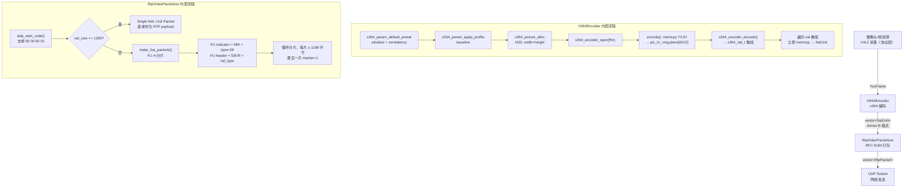
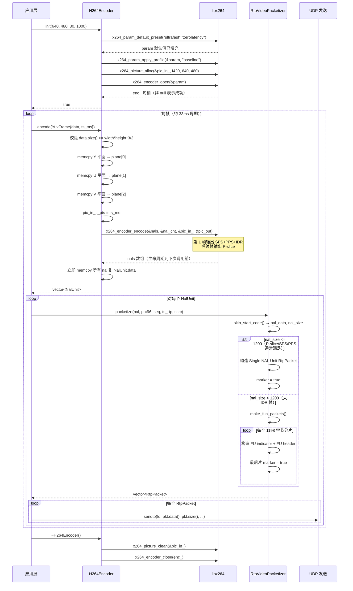

# module07_video — H.264 编码与 RTP 视频打包

## 1. 模块目的与协议背景

### 1.1 模块目的

本模块实现实时视频通话链路中的两个核心环节：

1. **H.264 编码**：将原始 YUV420P 视频帧通过 libx264 压缩为 H.264 码流，输出 Annex B 格式的 NAL unit 列表。
2. **RTP 视频打包**：将 H.264 NAL unit 按照 RFC 6184 规范打包成 RTP 包列表，送入 UDP 网络发送。

两者串联起来构成"摄像头采集 → YUV 原始帧 → H.264 编码 → RTP 打包 → UDP 发送"链路的中间两段。

### 1.2 H.264 协议背景

H.264（又名 AVC，Advanced Video Coding）是 ITU-T H.264 / ISO MPEG-4 Part 10 标准，至今仍是视频会议、流媒体的主流编码格式。其核心设计思想是通过帧间预测大幅减少时间维度的冗余，只对预测残差做 DCT 变换和熵编码。

**Profile 三级台阶**

| Profile | 特性 | 典型场景 |
|---------|------|---------|
| Baseline | 无 B 帧、CAVLC 熵编码、简单 deblocking | 低延迟视频通话、嵌入式设备 |
| Main | 支持 B 帧、CABAC 熵编码 | 移动端播放 |
| High | 8×8 帧内预测、自适应量化矩阵 | 蓝光、高清录制 |

实时通话几乎固定选用 **Baseline Profile**：没有 B 帧意味着编码器无需"看未来帧"，端到端延迟最低；CAVLC 比 CABAC 计算量更小，CPU 更友好，对算力紧张的嵌入式设备尤为重要。

**帧类型与 GOP**

- **I 帧（IDR）**：完整关键帧，解码无需参考其他帧。IDR（Instantaneous Decoder Refresh）特指能清除解码器所有参考帧缓冲的 I 帧，是随机接入点。新加入的接收方必须等到 IDR 帧才能开始解码。
- **P 帧**：单向预测，参考前面已解码帧的运动块，只编码运动矢量和残差。压缩比通常为 I 帧的 3-5 倍。
- **B 帧**：双向预测，参考前后帧。Baseline Profile 不使用，因为它要求编码器缓存未来帧，引入多帧延迟。

GOP（Group of Pictures）指相邻两个 I 帧之间的帧数。本模块设为 `fps * 2`，即每 2 秒一个关键帧。GOP 越大，平均码率越低，但随机接入延迟越长，丢失 I 帧后的花屏恢复时间也越长。

### 1.3 RTP 协议背景

RTP（Real-time Transport Protocol，RFC 3550）是实时媒体传输的标准协议，运行在 UDP 之上。每个 RTP 包包含：

- **12 字节固定头**：版本（V=2）、填充标志（P）、扩展标志（X）、CSRC 计数（CC）、标记位（M）、载荷类型（PT）、序列号（16bit）、时间戳（32bit）、SSRC（同步源标识符，32bit）。
- **可变载荷**：内容与具体编解码格式相关，由 RFC 6184 定义 H.264 的打包规则。

H.264 over RTP 的规范是 **RFC 6184**（2011），定义了三种打包模式：Single NAL Unit、STAP-A（聚合包）、FU-A（分片包）。本模块实现前者和后者。

---

## 2. 架构图



---

## 3. 关键类与文件表

| 文件路径 | 类 / 结构体 | 职责说明 |
|---------|------------|---------|
| `include/video/h264_encoder.h` | `YuvFrame` | 携带 YUV420P 原始帧数据（平面格式）及毫秒时间戳 |
| `include/video/h264_encoder.h` | `NalUnit` | 单个 NAL unit（含 Annex B start code）及关键帧标记 |
| `include/video/h264_encoder.h` | `H264Encoder` | 封装 x264 编码器生命周期（`init/encode/~`）|
| `include/video/rtp_video_packetizer.h` | `RtpVideoPacketizer` | 将 NalUnit 按 RFC 6184 拆分为 RTP 包列表 |
| `src/h264_encoder.cpp` | — | `init()` 参数配置、`encode()` YUV 复制与编码调用 |
| `src/rtp_video_packetizer.cpp` | — | `skip_start_code()`、`packetize()`、`make_fua_packets()` |
| `tests/test_h264.cpp` | — | 4 个单元测试：编码器初始化、首帧输出、Single/FU-A 打包 |

**外部依赖**

| 依赖 | 用途 |
|------|------|
| `libx264` | H.264 编码器核心库 |
| `rtp/rtp_packet.h` | RTP 包构造与读取（项目内共享头） |

---

## 4. 核心算法

### 4.1 YUV420P 内存布局与色度二次采样

YUV420P（又称 I420）是平面格式（planar），三个分量分别连续存储：

```
内存偏移 0
┌──────────────────────────────────────┐
│          Y 平面（亮度）               │  大小 = width × height 字节
│  每像素 1 字节，范围 [16, 235]         │  （行优先，无行对齐填充）
├──────────────────────────────────────┤
│          U 平面（蓝色差 Cb）           │  大小 = (width/2) × (height/2) 字节
│  每 2×2 像素块共用 1 个 U 值           │  = width × height / 4
├──────────────────────────────────────┤
│          V 平面（红色差 Cr）           │  大小 = (width/2) × (height/2) 字节
└──────────────────────────────────────┘
总大小 = width × height × 3 / 2
```

**色度二次采样（4:2:0）的意义**：人眼对亮度（Y）变化的敏感度远高于对色度（U/V）变化的敏感度，因此将 U/V 的采样率降低为 Y 的 1/4 面积，几乎不影响主观画质，但带宽节省 50%（相比 YUV444）。

在代码中，三个平面的大小计算和复制：

```cpp
int y_size  = width_ * height_;     // Y 平面字节数
int uv_size = y_size / 4;           // U 或 V 平面字节数（各一半色度）

// x264 按 plane[0]=Y, plane[1]=U(Cb), plane[2]=V(Cr) 索引
std::memcpy(pic_in_.img.plane[0], frame.data.data(),                    y_size);
std::memcpy(pic_in_.img.plane[1], frame.data.data() + y_size,           uv_size);
std::memcpy(pic_in_.img.plane[2], frame.data.data() + y_size + uv_size, uv_size);
```

### 4.2 V4L2 摄像头采集流程（协议介绍）

虽然本模块未实现摄像头采集，完整的视频采集管线需通过 V4L2（Video for Linux 2）内核接口获取 YUV 帧：

```
1. open("/dev/video0", O_RDWR)
       ↓
2. VIDIOC_QUERYCAP  → 查询设备能力（确认支持 V4L2_CAP_VIDEO_CAPTURE）
       ↓
3. VIDIOC_S_FMT     → 设置捕获格式
       v4l2_format.fmt.pix.pixelformat = V4L2_PIX_FMT_YUV420
       v4l2_format.fmt.pix.width  = 640
       v4l2_format.fmt.pix.height = 480
       ↓
4. VIDIOC_REQBUFS   → 申请内核 DMA 缓冲区（count=4，type=MMAP）
       ↓
5. for each buf:
       VIDIOC_QUERYBUF → 获取缓冲区偏移和长度
       mmap(NULL, len, PROT_READ|PROT_WRITE, MAP_SHARED, fd, offset)
           → 将内核缓冲区映射到用户空间，零拷贝关键
       VIDIOC_QBUF     → 将缓冲区入队，告知驱动可以填充
       ↓
6. VIDIOC_STREAMON  → 启动采集流
       ↓
7. 采集循环:
       select(fd) / poll(fd)  → 阻塞等待帧就绪
       VIDIOC_DQBUF           → 取出已填充的缓冲区（获得帧数据指针）
       处理帧（复制或直接传入 H264Encoder::encode()）
       VIDIOC_QBUF            → 将缓冲区重新入队供驱动复用
       ↓
8. VIDIOC_STREAMOFF → 停止采集，释放缓冲区
```

mmap 模式避免了内核到用户空间的数据拷贝，是高性能采集的标准实践。

### 4.3 x264 初始化参数选择逻辑

```
输入参数: width, height, fps, bitrate_kbps

步骤 1: x264_param_default_preset(&param, "ultrafast", "zerolatency")
  ├── ultrafast preset 效果:
  │     关闭 CABAC、关闭 B 帧自适应、关闭 deblocking 精调
  │     运动搜索范围最小（16 像素）、无帧级并行分析
  │     编码速度是 slow 的 10-20 倍，画质略有损失
  └── zerolatency tune 效果:
        禁用 lookahead（不缓帧）
        强制帧延迟 = 0（输入一帧立即输出一帧）
        禁用 VBV 预读（影响码率平滑，但换取零延迟）

步骤 2: 配置关键帧间隔
  param.i_keyint_max = fps * 2   // 每 2 秒一个 IDR
  含义: GOP = 60 帧（30fps）时，I 帧占比 1/60
  → 平均码率较低，但切换场景时需等待下一个 IDR

步骤 3: 码率控制模式 X264_RC_ABR（平均比特率）
  对比:
  CQP（恒定量化）→ 质量恒定，码率剧烈波动，不适合网络传输
  CRF（恒定质量）→ 平静画面码率很低，运动画面码率很高，网络难以预测
  ABR（平均比特率）→ 长期平均码率稳定，网络缓冲区可预期

步骤 4: x264_param_apply_profile(&param, "baseline")
  强制限制:
  B 帧 = 0，熵编码 = CAVLC，8x8 DCT = 关闭
  最终 profile/level 写入 SPS，解码端据此分配缓冲区

步骤 5: x264_picture_alloc(&pic_in_, X264_CSP_I420, width, height)
  分配 x264 内部管理的 YUV 缓冲区
  pic_in_.img.plane[0/1/2] 即三个平面的指针
  析构时必须调用 x264_picture_clean(&pic_in_)
```

**为什么实时场景不用 slow/medium preset？**

`slow` preset 启用多参考帧（up to 16）、大运动搜索范围（64 像素半径）、CABAC 精细调优，CPU 开销可能是 `ultrafast` 的 10-20 倍。30fps 实时场景下每帧预算约 33ms，服务器同时处理数十路流时 `slow` 会导致编码积压、延迟雪崩。实时通话在质量和延迟之间的权衡明确倾向于延迟。

### 4.4 Annex B vs AVCC 格式对比

H.264 码流有两种封装格式：

**Annex B**（字节流格式，用于 MPEG-2 TS、RTP、文件直接流）：
```
[00 00 00 01] [NAL unit data ...]    ← 4 字节 start code（常见于 SPS/PPS/IDR 首包）
[00 00 01]    [NAL unit data ...]    ← 3 字节 start code（其他 NAL）
```

**AVCC**（MP4/MOV 容器格式）：
```
[4字节大端长度] [NAL unit data ...]
```

RTP 传输**必须用 Annex B** 的理由：RFC 6184 要求发送端去掉 start code 后再封入 RTP，接收端收到后可以直接拼接 start code 送给解码器，整个链路保持 Annex B 语义。x264 通过 `param.b_annexb = 1` 输出 Annex B，packetizer 中的 `skip_start_code()` 负责在打包前剥离前缀。

### 4.5 NAL unit 类型详解

NAL unit 头字节格式（1 字节）：

```
bit 7:    F（forbidden_zero_bit，H.264 规定必须为 0）
bit 5-6:  NRI（nal_ref_idc，0=非参考/可丢弃，1-3=参考重要性递增）
bit 0-4:  Type（NAL 类型）
```

| 类型值 | 名称 | 作用 | NRI 典型值 |
|--------|------|------|-----------|
| 1 | Non-IDR slice（P slice） | 参考帧预测，依赖之前的参考帧解码 | 2 |
| 5 | IDR slice | 清除参考缓冲的关键帧，随机接入点 | 3 |
| 6 | SEI | 补充增强信息（时间码、用户数据） | 0 |
| 7 | SPS | 序列参数集（分辨率、帧率、Profile） | 3 |
| 8 | PPS | 图像参数集（熵编码方式、初始量化参数） | 3 |
| 28 | FU-A | 分片单元（RFC 6184 打包辅助类型） | — |

**IDR 帧的正确发送顺序**：`SPS → PPS → IDR slice`。解码器必须先解析 SPS 确定分辨率、Profile，再解析 PPS 获取图像参数，最后才能解码 IDR 帧。顺序错误会导致解码器直接报错。

### 4.6 RFC 6184 三种打包模式

**模式一：Single NAL Unit Packet**（nal_size ≤ MAX_RTP_PAYLOAD）

```
RTP 头 (12B) | NAL unit（含 NAL 头字节，直接作为 RTP payload）
```

NAL 头字节同时作为 payload 的第一个字节，接收端根据 `payload[0] & 0x1F` 判断 NAL 类型。

**模式二：STAP-A**（Aggregation Packet，本模块未实现）

```
RTP 头 | 0x18（STAP-A header） | 2B大小 | NAL1 | 2B大小 | NAL2 | ...
```

适合将 SPS + PPS 合并进一个 RTP 包，节省包头开销。本模块每个 NAL 独立打包，略有浪费。

**模式三：FU-A**（Fragmentation Unit，nal_size > MAX_RTP_PAYLOAD）

```
RTP 头 | FU indicator (1B) | FU header (1B) | NAL 数据片段
```

### 4.7 FU-A 分片算法详解

```
输入: nal_data（已去掉 Annex B start code），nal_size
      MAX_RTP_PAYLOAD = 1200，FU 开销 = 2 字节

构造 FU indicator：
  fu_indicator = (nal_data[0] & 0xE0) | 28
    ├── bit 7:   F = nal_data[0] bit7（复用原 NAL 头，必须为 0）
    ├── bit 5-6: NRI = nal_data[0] bit5-6（复用，保留 NAL 重要性）
    └── bit 0-4: Type = 28（固定，标识这是 FU-A 包）

提取原始 NAL 类型：
  nal_type = nal_data[0] & 0x1F    // 用于 FU header

分片循环（src = nal_data+1，remaining = nal_size-1）：
  WHILE remaining > 0:
    chunk = min(remaining, 1198)    // 1200 - 2B FU 开销
    last  = (chunk == remaining)

    fu_header = nal_type
    if first: fu_header |= 0x80    // S bit = 1（第一个分片）
    if last:  fu_header |= 0x40    // E bit = 1（最后一个分片）
    // R bit（bit5）保留，必须为 0

    payload = [fu_indicator, fu_header] + src[0..chunk-1]
    构造 RTP 包，marker = last     // 仅最后一片 marker=1

    src += chunk; remaining -= chunk; first = false

接收端重组（本模块未实现）：
  收集所有 FU-A 分片（同 timestamp + ssrc）
  验证 S bit 在第一片，E bit 在最后片
  重建 NAL 头 = (fu_indicator & 0xE0) | nal_type
  拼接: [重建 NAL 头] + 所有分片的数据部分
```

---

## 5. 调用时序图



---

## 6. 关键代码片段

### 6.1 x264 参数初始化（含详细注释）

```cpp
// src/h264_encoder.cpp — H264Encoder::init()

x264_param_t param;

// ultrafast: 关闭几乎所有耗时分析
//   - 运动搜索范围最小（仅 ±16 像素）
//   - 不使用 CABAC（改用 CAVLC）
//   - 不做帧内预测精化
//   - 编码速度约为 slow 的 10-20 倍
// zerolatency: 禁用 lookahead，确保输入一帧立即输出一帧
//   - 关键：实时通话不能接受编码器内部缓帧造成的延迟
if (x264_param_default_preset(&param, "ultrafast", "zerolatency") < 0) {
    return false;
}

param.i_width   = width;
param.i_height  = height;
param.i_fps_num = static_cast<uint32_t>(fps);
param.i_fps_den = 1;

// 关键帧间隔 2 秒 = fps * 2 帧
// 每 2 秒发送一次完整 IDR，新加入接收方最多等待 2 秒即可解码
param.i_keyint_max = fps * 2;

// ABR（平均比特率）：长期码率稳定，网络缓冲区可预期
// 不选 CRF：CRF 在复杂场景码率可能突增 5-10 倍，难以控制网络占用
param.rc.i_rc_method = X264_RC_ABR;
param.rc.i_bitrate   = bitrate_kbps;  // 单位 kbps

param.i_csp = X264_CSP_I420;  // 输入色彩空间：YUV420P

// b_annexb=1：输出 Annex B 字节流（00 00 00 01 前缀）
// 若设为 0 则输出 AVCC（length-prefixed），适合 MP4 文件，不适合 RTP
param.b_annexb = 1;

param.i_log_level = X264_LOG_NONE;  // 关闭 x264 内部日志输出

// Baseline Profile 限制：强制禁用 B 帧、8×8 DCT，使用 CAVLC
// 牺牲约 5-10% 的压缩率，换取兼容性最广和延迟最低
if (x264_param_apply_profile(&param, "baseline") < 0) {
    return false;
}

// 分配 x264 内部管理的 YUV 缓冲区
// pic_in_.img.plane[0/1/2] 由 x264 分配，我们只需 memcpy 数据进去
if (x264_picture_alloc(&pic_in_, X264_CSP_I420, width, height) < 0) {
    return false;
}

enc_ = x264_encoder_open(&param);
return enc_ != nullptr;
```

### 6.2 编码输出与 NAL 生命周期处理

```cpp
// src/h264_encoder.cpp — H264Encoder::encode()

x264_picture_t pic_out;
x264_nal_t*    nals    = nullptr;
int            nal_cnt = 0;

// x264_encoder_encode 返回编码后的字节数（>=0 成功，<0 失败）
// nals 指针由 x264 内部管理，生命周期仅持续到下一次编码调用
// 必须在本函数返回前完成所有数据的 memcpy！
int frame_size = x264_encoder_encode(enc_, &nals, &nal_cnt, &pic_in_, &pic_out);
if (frame_size < 0) return {};

std::vector<NalUnit> result;
for (int i = 0; i < nal_cnt; ++i) {
    NalUnit nu;
    // assign() 做深拷贝：把 nals[i].p_payload 的数据复制到 nu.data
    // 如果不拷贝直接持有指针，下一帧编码后该内存会被 x264 覆盖
    nu.data.assign(nals[i].p_payload,
                   nals[i].p_payload + nals[i].i_payload);
    // b_keyframe 由 pic_out 标记，整批 NAL（SPS+PPS+IDR）共同决定
    nu.is_keyframe = (pic_out.b_keyframe != 0);
    result.push_back(std::move(nu));
}
return result;
```

### 6.3 start code 剥离与单包判断

```cpp
// src/rtp_video_packetizer.cpp — skip_start_code() + packetize()

// 检测并跳过 Annex B start code（4字节或3字节版本）
// x264 通常输出 4 字节 start code，但标准允许 3 字节
static const uint8_t* skip_start_code(const uint8_t* data, size_t size, size_t& out_size) {
    if (size >= 4 && data[0]==0 && data[1]==0 && data[2]==0 && data[3]==1) {
        out_size = size - 4;
        return data + 4;  // 跳过 4 字节
    }
    if (size >= 3 && data[0]==0 && data[1]==0 && data[2]==1) {
        out_size = size - 3;
        return data + 3;  // 跳过 3 字节
    }
    out_size = size;       // 无 start code，原样返回
    return data;
}

// packetize() 主逻辑
std::vector<RtpPacket> RtpVideoPacketizer::packetize(...) {
    size_t nal_size = 0;
    const uint8_t* nal_data = skip_start_code(nal.data.data(), nal.data.size(), nal_size);

    if (nal_size <= MAX_RTP_PAYLOAD) {
        // Single NAL Unit Packet：NAL 数据直接作为 RTP payload
        // marker=true：这个 NAL 是一个完整的帧单元，接收端可以触发解码
        RtpPacket pkt;
        pkt.build(payload_type, seq++, timestamp, ssrc,
                  nal_data, nal_size, /*marker=*/true);
        return {pkt};
    }
    return make_fua_packets(nal_data, nal_size, payload_type, seq, timestamp, ssrc);
}
```

### 6.4 FU-A 分片头构造

```cpp
// src/rtp_video_packetizer.cpp — make_fua_packets()

uint8_t nal_header = nal_data[0];

// FU indicator 字节构造：
//   bit 7:   F  = nal_header & 0x80（forbidden，必须为 0）
//   bit 5-6: NRI = nal_header & 0x60（保留重要性：SPS/PPS/IDR=3，P=2）
//   bit 0-4: Type = 28（0x1C，标识 FU-A 包）
uint8_t fu_indicator = (nal_header & 0xE0) | 28;

// nal_type 用于 FU header 的低 5 位，接收端重组时还原 NAL 头
uint8_t nal_type = nal_header & 0x1F;

const size_t max_payload = MAX_RTP_PAYLOAD - 2;  // 减去 2 字节 FU 开销
const uint8_t* src = nal_data + 1;  // 跳过原始 NAL 头（1 字节）
size_t remaining = nal_size - 1;    // 剩余待分片的数据量

bool first = true;
while (remaining > 0) {
    size_t chunk = std::min(remaining, max_payload);
    bool last = (chunk == remaining);

    // FU header 字节构造：
    //   bit 7: S = 1 表示这是第一个分片（Start）
    //   bit 6: E = 1 表示这是最后一个分片（End）
    //   bit 5: R = 0 保留位（必须为 0）
    //   bit 0-4: nal_type（原始 NAL 类型，接收端重组需要）
    uint8_t fu_header = nal_type;
    if (first) fu_header |= 0x80;  // S bit
    if (last)  fu_header |= 0x40;  // E bit

    std::vector<uint8_t> payload(2 + chunk);
    payload[0] = fu_indicator;
    payload[1] = fu_header;
    std::memcpy(payload.data() + 2, src, chunk);

    RtpPacket pkt;
    // marker bit 只在最后一个分片置 1：
    // 告知接收端"本帧最后一个 RTP 包已到"，可触发解码
    pkt.build(payload_type, seq++, timestamp, ssrc,
              payload.data(), payload.size(), /*marker=*/last);
    result.push_back(std::move(pkt));

    src += chunk;
    remaining -= chunk;
    first = false;
}
```

---

## 7. 设计决策

### 7.1 MTU 选 1200 而非 1500

以太网物理 MTU = 1500 字节，但各层头开销使实际可用载荷空间小得多：

```
以太网帧      1500 字节（不含以太网头）
  - IPv4 头    20 字节（最小值，无选项）
  - UDP 头      8 字节
  - RTP 头     12 字节（最小值，无 CSRC/扩展）
  = 可用 RTP payload：1460 字节（理想情况）

实际还需扣除：
  - SRTP 加密开销：约 10-16 字节（认证 tag）
  - TURN 中继包头：约 4-36 字节
  - VPN 隧道（WireGuard/OpenVPN）：约 60 字节
  → 留出安全余量：≥ 260 字节

最终选择 1200：覆盖几乎所有网络路径，包括双重 NAT + VPN 场景
```

若 UDP 包超过路径 MTU，IP 层会将其分片。**IP 分片是致命的**：任意一个 IP 分片丢失会导致整个 UDP 数据报被丢弃，接收端无法重组，等价于整个 RTP 包丢失，且无法被 NACK 单独重传。

### 7.2 Baseline Profile 的选择理由

Baseline Profile 限制：无 B 帧、CAVLC 熵编码、无 8×8 DCT 变换。代价是约 5-10% 的压缩率损失，但换来：
1. **零帧延迟**：B 帧需要缓存未来帧，在 30fps 下可能引入 2-3 帧（67-100ms）的编码延迟。
2. **解码端兼容性**：几乎所有硬件解码器（手机 SoC、嵌入式芯片）都支持 Baseline，Main/High 有时需要额外授权或更高端硬件。
3. **错误恢复更简单**：无 B 帧意味着参考帧关系是单向链，丢包后的错误传播可控。

### 7.3 per-NAL 独立打包 vs STAP-A 聚合

本模块每个 NAL unit 独立打包。更优化的做法是用 STAP-A 将 SPS + PPS 合并进同一 RTP 包：
- 优点：减少包数，节省 RTP 头开销（12 字节/包）。
- 缺点：实现复杂度增加；若 STAP-A 包丢失，SPS 和 PPS 同时丢失，比分开发送时的丢失影响更大。

教学项目选择独立打包，逻辑更清晰，且对大部分场景足够用。

### 7.4 NalUnit 保留 Annex B start code

`NalUnit.data` 保留了 `00 00 00 01` 前缀，与 FFmpeg、GStreamer 等工具链的接口保持一致。packetizer 在打包时调用 `skip_start_code()` 剥离，层次清晰：编码层以 Annex B 为标准格式，打包层处理格式转换。

### 7.5 timestamp 单位的选择

RTP 视频时间戳单位通常为 **90000 Hz**（H.264 标准规定），而本模块传入的 `timestamp` 参数单位取决于调用方。为简化教学实现，代码直接使用毫秒时间戳传入，真实产品中应做 `ts_rtp = timestamp_ms * 90`（毫秒 → 90kHz 时钟）的换算。

---

## 8. 常见坑

### 坑 1：x264 NAL 数组生命周期只到下一次编码调用

`x264_encoder_encode()` 返回的 `nals` 指针指向 x264 内部缓冲区，该缓冲区在下一次调用 `x264_encoder_encode()` 时**会被覆盖**。必须在 `encode()` 函数返回前完成所有 `memcpy`。本模块通过 `nu.data.assign(nals[i].p_payload, ...)` 立即深拷贝解决此问题。若直接持有 `p_payload` 指针，多帧编码后读到的将是脏数据。

### 坑 2：忘记在 IDR 前发送 SPS/PPS

接收端在流中途加入，且发送端没有周期性重传 SPS/PPS，则接收端无法解码任何帧直到下一个携带 SPS/PPS 的 IDR 包。网络丢包导致 SPS 丢失后，即使 IDR 帧全部到达，解码器也无法工作。解决方案：将 SPS/PPS 与每个 IDR 帧一起发送（STAP-A 聚合），或通过 SDP 的 `sprop-parameter-sets` 字段在信令阶段预先交换。

### 坑 3：FU-A 重组时忘记重建 NAL 头

FU-A 分片去掉了原始 NAL 头（`nal_data[0]`），接收端重组时**必须**在数据前面加上重建的 NAL 头字节：`reconstructed_nal_header = (fu_indicator & 0xE0) | nal_type`。忘记加会导致解码器读到错误的 NAL 类型，轻则静默报错，重则花屏或崩溃。

### 坑 4：YUV 缓冲区大小与宽高不匹配

YUV420P 总大小 = `width × height × 3 / 2`。若调用方传入的 `YuvFrame.data.size()` 与宽高不匹配（如摄像头驱动存在行对齐 padding），`memcpy` 会把 padding 字节当作色度数据写入，导致编码出花屏。正确做法是按行 stride 复制：`memcpy_by_stride(plane, src, width, height, stride)`。

### 坑 5：seq 序列号回绕处理

RTP 序列号是 `uint16_t`（0-65535），在连续流中自然回绕。如果接收端用普通大小比较（`if (new_seq > max_seq)`）判断乱序，在回绕点（65535 → 0）会将序号 0 误判为"小于" 65535，导致后续所有包被丢弃。必须使用 RFC 3550 定义的回绕安全比较：`(int16_t)(new_seq - max_seq) > 0`。

### 坑 6：marker bit 语义误用

marker bit 应在**帧的最后一个 RTP 包**置 1，不是在"关键帧的最后一包"。对于 Single NAL Unit 包，每包即为完整帧（NAL），必须置 marker=1。对于 FU-A，只有最后一个分片置 marker=1。若 Single NAL Unit 包未置 marker，接收端（JitterBuffer/解码器）永远等不到帧结束信号，无法触发解码。

### 坑 7：NRI 字段影响 QoS

FU indicator 中 NRI 字段（bit5-6）决定 NAL 的网络优先级。SPS/PPS/IDR 的 NRI=3（最高），P-slice 的 NRI=2，非参考 B 帧 NRI=0。部分 DSCP/ECN 感知的中间设备或 WebRTC 实现会依据 NRI 对 RTP 包做差异化处理（如优先重传 NRI=3 的包）。如果在 FU-A 中错误地将 NRI 清零，可能导致 SPS/PPS 在拥塞时被优先丢弃，比丢普通 P 帧危害更大。

### 坑 8：x264 flush 未处理导致帧丢失

销毁编码器前必须 flush 内部缓冲区。即使在 `zerolatency` 模式下，编码器内部仍可能有 1-2 帧未输出。正确的销毁序列：

```cpp
// flush 剩余帧
while (true) {
    int sz = x264_encoder_encode(enc_, &nals, &nal_cnt, nullptr, &pic_out);
    if (sz == 0 || nal_cnt == 0) break;
    // 处理 nals...
}
x264_picture_clean(&pic_in_);
x264_encoder_close(enc_);
```

---

## 9. 测试覆盖说明

测试文件：`tests/test_h264.cpp`，使用 Google Test 框架，4 个测试用例。

### TEST(H264Encoder, Init)

验证 `init(640, 480, 30, 1000)` 返回 `true`。覆盖 x264 库正确链接、参数合法性（分辨率/帧率/比特率有效）、Profile 应用成功。若返回 `false` 通常说明 libx264 未安装或参数越界（如宽高不是 2 的倍数）。

### TEST(H264Encoder, EncodeFrame)

用 `make_black_frame(320, 240)` 构造全黑 YUV420P 帧（Y=0，U=V=128 表示黑色），编码后验证输出 NAL 列表非空。第一帧必然包含 SPS + PPS + IDR，共 3 个或更多 NAL unit。同时测试：YUV 数据复制逻辑正确（三个平面偏移计算无误）；`is_keyframe` 标记对第一帧为 true。

### TEST(RtpVideoPacketizer, SmallNal)

构造 104 字节 NAL（4B start code + 0x65 IDR 头 + 99B payload），打包后期望：
- 输出恰好 1 个 RTP 包（Single NAL Unit，nal_size=100 ≤ 1200）
- `pkts[0].marker() == true`

### TEST(RtpVideoPacketizer, LargeNalFuA)

构造 3004 字节 IDR NAL（4B start code + 0x65 + 2999B payload），打包后验证：
- 输出 3 个以上 RTP 包（FU-A 分片，3000 字节需至少 3 片）
- 第一包：`payload[0] & 0x1F == 28`（FU indicator type=28）且 `payload[1] & 0x80 != 0`（S bit）
- 最后包：`payload[1] & 0x40 != 0`（E bit）且 `marker() == true`

### 未覆盖场景（待补充）

| 缺失场景 | 测试建议 |
|---------|---------|
| 多帧连续编码 | 验证 seq 单调递增、P 帧 `is_keyframe == false` |
| 3 字节 start code | 构造 `{0,0,1,0x65,...}` 验证 skip_start_code 正确跳过 |
| SPS/PPS 排在 IDR 前 | 验证第一帧 NAL 类型顺序 7→8→5 |
| SSRC/timestamp 透传 | 验证 RTP 包的 ssrc 和 timestamp 与输入参数一致 |
| seq 回绕 | 从 seq=65534 开始打包，验证 65535→0 的回绕行为 |

---

## 10. 构建与运行

### 依赖安装

```bash
# Ubuntu/Debian（系统包，版本较旧）
sudo apt-get install libx264-dev

# 从源码编译（推荐，可控版本）
git clone https://code.videolan.org/videolan/x264.git
cd x264
./configure --enable-shared --enable-pic --disable-avs --disable-swscale
make -j$(nproc)
sudo make install
sudo ldconfig
```

### 编译整个项目

```bash
# 在 cpp_meet 根目录
CXX=g++-10 CC=gcc-10 cmake -B build -DCMAKE_BUILD_TYPE=Debug
cmake --build build -j$(nproc)
```

### 运行 module07 测试

```bash
cd build
# 方式一：通过 ctest 过滤
ctest --output-on-failure -R module07

# 方式二：直接运行测试二进制
./module07_video/tests/test_module07_video
```

### 手动验证编码器输出

```bash
# 用 ffmpeg 生成 YUV420P 测试文件（全黑，320×240，30帧）
ffmpeg -f lavfi -i color=black:s=320x240:r=30 \
       -t 1 -pix_fmt yuv420p test_320x240.yuv

# 检查 x264 版本
pkg-config --modversion x264

# 用 ffprobe 验证编码输出（如果实现了文件写入）
ffprobe -v quiet -show_streams output.264
```

---

## 11. 延伸阅读

- **RFC 6184** — RTP Payload Format for H.264 Video
  https://datatracker.ietf.org/doc/html/rfc6184
  （FU-A/STAP-A 的权威定义，本模块的直接依据）

- **ITU-T H.264 规范（免费下载）**
  https://www.itu.int/rec/T-REC-H.264/en
  （NAL unit 类型定义、SPS/PPS 语法）

- **x264 源码与文档**
  https://code.videolan.org/videolan/x264
  （参数含义最权威的参考：`x264.h` 中的注释）

- **V4L2 API 编程指南 — capture.c 示例**
  https://www.kernel.org/doc/html/latest/userspace-api/media/v4l/capture.c.html
  （完整 mmap 模式采集代码，可直接移植）

- **YUV formats in V4L2**
  https://www.kernel.org/doc/html/latest/userspace-api/media/v4l/yuv-formats.html
  （I420/NV12/YUYV 等格式的精确内存布局说明）

- **WebRTC 源码中的 H264 编码器**
  `modules/video_coding/codecs/h264/h264_encoder_impl.cc`
  （工业级实现：simulcast、硬件加速、带宽自适应的完整参考）

- **"H.264 and MPEG-4 Video Compression"** — Iain Richardson 著
  （H.264 帧间预测、率失真优化的系统性教材）

- **FFmpeg libavcodec H264 解码器**
  `libavcodec/h264dec.c`
  （理解 NAL 解析流程和 SPS/PPS 作用的最佳实践代码）

- **RFC 3550** — RTP: A Transport Protocol for Real-Time Applications
  https://datatracker.ietf.org/doc/html/rfc3550
  （seq 回绕、jitter 估算、SSRC 冲突处理的基础规范）
