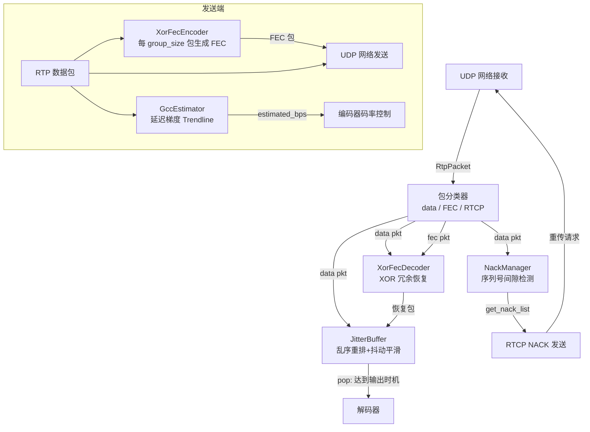
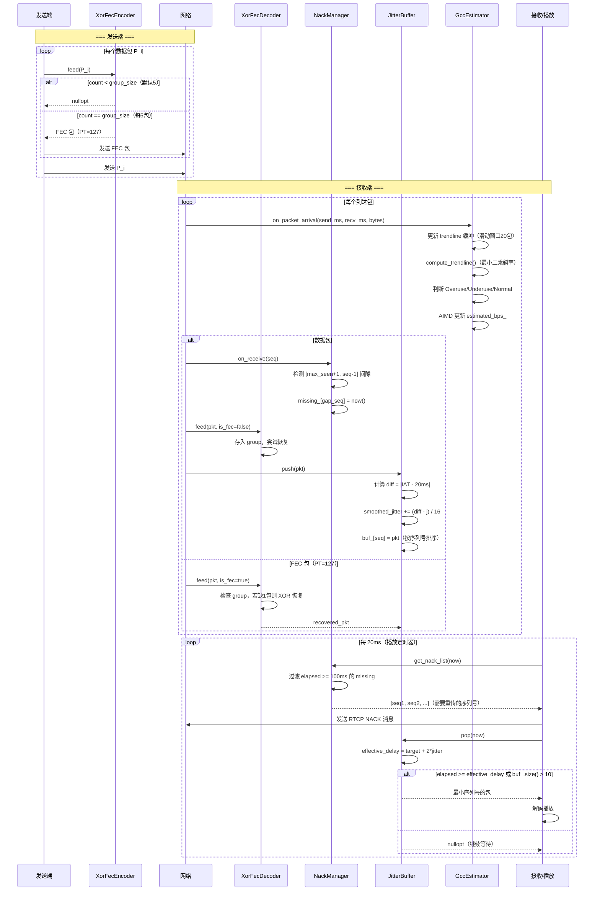

# module08_weak_network — 弱网对抗：JitterBuffer / FEC / NACK / GCC

## 1. 模块目的与协议背景

### 1.1 模块目的

实时音视频通话运行在公共互联网上，而互联网本质上是"尽力而为"（best-effort）的网络，不提供任何服务质量保证。本模块实现四个互补的弱网对抗组件：

| 组件 | 应对的网络问题 | 核心机制 |
|------|--------------|---------|
| `JitterBuffer` | 抖动（乱序到达、间歇延迟） | EMA 平滑 + 自适应输出延迟 |
| `XorFecEncoder/Decoder` | 随机丢包（< 20%） | XOR 冗余包恢复 |
| `NackManager` | 偶发丢包（RTT 可接受） | 序列号间隙检测 + 重传请求 |
| `GccEstimator` | 网络拥塞 | 延迟梯度 Trendline + AIMD |

四者形成分层防御：GCC 主动避免拥塞，FEC 快速恢复少量丢包，NACK 补偿 FEC 恢复不了的丢包，JitterBuffer 平滑剩余的时间抖动。

### 1.2 弱网挑战的四类问题

**丢包（Packet Loss）**：网络设备缓冲区溢出时丢弃 UDP 包。视频层面：P 帧丢失导致后续所有参考该帧的 P 帧解码失败，直到下一个 IDR 帧（花屏可能持续数秒）。音频层面：单包丢失导致约 20ms 静音，通常可被 PLC（丢包补偿）掩盖。

**延迟（Latency）**：端到端传播延迟。对于 RTC 而言，单向延迟 < 150ms 体验良好，> 300ms 明显感到"对话碰撞"（ITU-T G.114 建议）。

**抖动（Jitter）**：连续包的到达时间间隔不均匀。即使平均延迟低，高抖动也会导致播放时出现卡顿（某些帧太晚到达，播放时刻已过）。JitterBuffer 专门对抗这一问题。

**乱序（Out-of-order）**：包到达顺序与发送顺序不同。JitterBuffer 的 `std::map<uint16_t, RtpPacket>` 用序列号作 key，自动重排。

### 1.3 协议背景

- **FEC**：RFC 5109（RTP Payload Format for Generic Forward Error Correction），本模块实现简化版 XOR-FEC。
- **NACK**：RFC 4585（RTCP-Based Feedback），通过 RTCP PLI/NACK 消息请求重传。
- **GCC**：Google Congestion Control，WebRTC 核心带宽估算算法，基于 IETF RMCAT 工作组草案（draft-ietf-rmcat-gcc）。
- **JitterBuffer**：RFC 3550 附录 A.8 定义了抖动估算公式，本模块基于此扩展为自适应输出策略。

---

## 2. 架构图



---

## 3. 关键类与文件表

| 文件路径 | 类 | 职责说明 |
|---------|-----|---------|
| `include/weak/jitter_buffer.h` | `JitterBuffer` | 乱序重排缓冲 + EMA 抖动估算 + 自适应输出 |
| `include/weak/fec.h` | `XorFecEncoder` | 每 group_size 包生成 XOR 冗余包 |
| `include/weak/fec.h` | `XorFecDecoder` | 当 group 缺 1 包且有 FEC 时恢复 |
| `include/weak/nack_manager.h` | `NackManager` | 检测序列号间隙，100ms 超时后生成 NACK 列表 |
| `include/weak/gcc_estimator.h` | `GccEstimator` | 延迟梯度 Trendline 线性回归 + AIMD 码率控制 |
| `src/jitter_buffer.cpp` | — | `push()` EMA 更新；`pop()` 自适应输出判断 |
| `src/fec.cpp` | — | 编码器 XOR 累积；解码器 group 管理与 XOR 恢复 |
| `src/nack_manager.cpp` | — | `on_receive()` 间隙检测；`get_nack_list()` 超时过滤 |
| `src/gcc_estimator.cpp` | — | Trendline 最小二乘；状态机；AIMD 更新 |
| `tests/test_fec.cpp` | — | 单次丢包恢复验证（5 包 group，丢第 3 包） |

---

## 4. 核心算法

### 4.1 JitterBuffer 详解

#### 为什么不能直接播放

RTP 包通过 UDP 网络到达接收端时，由于路由器队列的不确定性，相邻包的到达时间间隔（IAT，Inter-Arrival Time）会围绕期望值波动。例如发送端每 20ms 发一包，接收端可能以 5ms/35ms/18ms/22ms 的间隔收到——如果直接按收到的顺序立即播放，则会出现声音卡顿（35ms 间隔时静音 15ms）。

#### 目标延迟的权衡

JitterBuffer 引入一段可控缓冲延迟（target_delay_ms），让接收端"等待"一段时间，使得抖动范围内的包都能在播放时刻前到达。权衡如下：

```
目标延迟越大 → 缓冲区越大 → 抖动容忍度越高 → 端到端延迟越大
目标延迟越小 → 缓冲区越小 → 抖动容忍度越低 → 延迟低但容易卡顿

典型值：
  音频通话：50-100ms（对延迟敏感，对卡顿容忍度稍高）
  视频通话：100-200ms（视频帧更大，抖动更明显）
  直播场景：500-3000ms（延迟不敏感，要求绝对流畅）
```

#### EMA 抖动估算（RFC 3550 §A.8）

```cpp
// push() 中的抖动估算
double diff = std::abs(delta - 20.0);  // 20ms 是期望到达间隔（50fps → 20ms/包）
smoothed_jitter_ms_ += (diff - smoothed_jitter_ms_) / 16.0;
```

这是 RFC 3550 定义的指数移动平均（EMA），α = 1/16 ≈ 0.0625：

```
smoothed_jitter = smoothed_jitter × (1 - 1/16) + diff × (1/16)
               = smoothed_jitter × 15/16 + diff / 16
```

α = 1/16 的含义：新样本权重约 6.25%，历史均值权重约 93.75%。较小的 α 使估算值平滑、响应慢；较大的 α 响应快但噪声大。1/16 是实时媒体领域的经验值。

#### 输出时机判断

```cpp
// pop() 中的输出条件
int effective_delay = target_delay_ms_ + static_cast<int>(smoothed_jitter_ms_ * 2);
if (elapsed >= static_cast<double>(effective_delay) || buf_.size() > 10) {
    // 输出序列号最小的包（buf_ 是 map，begin() 即最小 seq）
}
```

**`effective_delay = target_delay + 2 × smoothed_jitter` 的推导**：

- `smoothed_jitter` 是抖动的期望值（EMA 平均）
- 实际抖动服从某分布，99.7% 的样本在 3σ 内（若近似正态）
- 使用 2× 作为安全系数（覆盖约 95% 的场景），在保守性和延迟之间取平衡
- 当网络抖动增大时，`effective_delay` 自动增大，减少丢帧；当抖动减小时自动收缩，降低延迟
- `buf_.size() > 10` 是保护条款：防止缓冲区无限增长（网络长时间拥塞时强制输出）

### 4.2 XOR-FEC 数学原理

#### XOR 的可逆性

对于任意字节序列 A 和 B，XOR 满足：
```
A ⊕ B = C
C ⊕ B = A    （已知 C 和 B，可恢复 A）
C ⊕ A = B    （已知 C 和 A，可恢复 B）
```

对 N 个包做 XOR：`F = P1 ⊕ P2 ⊕ ... ⊕ PN`

若 N-1 个包和 F 已知，可以恢复任意一个丢失的包：
```
P_missing = F ⊕ P1 ⊕ P2 ⊕ ... ⊕ P(N-1)（跳过 missing 的那个）
```

这是 1-冗余包覆盖 1-丢失包的数学保证。

#### 编码器实现

```
输入: N 个 RTP 包（一个 group）

初始化: xor_buf = P1.payload（第一个包时直接赋值）
后续包: xor_buf[i] ^= P_k.payload[i]（逐字节 XOR）
       若 P_k.payload 比 xor_buf 短，xor_buf 末尾保持不变

完成: 构造 FEC 包
  PT = 127（FEC 专用 payload type）
  timestamp = base_seq（标识这个 group 的起始序列号）
  SSRC = 0xFEC00000（区分 FEC 流与数据流）
  payload = xor_buf
```

#### 解码器 group 管理

```
数据包到达:
  base_seq = (pkt.seq / group_size) * group_size   // 向下对齐
  idx = pkt.seq - base_seq                          // 组内偏移 [0, group_size-1]
  groups[base_seq].pkts[idx] = pkt
  groups[base_seq].received++

FEC 包到达:
  base_seq = pkt.timestamp & 0xFFFF                 // 编码端存入的 base_seq
  groups[base_seq].fec = pkt

恢复尝试（每次 feed 后遍历）:
  FOR 每个 group g:
    IF g.fec.has_value() AND g 中恰好缺 1 个包:
      recovered = g.fec.payload
      FOR i IN [0, group_size-1] IF i != missing_idx:
        recovered[j] ^= g.pkts[i].payload[j]    // 逐字节 XOR
      rec_seq = base_seq + missing_idx
      构造并返回恢复包
      清理 group
```

#### FEC 开销与局限

- **带宽开销**：`group_size=5` 时每 5 个数据包发 1 个 FEC 包，额外开销 = 1/5 = 20%。
- **恢复条件**：**一个 group 内只能恢复 1 个丢失包**。若同一 group 的两个包同时丢失，无法恢复。
- **连续丢包的致命弱点**：若连续两个相邻包（如 seq=3 和 seq=4）都丢失，且它们属于同一 group（group_size=5，base=0），则 missing_cnt=2，无法恢复。实际网络中"突发丢包"（burst loss）往往连续丢 2-5 个包，XOR-FEC 对此无能为力。真正工业级方案会使用二维 FEC（行 FEC + 列 FEC）或 Reed-Solomon 码。

### 4.3 NACK 机制详解

#### 序列号间隙检测

```
on_receive(seq):
  IF seq > max_seen_（使用 seq_gt 回绕安全比较）:
    FOR s IN [max_seen_+1, seq-1]:  // 新出现的间隙
      IF s NOT IN received_:
        missing_[s] = now()         // 记录首次发现时间
    max_seen_ = seq
  IF seq IN missing_:               // 迟到的包终于到了
    missing_.erase(seq)
```

#### 为什么等 100ms 才发 NACK

直接在检测到间隙时立即发 NACK 是错误的：

1. **乱序**：seq=10 到达，seq=9 还在路上，可能几毫秒后就到了。若立即发 NACK，会造成不必要的重传（浪费带宽）和虚假延迟。
2. **RFC 4585 建议**：等待足够时间（通常 1-2 个包间隔，约 20-40ms）确认包是真正丢失而非乱序。
3. **本模块选择 100ms**：比较保守，主要考虑 RTT 通常在 50-100ms 范围，等待 100ms 确认丢失后立即发 NACK，重传包在约 200ms 后到达，仍在许多缓冲区的容限内。

```cpp
// nack_manager.cpp — get_nack_list()
constexpr int NACK_TIMEOUT_MS = 100;
for (auto& [seq, first_seen] : missing_) {
    auto elapsed_ms = duration_cast<milliseconds>(now - first_seen).count();
    if (elapsed_ms >= NACK_TIMEOUT_MS) {
        result.push_back(seq);  // 超过 100ms 还没到，确认为丢包，请求重传
    }
}
```

#### 发送端重传缓冲

NACK 要求发送端保留已发送包的副本。典型实现维护一个循环缓冲区（最多 200 个包）：

```
发送时: retransmit_buffer[seq % 200] = pkt（保留副本）
收到 NACK(seq):
  IF seq 在缓冲区内且未超时: 重发 retransmit_buffer[seq % 200]
  ELSE: 忽略（包已超出保留范围，无法重传）
```

本模块只实现接收端的 NackManager（生成 NACK 列表），发送端重传缓冲需在更上层实现。

#### NACK vs FEC 的互补关系

| 特性 | FEC | NACK |
|------|-----|------|
| 恢复延迟 | 0（冗余包同时发送） | RTT（需要往返一次） |
| 额外带宽 | 固定（20%@group=5） | 按需（只重传丢失包） |
| 适用场景 | RTT 较高时（> 100ms） | RTT 较低时（< 100ms） |
| 连续丢包 | 无法恢复 | 可以恢复（每个都请求） |
| 实时性 | 高（无额外往返） | 低（等待 RTT） |

最佳实践：低 RTT（< 50ms）的局域网优先用 NACK；高 RTT（> 100ms）的跨国链路优先用 FEC；两者结合可获得更强鲁棒性。

### 4.4 GCC 带宽估算详解

#### 延迟梯度的定义

**单向延迟（One-Way Delay，OWD）**：`delay = recv_time - send_time`

注意：由于发送端和接收端时钟不同步，OWD 的绝对值是无意义的（可能是负数）。有意义的是 OWD 的**变化量**（梯度），即两个相邻包之间的 OWD 差值：

```
d(t) = OWD(t) - OWD(t-1)
     = (recv_t - send_t) - (recv_{t-1} - send_{t-1})
     = (recv_t - recv_{t-1}) - (send_t - send_{t-1})
     = arrival_delta - send_delta
```

如果路由器队列正在积累（拥塞），arrival_delta > send_delta，d(t) > 0，即延迟梯度为正，表示网络正在过载。

#### Trendline 过滤（线性回归）

单个 d(t) 样本噪声很大（路由器处理抖动、测量误差），不能直接用于决策。Trendline 过滤器维护最近 N 个样本，用最小二乘线性回归计算延迟梯度的趋势斜率：

```
样本: (x_i, y_i) = (包序号 i, OWD(i))，保留最近 20 个

线性回归斜率:
  slope = Σ((x_i - x̄)(y_i - ȳ)) / Σ((x_i - x̄)²)

含义:
  slope > 0  → OWD 随时间递增 → 队列积累 → Overuse
  slope < 0  → OWD 随时间递减 → 队列在排空 → Underuse
  slope ≈ 0  → OWD 稳定 → 正常状态
```

使用 20 个样本窗口（约 400ms @ 50pps），能过滤短期噪声，同时对持续拥塞在几秒内作出响应。

#### 状态机

```
         slope > 0.5ms/pkt
Normal ─────────────────────→ Overuse
  ↑                              │
  │  slope ∈ [-0.5, 0.5]         │ 乘性减 × 0.85
  │                              ↓
  └──────────── Normal ←── Overuse 解除
  ↓
  slope < -0.5ms/pkt
Underuse（加性增 +100kbps/次）
```

#### AIMD 码率控制

```cpp
if (state_ == State::Overuse && prev_state != State::Overuse) {
    // Multiplicative Decrease（乘性减）：激进地降低码率
    // 0.85 = 降低 15%，与 TCP 的 0.5 相比更温和，避免视频质量剧烈波动
    estimated_bps_ = static_cast<int64_t>(estimated_bps_ * 0.85);
    if (estimated_bps_ < 50'000) estimated_bps_ = 50'000;  // 最低 50kbps
} else if (state_ == State::Normal || state_ == State::Underuse) {
    // Additive Increase（加性增）：保守地探测可用带宽
    // +100kbps/次，调用方每 100ms 调用一次 → 每秒增加 1Mbps
    estimated_bps_ += 100'000;
}
```

AIMD 的名称来自 Additive Increase Multiplicative Decrease：加性增保证慢慢探测带宽上限，乘性减保证快速退出拥塞，这是 TCP 拥塞控制的经典策略，GCC 将其适配到视频实时场景。

#### 为什么不用丢包率估算带宽

丢包是**滞后指标**：包丢失意味着路由器缓冲区已经溢出，拥塞已经严重发生。此时再降低码率是"亡羊补牢"，用户已经遭受了花屏。

延迟梯度是**前瞻性指标**：队列开始积累时（缓冲区还没满），OWD 就开始上升，可以在丢包发生前就降低码率。这是 GCC 相对于基于丢包的拥塞控制（如 TFRC）的核心优势。

---

## 5. 调用时序图



---

## 6. 关键代码片段

### 6.1 JitterBuffer EMA 抖动估算与自适应输出

```cpp
// src/jitter_buffer.cpp — push()

if (started_) {
    // delta: 距上一个包的到达时间间隔（毫秒）
    auto delta = std::chrono::duration<double, std::milli>(now - last_arrival_).count();

    // diff: 实际间隔与期望间隔（20ms）的偏差绝对值
    // 取绝对值是因为我们关心抖动的幅度，不关心方向（早到/晚到同样影响播放）
    double diff = std::abs(delta - 20.0);

    // RFC 3550 §A.8 的 EMA 公式，α = 1/16
    // 等价: smoothed = 0.9375 * smoothed + 0.0625 * diff
    // 平滑系数大 → 历史值权重大 → 平滑但响应慢（适合稳定网络）
    smoothed_jitter_ms_ += (diff - smoothed_jitter_ms_) / 16.0;
}
last_arrival_ = now;
started_ = true;
buf_.emplace(pkt.sequence(), std::move(pkt));  // map 自动按 seq 排序
```

```cpp
// src/jitter_buffer.cpp — pop()

auto elapsed = duration<double, milli>(now - last_arrival_).count();

// 动态调整有效延迟：网络平稳时 effective_delay 收缩，抖动大时扩展
// × 2 为安全系数（覆盖约 95% 的抖动样本）
int effective_delay = target_delay_ms_ + static_cast<int>(smoothed_jitter_ms_ * 2);

// elapsed: 距最后一个包到达已过去多少时间
// 等待足够时间后，说明晚到的包也应该到了，可以安全输出
if (elapsed >= static_cast<double>(effective_delay) || buf_.size() > 10) {
    auto it = buf_.begin();  // begin() = 序列号最小的包（自动乱序重排）
    RtpPacket pkt = std::move(it->second);
    buf_.erase(it);
    return pkt;
}
return std::nullopt;
```

### 6.2 XOR-FEC 编码器：逐字节 XOR 累积

```cpp
// src/fec.cpp — XorFecEncoder::feed()

const uint8_t* payload = pkt.payload();
size_t plen = pkt.payload_size();

if (count_ == 0) {
    base_seq_ = pkt.sequence();
    // 第一包：直接初始化 xor_buf（不能 XOR 空缓冲区）
    xor_buf_.assign(payload, payload + plen);
} else {
    // 后续包：扩展 xor_buf 到最大 payload 长度（短包高位补 0）
    // 这保证了 xor_buf 能覆盖 group 中最长的包
    if (xor_buf_.size() < plen) xor_buf_.resize(plen, 0);
    for (size_t i = 0; i < plen; ++i) {
        xor_buf_[i] ^= payload[i];  // 逐字节 XOR 累积
    }
}
++count_;

if (count_ == group_size_) {
    RtpPacket fec_pkt;
    // timestamp 字段复用为 base_seq，解码端据此找到对应 group
    // 这是一种简化约定，工业实现会用专门的 FEC 头字段
    fec_pkt.build(/*PT=*/127, fec_seq_++,
                  static_cast<uint32_t>(base_seq_),  // 存 base_seq
                  fec_ssrc_,
                  xor_buf_.data(), xor_buf_.size());
    count_ = 0;
    xor_buf_.clear();
    return fec_pkt;  // 到达 group 边界，输出 FEC 包
}
return std::nullopt;  // group 未满，继续累积
```

### 6.3 XOR-FEC 解码器：恢复逻辑

```cpp
// src/fec.cpp — XorFecDecoder::feed() 恢复核心

// 找到 group 中只缺 1 个包的情况
int missing_idx = -1, missing_cnt = 0;
for (int i = 0; i < group_size_; ++i) {
    if (!grp.pkts[i].has_value()) { ++missing_cnt; missing_idx = i; }
}

if (missing_cnt != 1 || missing_idx < 0) { ++it; continue; }

// XOR 恢复：从 FEC 包开始，逐步 XOR 每个已有的数据包
// 数学原理：FEC = P0 ⊕ P1 ⊕ P2 ⊕ P3 ⊕ P4
//          P2_recovered = FEC ⊕ P0 ⊕ P1 ⊕ P3 ⊕ P4
const RtpPacket& fec = grp.fec.value();
std::vector<uint8_t> recovered(fec.payload(), fec.payload() + fec.payload_size());
for (int i = 0; i < group_size_; ++i) {
    if (i == missing_idx) continue;  // 跳过丢失的包
    const RtpPacket& p = grp.pkts[i].value();
    size_t plen = p.payload_size();
    if (recovered.size() < plen) recovered.resize(plen, 0);
    for (size_t j = 0; j < plen; ++j) {
        recovered[j] ^= p.payload()[j];
    }
}

// 从组内其他已知包推断 PT/SSRC/timestamp（不能从 FEC 包获取，FEC 包这些字段含义不同）
uint16_t rec_seq = static_cast<uint16_t>(bs + missing_idx);
RtpPacket rec_pkt;
rec_pkt.build(pt, rec_seq, ts, ssrc, recovered.data(), recovered.size());

it = groups_.erase(it);  // 清理 group，防止内存泄漏
return rec_pkt;
```

### 6.4 NackManager 序列号间隙检测

```cpp
// src/nack_manager.cpp — on_receive()

if (RtpPacket::seq_gt(seq, max_seen_)) {
    // 发现 max_seen_+1 到 seq-1 之间所有序列号的间隙
    uint16_t prev = max_seen_;
    for (uint16_t s = static_cast<uint16_t>(prev + 1); s != seq; ++s) {
        if (received_.find(s) == received_.end()) {
            // 记录首次发现时间：100ms 后若仍未到，才发 NACK
            // 等待原因：包可能只是乱序，还在路上
            missing_[s] = std::chrono::steady_clock::now();
        }
    }
    max_seen_ = seq;
}

// 迟到的包到了：从 missing_ 移除，不再发 NACK
auto it = missing_.find(seq);
if (it != missing_.end()) missing_.erase(it);
```

### 6.5 GCC Trendline 线性回归

```cpp
// src/gcc_estimator.cpp — compute_trendline()

// 最小二乘线性回归斜率
// 样本: (x_i=包序号, y_i=单向延迟ms)，最近 20 个
double sum_x = 0, sum_y = 0;
for (auto& s : trendline_buf_) { sum_x += s.x; sum_y += s.y; }
double mean_x = sum_x / n;
double mean_y = sum_y / n;

double num = 0, den = 0;
for (auto& s : trendline_buf_) {
    double dx = s.x - mean_x;
    double dy = s.y - mean_y;
    num += dx * dy;   // 协方差分子
    den += dx * dx;   // 方差分母
}
// 斜率 = Cov(x,y) / Var(x) = 延迟随时间的变化率（ms/包）
return (std::abs(den) < 1e-9) ? 0.0 : num / den;
```

---

## 7. 设计决策

### 7.1 JitterBuffer 使用 map 而非环形缓冲区

`std::map<uint16_t, RtpPacket>` 自动按序列号排序，`begin()` 始终是最小序列号的包，乱序重排是天然的。代价是每次插入 O(log n)，但缓冲区通常 < 100 包，性能完全足够。环形缓冲区插入 O(1)，但实现乱序重排需要额外维护排序状态，代码复杂度高。

### 7.2 FEC base_seq 通过 timestamp 字段携带

编码端将 `base_seq` 存入 FEC 包的 `timestamp` 字段（截取低 16 位），解码端读取 `pkt.timestamp() & 0xFFFF` 来识别 group。这是一种简化约定，利用了 FEC 包的 timestamp 字段在数据语义上没有实际用途的特点。工业实现（RFC 5109）会使用专门的 FEC 头，但教学项目这样做代码更简洁。

### 7.3 NACK 超时设为 100ms 而非更短

100ms 的超时设计考量：
- 一般 RTT < 50ms 时，乱序包通常在 10-20ms 内就到了，100ms 绝对不会误报。
- RTT 50-100ms 的情况，100ms 超时后发 NACK，重传包在 RTT 后到达（共约 150-200ms），仍在典型 JitterBuffer 容限内。
- 若超时过短（如 30ms），高 RTT 场景下乱序包还没到就发了 NACK，造成不必要的重传（带宽浪费，发送端缓冲压力增大）。

### 7.4 GCC 斜率阈值选择 ±0.5ms/pkt

`OVERUSE_THRESH = 0.5ms/pkt`：在 50pps（50 包/秒）的流中，0.5ms/包意味着每秒 OWD 增加 25ms，约 4 秒后缓冲区满（典型路由器 100ms 缓冲），这留出了足够的反应时间。若阈值过低（如 0.1），噪声触发误判；若过高（如 2.0），响应太慢，丢包已发生才降码率。

### 7.5 AIMD 参数选择：×0.85 vs +100kbps

- **乘性减 0.85（降低 15%）**：TCP 通常用 0.5（降低 50%），视频通话不能接受如此剧烈的质量波动，0.85 是经验值，能较快消除拥塞同时保持画质稳定。
- **加性增 +100kbps/次**：调用方每 100ms 调用一次，即每秒增加 1Mbps。从 1Mbps 开始，10 秒后探测到 2Mbps 上限，这个收敛速度在视频会议场景是合理的。

---

## 8. 常见坑

### 坑 1：JitterBuffer 的 elapsed 计算基于"最后一个包的到达时间"

`elapsed = now - last_arrival_`，这是距最后一个包到达的时间。这意味着：若持续有包到达（last_arrival_ 不断更新），elapsed 始终很小，`pop()` 永远不会输出——除非通过 `buf_.size() > 10` 强制输出。在单元测试中验证输出时机时，必须在 `push()` 后显式 sleep 超过 `effective_delay` 毫秒，否则 `pop()` 一定返回 `nullopt`。

### 坑 2：XOR-FEC 不能处理 payload 长度不同的包

当 group 内各包 payload 长度不同时，`xor_buf_` 会扩展到最大长度，较短包的高位用 0 填充后参与 XOR。恢复出的包长度等于 `xor_buf_.size()`（最大长度），而原始丢失包可能更短。本模块未存储原始长度信息，恢复包末尾可能有多余的 0 字节。工业实现需在 FEC 包头中记录每个原始包的长度。

### 坑 3：FEC 解码器中 base_seq 计算依赖 group_size 对齐

解码端通过 `base_seq = (seq / group_size) * group_size` 计算 group 起点。这要求编解码两端使用**完全相同**的 group_size，且序列号从 0 开始严格对齐。若发送端在中途改变 group_size，或序列号不从 0 开始（如从 1000 开始，1000 % 5 = 0 没问题，但若从 1001 开始则第一个 group 的 base 计算错误）。

### 坑 4：NackManager 使用 seq_gt 回绕安全比较

序列号是 `uint16_t`，在 65535 → 0 处回绕。直接用 `seq > max_seen_` 在回绕点附近会失效（0 < 65535 在算术上为真，但序号 0 其实比 65535 "新"）。代码用 `RtpPacket::seq_gt(seq, max_seen_)` 做回绕安全比较，等价于 `(int16_t)(seq - max_seen_) > 0`。若忘记这个比较，会在序列号回绕时导致 `max_seen_` 不更新，大量包被误标为 missing。

### 坑 5：GCC 时钟同步假设

`on_packet_arrival(send_time_ms, recv_time_ms, ...)` 中，`delay = recv_time_ms - send_time_ms`。这要求发送端的时钟（send_time_ms）与接收端的时钟（recv_time_ms）单调且相对稳定。实际中时钟偏移（clock skew）会引入系统性误差。工业 GCC 实现会用 RTCP SR 中的 NTP 时间戳做时钟同步校正，或使用 **inter-arrival jitter** 代替绝对延迟。

### 坑 6：FEC group 内存不回收

`XorFecDecoder::groups_` 是 `std::map`，成功恢复后通过 `groups_.erase(it)` 清理。但若某个 group 缺失 >= 2 个包（无法恢复），或 FEC 包从未到达，对应 group 会永久留在 map 中占用内存。生产实现需要基于序列号的过期清理：若 group 的 base_seq 距 max_seen 超过 2 倍 group_size，强制丢弃。

### 坑 7：NACK missing_ 不清理已超时的间隙

`missing_` map 持续积累。如果丢失的包始终未到达（网络持续丢包），这些序列号会永久留在 missing_，每次 `get_nack_list()` 都重复返回，导致无限重传请求（NACK 风暴）。生产实现应在首次发 NACK 后记录发送时间，若超过 `max_nack_retries × RTT` 仍未恢复，则放弃并标记丢包。

### 坑 8：GccEstimator trendline x 坐标每次重编号有偏差

```cpp
for (size_t i = 0; i < trendline_buf_.size(); ++i) {
    trendline_buf_[i].x = static_cast<double>(i);
}
```

滑动窗口移除最老样本后，将所有 x 重置为 [0, N-1]，这使得 x 轴含义从"绝对包序号"变成了"窗口内相对序号"。线性回归的斜率仍然正确（代表窗口内 OWD 的变化率），但若需要跨窗口的长期趋势分析，需要保留绝对时间轴。

---

## 9. 测试覆盖说明

测试文件：`tests/test_fec.cpp`，使用 Google Test 框架，1 个核心测试用例。

### TEST(XorFec, RecoverOneLoss)

**测试场景**：构造 5 个 RTP 数据包（payload 各为 1/2/3/4/5 填充的 20 字节），通过 `XorFecEncoder(5)` 编码，在第 5 包时获得 FEC 包。然后模拟丢失第 3 个包（index=2，seq=2），喂入其余 4 个数据包 + FEC 包给 `XorFecDecoder`，期望恢复的包 payload 与原始 `data_pkts[2]` 完全相同。

**覆盖的关键路径**：
1. 编码器的 5 包 XOR 累积逻辑
2. FEC 包的 PT/timestamp/SSRC 字段设置
3. 解码器的 group 识别（通过 FEC.timestamp 获取 base_seq）
4. 解码器的 missing_cnt == 1 判断
5. XOR 恢复的字节级正确性（memcmp 验证）
6. group 清理（groups_.erase 防止内存泄漏）

**验证方式**：
```cpp
ASSERT_TRUE(fec_pkt.has_value());          // FEC 包在第5包时生成
ASSERT_TRUE(recovered.has_value());        // 成功恢复
ASSERT_EQ(recovered->payload_size(), data_pkts[2].payload_size());
EXPECT_EQ(memcmp(recovered->payload(), data_pkts[2].payload(), size), 0);
```

### 未覆盖场景（待补充）

| 缺失测试 | 描述 |
|---------|------|
| JitterBuffer 自适应延迟 | 模拟高抖动网络，验证 effective_delay 动态增大 |
| NackManager 100ms 超时 | 注入间隙，sleep 100ms 后验证 get_nack_list 非空 |
| NackManager 乱序不误报 | 注入 seq 乱序到达，验证 100ms 内 NACK 列表为空 |
| FEC 连续两包丢失 | group 内丢 2 包，验证无法恢复（missing_cnt=2） |
| GCC Overuse 降码率 | 喂入递增延迟样本，验证 estimated_bps 降低 15% |
| GCC Underuse 升码率 | 喂入递减延迟样本，验证 estimated_bps 增加 |
| seq 回绕边界 | NackManager 在 65535→0 回绕时不产生误报 |

---

## 10. 构建与运行

### 依赖

本模块无额外系统依赖，所有依赖通过项目内共享头文件提供（`rtp/rtp_packet.h`，`rtp/rtcp_packet.h`）。

### 编译

```bash
# 在 cpp_meet 根目录
CXX=g++-10 CC=gcc-10 cmake -B build -DCMAKE_BUILD_TYPE=Debug
cmake --build build -j$(nproc)
```

### 运行测试

```bash
cd build

# 方式一：通过 ctest 过滤
ctest --output-on-failure -R module08

# 方式二：直接运行测试二进制
./module08_weak_network/tests/test_module08_weak_network

# 启用详细输出
./module08_weak_network/tests/test_module08_weak_network --gtest_verbose
```

### 手动验证 FEC

```bash
# 通过 gdb 单步调试 FEC 恢复过程
gdb ./module08_weak_network/tests/test_module08_weak_network
(gdb) break XorFecDecoder::feed
(gdb) run --gtest_filter="XorFec.RecoverOneLoss"
```

### 使用 AddressSanitizer 检测内存问题

```bash
CXX=g++-10 CC=gcc-10 cmake -B build \
    -DCMAKE_CXX_FLAGS="-fsanitize=address,undefined" \
    -DCMAKE_BUILD_TYPE=Debug
cmake --build build -j$(nproc)
./build/module08_weak_network/tests/test_module08_weak_network
```

---

## 11. 延伸阅读

- **RFC 3550** — RTP: A Transport Protocol for Real-Time Applications
  https://datatracker.ietf.org/doc/html/rfc3550
  （附录 A.8 定义抖动估算 EMA 公式，JitterBuffer 的理论基础）

- **RFC 4585** — Extended RTP Profile for RTCP-based Feedback (RTP/AVPF)
  https://datatracker.ietf.org/doc/html/rfc4585
  （NACK 消息格式、发送时机的权威规范）

- **RFC 5109** — RTP Payload Format for Generic Forward Error Correction
  https://datatracker.ietf.org/doc/html/rfc5109
  （工业级 FEC 格式，包含多包恢复、FEC 头字段定义）

- **draft-ietf-rmcat-gcc** — A Google Congestion Control Algorithm for Real-Time Communication
  https://datatracker.ietf.org/doc/html/draft-ietf-rmcat-gcc
  （GCC 的官方算法描述，包含 Trendline 和 AIMD 的完整规范）

- **WebRTC 源码：GCC 实现**
  `modules/congestion_controller/goog_cc/` — 工业级 GCC 实现
  `modules/congestion_controller/goog_cc/trendline_estimator.cc` — Trendline 核心

- **WebRTC 源码：NACK 实现**
  `modules/rtp_rtcp/source/nack_rtx_handler.cc`

- **"Analysis of the Google Congestion Control for Real-time Multimedia"** — SIGCOMM workshop
  （对 GCC 算法的实测分析，包含与 CUBIC、BBR 的对比）

- **QUIC DATAGRAM (RFC 9221) + WebTransport**
  新一代低延迟传输方案，可替代 RTP/RTCP，JitterBuffer 和拥塞控制概念仍适用

- **Reed-Solomon 纠错码**
  https://en.wikipedia.org/wiki/Reed–Solomon_error_correction
  （XOR-FEC 的升级版，可恢复多个丢失包，用于 RAID、QR 码）

- **"Computer Networks: A Systems Approach"** — Peterson & Davie
  第 6 章（拥塞控制）对 AIMD 有系统性的理论推导，是理解 GCC 设计哲学的必读背景
