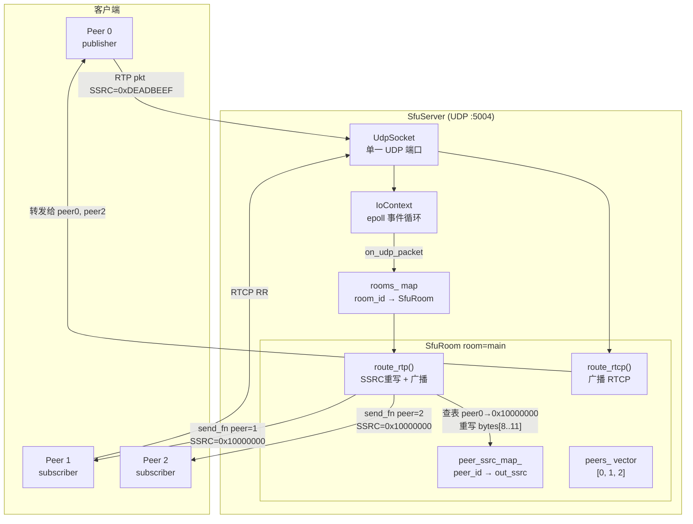
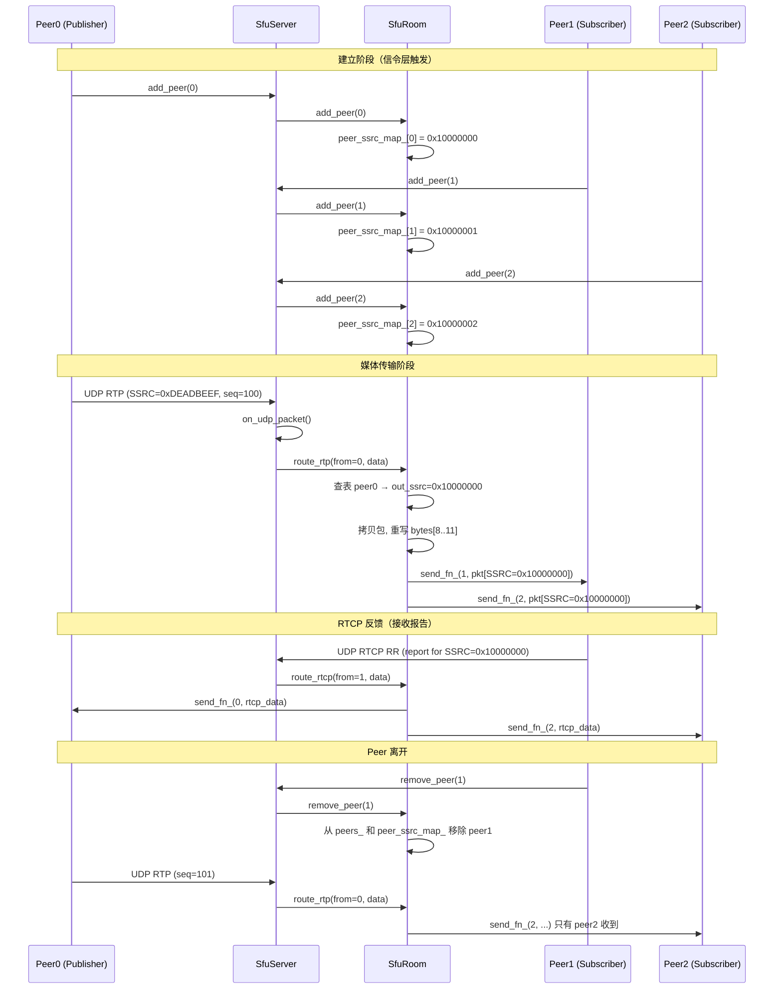

# module09_sfu — Selective Forwarding Unit（选择性转发单元）

---

## 1. 模块目的与背景

实时多人音视频会议系统中，多端互联的媒体路由架构是核心挑战。随着参与者数量增加，
P2P 全连接的带宽开销呈指数级上升，而 MCU 的集中转码又带来极高的服务器 CPU 压力。
SFU（Selective Forwarding Unit）在两者之间取得了工程实践中最优的平衡点。

### 三种多人媒体架构对比

| 维度 | P2P（全连接） | MCU（混流） | SFU（选择转发） |
|------|--------------|------------|----------------|
| 延迟 | 最低（直连） | 最高（混流额外编解码） | 低（单跳转发） |
| 服务器 CPU | 无 | 极高（N路解码 + 1路编码） | 低（仅复制转发） |
| 客户端上行带宽 | N-1 路 | 1 路 | 1 路 |
| 客户端下行带宽 | N-1 路独立流 | 1 路混流 | N-1 路独立流 |
| 适用人数 | ≤4人 | 任意（服务端扛） | 2~100人（推荐） |
| 服务端是否解码 | N/A | 是 | 否 |
| 实现复杂度 | 简单 | 复杂（编解码、混音） | 中等 |

### 为什么 SFU 不解码？

SFU 的核心价值在于：**只转发，不解码**。每路 RTP 包到达 SFU 后，SFU 只做：

1. 校验包头合法性（length >= 12 字节）
2. 重写 SSRC 字段（防止下游 SSRC 冲突）
3. 将包复制投递给房间内其他所有 peer 的发送队列

全程不涉及 VP8/H.264/Opus 解码，CPU 消耗近乎为零（相比 MCU 可低 10~100 倍）。
这也意味着 SFU 对编码格式无感知，天然支持任意 codec，无需随 codec 演进而升级服务端。

### SRTP 重加密问题（完整方案说明）

虽然本模块以明文 RTP 实现（教学简化），生产环境需要处理 SRTP 重加密：

```
Publisher                     SFU                      Subscriber
   |                           |                            |
   |-- SRTP (pub_key) -------> |                            |
   |                           | 用 pub_key 解密            |
   |                           | 得到明文 RTP               |
   |                           | 用 sub_key 重新加密        |
   |                           |-- SRTP (sub_key) -------> |
```

- 每个 peer 与 SFU 之间独立完成 DTLS 握手，各有一套独立的 SRTP 密钥
- SFU 对每一路入流使用 publisher 的密钥解密，得到明文 RTP
- 对每一路出流使用目标 subscriber 的密钥重新加密
- 不同 subscriber 收到的是用各自密钥加密的独立副本
- 本模块简化：省略 DTLS/SRTP，明文路由，实际需结合 module04 的 SRTP 实现

本模块的学习目标是掌握 SFU 的**路由逻辑**（SSRC 重写、peer 管理、房间隔离），
加密部分留待与 module04 集成时完善。

### SSRC 重写的必要性

SSRC（Synchronization Source）是 RTP 头中标识媒体流来源的 32 位字段。
多人会议中，若直接透传各 peer 自己的 SSRC，subscriber 可能同时收到来自
不同 publisher 但 SSRC 相同的包，导致：

- 接收端 jitter buffer 将两路流视为同一流，产生播放跳变
- RTCP 统计（丢包率、jitter）发生混淆
- RFC 3550 要求 SSRC 在一个 RTP 会话中唯一

SFU 为每个 publisher 分配全局唯一的出口 SSRC，重写后再转发，彻底解决冲突。

---

## 2. 架构图



---

## 3. 关键类与文件表

| 文件 | 类 / 函数 | 职责 |
|------|----------|------|
| `include/sfu/sfu_room.h` | `SfuRoom` | 单个会议房间：peer 管理、RTP 路由、SSRC 重写 |
| `include/sfu/sfu_server.h` | `SfuServer` | 服务器入口：UDP 监听、多房间管理 |
| `src/sfu_room.cpp` | `SfuRoom::add_peer` | 注册 peer，分配出口 SSRC |
| `src/sfu_room.cpp` | `SfuRoom::remove_peer` | 注销 peer，清理映射 |
| `src/sfu_room.cpp` | `SfuRoom::route_rtp` | SSRC 重写，广播给其他 peer |
| `src/sfu_room.cpp` | `SfuRoom::route_rtcp` | RTCP 广播转发（简化版） |
| `src/sfu_server.cpp` | `SfuServer::start` | epoll 注册 UDP socket，启动 io_thread |
| `src/sfu_server.cpp` | `SfuServer::get_or_create_room` | 按 room_id 懒创建 SfuRoom |
| `src/sfu_server.cpp` | `SfuServer::on_udp_packet` | UDP 包分发入口（框架，TODO 路由协议） |
| `tests/test_sfu_room.cpp` | `RoutingToOtherPeers` | 验证转发不回环给发送者 |
| `tests/test_sfu_room.cpp` | `SsrcRewrite` | 验证 SSRC 字段被正确重写为分配值 |
| `tests/test_sfu_room.cpp` | `RemovePeer` | 验证离开房间后不再收到包 |

### 核心数据结构

```
SfuRoom {
    room_id_       : string
    send_fn_       : function(peer_id, data, len) -> void   // 注入的发包回调
    mutex_         : mutex                                   // 保护以下字段
    peer_ssrc_map_ : unordered_map<int, uint32_t>           // peer_id → out_ssrc
    peers_         : vector<int>                             // 按加入顺序排列
    next_ssrc_     : uint32_t = 0x10000000                  // 单调递增的 SSRC 分配器
}

SfuServer {
    udp_port_      : uint16_t
    udp_           : UdpSocket
    io_            : IoContext                               // epoll 事件循环
    io_thread_     : thread                                  // IO 线程
    rooms_mutex_   : mutex
    rooms_         : unordered_map<string, unique_ptr<SfuRoom>>
}
```

---

## 4. 核心算法

### 4.1 peer 注册与 SSRC 分配

```
procedure add_peer(peer_id):
    lock(mutex_)
    if peer_id in peer_ssrc_map_:
        return                          // 幂等：重复注册无副作用
    peer_ssrc_map_[peer_id] = next_ssrc_++
    peers_.append(peer_id)
    unlock(mutex_)

procedure remove_peer(peer_id):
    lock(mutex_)
    peer_ssrc_map_.erase(peer_id)
    peers_.remove(peer_id)              // erase-remove idiom
    unlock(mutex_)
```

### 4.2 RTP 路由主流程（SSRC 重写）

```
procedure route_rtp(from_peer_id, rtp_data, len):
    if len < 12:
        return                          // RTP 固定头最小长度

    lock(mutex_)
    if from_peer_id not in peer_ssrc_map_:
        return                          // 未注册的 peer

    out_ssrc = peer_ssrc_map_[from_peer_id]

    buf = copy(rtp_data[0..len])        // 必须拷贝，同一包要发给多个 peer

    // RTP 固定头布局（RFC 3550）：
    // offset  0: V(2) P(1) X(1) CC(4)
    // offset  1: M(1) PT(7)
    // offset  2: Sequence Number high byte
    // offset  3: Sequence Number low byte
    // offset  4: Timestamp (32-bit big-endian)
    // offset  8: SSRC     (32-bit big-endian)  <-- 重写此处
    buf[8]  = (out_ssrc >> 24) & 0xFF
    buf[9]  = (out_ssrc >> 16) & 0xFF
    buf[10] = (out_ssrc >>  8) & 0xFF
    buf[11] =  out_ssrc        & 0xFF

    for each peer in peers_:
        if peer == from_peer_id:
            continue                    // 不回环
        send_fn_(peer, buf)

    unlock(mutex_)
```

### 4.3 RTCP 路由策略（简化版与完整版对比）

**当前简化实现：**
```
procedure route_rtcp(from_peer_id, rtcp_data, len):
    if len < 4: return
    lock(mutex_)
    for each peer in peers_:
        if peer != from_peer_id:
            send_fn_(peer, rtcp_data)   // 原样广播
    unlock(mutex_)
```

**生产级完整实现应做：**
```
procedure route_rtcp_full(from_peer_id, rtcp_data, len):
    // 解析 RTCP 复合包（可能包含多个 RTCP 子包）
    for each rtcp_packet in parse_compound(rtcp_data):
        pt = rtcp_packet.payload_type

        if pt == SR (200):
            // SR 中的 SSRC 是 publisher 的出口 SSRC
            // 需要保留 SR，发给所有 subscriber（无需转换 SSRC）
            broadcast_to_subscribers(from_peer_id, rtcp_packet)

        elif pt == RR (201):
            // RR 中的 report blocks 引用 out_ssrc
            // 需要：将 out_ssrc 转换为 publisher 原始 SSRC
            //       然后只发给对应的 publisher
            for each report_block in rtcp_packet.report_blocks:
                publisher_id = reverse_ssrc_map_[report_block.ssrc]
                translated = translate_ssrc(report_block, publisher_id)
                send_fn_(publisher_id, translated)
```

### 4.4 完整 SRTP 重加密流程

```
// DTLS 握手完成后
procedure on_dtls_complete(peer_id, dtls_context):
    srtp_key = dtls_context.extract_srtp_keying_material()
    srtp_send_ctx_[peer_id] = SrtpContext(srtp_key, direction=SEND)
    srtp_recv_ctx_[peer_id] = SrtpContext(srtp_key, direction=RECV)

// 收到加密 RTP
procedure route_rtp_encrypted(from_peer_id, srtp_data, len):
    // Step 1: 用 publisher 的 SRTP 上下文解密
    plain_rtp = srtp_recv_ctx_[from_peer_id].unprotect(srtp_data)
    if plain_rtp is None: return    // 认证失败

    // Step 2: 重写 SSRC
    rewrite_ssrc(plain_rtp, peer_ssrc_map_[from_peer_id])

    // Step 3: 对每个 subscriber 用其发送上下文重新加密
    for each peer in peers_:
        if peer == from_peer_id: continue
        encrypted = srtp_send_ctx_[peer].protect(plain_rtp)
        send_fn_(peer, encrypted)
```

### 4.5 Simulcast 分层转发（扩展方案）

```
// Publisher 同时发送 3 个质量层（不同 SSRC）
// SFU 根据 subscriber 的网络状况选择对应层转发

procedure route_simulcast(from_peer_id, rtp_data):
    ssrc = read_ssrc(rtp_data)
    layer_id = ssrc_layer_map_[ssrc]    // 0=高清, 1=中清, 2=低清

    for each subscriber in peers_:
        if subscriber == from_peer_id: continue
        target = bandwidth_estimator_[subscriber].recommended_layer()
        if layer_id == target:
            rewritten = rewrite_ssrc(rtp_data, subscriber_ssrc_map_[from_peer_id][layer_id])
            send_fn_(subscriber, rewritten)
```

---

## 5. 调用时序图



---

## 6. 关键代码片段

### 6.1 SSRC 重写核心实现

```cpp
// src/sfu_room.cpp: route_rtp()
void SfuRoom::route_rtp(int from_peer_id, const uint8_t* rtp_data, size_t len) {
    if (len < kRtpMinLen) return;  // kRtpMinLen = 12，最小 RTP 固定头

    std::lock_guard<std::mutex> lk(mutex_);

    auto it = peer_ssrc_map_.find(from_peer_id);
    if (it == peer_ssrc_map_.end()) return;  // 未注册 peer，丢弃

    uint32_t out_ssrc = it->second;  // 取出预分配的出口 SSRC

    // 必须拷贝：同一个包要转发给多个 peer，不能修改调用方的缓冲区
    // 若省略此拷贝直接修改 rtp_data，第一个 peer 收到正确包后
    // 后续 peer 仍会收到同样被修改的包（幸运的是效果相同），但
    // 若调用方在发送后复用此缓冲区，则存在数据竞争
    std::vector<uint8_t> buf(rtp_data, rtp_data + len);

    // RTP 固定头 bytes[8..11] 是 SSRC，big-endian 32-bit
    buf[8]  = (out_ssrc >> 24) & 0xFF;
    buf[9]  = (out_ssrc >> 16) & 0xFF;
    buf[10] = (out_ssrc >>  8) & 0xFF;
    buf[11] =  out_ssrc        & 0xFF;

    for (int peer : peers_) {
        if (peer == from_peer_id) continue;  // 不回环给发送者
        send_fn_(peer, buf.data(), buf.size());
    }
}
```

### 6.2 SSRC 分配器初始化

```cpp
// include/sfu/sfu_room.h
uint32_t next_ssrc_{0x10000000};
// 从 0x10000000 起递增，原因：
// 1. RFC 3550 要求 SSRC 随机选取，低位空间（0x0~0xFFFF）可能被 peer 自选
// 2. 0x10000000 以上作为 SFU 分配空间，与 peer 随机 SSRC 自然隔离
// 3. uint32_t 空间足够大（约 40 亿），单一服务实例无溢出风险

void SfuRoom::add_peer(int peer_id) {
    std::lock_guard<std::mutex> lk(mutex_);
    if (peer_ssrc_map_.find(peer_id) != peer_ssrc_map_.end())
        return;  // 幂等：信令层可能重复调用
    peer_ssrc_map_[peer_id] = next_ssrc_++;
    peers_.push_back(peer_id);
}
```

### 6.3 epoll 事件驱动的 IO 循环

```cpp
// src/sfu_server.cpp: start()
void SfuServer::start() {
    if (!udp_.bind(udp_port_)) {
        std::cerr << "[SfuServer] Failed to bind UDP port " << udp_port_ << "\n";
        return;
    }

    // 向 epoll 注册 UDP socket 的可读事件
    // Lambda 在 IO 线程中执行，需注意线程安全
    io_.register_fd(udp_.fd(), EPOLLIN, [this](int /*fd*/, uint32_t /*events*/) {
        uint8_t buf[65536];  // 64KB，覆盖最大 UDP payload
        sockaddr_in from{};
        ssize_t n = udp_.recv_from(buf, sizeof(buf), from);
        if (n > 0)
            on_udp_packet(buf, static_cast<size_t>(n), from);
    });

    // 在独立线程运行 epoll_wait 循环，不阻塞主线程
    io_thread_ = std::thread([this]() { io_.run(); });
}
```

### 6.4 单元测试：SSRC 重写验证

```cpp
// tests/test_sfu_room.cpp: SsrcRewrite
TEST(SfuRoom, SsrcRewrite) {
    std::vector<std::vector<uint8_t>> received_pkts;

    SfuRoom room("ssrc_room", [&](int, const uint8_t* data, size_t len) {
        received_pkts.push_back(std::vector<uint8_t>(data, data + len));
    });

    room.add_peer(10);
    room.add_peer(20);

    uint32_t original_ssrc = 0xDEADBEEF;
    auto pkt = make_rtp(original_ssrc, 0x01);
    room.route_rtp(10, pkt.data(), pkt.size());

    ASSERT_EQ(received_pkts.size(), 1u);
    auto& rpkt = received_pkts[0];

    // 从 bytes[8..11] 读出重写后的 SSRC（big-endian）
    uint32_t rewritten_ssrc =
        ((uint32_t)rpkt[8]  << 24) |
        ((uint32_t)rpkt[9]  << 16) |
        ((uint32_t)rpkt[10] <<  8) |
         (uint32_t)rpkt[11];

    // peer10 是第一个注册的 peer，获得 next_ssrc_ 初始值 0x10000000
    EXPECT_EQ(rewritten_ssrc, 0x10000000u);
    EXPECT_NE(rewritten_ssrc, original_ssrc);  // 原始值已被覆盖
}
```

---

## 7. 设计决策

### 7.1 单端口多路复用 vs 每 peer 独立端口

本模块选择**单 UDP 端口**接收所有 peer 的包（与 WebRTC 的 ICE 一致）。
优点：NAT 穿透友好，防火墙只需开放一个端口，运维简单。
代价：需要在协议层区分 peer，生产实现通过 DTLS 的 fingerprint 或信令层
维护 `sockaddr_in → peer_id` 映射。

### 7.2 SendFn 回调注入而非直接持有 Socket

`SfuRoom` 通过构造时注入的 `SendFn` 回调发包，而非直接持有 `UdpSocket`。
这带来的好处：
- 测试中可用 lambda 捕获 `vector` 验证转发行为，无需真实 UDP
- 生产环境在回调中可叠加加密、带宽整形、队列调度等后处理
- `SfuRoom` 本身无 I/O 依赖，纯逻辑，可跨传输层复用

### 7.3 每次 route_rtp 分配独立的 vector

当前实现为每次转发分配一个 `std::vector<uint8_t>` 拷贝。
对 N 路 subscriber 每包分配一次内存。生产优化方向：
- 拷贝一次，用 `shared_ptr<vector<uint8_t>>` 引用计数共享
- 或使用环形缓冲池，避免堆分配
- 或使用 scatter-gather I/O：原包 + SSRC 补丁，内核层合并发送

### 7.4 RTCP 简化广播的取舍

生产级 RTCP 处理需要解析复合包、转换 SSRC 引用、区分 SR/RR/SDES 等。
本模块选择直接广播以聚焦于 RTP 路由的核心机制，避免增加不必要的复杂度。
RTCP 的完整处理是 WebRTC 实现中最繁琐的部分之一。

### 7.5 rooms_ 的生命周期管理

`SfuServer` 用 `unique_ptr<SfuRoom>` 管理房间，懒创建，永不主动销毁。
生产环境需要：
- 监控房间内 peer 数量，全部离开后定时回收空房间
- 防止内存泄漏（长期运行的服务器可能积累数千个空房间）

---

## 8. 常见坑

### 坑 1：未处理 len < 12 直接访问 buf[8..11]

`route_rtp` 对 `len < kRtpMinLen` 有防御检查。若去掉此检查，对短包
（如 RTCP BYE 包被误送入 route_rtp）将产生越界写，触发未定义行为。
RTP 和 RTCP 均使用 UDP 传输，混入同一 socket 时必须在路由前区分类型
（RTP 版本字段 V=2，RTCP PT 范围 200~207）。

### 坑 2：发送者收到自己的包（回环）

`for (int peer : peers_)` 必须跳过 `from_peer_id`。若省略，publisher
会收到自己发出并经 SSRC 重写的包，可能引发：
- 视频解码器收到来路不明的重复帧
- 音频出现回声
- RTCP 统计计算混乱（自己发的包统计为接收）

### 坑 3：remove_peer 后 peer_ssrc_map_ 与 peers_ 不同步

`remove_peer` 必须同时清理两个数据结构。若只清理 `peers_` 而保留
`peer_ssrc_map_`，该 peer 再次加入时 `add_peer` 的幂等检查会认为
已注册，导致新连接无法获得新的 SSRC 分配。
若只清理 `peer_ssrc_map_` 而保留 `peers_`，`route_rtp` 的转发循环
仍会调用 `send_fn_(removed_peer, ...)`，向已断开连接的 peer 发包。

### 坑 4：RTCP SR/RR 中的 SSRC 未做双向转换

当前实现直接广播 RTCP，subscriber 收到 SR 时其 SSRC 字段已是 `out_ssrc`，
这部分是正确的（subscriber 用 `out_ssrc` 来识别这路流）。
但 subscriber 发出的 RR 中引用的也是 `out_ssrc`，publisher 收到后无法
与自己流的原始 SSRC 对应，导致：
- Adaptive Bitrate 算法收不到有效的 RTCP 反馈
- 视频编码器无法根据丢包率调整码率
- 网络状况恶化时无法降质保流

### 坑 5：mutex 持锁期间调用 send_fn_ 引发性能问题或死锁

`route_rtp` 在持有 `mutex_` 期间调用 `send_fn_`，若 `send_fn_` 内部
有阻塞操作（同步 write 系统调用），整个房间的路由将串行化，一个慢
subscriber 会阻塞其他所有人收包。
正确做法：持锁段只复制 peer 列表和构造发送缓冲区，释放锁后异步发包。

### 坑 6：next_ssrc_ 溢出到 0

`next_ssrc_` 是 `uint32_t`，从 `0x10000000` 起递增。虽然溢出需要
约 34 亿次 add_peer 调用，但若 SFU 长期运行且 peer 频繁入离，
溢出后 `next_ssrc_` 变为 0，分配出 SSRC=0 是 RFC 3550 明确禁止的
（保留值，不得作为 SSRC 使用）。生产环境需检测并跳过保留值。

### 坑 7：同一 peer 的多路流共享 SSRC

一个 peer 通常同时发音频和视频两路流，两路 RTP 包的 `from_peer_id` 相同，
但携带不同 PT（payload type）。本模块按 `peer_id` 分配 SSRC，两路流重写后
SSRC 相同。某些 RTP 实现（如浏览器的 WebRTC 栈）要求同一 SSRC 只对应
一个 PT，否则拒绝解码。生产环境需要按 `(peer_id, original_ssrc)` 或
`(peer_id, media_type)` 独立分配出口 SSRC。

---

## 9. 测试覆盖说明

| 测试用例 | 文件位置 | 验证内容 |
|---------|---------|---------|
| `SfuRoom.RoutingToOtherPeers` | `tests/test_sfu_room.cpp:20` | 3 peer 场景：发送者 peer0 不收包；peer1 和 peer2 各收到 1 个包；send_fn 共被调用 2 次 |
| `SfuRoom.SsrcRewrite` | `tests/test_sfu_room.cpp:50` | 发送 SSRC=0xDEADBEEF 的包，接收到的包 bytes[8..11] 被重写为 0x10000000（首个分配的出口 SSRC） |
| `SfuRoom.RemovePeer` | `tests/test_sfu_room.cpp:82` | 3 peer 中移除 peer2，从 peer1 发包后只有 peer3 收到（send_fn 调用 1 次） |

**当前未覆盖的场景（可扩展）：**

- `add_peer` 幂等性：同一 peer_id 重复调用不重复分配 SSRC
- 并发 `route_rtp`：多个 goroutine 同时路由，验证 mutex 正确性
- `route_rtcp` 的广播行为
- 空房间路由：无 peer 时调用 `route_rtp` 不崩溃
- SSRC 边界：next_ssrc_ 溢出时的处理
- `SfuServer` 的 UDP 接收端到端测试（当前 `on_udp_packet` 为 TODO 框架）

---

## 10. 构建与运行

```bash
# 进入 cpp_meet 根目录
cd /home/aoi/AWorkSpace/cpp_meet

# 配置（系统默认 GCC 7 不支持 C++17，必须指定 GCC 10）
CXX=g++-10 CC=gcc-10 cmake -B build -DCMAKE_BUILD_TYPE=Debug

# 构建 module09 测试目标
cmake --build build --target sfu_room_test -j$(nproc)

# 运行测试
cd build && ctest -R SfuRoom -V
# 或直接运行可执行文件
./module09_sfu/sfu_room_test
```

**预期输出：**
```
[==========] Running 3 tests from 1 test suite.
[----------] 3 tests from SfuRoom
[ RUN      ] SfuRoom.RoutingToOtherPeers
[       OK ] SfuRoom.RoutingToOtherPeers (0 ms)
[ RUN      ] SfuRoom.SsrcRewrite
[       OK ] SfuRoom.SsrcRewrite (0 ms)
[ RUN      ] SfuRoom.RemovePeer
[       OK ] SfuRoom.RemovePeer (0 ms)
[----------] 3 tests from SfuRoom (0 ms total)
[==========] 3 tests from 1 test suite ran. (0 ms total)
[  PASSED  ] 3 tests.
```

---

## 11. 延伸阅读

- **RFC 3550** — RTP: A Transport Protocol for Real-Time Applications
  完整定义 RTP/RTCP 包格式、SSRC 冲突检测、SR/RR 结构、复合包规则

- **RFC 3711** — The Secure Real-time Transport Protocol (SRTP)
  SRTP 密钥派生、AES-CTR 加密模式、HMAC-SHA1 完整性认证

- **RFC 5576** — Source-Specific Media Attributes in SDP
  定义 SDP 中 `a=ssrc:` 行格式，信令层如何告知对端各 SSRC 的含义

- **RFC 8829** — JavaScript Session Establishment Protocol (JSEP)
  WebRTC 信令协议，说明 SDP Offer/Answer 如何协商 SSRC 和编解码器

- **draft-ietf-mmusic-sdp-simulcast** — Simulcast SDP 扩展
  说明如何在 SDP 中声明多质量层，SFU 按需选择转发层

- **mediasoup 设计文档** — https://mediasoup.org/documentation/v3/mediasoup/design/
  成熟 SFU 实现，详细描述了 Router/Producer/Consumer 对象模型与 SSRC 管理策略

- **Jitsi Video Bridge 架构** — https://jitsi.github.io/handbook/
  开源 SFU，参考其如何处理多流、Simulcast、SSRC 重映射

- **WebRTC for the Curious** — https://webrtcforthecurious.com
  从协议底层到完整实现的指南，覆盖 ICE、DTLS、SRTP、RTP 全链路
