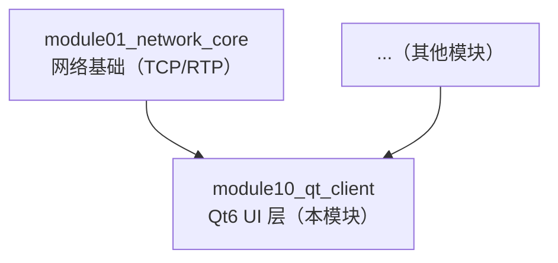
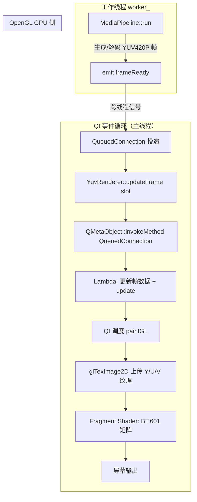
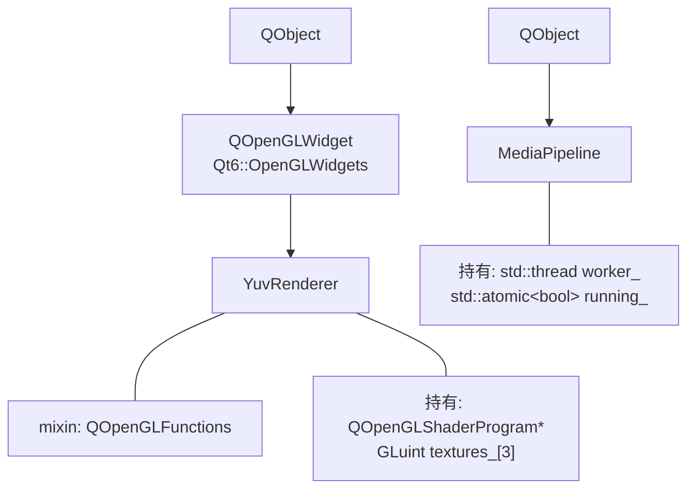
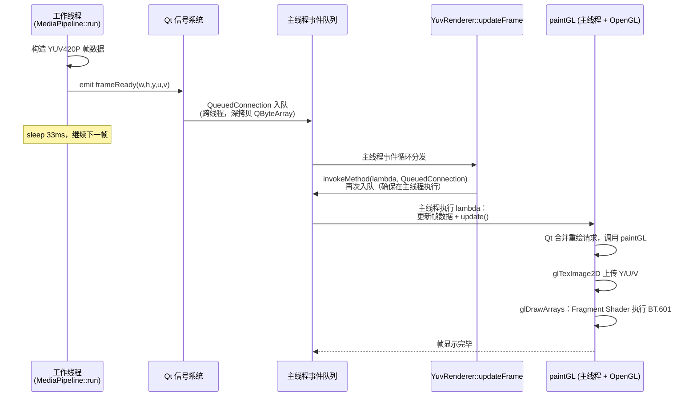

# module10_qt_client — Qt6 OpenGL YUV 视频渲染客户端

## 1. 模块目的与背景

本模块是整个 `cpp_meet` 课程的 UI 展现层，将前面各模块（网络传输、编解码流水线）产生的视频帧在屏幕上实时渲染出来。它回答一个核心问题：**解码器输出的 YUV420P 数据如何以最低 CPU 开销显示到窗口？**

### 为什么解码器输出 YUV 而不是 RGB？

视频编码标准（H.264/H.265/AV1）的设计源头是人眼视觉生理特性：人眼对亮度（Luma）变化的分辨率远高于对色度（Chroma）变化的分辨率。YUV 色彩空间将亮度 Y 与色度 U/V 解耦，YUV420P 格式对 U/V 分量做 2x2 下采样，使每个像素的平均存储开销从 RGB 的 3 字节降至 1.5 字节（节省 50%），同时视觉损失几乎不可感知。

H.264 解码器（libavcodec）的原生输出格式正是 `AV_PIX_FMT_YUV420P`。如果在 CPU 侧把每帧转成 RGB 再送给 OpenGL，对于 1080p 30fps 来说每秒要做 1920×1080×30 = 约 6200 万次矩阵乘法，浪费大量 CPU 资源，且引入额外内存拷贝。

### 为什么在 GPU 上做色彩转换？

GPU 天生适合这类"对每个像素独立执行同一段代码"的任务。Fragment Shader 在千个 shader core 上并行运行，把 BT.601 矩阵乘法的延迟从毫秒级降至微秒级。CPU 侧只需将三块原始 YUV 内存各上传一次，剩下的转换全部在 GPU 完成。

### 模块定位



本模块依赖 `module01_network_core`，在其之上构建媒体处理流水线 `MediaPipeline` 和 OpenGL 渲染器 `YuvRenderer`。

---

## 2. 架构图



关键路径：**解码线程 emit → Qt 事件队列 → slot → invokeMethod → paintGL → GPU**。
整条链路中，唯一触及 OpenGL 上下文的操作在主线程的 `paintGL` 中发生，严格遵守 Qt 的"OpenGL context 只能在持有它的线程使用"规则。

---

## 3. 关键类与文件表

| 文件 | 类 / 符号 | 职责 |
|------|-----------|------|
| `include/qtclient/yuv_renderer.h` | `YuvRenderer` | 继承 `QOpenGLWidget`，管理 3 个 GL 纹理和 GLSL 程序 |
| `include/qtclient/pipeline.h` | `MediaPipeline` | 继承 `QObject`，管理 `std::thread` 工作线程，发射 `frameReady` 信号 |
| `src/yuv_renderer.cpp` | `YuvRenderer::initializeGL` | 创建 shader program 和 3 张 GL_RED 纹理 |
| `src/yuv_renderer.cpp` | `YuvRenderer::paintGL` | 每帧上传纹理 + 绑定 + 绘制全屏四边形 |
| `src/yuv_renderer.cpp` | `YuvRenderer::updateFrame` | 跨线程入口：通过 `invokeMethod` 把帧数据投递到主线程 |
| `src/yuv_renderer.cpp` | `VERTEX_SHADER` | GLSL 330 顶点着色器，传递纹理坐标 |
| `src/yuv_renderer.cpp` | `FRAGMENT_SHADER` | GLSL 330 片段着色器，实现 BT.601 YUV→RGB |
| `src/pipeline.cpp` | `MediaPipeline::run` | 工作线程主循环：生成测试 YUV420P 帧，30fps 节拍 |
| `tests/test_pipeline.cpp` | `StartStop` / `DoubleStop` | 无 UI 环境下的流水线生命周期测试 |
| `CMakeLists.txt` | — | Qt6 检测、AUTOMOC、链接 OpenGLWidgets |

### 类继承关系



---

## 4. 核心算法

### 4.1 BT.601 YUV→RGB 色彩转换推导

**输入约定（studio swing，YUV420P uint8）：**
- Y 范围 [16, 235]，映射到 [0, 1] 归一化后偏移 16/255 ≈ 0.0625
- U、V 范围 [16, 240]，中性值 128，归一化后偏移 0.5

**归一化偏移：**
```
Y' = Y_normalized - 16/255   = Y_normalized - 0.0625
U' = U_normalized - 128/255  ≈ U_normalized - 0.5
V' = V_normalized - 128/255  ≈ V_normalized - 0.5
```

**BT.601 标准矩阵（Rec. 601, studio swing）：**
```
R = 1.164 * Y' + 0.000 * U' + 1.596 * V'
G = 1.164 * Y' - 0.391 * U' - 0.813 * V'
B = 1.164 * Y' + 2.018 * U' + 0.000 * V'
```

系数来源：
- 1.164 = 255/(235-16)，对 Y 范围拉伸
- 1.596、0.813、0.391、2.018 来自 BT.601 的色差方程与人眼感知权重

**完整 GLSL 实现伪代码：**
```
步骤 1: 采样三张纹理，得到 float y, u, v (范围 [0,1])
步骤 2: 计算偏移后的分量
        y' = y - 0.0625
        u' = u - 0.5
        v' = v - 0.5
步骤 3: 应用矩阵
        r = 1.164*y' + 1.596*v'
        g = 1.164*y' - 0.391*u' - 0.813*v'
        b = 1.164*y' + 2.018*u'
步骤 4: clamp 到 [0,1] 防止溢出
步骤 5: 输出 FragColor = vec4(r, g, b, 1.0)
```

### 4.2 三纹理上传算法

```
initializeGL():
    创建 3 个纹理对象 textures_[0..2]
    对每个纹理:
        设置 MIN/MAG filter = GL_LINEAR  (色度平面双线性插值放大)
        设置 WRAP = GL_CLAMP_TO_EDGE     (避免边缘采样越界)

paintGL() 每帧执行:
    if !has_frame_: return

    上传 Y 纹理:
        glTexImage2D(textures_[0], GL_RED, width,   height,   y_plane_)
    上传 U 纹理:
        glTexImage2D(textures_[1], GL_RED, width/2, height/2, u_plane_)
    上传 V 纹理:
        glTexImage2D(textures_[2], GL_RED, width/2, height/2, v_plane_)

    绑定到纹理单元 0/1/2
    设置 uniform texY=0, texU=1, texV=2
    绘制全屏四边形 (GL_TRIANGLE_STRIP, 4 顶点)
```

关键点：U/V 平面尺寸是 Y 的 1/4（宽高各一半），但 Fragment Shader 用同一套 TexCoord 采样三张纹理，GPU 的 GL_LINEAR 过滤负责自动插值，等效于色度上采样。

### 4.3 跨线程帧投递算法

```
工作线程 (MediaPipeline::run):
    while running_:
        构造 QByteArray y_plane, u_plane, v_plane
        填充像素数据
        emit frameReady(W, H, move(y), move(u), move(v))
        sleep 33ms  // ~30fps

主线程接收 (YuvRenderer::updateFrame):
    // 此 slot 本身可能在任意线程被调用
    QMetaObject::invokeMethod(this, lambda, Qt::QueuedConnection)
    // invokeMethod 将 lambda 投递到 this 所属线程的事件队列
    // this 是 QWidget，其线程是主线程
    // 主线程事件循环取出 lambda 执行:
        frame_width_ = width
        frame_height_ = height
        y_plane_ = move(y)  // 零拷贝移动语义
        u_plane_ = move(u)
        v_plane_ = move(v)
        has_frame_ = true
        update()            // 触发 Qt 重绘请求，最终调用 paintGL
```

---

## 5. 调用时序图



注意 `invokeMethod` 的双重入队：`updateFrame` slot 本身被 `QueuedConnection` 调用（已在主线程），但内部再次用 `invokeMethod(..., QueuedConnection)` 投递 lambda，确保即使 `updateFrame` 被直接调用（跨线程）时也能正确切换到主线程。

---

## 6. 关键代码片段

### 6.1 Fragment Shader（BT.601 核心）

```glsl
// src/yuv_renderer.cpp: YuvRenderer::FRAGMENT_SHADER
#version 330 core
in vec2 TexCoord;
out vec4 FragColor;

// 三张独立的 GL_RED 纹理，每张只有一个通道
uniform sampler2D texY;   // 纹理单元 0：亮度平面，尺寸 W×H
uniform sampler2D texU;   // 纹理单元 1：蓝色差平面，尺寸 W/2×H/2
uniform sampler2D texV;   // 纹理单元 2：红色差平面，尺寸 W/2×H/2

void main() {
    // .r 分量取值，因为 GL_RED 格式只填充红通道
    float y = texture(texY, TexCoord).r;
    float u = texture(texU, TexCoord).r;  // GPU 自动双线性插值放大
    float v = texture(texV, TexCoord).r;

    // BT.601 studio swing 偏移
    // Y 中性点 16/255=0.0625；UV 中性点 128/255≈0.5
    vec3 yuv = vec3(y - 0.0625, u - 0.5, v - 0.5);

    // BT.601 矩阵乘法
    float r = yuv.x * 1.164 + yuv.z * 1.596;
    float g = yuv.x * 1.164 - yuv.y * 0.391 - yuv.z * 0.813;
    float b = yuv.x * 1.164 + yuv.y * 2.018;

    // clamp 防止矩阵乘法溢出 [0,1] 范围
    FragColor = vec4(clamp(r, 0.0, 1.0),
                     clamp(g, 0.0, 1.0),
                     clamp(b, 0.0, 1.0),
                     1.0);
}
```

U/V 平面尺寸只有 Y 的 1/4，但两者共用同一套 `TexCoord`。GPU 纹理采样器发现纹理尺寸不同时，会自动根据 `GL_LINEAR` 过滤做双线性插值，相当于免费完成了色度上采样（Chroma Upsampling）。

### 6.2 跨线程帧投递（updateFrame）

```cpp
// src/yuv_renderer.cpp
void YuvRenderer::updateFrame(int width, int height,
                               QByteArray y, QByteArray u, QByteArray v)
{
    // 关键：此函数可能在工作线程被调用
    // 不能在这里直接操作 OpenGL 或修改 Qt widget 状态
    // 必须把操作切换到 this 所在的线程（主线程）

    QMetaObject::invokeMethod(this,
        // C++14 广义 lambda capture，move 语义避免 QByteArray 深拷贝
        [this, width, height,
         y = std::move(y),   // 移动进 lambda，工作线程不再持有
         u = std::move(u),
         v = std::move(v)]() mutable {
            frame_width_  = width;
            frame_height_ = height;
            y_plane_ = std::move(y);   // 再次移动，零拷贝
            u_plane_ = std::move(u);
            v_plane_ = std::move(v);
            has_frame_ = true;
            update();  // 发起重绘请求，Qt 在合适时机调用 paintGL
        },
        Qt::QueuedConnection  // 异步投递，不阻塞调用线程
    );
}
```

`Qt::QueuedConnection` 是这里的关键标志。它告诉 Qt：将此调用序列化到目标对象（`this`，即 `YuvRenderer`）所属的事件循环中执行，而不是在当前线程立即执行。这是 Qt 跨线程通信的核心机制。

### 6.3 MediaPipeline 工作线程主循环

```cpp
// src/pipeline.cpp
void MediaPipeline::run() {
    constexpr int W = 320;
    constexpr int H = 240;
    int frame_idx = 0;

    while (running_.load()) {    // std::atomic<bool>，无需加锁
        // 分配三个平面的缓冲区
        QByteArray y_plane(W * H,         0);    // 亮度：W×H 字节
        QByteArray u_plane(W/2 * H/2, 128);      // 蓝色差：1/4 大小，U=128 为中性灰
        QByteArray v_plane(W/2 * H/2, 128);      // 红色差：1/4 大小，V=128 为中性灰

        // 生成灰度渐变测试图案：逐帧偏移，产生动态效果
        uint8_t* y_data = reinterpret_cast<uint8_t*>(y_plane.data());
        for (int i = 0; i < W * H; ++i) {
            y_data[i] = static_cast<uint8_t>((frame_idx * 4 + i) & 0xFF);
        }

        // emit：通过 Qt 信号机制跨线程发送帧数据
        // 因为接收方（YuvRenderer）在主线程，Qt 自动做 QueuedConnection 处理
        emit frameReady(W, H, std::move(y_plane), std::move(u_plane), std::move(v_plane));

        ++frame_idx;
        std::this_thread::sleep_for(std::chrono::milliseconds(33)); // ~30fps
    }
}
```

### 6.4 纹理初始化（initializeGL）

```cpp
// src/yuv_renderer.cpp
void YuvRenderer::initializeGL() {
    initializeOpenGLFunctions();  // 绑定 Qt 封装的 OpenGL 函数指针

    program_ = new QOpenGLShaderProgram(this);
    program_->addShaderFromSourceCode(QOpenGLShader::Vertex,   VERTEX_SHADER);
    program_->addShaderFromSourceCode(QOpenGLShader::Fragment, FRAGMENT_SHADER);
    program_->link();

    glGenTextures(3, textures_);           // 一次申请 3 个纹理名
    for (int i = 0; i < 3; ++i) {
        glBindTexture(GL_TEXTURE_2D, textures_[i]);
        // 线性过滤：U/V 平面放大时做双线性插值，视觉效果更平滑
        glTexParameteri(GL_TEXTURE_2D, GL_TEXTURE_MIN_FILTER, GL_LINEAR);
        glTexParameteri(GL_TEXTURE_2D, GL_TEXTURE_MAG_FILTER, GL_LINEAR);
        // 边缘钳位：防止 TexCoord=1.0 时采样到对面的纹素
        glTexParameteri(GL_TEXTURE_2D, GL_TEXTURE_WRAP_S, GL_CLAMP_TO_EDGE);
        glTexParameteri(GL_TEXTURE_2D, GL_TEXTURE_WRAP_T, GL_CLAMP_TO_EDGE);
    }
}
```

### 6.5 全屏四边形顶点布局

```cpp
// src/yuv_renderer.cpp: paintGL 内
static const float vertices[] = {
    // NDC pos (x,y)    texcoord (s,t)
    -1.0f,  1.0f,       0.0f, 0.0f,   // 左上角：NDC(-1,1) → 纹理(0,0)
    -1.0f, -1.0f,       0.0f, 1.0f,   // 左下角：NDC(-1,-1) → 纹理(0,1)
     1.0f,  1.0f,       1.0f, 0.0f,   // 右上角：NDC(1,1) → 纹理(1,0)
     1.0f, -1.0f,       1.0f, 1.0f,   // 右下角：NDC(1,-1) → 纹理(1,1)
};
// GL_TRIANGLE_STRIP：4 顶点构成两个三角形，覆盖整个 NDC 空间
// 纹理 t 坐标从上到下是 0→1，与 OpenGL NDC y 轴方向（下→上）相反
// 这里 y=1.0f 对应 t=0.0f（纹理顶部），实现了 Y 轴翻转
```

---

## 7. 设计决策

### 7.1 三纹理方案 vs 备选方案

**备选方案 A：CPU 端转 RGB，单纹理 GL_RGB。**
缺点：每帧需要在 CPU 上执行 W×H 次浮点矩阵乘法，1080p 30fps 约消耗 1 个完整 CPU 核。

**备选方案 B：单纹理 GL_LUMINANCE_ALPHA 打包 YUV。**
需要特殊的像素对齐，编码复杂，在 OpenGL Core Profile（3.3+）中 GL_LUMINANCE 已被废弃。

**本模块选择 C：三张 GL_RED 纹理。**
- 每个平面直接 `memcpy`，无需重排内存布局
- GL_RED 是 Core Profile 合法格式
- Fragment Shader 的矩阵乘法代价极低（GPU 并行）
- U/V 平面上传量只有 Y 的 1/4，总带宽 = W×H×1.5 字节/帧，与原始 YUV420P 大小完全一致

### 7.2 QueuedConnection vs DirectConnection

`MediaPipeline::frameReady` 信号连接到 `YuvRenderer::updateFrame` slot 时，因为两者在不同线程，Qt 自动选择 `QueuedConnection`（除非显式指定 `DirectConnection`）。

`DirectConnection` 会在发送线程直接调用 slot，如果 slot 中操作 Qt Widget 或 OpenGL，会造成线程安全问题（OpenGL context 不能跨线程，Qt Widget 方法只能在主线程调用）。

`QueuedConnection` 保证 slot 在接收者所属线程的事件循环中执行，代价是一次额外的事件队列往返（通常 < 1ms），对 30fps 视频完全可接受。

### 7.3 updateFrame 内部再次 invokeMethod 的原因

`updateFrame` 是一个 public slot，外部代码可能直接调用它（而不是通过信号），此时不能保证在主线程。内部用 `invokeMethod(..., QueuedConnection)` 做了二次保证：**无论调用者在哪个线程，帧数据的写入和 `update()` 调用永远在主线程发生**。

### 7.4 移动语义减少拷贝

`QByteArray` 的拷贝操作会触发深拷贝（写时复制 COW 的引用计数机制）。工作线程构造帧数据后，通过 `std::move` 将所有权转移进 lambda，lambda 被投递到事件队列时 Qt 内部会再次拷贝（必要的跨线程数据传递），但整条链路中用户代码侧的深拷贝次数降至最少。

### 7.5 AUTOMOC 必须开启

`YuvRenderer` 和 `MediaPipeline` 的头文件中都有 `Q_OBJECT` 宏。`Q_OBJECT` 展开后会声明若干方法（`metaObject()`、`qt_metacall()` 等），这些方法的**实现**由 MOC（Meta-Object Compiler）根据头文件生成。`CMakeLists.txt` 中的 `set_target_properties(... AUTOMOC ON)` 让 CMake 在构建时自动为每个含 `Q_OBJECT` 的头文件调用 MOC，生成对应的 `moc_*.cpp` 文件并编译进目标。

如果忘记开启 AUTOMOC，链接时会报大量"undefined reference to vtable"或"undefined reference to qt_metacall"错误。

### 7.6 Qt6 vs Qt5 的关键差异

| 特性 | Qt5 | Qt6 |
|------|-----|-----|
| OpenGL Widget | `QOpenGLWidget` 在 `Qt5::OpenGL` | `QOpenGLWidget` 移至 `Qt6::OpenGLWidgets`，需额外链接 |
| 默认 OpenGL 版本 | Core Profile 3.0 | Core Profile 3.2+ |
| `QOpenGLFunctions` | 直接继承 | 同，但推荐使用 `QOpenGLVersionFunctionsFactory` |
| CMake 模块 | `find_package(Qt5 COMPONENTS OpenGL)` | `find_package(Qt6 COMPONENTS OpenGL OpenGLWidgets)` |
| 信号参数传递 | 旧式连接语法可用 | 推荐函数指针或 lambda 连接 |

本模块 `CMakeLists.txt` 开头检测 `Qt6_FOUND`，未找到时跳过整个模块，避免在没有 Qt6 的环境下编译失败。

---

## 8. 常见坑

### 坑 1：在非主线程直接调用 `update()` 或操作 OpenGL

**现象：** 程序崩溃或出现 OpenGL 错误（`GL_INVALID_OPERATION`），有时只在特定平台（macOS 强制检查，Linux Mesa 可能静默）出现。

**原因：** `QOpenGLWidget` 的 OpenGL context 绑定在主线程。在其他线程调用 `makeCurrent()`、`glTexImage2D`、`update()` 均为未定义行为。

**解决：** 所有 OpenGL 操作必须在 `initializeGL`、`resizeGL`、`paintGL` 中执行（Qt 保证这三个函数在持有 context 的线程调用）。跨线程投递帧数据只能通过 `QueuedConnection` 或 `invokeMethod`。

### 坑 2：`Q_OBJECT` 声明了但忘记开 AUTOMOC

**现象：** 链接失败，报错类似：
```
undefined reference to `YuvRenderer::staticMetaObject`
undefined reference to `vtable for YuvRenderer`
```

**原因：** MOC 没有为该类生成元对象代码。

**解决：** 在 `CMakeLists.txt` 中对目标设置 `AUTOMOC ON`，或手动对头文件调用 `qt_wrap_cpp`。检查方式：`cmake --build build -v` 看是否有 `moc_yuv_renderer.cpp` 被编译。

### 坑 3：UV 平面尺寸传错

**现象：** 画面出现色彩错位、彩色条纹、色块偏移。

**原因：** 上传 U/V 纹理时，如果错误地传入 `W×H`（Y 平面的尺寸），OpenGL 会读取越界内存。

**正确做法：**
```cpp
glTexImage2D(GL_TEXTURE_2D, 0, GL_RED,
             frame_width_ / 2, frame_height_ / 2,  // 注意：各一半
             0, GL_RED, GL_UNSIGNED_BYTE, u_plane_.constData());
```

### 坑 4：`QByteArray` 信号参数跨线程深拷贝导致延迟

**现象：** 高分辨率视频（如 4K）时，信号槽的传递延迟明显，出现帧积压。

**原因：** `QueuedConnection` 传递信号参数时，Qt 内部会对参数做一次深拷贝（进入事件队列），另一次在 slot 执行时（出队列）。对于 4K YUV420P 帧（~12MB），一次跨线程传递产生约 24MB 内存分配。

**解决：**
- 使用共享内存池（`std::shared_ptr<FrameBuffer>`），信号传递指针而非数据本体
- 引入 RingBuffer，工作线程写入，渲染线程从固定槽位读取，避免 Qt 信号机制的参数拷贝

### 坑 5：`GL_RED` 格式在旧驱动上不可用

**现象：** `glTexImage2D` 无错误但纹理显示全黑，或 shader 采样为 0。

**原因：** OpenGL 2.x 时代使用 `GL_LUMINANCE`，Core Profile 3.x 废弃了 `GL_LUMINANCE`，引入了 `GL_RED`。部分老旧驱动（或 OpenGL ES 2.0）不支持 `GL_RED` 作为 `internalformat`。

**解决：** 检查 `QSurfaceFormat::defaultFormat()` 是否请求了 Core Profile 3.3+；对 OpenGL ES 可改用 `GL_LUMINANCE`（GLES 2.0）或 `GL_R8`（GLES 3.0）。

### 坑 6：`makeCurrent` 在析构函数中忘记调用

**现象：** 析构 `YuvRenderer` 时 OpenGL 相关崩溃，报错 "no current context"。

**原因：** `glDeleteTextures` 必须在 OpenGL context 激活时调用。析构函数中需要先 `makeCurrent()`，操作完成后 `doneCurrent()`，如本模块析构函数所示：
```cpp
YuvRenderer::~YuvRenderer() {
    makeCurrent();
    if (textures_[0]) glDeleteTextures(3, textures_);
    delete program_;
    doneCurrent();
}
```

### 坑 7：AV 同步（音视频同步）问题

**现象：** 有音频时，视频和音频逐渐不同步，或视频明显超前/滞后于音频。

**原因：** 本模块的 30fps 固定 sleep 只适用于无音频的纯视频播放。真实场景中，音频播放由声卡的时钟驱动（硬件级精确），视频时钟基于系统时间（软件层），二者会因为 `sleep` 精度、系统调度抖动等原因逐渐漂移。

**解决方案（AV sync）：**
1. 以音频时钟（Audio Clock）为主时钟，记录已播放的音频 PTS（Presentation Timestamp）
2. 视频渲染时比较视频帧 PTS 与音频时钟：
   - 视频超前（PTS > 音频时钟 + 阈值）：延迟渲染
   - 视频落后（PTS < 音频时钟 - 阈值）：丢帧追赶
3. 为什么视频等音频：音频播放中断（卡顿）对用户体验的破坏远大于视频卡顿，因此通常让视频服从音频节拍。

### 坑 8：信号参数类型未注册到 Qt 元类型系统

**现象：** 跨线程信号触发时，Qt 打印 warning：
```
QObject::connect: Cannot queue arguments of type 'QByteArray'
```
或参数传递为空/乱码。

**原因：** `QueuedConnection` 需要通过 `QMetaType` 序列化参数。`QByteArray` 是 Qt 内置类型，已注册；但如果信号参数是自定义结构体，必须用 `Q_DECLARE_METATYPE` + `qRegisterMetaType<T>()` 先注册。

**解决：** 对自定义帧结构体，在 `main()` 初始化时调用 `qRegisterMetaType<MyFrame>("MyFrame")`，并在头文件末尾添加 `Q_DECLARE_METATYPE(MyFrame)`。

---

## 9. 测试覆盖说明

### 9.1 测试策略

Qt OpenGL 渲染涉及 GPU 资源（纹理、Shader、OpenGL context），在无显示器的 CI 环境（headless server）中无法直接测试 `QOpenGLWidget` 的绘制逻辑。本模块采用**分层测试策略**：

| 层次 | 覆盖范围 | 运行条件 |
|------|----------|----------|
| 流水线生命周期 | `MediaPipeline` 启停、线程安全 | 无 GUI，无 OpenGL 驱动 |
| 渲染逻辑（手工/视觉验证） | `YuvRenderer` 绘制效果 | 需要 GPU + 显示器 |
| BT.601 数学验证（可扩展） | 色彩转换矩阵精度 | 纯 CPU 计算，无依赖 |

### 9.2 现有测试用例

**文件：** `tests/test_pipeline.cpp`

**StartStop（行 7-13）：**
- 创建 `MediaPipeline`，调用 `start()` 让工作线程运行 100ms，再调用 `stop()`
- 验证：线程能正常启动、正常退出（`worker_.join()` 不超时），无崩溃、无内存泄漏
- 覆盖：`running_.load()` 轮询、`std::thread` 生命周期

**DoubleStop（行 16-21）：**
- 连续调用两次 `stop()`
- 验证：第二次 `stop()` 面对 `!worker_.joinable()` 时安全跳过，不 double-join
- 覆盖：`stop()` 的幂等性保证

### 9.3 未覆盖项（扩展建议）

1. **帧数据验证：** 通过信号连接到 mock slot，验证 `frameReady` 发射的 Y/U/V 数据内容和尺寸符合预期（320×240 Y，160×120 U/V）
2. **帧率验证：** 统计 100ms 内收到的帧数，验证接近 3 帧（33ms 间隔）
3. **BT.601 精度测试：** 对已知 YUV 值（如 Y=235, U=128, V=128 应为白色）验证转换结果在误差范围内
4. **OpenGL 渲染测试（离屏）：** 使用 `QOffscreenSurface` + `QOpenGLContext` + `QOpenGLFramebufferObject` 在无显示器环境测试 Shader 输出

---

## 10. 构建与运行

### 前提条件

| 依赖 | 最低版本 | 说明 |
|------|----------|------|
| GCC | 10+ | 系统默认 GCC 7 不支持 C++17 的部分特性 |
| CMake | 3.16+ | `qt_wrap_cpp` / AUTOMOC 需要 |
| Qt6 | 6.2+ | 需要 Core、Widgets、OpenGL、OpenGLWidgets 组件 |
| OpenGL | 3.3 Core Profile | GLSL `#version 330 core` |
| Google Test | 任意 | 通过 CMake FetchContent 自动拉取 |

### 安装 Qt6（Ubuntu/Debian）

```bash
# 方式 1：apt（Ubuntu 22.04+）
sudo apt install qt6-base-dev qt6-base-dev-tools \
                 libqt6opengl6-dev libqt6openglwidgets6

# 方式 2：Qt Online Installer（推荐，版本更新）
# https://www.qt.io/download-qt-installer
```

### 构建步骤

```bash
# 从项目根目录（cpp_meet/）执行
CXX=g++-10 CC=gcc-10 cmake -B build -DCMAKE_BUILD_TYPE=Release

# 如果 Qt6 安装在非标准路径
CXX=g++-10 CC=gcc-10 cmake -B build \
    -DCMAKE_BUILD_TYPE=Release \
    -DCMAKE_PREFIX_PATH=/opt/Qt/6.5.0/gcc_64

cmake --build build -j$(nproc)
```

### 运行测试

```bash
# 运行 module10 的流水线测试（无需 GUI）
cd build && ctest -R module10 -V

# 或直接执行测试二进制
./build/module10_qt_client/module10_tests
```

预期输出：
```
[==========] Running 2 tests from 1 test suite.
[----------] 2 tests from MediaPipeline
[ RUN      ] MediaPipeline.StartStop
[       OK ] MediaPipeline.StartStop (100 ms)
[ RUN      ] MediaPipeline.DoubleStop
[       OK ] MediaPipeline.DoubleStop (0 ms)
[==========] 2 tests from 1 test suite ran. (100 ms total)
[  PASSED  ] 2 tests.
```

### 跳过条件

若 CMake 检测不到 Qt6（`Qt6_FOUND` 为 false），整个 module10 会被静默跳过：
```
-- Qt6 not found, skipping module10_qt_client
```
其他模块不受影响。

### 验证渲染效果

如果系统有显示器，可在主程序中启用 Qt 主窗口，将 `MediaPipeline` 与 `YuvRenderer` 连接：

```cpp
// 伪代码示例
QApplication app(argc, argv);
YuvRenderer renderer;
renderer.resize(640, 480);
renderer.show();

MediaPipeline pipeline;
QObject::connect(&pipeline, &MediaPipeline::frameReady,
                 &renderer, &YuvRenderer::updateFrame);
pipeline.start();
return app.exec();
```

预期效果：窗口中显示 320×240 的灰度渐变动画，每帧亮度偏移 4，形成从暗到亮的流动条纹。

---

## 11. 延伸阅读

### Qt 与 OpenGL

- **Qt 官方文档 — QOpenGLWidget：**
  https://doc.qt.io/qt-6/qopenglwidget.html
  详细说明了 `initializeGL`/`resizeGL`/`paintGL` 的调用时机，以及 context 线程规则。

- **Qt 官方文档 — Threads and QObjects：**
  https://doc.qt.io/qt-6/thread-basics.html
  解释 `QueuedConnection`、`invokeMethod`、对象所属线程的完整模型。

- **Qt 博客 — Qt 6 OpenGL Changes：**
  https://www.qt.io/blog/qt-6-opengl-changes
  介绍 Qt6 中 OpenGL 相关 API 的重组，包括 `OpenGLWidgets` 模块的独立。

### YUV 与色彩空间

- **BT.601 标准原文（ITU-R BT.601-7）：**
  https://www.itu.int/rec/R-REC-BT.601/en
  YUV 矩阵系数的权威来源。

- **fourcc.org — YUV Format Reference：**
  https://www.fourcc.org/yuv.php
  各种 YUV 格式（YUV420P、NV12、YUYV 等）的内存布局详解。

### OpenGL 纹理与 GLSL

- **learnopengl.com — Textures：**
  https://learnopengl.com/Getting-started/Textures
  GL_RED 格式、纹理参数、多纹理单元的基础教程。

- **The Book of Shaders — Color：**
  https://thebookofshaders.com/06/
  GLSL 色彩空间操作的交互式教程。

### 视频解码与 AV 同步

- **FFmpeg 官方文档 — AVFrame：**
  https://ffmpeg.org/doxygen/trunk/structAVFrame.html
  解码器输出的 `data[0..2]` 对应 YUV 三平面的内存布局。

- **dranger.com — FFmpeg Tutorial（经典教程）：**
  http://dranger.com/ffmpeg/tutorial05.html
  Tutorial 05 详细讲解了基于音频时钟的 AV sync 实现。

- **Multimedia Wiki — PTS/DTS：**
  https://wiki.multimedia.cx/index.php/Presentation_timestamp
  PTS（Presentation Timestamp）与 DTS（Decode Timestamp）的区别，AV sync 的时间基础。

### 性能优化方向

- **OpenGL PBO（Pixel Buffer Object）：**
  异步纹理上传，让 `glTexImage2D` 的 DMA 传输与 CPU 渲染并行，适合高帧率场景。
  参考：https://www.songho.ca/opengl/gl_pbo.html

- **VAO + 持久化 VBO：**
  本模块使用 `setAttributeArray` 的即时模式，每帧重新提交顶点。生产代码应使用 VAO 缓存属性状态，VBO 只在顶点变化时更新。

- **glTexSubImage2D vs glTexImage2D：**
  `glTexImage2D` 每次都重新分配 GPU 内存；对于固定分辨率流，改用 `glTexSubImage2D` 可以复用已分配的纹理存储，减少驱动端开销。
