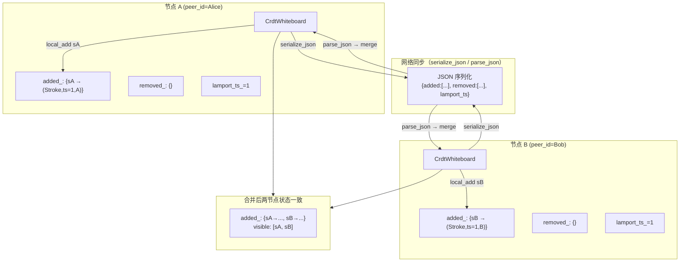
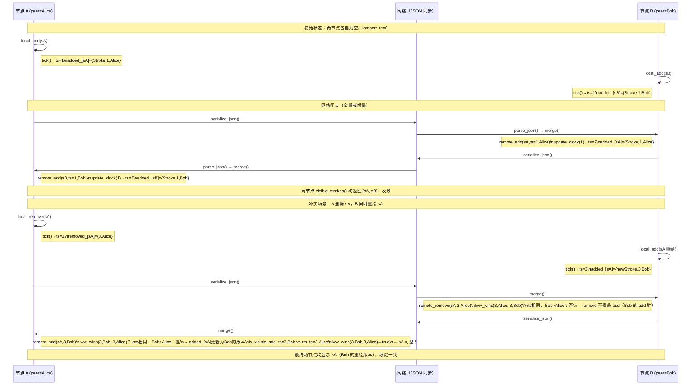

# module11_whiteboard — 基于 CRDT 的协同白板

---

## 1. 模块目的与背景

实时协同白板要求多个用户能够**同时**在同一画布上绘制笔划、撤销操作，
且在网络不稳定（延迟、断连、乱序）的环境下，最终所有用户看到的画布
状态必须**完全一致**。

这本质上是一个**分布式一致性**问题。本模块采用 CRDT（Conflict-free
Replicated Data Type）中的 **LWW-Element-Set**（Last-Write-Wins
Element Set）实现，结合 **Lamport 时钟**作为时序依据，满足：

- **无中心协调**：每个节点独立接受操作，无需全局锁或中央权威
- **最终一致**：任意两节点互相 merge 后，状态收敛到同一结果
- **确定性冲突解决**：相同时间戳时用 peer_id 字典序打破平局，无需通信

### OT vs CRDT：为什么白板选 CRDT？

| 维度 | OT（操作转换） | CRDT（免冲突复制数据类型） |
|------|--------------|------------------------|
| 代表产品 | Google Docs、Etherpad | Figma、Atom Teletype |
| 核心思路 | 对并发操作做变换，使其顺序无关 | 设计数据结构使合并天然满足交换律/结合律 |
| 中心节点 | 通常需要一个操作序号权威 | 无需中心节点 |
| 网络要求 | 消息需按序到达或服务端排队 | 消息可乱序、重复、丢失后重传 |
| 实现复杂度 | 高（变换函数难以正确实现） | 中等（数据结构设计是关键） |
| 适用场景 | 富文本编辑（操作语义强） | 白板/图形/KV 存储（元素独立） |
| 历史记录 | 天然保留操作历史 | 需额外设计 |

白板场景的笔划是**独立元素**（增删互不影响其他笔划），不涉及富文本的
"插入 N 个字符后第 M 位" 这类位置相对性问题，因此 CRDT LWW-Set 能以
较低复杂度完美胜任。

### Lamport 时钟的作用

物理时钟在分布式系统中不可靠（NTP 漂移、闰秒、VM 暂停）。
Lamport 时钟是一种**逻辑时钟**，保证：

- 若事件 A 发生在事件 B 之前（因果先序），则 `ts(A) < ts(B)`
- 反之不一定成立（Lamport 时钟无法检测并发，但对 LWW 够用）

对白板而言，我们只需要"最新操作胜出"，不需要检测并发，Lamport 时钟
提供的偏序关系已经足够。

---

## 2. 架构图



---

## 3. 关键类与文件表

| 文件 | 类 / 结构 | 职责 |
|------|----------|------|
| `include/wb/crdt_whiteboard.h` | `Point` | 二维坐标点 `{float x, y}` |
| `include/wb/crdt_whiteboard.h` | `Stroke` | 笔划：uuid、点列表、颜色、线宽 |
| `include/wb/crdt_whiteboard.h` | `CrdtWhiteboard` | LWW-Element-Set 主类 |
| `include/wb/crdt_whiteboard.h` | `AddEntry` | 内部：`{Stroke, uint64_t ts, string peer_id}` |
| `include/wb/crdt_whiteboard.h` | `RemoveEntry` | 内部：`{uint64_t ts, string peer_id}` |
| `src/crdt_whiteboard.cpp` | `local_add` | 本地添加笔划，tick() 生成时间戳 |
| `src/crdt_whiteboard.cpp` | `local_remove` | 本地删除笔划，tick() 生成时间戳 |
| `src/crdt_whiteboard.cpp` | `remote_add` | 接收远端 add，update_clock() 同步时钟 |
| `src/crdt_whiteboard.cpp` | `remote_remove` | 接收远端 remove，update_clock() 同步时钟 |
| `src/crdt_whiteboard.cpp` | `merge` | 合并另一节点的完整 added_ 和 removed_ |
| `src/crdt_whiteboard.cpp` | `is_visible` | LWW 判断：add 是否胜过 remove |
| `src/crdt_whiteboard.cpp` | `visible_strokes` | 遍历 added_，过滤 is_visible |
| `src/crdt_whiteboard.cpp` | `serialize_json` | 完整状态序列化为 JSON 字符串 |
| `src/crdt_whiteboard.cpp` | `parse_json` | 从 JSON 恢复状态（全量替换） |
| `tests/test_crdt.cpp` | 5 个测试用例 | 覆盖 add/remove/并发/merge/序列化 |

### LWW-Element-Set 数学定义

```
State = (A, R)
  A: Map<UUID, (Stroke, timestamp, peer_id)>   // added set
  R: Map<UUID, (timestamp, peer_id)>           // removed set

visible(uuid) =
  uuid ∈ A  AND
  ( uuid ∉ R  OR  lww_wins(A[uuid].ts, A[uuid].peer, R[uuid].ts, R[uuid].peer) )

lww_wins(ts_a, pid_a, ts_b, pid_b) =
  ts_a > ts_b  OR  (ts_a == ts_b AND pid_a > pid_b)   // 字典序比较

merge(S1, S2):
  for each (uuid, entry) in S2.A:
    if uuid ∉ S1.A or lww_wins(entry.ts, entry.peer, S1.A[uuid].ts, S1.A[uuid].peer):
      S1.A[uuid] = entry
  for each (uuid, entry) in S2.R:
    if uuid ∉ S1.R or lww_wins(entry.ts, entry.peer, S1.R[uuid].ts, S1.R[uuid].peer):
      S1.R[uuid] = entry
```

---

## 4. 核心算法

### 4.1 Lamport 时钟更新规则

```
// 本地操作：时钟自增
procedure tick() -> uint64_t:
    lamport_ts_ += 1
    return lamport_ts_

// 收到远端消息：同步时钟
// 保证：处理远端消息后，本节点的时钟 > remote_ts
procedure update_clock(remote_ts) -> uint64_t:
    if remote_ts >= lamport_ts_:
        lamport_ts_ = remote_ts + 1
    return lamport_ts_
```

为什么用 `remote_ts + 1` 而非 `max(local, remote)`？
因为 Lamport 时钟要求：**处理消息的事件**的时间戳必须严格大于消息本身的时间戳，
`remote_ts + 1` 精确满足此要求。

### 4.2 本地添加笔划

```
procedure local_add(stroke):
    ts = tick()                          // 本地时钟自增
    existing = added_[stroke.uuid]

    if existing is None OR lww_wins(ts, peer_id_, existing.ts, existing.peer_id):
        added_[stroke.uuid] = {stroke, ts, peer_id_}

    // 注意：不清理 removed_，is_visible() 中比较 add_ts vs remove_ts
    // 若 add_ts > remove_ts：笔划重新显示（撤销删除）
    // 若 add_ts < remove_ts：笔划仍隐藏（删除仍有效）
```

### 4.3 本地删除笔划

```
procedure local_remove(uuid):
    ts = tick()
    existing = removed_[uuid]

    if existing is None OR lww_wins(ts, peer_id_, existing.ts, existing.peer_id):
        removed_[uuid] = {ts, peer_id_}

    // 不从 added_ 中物理删除，保留历史（tombstone 模式）
    // 这保证了合并的幂等性：重复应用同一 remove 操作结果不变
```

### 4.4 可见性判断（is_visible）

```
procedure is_visible(uuid) -> bool:
    if uuid not in added_:
        return false                         // 从未被添加

    if uuid not in removed_:
        return true                          // 只有 add，没有 remove

    add_entry = added_[uuid]
    rm_entry  = removed_[uuid]

    // add 胜过 remove 时可见
    return lww_wins(add_entry.ts, add_entry.peer_id,
                    rm_entry.ts,  rm_entry.peer_id)
```

### 4.5 全状态合并（merge）

```
procedure merge(other: CrdtWhiteboard):
    // 合并 added_ 集合
    for (uuid, entry) in other.added_:
        remote_add(entry.stroke, entry.ts, entry.peer_id)
        // remote_add 内部调用 update_clock() 并做 LWW 比较

    // 合并 removed_ 集合
    for (uuid, entry) in other.removed_:
        remote_remove(uuid, entry.ts, entry.peer_id)

    // 合并操作满足交换律（A.merge(B) 和 B.merge(A) 结果相同）
    // 满足结合律（(A.merge(B)).merge(C) = A.merge(B.merge(C))）
    // 满足幂等性（A.merge(A) = A）
    // 以上三条保证 CRDT 的最终一致性
```

### 4.6 LWW 胜负判断（tiebreaker 设计）

```
// 静态方法，无状态
static lww_wins(ts_a, pid_a, ts_b, pid_b) -> bool:
    if ts_a != ts_b:
        return ts_a > ts_b    // 较新的时间戳胜

    // 同一时间戳：peer_id 字典序大者胜
    // 为什么用 peer_id 而非随机数？
    // 1. 确定性：所有节点计算结果相同，无需通信
    // 2. 无需全局状态：只需知道两个 peer_id
    // 3. peer_id 由系统分配，字典序有明确全序关系
    return pid_a > pid_b
```

---

## 5. 调用时序图



---

## 6. 关键代码片段

### 6.1 Lamport 时钟的两个关键方法

```cpp
// include/wb/crdt_whiteboard.h
private:
    uint64_t lamport_ts_{0};

    // 本地操作：自增后返回新时间戳
    // 每次本地操作调用一次，保证单调递增
    uint64_t tick() { return ++lamport_ts_; }

    // 收到远端消息时同步时钟
    // 保证：处理事件后 lamport_ts_ > remote_ts
    // 若 remote_ts=5 且本地 ts=3：ts 变为 6（不是 max(3,5)=5，因为处理事件本身也是一个事件）
    uint64_t update_clock(uint64_t remote_ts) {
        if (remote_ts >= lamport_ts_)
            lamport_ts_ = remote_ts + 1;  // +1 是关键
        return lamport_ts_;
    }
```

### 6.2 LWW 胜负判断

```cpp
// include/wb/crdt_whiteboard.h
// 静态方法：(ts_a, pid_a) 是否胜过 (ts_b, pid_b)
// 规则：ts 大者胜；ts 相同时 peer_id 字典序大者胜
// 此规则在所有节点上确定性执行，无需协商
static bool lww_wins(uint64_t ts_a, const std::string& pid_a,
                     uint64_t ts_b, const std::string& pid_b) {
    if (ts_a != ts_b) return ts_a > ts_b;
    return pid_a > pid_b;  // std::string 字典序比较
}
```

### 6.3 可见性判断

```cpp
// src/crdt_whiteboard.cpp: is_visible()
bool CrdtWhiteboard::is_visible(const std::string& uuid) const {
    auto add_it = added_.find(uuid);
    if (add_it == added_.end()) return false;  // 从未添加

    auto rm_it = removed_.find(uuid);
    if (rm_it == removed_.end()) return true;  // 只有 add，无 remove

    // 核心判断：add 的 (ts, peer_id) 是否胜过 remove 的 (ts, peer_id)
    // add 胜：笔划可见（最后操作是 add）
    // remove 胜：笔划隐藏（最后操作是 remove）
    return lww_wins(add_it->second.ts, add_it->second.peer_id,
                    rm_it->second.ts,  rm_it->second.peer_id);
}
```

### 6.4 全量 JSON 序列化格式

```cpp
// src/crdt_whiteboard.cpp: serialize_json()
// 序列化整个 CRDT 状态（added_ + removed_ + 元信息）
// 用于节点初次加入时的全量同步，或断连重连后的状态恢复
std::string CrdtWhiteboard::serialize_json() const {
    json j;
    j["peer_id"]    = peer_id_;
    j["lamport_ts"] = lamport_ts_;

    json added_arr = json::array();
    for (auto& [uuid, entry] : added_) {
        json e;
        e["uuid"]    = entry.stroke.uuid;
        e["color"]   = entry.stroke.color;   // ARGB uint32
        e["width"]   = entry.stroke.width;   // float
        e["ts"]      = entry.ts;
        e["peer_id"] = entry.peer_id;
        json pts = json::array();
        for (auto& p : entry.stroke.points)
            pts.push_back({{"x", p.x}, {"y", p.y}});
        e["points"] = pts;
        added_arr.push_back(e);
    }
    j["added"] = added_arr;
    // ... removed_ 类似
    return j.dump();
}
```

**JSON 格式示例：**
```json
{
  "peer_id": "Alice",
  "lamport_ts": 3,
  "added": [
    {
      "uuid": "550e8400-e29b-41d4-a716-446655440000",
      "color": 4278190080,
      "width": 2.0,
      "ts": 1,
      "peer_id": "Alice",
      "points": [{"x": 10.5, "y": 20.3}, {"x": 15.0, "y": 25.0}]
    }
  ],
  "removed": [
    {
      "uuid": "550e8400-e29b-41d4-a716-446655440001",
      "ts": 3,
      "peer_id": "Alice"
    }
  ]
}
```

### 6.5 并发添加后 merge 收敛测试

```cpp
// tests/test_crdt.cpp: ConcurrentAddConverge
TEST(CrdtWhiteboard, ConcurrentAddConverge) {
    // 两个节点在没有任何同步的情况下各自添加一个不同笔划
    CrdtWhiteboard wbA("A");
    CrdtWhiteboard wbB("B");

    wbA.local_add(make_stroke("sA"));   // A: added_[sA]={ts=1, peer=A}
    wbB.local_add(make_stroke("sB"));   // B: added_[sB]={ts=1, peer=B}

    // 双向 merge：A 接收 B 的状态，B 接收 A 的状态
    wbA.merge(wbB);
    wbB.merge(wbA);

    // 两节点最终状态完全一致：两个笔划都可见
    auto vA = wbA.visible_strokes();
    auto vB = wbB.visible_strokes();
    EXPECT_EQ(vA.size(), 2u);   // sA 和 sB 都在 A 上可见
    EXPECT_EQ(vB.size(), 2u);   // sA 和 sB 都在 B 上可见
}
```

---

## 7. 设计决策

### 7.1 为什么用 UUID 而非自增 ID？

分布式环境中，若每个节点用自增 ID（1, 2, 3, ...），多节点同时创建笔划
时必然产生 ID 冲突。解决方案：

- **中心 ID 服务**：引入单点依赖，破坏 CRDT 的去中心化优势
- **UUID v4**：128位随机数，碰撞概率约 1/5.3×10^36，实践中忽略不计

UUID 还使 tombstone（removed_ 条目）能够永久标识已删除的笔划，
即使笔划本体已从 added_ 中不可见，removed_ 中仍保留历史记录。

### 7.2 为什么不用 Vector Clock？

Vector Clock 能检测并发（判断两个事件是否存在因果关系），但：
- 开销：每个操作需携带长度为节点数的向量，N 个节点则 O(N) 额外数据
- LWW 不需要检测并发，只需要一个全序关系来确定"谁的操作更新"
- Lamport 时钟提供偏序，配合 peer_id tiebreaker 升格为全序，足够 LWW 使用

### 7.3 Tombstone 的内存代价

`removed_` 永久保存已删除笔划的记录（tombstone），不做垃圾回收。
优点：合并操作幂等，历史状态可重建。
代价：长时间运行后 removed_ 无限增长。

生产环境的解决方案是**GC（Garbage Collection）协议**：
- 所有节点对某时间点 T 达成共识（如 Paxos/Raft）
- T 之前的 tombstone 可以安全删除（所有节点都已收到该 remove 操作）
- 新加入节点不能是 T 之前状态的观察者

### 7.4 serialize_json 是全量同步而非增量

当前 `serialize_json` 序列化整个 `added_` 和 `removed_`，适合：
- 节点首次加入时的状态同步
- 断连重连后的状态恢复

增量同步（只发送自上次同步后的变化）需要维护每次操作的日志和
"已同步到对端的水位线"，复杂度更高，本模块暂不实现。

### 7.5 parse_json 做全量替换而非 merge

`parse_json` 当前实现：先 `clear()` 再全量填充，不做 LWW 比较。
这适合全量同步场景（数据来源权威，可信任）。
若用于增量同步，应改为调用 `remote_add` / `remove_remove`，
让 LWW 逻辑决定是否更新本地状态。

---

## 8. 常见坑

### 坑 1：local_add 和 remote_add 的时钟处理不同

`local_add` 调用 `tick()`（自增），`remote_add` 调用 `update_clock()`（同步）。
若将两者搞混——例如 `remote_add` 也调用 `tick()`——会导致：
- 本地时钟与远端消息的时间戳无关，失去 Lamport 时钟的因果语义
- 同一消息在不同节点上的处理结果可能不同（违反 CRDT 收敛性）

### 坑 2：is_visible 中 remove 胜出时笔划仍在 added_ 中

`removed_` 是 tombstone，笔划被删除后不从 `added_` 中物理移除。
`visible_strokes()` 必须每次调用 `is_visible()` 过滤，不能缓存。
若实现时直接从 `added_` 遍历而忘记调用 `is_visible()`，所有已删除
的笔划将重新显示。

### 坑 3：同 timestamp tiebreaker 方向必须全局一致

`lww_wins` 中 `ts_a == ts_b` 时用 `pid_a > pid_b`（大者胜）。
若某个节点的实现改为 `pid_a < pid_b`（小者胜），两节点对同一冲突
的判断结果相反，永远无法收敛，产生"闪烁"（不断相互覆盖）。
tiebreaker 规则必须在所有参与者中**精确一致**。

### 坑 4：merge 后 lamport_ts_ 可能高于任何已知操作的时间戳

`merge` 内部调用 `remote_add` / `remote_remove`，后者调用 `update_clock()`
可能将本地 `lamport_ts_` 推进到 `max(remote_ts) + 1`。
此后本地 `tick()` 产生的时间戳会高于所有历史操作，符合 Lamport 时钟语义。
但若有代码保存了 merge 前的 `lamport_ts_` 值并用于比较，结果可能失效。

### 坑 5：UUID 碰撞（极小概率，但需意识到）

UUID v4 的碰撞概率约为 `1 / (2^61)` per pair。若白板有百万用户，
每用户每天产生 1000 个笔划，运行 1000 年才有约 50% 概率出现第一次碰撞。
实践中可忽略，但对安全敏感场景（攻击者故意伪造 UUID），需要服务端校验。

### 坑 6：parse_json 异常处理不完整

当前 `parse_json` 用 `try { ... } catch (...) { return false; }` 捕获所有异常。
若 JSON 字段存在但类型不匹配（如 `ts` 字段为字符串而非数字），
`nlohmann::json` 的 `get<uint64_t>()` 会抛出异常，整个解析失败。
生产环境需要对每个字段单独做类型检查并给出明确的错误信息。

### 坑 7：visible_strokes 的遍历顺序不确定

`added_` 是 `unordered_map`，遍历顺序不确定。`visible_strokes()` 返回的
`vector<Stroke>` 每次调用顺序可能不同，导致画面上笔划的渲染 z 轴顺序
（后绘制者覆盖先绘制者）每次刷新都变化。
生产环境需要按 `ts` 排序后渲染，以获得稳定的视觉效果。

---

## 9. 测试覆盖说明

| 测试用例 | 文件位置 | 验证内容 |
|---------|---------|---------|
| `LocalAddVisible` | `tests/test_crdt.cpp:13` | 本地添加一个笔划后 visible_strokes() 返回该笔划 |
| `LocalRemoveHidden` | `tests/test_crdt.cpp:21` | 添加后再删除，visible_strokes() 返回空集合 |
| `ConcurrentAddConverge` | `tests/test_crdt.cpp:28` | 两节点各自添加不同笔划，双向 merge 后两节点各显示 2 个笔划 |
| `ConcurrentRemoveWins` | `tests/test_crdt.cpp:45` | 节点 B 用更大 ts 删除节点 A 添加的笔划，A merge 后该笔划不可见 |
| `SerializeRoundtrip` | `tests/test_crdt.cpp:62` | serialize_json → parse_json 后笔划的 uuid/坐标/颜色/线宽完整恢复 |

**当前未覆盖的场景（可扩展）：**

- 同一 UUID 的 `local_add` 被调用两次（LWW 取 ts 较大的）
- `remote_add` 用较小 ts 不覆盖本地 ts 较大的 add
- 三节点场景：A→B→C 链式 merge 后状态收敛
- Lamport 时钟越界（uint64_t 溢出，约需 1.8×10^19 次操作）
- 大量笔划（10000+）的 visible_strokes 性能
- 并发调用（当前 `CrdtWhiteboard` 无线程安全保证）

---

## 10. 构建与运行

```bash
cd /home/aoi/AWorkSpace/cpp_meet

# 配置（GCC 10 支持 C++17 结构化绑定 auto& [uuid, entry]）
CXX=g++-10 CC=gcc-10 cmake -B build -DCMAKE_BUILD_TYPE=Debug

# 构建 module11 测试目标
cmake --build build --target crdt_test -j$(nproc)

# 运行测试
cd build && ctest -R CrdtWhiteboard -V
# 或直接运行
./module11_whiteboard/crdt_test
```

**预期输出：**
```
[==========] Running 5 tests from 1 test suite.
[----------] 5 tests from CrdtWhiteboard
[ RUN      ] CrdtWhiteboard.LocalAddVisible
[       OK ] CrdtWhiteboard.LocalAddVisible (0 ms)
[ RUN      ] CrdtWhiteboard.LocalRemoveHidden
[       OK ] CrdtWhiteboard.LocalRemoveHidden (0 ms)
[ RUN      ] CrdtWhiteboard.ConcurrentAddConverge
[       OK ] CrdtWhiteboard.ConcurrentAddConverge (0 ms)
[ RUN      ] CrdtWhiteboard.ConcurrentRemoveWins
[       OK ] CrdtWhiteboard.ConcurrentRemoveWins (0 ms)
[ RUN      ] CrdtWhiteboard.SerializeRoundtrip
[       OK ] CrdtWhiteboard.SerializeRoundtrip (0 ms)
[==========] 5 tests passed.
```

---

## 11. 延伸阅读

- **Shapiro et al. (2011)** — "A comprehensive study of Convergent and Commutative
  Replicated Data Types"，CRDT 的奠基性论文，定义了 CvRDT 和 CmRDT 的形式化模型

- **Marc Shapiro, Nuno Preguiça** — "Conflict-free Replicated Data Types"
  https://crdt.tech/papers.html — 完整论文列表与实现参考

- **Lamport (1978)** — "Time, Clocks, and the Ordering of Events in a Distributed System"
  原始 Lamport 时钟论文，Communications of the ACM

- **Fidge (1988)** — "Timestamps in Message-Passing Systems"
  Vector Clock 的原始论文，与 Lamport 时钟的对比

- **Attiya et al. (2016)** — "Specification and Complexity of Collaborative Text Editing"
  为什么 OT 的正确性证明困难：对应于 Google Docs 问题的形式化分析

- **Figma 工程博客** — "How Figma's multiplayer technology works"
  https://www.figma.com/blog/how-figmas-multiplayer-technology-works/
  真实产品中 CRDT 在图形编辑场景的应用

- **Automerge** — https://automerge.org/
  开源 CRDT 库，支持 JSON 文档的协作编辑，含 Rust/JS/C 实现

- **YJS** — https://github.com/yjs/yjs
  高性能 CRDT 框架，广泛用于协同编辑，支持 WebRTC P2P 同步
