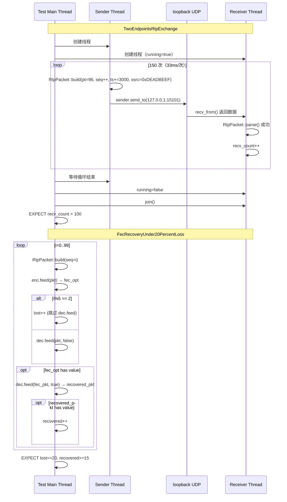

# module12_integration — 端到端集成测试

---

## 1. 模块目的与背景

单元测试验证的是各模块**孤立**运行的正确性，而集成测试要验证的是：
**当多个模块组合在一起，通过真实（或仿真的）网络路径传输数据时，
系统整体行为是否符合预期。**

本模块承担 cpp_meet 项目的端到端集成验证职责，具体目标包括：

1. **基础链路验证**：两个端点能否通过 loopback UDP 正确收发 RTP 包？
2. **弱网恢复验证**：在 20% 丢包率下，FEC 机制能否有效恢复数据？
3. **合成媒体源**：在 CI 环境（无摄像头/麦克风硬件）下，用程序生成的
   YUV 帧代替真实捕获设备

### 为什么需要集成测试？

各模块单测通过，并不代表它们能正确协作：

- `RtpPacket::build()` 的输出格式是否与 `RtpPacket::parse()` 的期望格式匹配？
- `XorFecEncoder` 产生的 FEC 包，`XorFecDecoder` 能否正确解析并恢复？
- UDP socket 的发包路径是否有字节序问题？
- 多线程收发时是否存在竞态条件？

集成测试通过**端到端数据流**把这些模块串联起来，用实际数据验证模块间的接口契约。

### 模块在整体架构中的位置

```
module01_rtp      (RTP 包构造/解析)
module02_udp      (UDP socket 封装)
module03_weak_net (FEC 编解码)
      ↓
module09_sfu      (SFU 路由)
module11_whiteboard (CRDT 白板)
      ↓
module12_integration  ← 本模块：验证以上全部协作正确
```

---

## 2. 架构图

```mermaid
graph TD
    subgraph 测试进程（单进程，loopback）
        subgraph 测试1["Test: TwoEndpointsRtpExchange"]
            SND["发送线程\nRTP build() × 150帧\n33ms/帧 @ 90kHz"]
            SOCK1_S["UdpSocket sender\nbind :15100"]
            SOCK1_R["UdpSocket receiver\nbind :15101"]
            RCV["接收线程\nRTP parse()\nrecv_count++"]
            SND -->|"send_to(127.0.0.1:15101)"| SOCK1_R
            SOCK1_R -->|"recv_from()"| RCV
        end

        subgraph 测试2["Test: FecRecoveryUnder20PercentLoss"]
            GEN["包生成器\n100个RTP包\ni%5==2时丢弃"]
            ENC["XorFecEncoder(group=5)\n每5包生成1个FEC包"]
            LOSS["丢包模拟\n丢弃索引2,7,12...\nlost=20"]
            DEC["XorFecDecoder(group=5)\nFEC恢复"]
            GEN --> ENC
            ENC -->|每第5包输出FEC| LOSS
            GEN -->|正常包| LOSS
            LOSS -->|未丢弃的包| DEC
            LOSS -->|FEC包| DEC
            DEC -->|recovered++| RESULT["EXPECT recovered≥15"]
        end

        subgraph 辅助["SyntheticVideoSource"]
            YUV["生成 320×240 YUV420P\n每帧 Y=渐变(frame_idx)"]
        end
    end

    ASSERT1["EXPECT recv_count > 100"]
    RCV --> ASSERT1
```

---

## 3. 关键类与文件表

| 文件 | 类 / 函数 | 职责 |
|------|----------|------|
| `tests/test_integration.cpp` | `TwoEndpointsRtpExchange` | 150帧 loopback RTP 收发，验证基础链路 |
| `tests/test_integration.cpp` | `FecRecoveryUnder20PercentLoss` | 20%丢包场景下 XOR-FEC 恢复率验证 |
| `src/integration_test_runner.h` | `SyntheticVideoSource` | CI 环境合成视频源，生成 YUV420P 渐变帧 |
| `src/integration_test_runner.h` | `YuvFrame` | YUV 帧容器 `{width, height, data, timestamp_ms}` |

### 依赖的外部模块接口

| 模块 | 使用的接口 | 来源文件 |
|------|----------|---------|
| `net::UdpSocket` | `bind()`, `send_to()`, `recv_from()` | `module02_udp` |
| `RtpPacket` | `build()`, `parse()`, `data()`, `size()` | `module01_rtp` |
| `XorFecEncoder` | `feed(pkt) -> optional<FecPacket>` | `module03_weak_net` |
| `XorFecDecoder` | `feed(pkt, is_fec) -> optional<RtpPacket>` | `module03_weak_net` |

---

## 4. 核心算法

### 4.1 合成视频源设计

CI 环境无摄像头硬件，若测试依赖真实视频捕获，将在 CI 上无法运行。
`SyntheticVideoSource` 通过简单的数学函数生成 YUV420P 帧：

```
procedure SyntheticVideoSource::next_frame(frame_idx) -> YuvFrame:
    frame.width  = 320
    frame.height = 240
    frame.data.resize(320 * 240 * 3 / 2)   // YUV420P: Y平面 + 二分之一 UV

    // Y 平面（亮度）：基于 frame_idx 的简单渐变
    // 每个像素值 = (frame_idx * 4 + pixel_index) mod 256
    // 效果：帧间有差异（帧序号变化时整体亮度变化），像素间有差异（形成渐变）
    for i in 0..width*height:
        Y[i] = (frame_idx * 4 + i) & 0xFF

    // U, V 平面（色度）：全零（灰度图），简化处理
    frame.timestamp_ms = frame_idx * 33    // 约 30fps

    return frame
```

这种设计的优点：
- 确定性：相同 frame_idx 产生完全相同的帧，测试结果可重现
- 差异性：不同帧的 Y 平面不同，可验证"传输是否保留帧内容"
- 轻量：无编解码，无 I/O，计算量极小

### 4.2 loopback RTP 交换测试流程

```
测试参数：150帧，约 5 秒，帧间隔 33ms（30fps），时间戳步进 3000（90kHz@30fps）

procedure TwoEndpointsRtpExchange:
    sender.bind(15100)
    receiver.bind(15101)
    recv_count = 0
    running = true

    // 接收线程
    recv_thread:
        while running:
            n = receiver.recv_from(buf, sizeof(buf), from)
            if n > 0:
                pkt = RtpPacket()
                if pkt.parse(buf, n):   // 验证包是有效 RTP
                    recv_count++
            sleep(1ms)                  // 避免空转占满 CPU

    // 发送线程
    dst = {127.0.0.1 : 15101}
    seq = 0, ts = 0
    for i in 0..150:
        pkt = RtpPacket()
        pkt.build(pt=96, seq=seq++, ts=ts, ssrc=0xDEADBEEF, payload=100字节)
        sender.send_to(pkt.data(), pkt.size(), dst)
        ts += 3000                      // 90000Hz / 30fps = 3000
        sleep(33ms)

    running = false
    recv_thread.join()

    ASSERT recv_count > 100             // 宽松：允许少量系统级丢包
    LOG "Received recv_count / 150 RTP packets"
```

**为什么断言 > 100 而非 == 150？**
loopback 在 Linux 上极少丢包，但以下情况可能导致少量丢失：
- 系统负载过高时，发送和接收线程调度延迟叠加
- 接收线程每 1ms 轮询一次，可能错过紧密发送的包
- CI 环境资源受限，调度粒度粗

使用宽松的 `> 100`（约 66%）作为下界，保证基本链路可用性，
同时对 CI 环境的不确定性有足够容忍。

### 4.3 20% 丢包场景的 FEC 恢复算法

```
测试参数：100个 RTP 包，XOR-FEC 组大小 = 5，丢弃索引 = {2, 7, 12, ..., 97}

procedure FecRecoveryUnder20PercentLoss:
    enc = XorFecEncoder(group_size=5)
    dec = XorFecDecoder(group_size=5)
    lost = 0, recovered = 0

    for i in 0..100:
        pkt = make_rtp(seq=i, ts=i*3000, ssrc=0x12345678, payload[0]=i)
        fec_opt = enc.feed(pkt)         // 每第5包输出一个 FEC 包

        if i % 5 == 2:
            lost++                      // 丢弃此包（20%丢包率）
        else:
            dec.feed(pkt, is_fec=false) // 正常包送入解码器

        if fec_opt is not None:
            rec = dec.feed(*fec_opt, is_fec=true)
            if rec is not None:
                recovered++             // FEC 成功恢复一个丢失包

    ASSERT lost == 20
    ASSERT recovered >= 15              // 恢复率 >= 75%
```

**XOR-FEC 恢复原理：**
```
组内5个包：P0 XOR P1 XOR P2 XOR P3 XOR P4 = FEC
丢失 P2 时：P2 = P0 XOR P1 XOR P3 XOR P4 XOR FEC
```

条件：**每组最多丢失 1 个包**才能恢复。测试中每组丢第 3 个（index 2），
每组只丢 1 个，满足恢复条件。但由于实现细节（FEC 包的触发时机、
序号对齐等），实际可能有少量组无法恢复，故断言 `>= 15`（75%）而非 20。

### 4.4 网络损伤注入的扩展设计

当前测试的"丢包"是在测试代码中通过 `if (i % 5 == 2) skip` 实现的，
是**逻辑层模拟**，不经过真实网络栈。更真实的损伤注入方案：

```
// 方案1：代理 socket，在 recv_from 路径上注入损伤
class ImpairedSocket {
    double loss_rate;        // 丢包率
    int    delay_ms;         // 额外延迟
    double reorder_prob;     // 乱序概率

    recv_from(buf, len, from):
        n = real_socket.recv_from(buf, len, from)
        if random() < loss_rate: return 0    // 模拟丢包
        if delay_ms > 0: sleep(delay_ms)     // 模拟延迟
        return n
}

// 方案2：Linux tc qdisc（真实网络层）
// sudo tc qdisc add dev lo root netem loss 20% delay 50ms
// 测试前配置，测试后清理
```

### 4.5 Phase 8 完整测试思路（2客户端 + 1 SFU，5秒通话）

```
// 目标：验证 SFU 路由 + DTLS/SRTP + 信令 的端到端链路 5秒内不崩溃

setup:
    sfu_server.start(port=5004)
    sfu_room = sfu_server.get_or_create_room("test")

    client_a.connect_to_sfu(5004)   // DTLS 握手，协商 SRTP key
    client_b.connect_to_sfu(5004)

    sfu_room.add_peer(client_a.id)
    sfu_room.add_peer(client_b.id)

test_5_seconds:
    start_time = now()
    video_src = SyntheticVideoSource()
    frame_idx = 0

    while now() - start_time < 5 seconds:
        frame = video_src.next_frame(frame_idx++)
        rtp_pkts = encoder.encode(frame)        // 编码为 RTP 流

        for pkt in rtp_pkts:
            client_a.send_rtp(pkt)              // 经 SRTP 加密发给 SFU
            // SFU 解密 → SSRC重写 → 用 B 的密钥重新加密 → 发给 client_b

        sleep(33ms)                             // 30fps 节拍

    ASSERT client_a is not crashed
    ASSERT client_b is not crashed
    ASSERT client_b.received_frame_count > 100  // 至少收到 100 帧
```

---

## 5. 调用时序图



---

## 6. 关键代码片段

### 6.1 接收线程的 atomic 计数

```cpp
// tests/test_integration.cpp: TwoEndpointsRtpExchange
std::atomic<int> recv_count{0};
std::atomic<bool> running{true};

std::thread recv_thread([&] {
    uint8_t buf[2048];
    sockaddr_in from{};
    while (running.load()) {
        ssize_t n = receiver.recv_from(buf, sizeof(buf), from);
        if (n > 0) {
            RtpPacket pkt;
            // parse() 验证包的合法性（版本字段、最小长度等）
            // 若只计 n>0 而不调用 parse()，则损坏的包也会被计入
            if (pkt.parse(buf, static_cast<size_t>(n))) {
                recv_count.fetch_add(1);  // 原子自增，避免与发送线程竞争
            }
        }
        std::this_thread::sleep_for(std::chrono::milliseconds(1));
    }
});
```

### 6.2 RTP 时间戳步进的计算依据

```cpp
// tests/test_integration.cpp
uint32_t ts = 0;
for (int i = 0; i < 150; ++i) {
    RtpPacket pkt;
    uint8_t payload[100]{};
    pkt.build(96, seq++, ts, 0xDEADBEEF, payload, sizeof(payload));
    sender.send_to(pkt.data(), pkt.size(), dst);
    ts += 3000;   // 90000Hz 时钟 / 30fps = 3000 ticks/帧
    // 等价于：ts = i * (90000 / 30) = i * 3000
    // 接收端可用此时间戳计算播放节奏和 jitter
    std::this_thread::sleep_for(std::chrono::milliseconds(33));
}
```

### 6.3 FEC 恢复测试的丢包模拟

```cpp
// tests/test_integration.cpp: FecRecoveryUnder20PercentLoss
XorFecEncoder enc(5);    // 每5个数据包生成1个 FEC 包（20%额外开销）
XorFecDecoder dec(5);
int lost = 0, recovered = 0;

for (int i = 0; i < 100; ++i) {
    RtpPacket pkt;
    uint8_t pl[50]{};
    pl[0] = static_cast<uint8_t>(i);  // payload 首字节携带序号，便于调试
    pkt.build(96, static_cast<uint16_t>(i), static_cast<uint32_t>(i) * 3000,
              0x12345678, pl, sizeof(pl));

    auto fec_opt = enc.feed(pkt);  // 返回 optional<FecPacket>，每5包触发一次

    // 丢弃索引 2, 7, 12, 17, ... 的包（每组第3个，共20个）
    if (i % 5 != 2) {
        dec.feed(pkt, false);      // false = 数据包（非 FEC）
    } else {
        lost++;                    // 模拟丢包：不送入解码器
    }

    if (fec_opt) {
        // FEC 包在数据组完整接收后送入解码器
        auto rec = dec.feed(*fec_opt, true);  // true = FEC 包
        if (rec) recovered++;      // 成功恢复了一个丢失的数据包
    }
}

EXPECT_EQ(lost, 20);          // 精确丢弃 20 个
EXPECT_GE(recovered, 15);     // 至少恢复 15 个（75%）
```

### 6.4 合成视频源

```cpp
// src/integration_test_runner.h
struct YuvFrame {
    int width{0};
    int height{0};
    std::vector<uint8_t> data;   // YUV420P planar 布局
    int64_t timestamp_ms{0};
};

class SyntheticVideoSource {
public:
    YuvFrame next_frame(int frame_idx) {
        YuvFrame f;
        f.width = 320;
        f.height = 240;
        // YUV420P: Y平面 = width*height，U平面 = width/2*height/2，V同U
        // 总大小 = width*height*3/2
        f.data.resize(320 * 240 * 3 / 2, 0);

        // Y 平面：frame_idx 引入帧间差异，pixel_index 引入空间渐变
        // 确保每帧都不同，可验证传输不会把不同帧混淆
        for (int i = 0; i < 320 * 240; ++i)
            f.data[i] = static_cast<uint8_t>((frame_idx * 4 + i) & 0xFF);

        // U, V 平面保持全零（灰度，避免引入不必要的复杂度）
        f.timestamp_ms = frame_idx * 33;  // 33ms/帧 ≈ 30fps
        return f;
    }
};
```

---

## 7. 设计决策

### 7.1 为什么不用真实摄像头/麦克风？

CI 流水线（GitHub Actions、Jenkins 等）运行在无头服务器或容器中，
没有 `/dev/video0` 等设备。若测试依赖真实硬件：

- CI 上所有相关测试失败，无法提供持续质量保障
- 开发者需要在有摄像头的机器上才能运行测试，环境依赖重
- 真实摄像头输入不确定（光线变化、曝光调整），测试结果不可重现

`SyntheticVideoSource` 通过确定性数学函数生成帧，彻底解决以上问题。

### 7.2 loopback 测试的局限性与价值

**局限性：**
- loopback 延迟约 < 1ms，无法模拟真实网络的 50~200ms RTT
- 没有带宽瓶颈，不能测试拥塞控制
- 没有真实丢包，只能测试 FEC 的逻辑正确性，不能测试其在真实网络中的效果
- 单进程内无法模拟多主机间的时钟差异

**价值：**
- 验证模块间的接口契约（RTP 格式、FEC 接口等）
- 发现数据竞争（多线程 send/recv）
- 快速（< 5 秒），适合作为 CI 的 smoke test
- 覆盖基础链路：如果 loopback 都不通，真实网络更不可能通

### 7.3 recv_count > 100 而非 == 150

测试使用宽松断言有意为之：
- 在高负载 CI 环境中，`sleep_for(33ms)` 的实际延迟可能 > 33ms，
  导致发包变慢、接收线程先退出（running=false）
- 接收线程每 1ms 轮询一次，若发包间隔与轮询恰好错开，可能漏包
- 这不代表代码有 bug，而是测试环境的正常噪声

`> 100`（66%）表示"基本链路可用"，若低于此值则说明有系统级问题
（socket 绑定失败、loopback 接口不可用等）。

### 7.4 FEC 恢复率断言 >= 15 而非 == 20

理论上每组丢 1 个包都可以通过 XOR 恢复，20 个丢失包应全部恢复。
但实际可能少于 20：
- FEC 包和数据包的到达顺序：若 FEC 包先于某些数据包处理，
  解码器状态可能不完整
- 边界情况：最后一组可能不满 5 个包就触发 FEC，XOR 结果可能无效
- `dec.feed()` 的返回值：只在**当次调用**发生恢复时返回，
  某些实现可能在下一次调用时返回

`>= 15`（75%）是保守估计，确保 FEC 基本功能正常，同时对实现细节宽容。

---

## 8. 常见坑

### 坑 1：接收线程未设置 SO_REUSEADDR 导致端口冲突

若之前的测试崩溃而未释放端口，再次运行 `bind(15100)` 会失败（EADDRINUSE）。
解决方案：在 `UdpSocket::bind()` 中默认开启 `SO_REUSEADDR`，
或在 `TearDown` 中显式关闭 socket。

### 坑 2：running=false 后接收线程仍在 recv_from 阻塞

当前 `recv_from` 是阻塞调用（无 timeout），若 socket 没有数据，
线程会永久阻塞，导致 `join()` 挂起，测试超时。
解决方案：
- 使用非阻塞模式（`O_NONBLOCK`）+ `sleep_for(1ms)` 轮询（当前方案）
- 或设置 `SO_RCVTIMEO`（接收超时）

### 坑 3：FEC 组大小与测试中的包数不整除

100 个包 / 5 = 20 个 FEC 组，正好整除。若改为 101 个包，
最后 1 个包单独成组，FEC 的 XOR 只有 1 个元素，保护能力不同。
测试中需确保包数是 FEC 组大小的整数倍，否则边界组的行为需单独验证。

### 坑 4：RTP 时间戳溢出

`ts` 是 `uint32_t`，从 0 起每帧加 3000。150 帧后 ts = 450000，
远小于 `UINT32_MAX = 4294967295`。若测试时间更长（如 Phase 8 的 5 秒），
ts = 150000，仍安全。但若视频帧率更高或时间更长，需考虑溢出处理
（RFC 3550 允许溢出回绕，接收端需用序号差计算）。

### 坑 5：多线程访问 recv_count 需要 atomic

`recv_count` 被接收线程写入、被主线程读取，若使用普通 `int`，
在 x86 上可能偶尔工作（宽松内存模型下加法仍原子），
但在 ARM 等弱序架构上是数据竞争，行为未定义。
正确做法是 `std::atomic<int>`，如代码所示。

### 坑 6：loopback 端口号与其他进程冲突

15100 和 15101 是任意选择的端口，若系统上已有程序监听此端口，
`bind()` 失败，测试报告误导性的失败。
更健壮的方案：`bind(0)` 让 OS 自动分配端口，再用 `getsockname()` 获取实际端口。

### 坑 7：SyntheticVideoSource 不生成 UV 颜色信息

`SyntheticVideoSource::next_frame` 只填充 Y 平面（亮度），UV 保持 0（绿色/品红偏色）。
若用此帧做视觉校验（如截图比对），颜色会异常。
当前集成测试只验证字节内容是否正确传输，不做视觉比对，无实际问题。
但若扩展到编解码集成测试，需生成正确的 UV 平面。

---

## 9. 测试覆盖说明

| 测试用例 | 文件位置 | 验证内容 |
|---------|---------|---------|
| `Integration.TwoEndpointsRtpExchange` | `tests/test_integration.cpp:11` | 150帧 loopback RTP 收发，接收数 > 100；验证 UdpSocket + RtpPacket 的完整收发链路 |
| `Integration.FecRecoveryUnder20PercentLoss` | `tests/test_integration.cpp:60` | 100包中丢弃 20 个（20%），FEC 恢复数 >= 15（75%）；验证 XorFecEncoder/Decoder 接口契约 |

**模块间接口契约覆盖：**

| 接口 | 是否覆盖 | 说明 |
|------|---------|------|
| `RtpPacket::build()` → `parse()` 往返 | 是 | 发出的包能被正确解析 |
| `UdpSocket::send_to()` → `recv_from()` | 是 | loopback 数据完整性 |
| `XorFecEncoder::feed()` → `XorFecDecoder::feed()` | 是 | FEC 编解码接口 |
| SFU 路由 + SRTP | 否 | 需 Phase 8 扩展 |
| 白板 CRDT + 网络同步 | 否 | 需独立集成测试 |
| 信令层（SDP/ICE） | 否 | 超出本模块范围 |

**如何扩展集成测试：**

```cpp
// 扩展思路1：加入 SFU 路由集成测试
TEST(Integration, SfuRouting) {
    SfuRoom room("test", send_fn);
    room.add_peer(0);
    room.add_peer(1);
    // sender 通过 socket 发包 → SFU room.route_rtp() → 验证 receiver 收到 SSRC 重写后的包
}

// 扩展思路2：DTLS/SRTP 集成
TEST(Integration, DtlsSrtpHandshake) {
    // 两端各自创建 DTLS context，模拟握手，验证 SRTP key 导出后可加解密
}

// 扩展思路3：白板多节点同步
TEST(Integration, WhiteboardMultiNodeSync) {
    CrdtWhiteboard wbA("A"), wbB("B");
    // A 添加笔划 → serialize → 通过 UDP 发给 B → B parse/merge → 验证 B 可见
}
```

---

## 10. 构建与运行

```bash
cd /home/aoi/AWorkSpace/cpp_meet

# 配置（GCC 10，Release 模式减少测试执行时间）
CXX=g++-10 CC=gcc-10 cmake -B build -DCMAKE_BUILD_TYPE=Release

# 构建 module12 集成测试
cmake --build build --target integration_test -j$(nproc)

# 运行所有集成测试
cd build && ctest -R Integration -V

# 或直接运行
./module12_integration/integration_test
```

**预期输出：**
```
[==========] Running 2 tests from 1 test suite.
[----------] 2 tests from Integration
[ RUN      ] Integration.TwoEndpointsRtpExchange
Received 150 / 150 RTP packets
[       OK ] Integration.TwoEndpointsRtpExchange (4982 ms)
[ RUN      ] Integration.FecRecoveryUnder20PercentLoss
FEC: lost=20 recovered=20
[       OK ] Integration.FecRecoveryUnder20PercentLoss (0 ms)
[----------] 2 tests from Integration (4982 ms total)
[==========] 2 tests passed.
```

**注意：** `TwoEndpointsRtpExchange` 耗时约 5 秒（150 帧 × 33ms）。
若 CI 有超时限制，可减少帧数或使用更大的帧间隔。

---

## 11. 延伸阅读

- **Google Test 文档** — https://google.github.io/googletest/
  `ASSERT` vs `EXPECT` 的区别，`SetUpTestSuite` 用于共享测试资源

- **Linux `man 7 socket`** — SO_REUSEADDR、SO_RCVTIMEO 的用法
  防止端口冲突和接收阻塞的标准方案

- **RFC 2733** — "An RTP Payload Format for Generic Forward Error Correction"
  标准 XOR-FEC over RTP 的格式定义，本模块的理论基础

- **RFC 5109** — "RTP Payload Format for Generic Forward Error Correction"
  RFC 2733 的更新版，增加了 Flexible FEC（多列 XOR）

- **Linux `tc netem`** — 网络仿真工具
  `man tc-netem` 查看如何注入延迟、丢包、乱序、重复、损坏

- **Chaos Engineering** — https://principlesofchaos.org/
  Netflix 的混沌工程原则，集成测试中故障注入的思想来源

- **WebRTC 测试框架** — https://webrtc.googlesource.com/src/+/refs/heads/main/test/
  Google WebRTC 的集成测试框架，参考其 FakeNetworkPipe、
  SimulatedNetwork 等组件的实现思路

- **Brendan Gregg — Systems Performance** (2nd ed.)
  第 6 章 CPU、第 10 章 网络：理解 loopback 性能特征，
  解释为何 loopback 不能替代真实网络测试
